# 用 MySQL、Selenium、PyInstaller 和 17track 创建采购代理数据库

> 原文：<https://medium.com/analytics-vidhya/create-a-purchase-agent-database-with-mysql-selenium-and-pyinstaller-58020d33911e?source=collection_archive---------13----------------------->

# 用 MySQL, Selenium, PyInstaller 和 17track 建立一個代購資料庫

## **1。结果显示**

1.1 Youtube 视频

*** * * * * * * * * * * * * * * * * * * * * * * * * * * * * *注****************************

**如果你对编码感到不舒服，实际上这些都不是必需的。在这些场景中，编码方法和图形界面方法都包括在内。编码可以增强处理数据的体验，但我向您保证，您可以使用该软件操纵数据库，就像它是一个高级 Excel 一样(该软件优于 Office Excel 的原因在第 2 部分中列出)。**

*** * * * * * * * * * * * * * * * * * * * * * * * * * * * * *注**************************

请下载 MySQL Workbench，这是这个工具的用户界面:[https://dev.mysql.com/downloads/installer/](https://dev.mysql.com/downloads/installer/)

项目内容的 Github 链接:[https://github.com/lester1027/order_form_system](https://github.com/lester1027/order_form_system)

您可以从链接下载这个项目中的工具和样本数据。

视频中使用的代码如下所示。

场景 1:将名为 Armani 的公司插入到“公司”表中。

`**INSERT INTO companies
(company_name)
VALUES (‘Armani’)**`

场景 2:在“客户”表中插入一个名为 Ann Tsukamoto 的客户。

`**INSERT INTO customers
(first_name,
last_name)
VALUES (‘Ann’,
‘Tsukamoto’)**`

场景 3:在“items”表中插入一个名为“Small，palmellato leather La Prima bag”的商品，价格为 CNY 10600，由 Armani 生产。

`**INSERT INTO items
(item_name,
price_cny,
company_id)
VALUES (‘Small, palmellato leather La Prima bag’,
10600,
8)**`

场景 4:插入销售记录，其中 Ann Tsukamoto 于 2020 年 11 月 9 日购买了 2 个“小型 palmellato leather La Prima bag ”,包裹 ID 为 EK465326285HK。

`**INSERT INTO sales
(purchase_date,
customer_id,
item_id,
quantity,
parcel_id)
VALUES (‘2020–11–09’,
13,
22,
2,
‘EK465326285HK’)**`

其他常见的操作语句如更新、删除请参见[https://www.w3schools.com/sql/sql_update.asp](https://www.w3schools.com/sql/sql_update.asp)和[https://www.w3schools.com/sql/sql_delete.asp](https://www.w3schools.com/sql/sql_delete.asp)的链接。当你想快速检查一个语句的语法时，这个网站是一个很好的来源。

1.2 表格

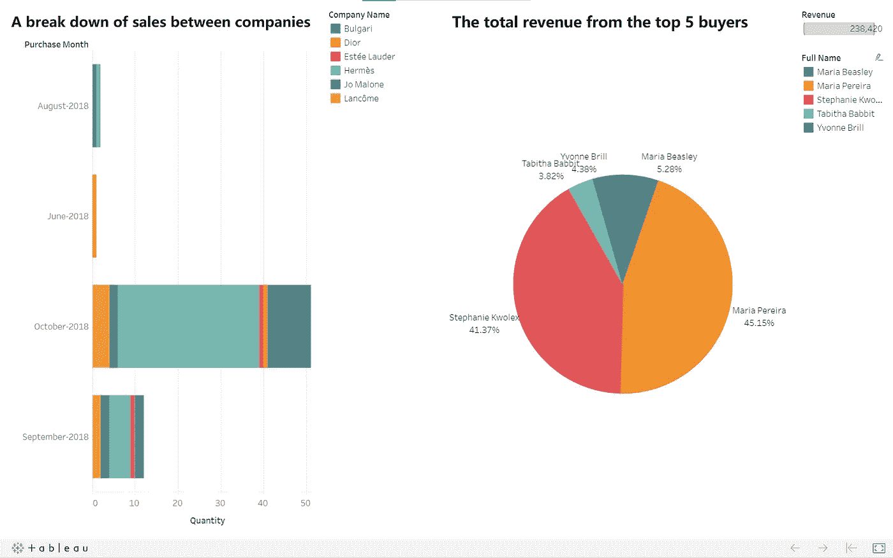

基于该项目的样本数据的 Tableau 仪表板

Tableau 链接:[https://public . tableau . com/views/order _ form _ system _ dashboard/dashboard 1？:language = zh-Hant&:display _ count = y&publish = yes&:origin = viz _ share _ link](https://public.tableau.com/views/order_form_system_dashboard/Dashboard1?:language=zh-Hant&:display_count=y&publish=yes&:origin=viz_share_link)

对工作表 1 的数据的查询:

**选择**

**DATE_FORMAT(s.purchase_date，' %M-%Y') as purchase_month，**

**公司名称，**

**公司标识，**

**计数(数量)作为数量**

**来自**

**销售 s**

**内部连接**

**s . item _ id = I . item _ id 上的项目 I**

**内部连接**

**I . company _ id = c . company _ id 上的公司 c**

**按 s.purchase_date，i.company_id，c.company_name 分组；**

对工作表 2 的数据的查询:

**选择**

**CONCAT(c.first_name，' '，c.last_name)作为全名，**

**总和((数量*价格记录人民币))作为收入**

**来自**

**v_track_prices v**

**内部连接**

**v . customer _ id = c . customer _ id 上的客户 c**

**按姓氏、名字分组**

**按 DESC 税务局排序**

**极限 5；**

## 2.动机

采购代理是一群人，他们通过帮助他人在世界不同地区购买产品来谋生。当订单数量增加时，就需要一个系统的方法来处理交易。关系数据库是一个不错的选择。你可能会问为什么他们不能直接使用 Office Excel，这确实是目前大多数采购代理使用的流行工具。这个问题可以从 3 个方面来回答，数据量、数据完整性和数据分析。

I)数据大小

从理论上讲，Office Excel 最多可以存储 1，048，576 行记录，但在达到这个数字之前，软件可能会严重滞后。此外，记录限制有时会很麻烦，甚至很危险。[Covid:Excel 如何可能导致英格兰 16，000 个测试结果丢失](https://www.theguardian.com/politics/2020/oct/05/how-excel-may-have-caused-loss-of-16000-covid-tests-in-england)就是一个生动的例子。另一方面，关系数据库显然是用来存储数据的。它可以轻松存储大量记录。即使存储了大量数据，它仍然可以在操作数据时保持高效率，因为底层优化器决定如何正确处理任务。

ii)数据完整性

数据库在构建时预先设置了某个字段中包含的数据类型。当输入了错误的数据类型时(例如，将“apple”输入到 INT 类型的字段中)，将会返回一个错误。该属性将输入错误数据的风险降至最低。Office Excel 有利于快速计算，但当输入大量数据时，灵活性就成了缺点。它不需要用户预先定义电子表格的数据类型。用户可能注意不到错误。在一些更严重的情况下，Excel 会改变数据本身，就像在[中的情况一样，科学家重命名人类基因，以防止 Microsoft Excel 将它们误读为日期](https://www.theverge.com/2020/8/6/21355674/human-genes-rename-microsoft-excel-misreading-dates)。

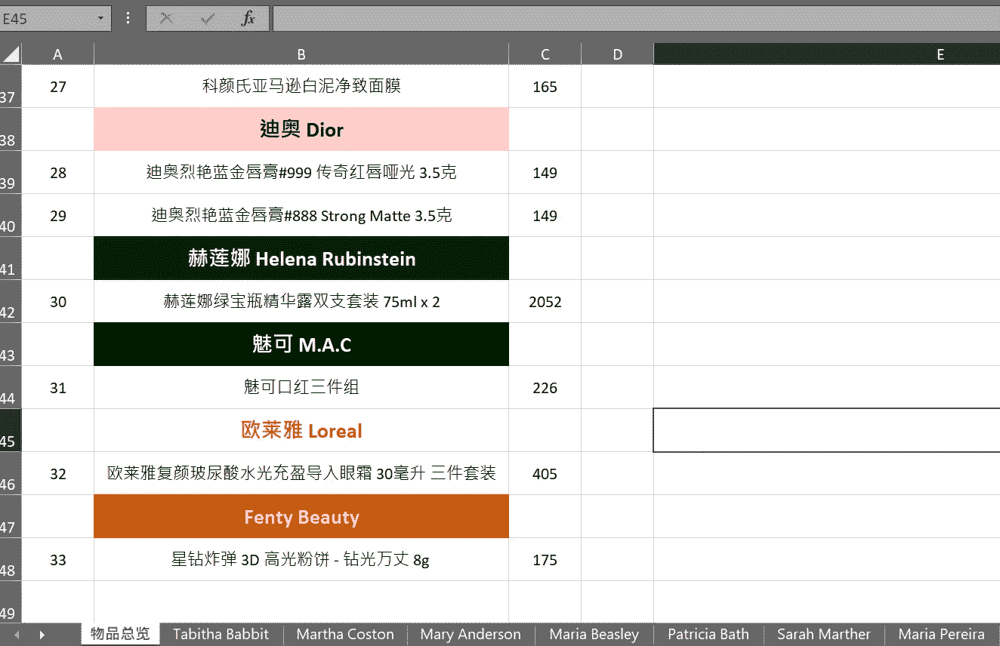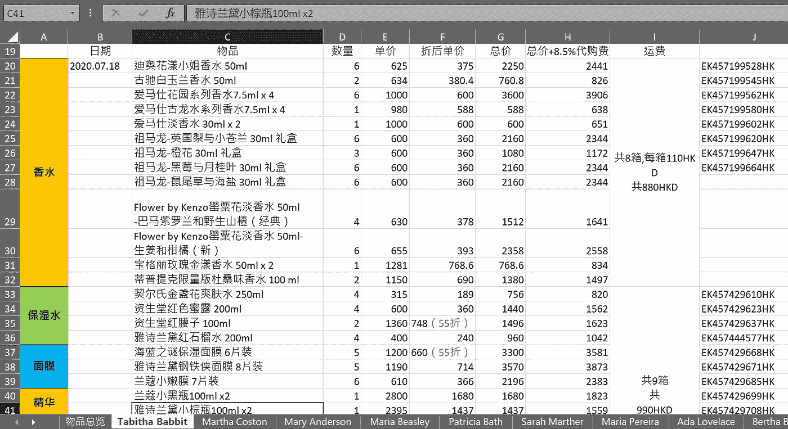

采购代理的电子表格。该结构对于数据完整性来说过于灵活。

设置键约束是关系数据库中的一个成熟属性。这些约束还防止用户输入不正确的数据。例如，在这个项目中，如果 item_id 没有首先添加到“items”表中，它就不能添加到“sales”表中。

三)数据分析

当关系数据库的用户想要从数据中获得洞察力时，他们可以很容易地编写 SQL 查询来获得所需结构的输出。SQL 是用于关系数据库的领域特定语言。这意味着它是专门为关系数据库设计的。关系型数据库让用户在短时间内获得复杂条件下的数据，而不是 Excel 中的一系列筛选、排序、复制和粘贴。

## 3.目标

这个项目的目标是开发一个集成的数据库系统，以便于数据记录、操作和分析。它应该满足以下需求

I)具有关系连接的数据表

关系约束使得数据库易于更新和分析。有了约束，数据完整性更加健壮。

ii)自动价格历史更新

在插入一个新商品或更新当前商品的价格后，价格跟踪表会自动发生变化。它允许用户很容易地检查项目的价格变化。

iii)自动运输信息获取

如果数据库能够集成包裹运输信息的信息，用户可以容易地跟踪物品，而不需要使用单独的工具。

iv)简单的数据分析

数据库中的数据应便于进一步分析。数据挖掘对于调整广告策略和计划折扣活动等商业决策非常重要。

## 4.方法

I)关系模式:具有关系连接的数据表

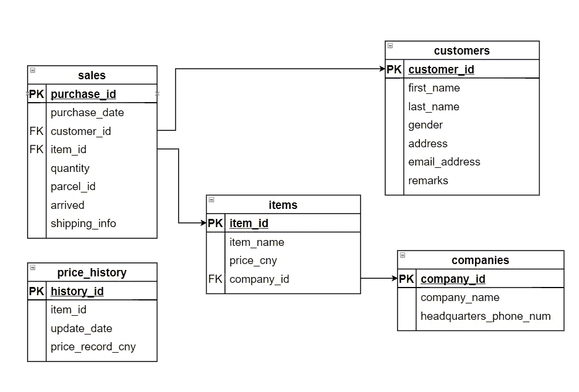

数据库的关系模式

上图是这个项目中数据库的关系模式。关系模式是说明数据库结构的图形。 **PK** 代表**主键**。表中的主键对于每条记录都是唯一的。**代表**外键**。外键展示了数据库的关系连接。例如，在上图中，“销售”中的 customer_id 是一个指向“项目”中的 PK item_id 的 FK。这意味着“销售”中的 customer_id 引用“项目”中的 PK item_id。如果“项目”中不存在 item_id，则它不能存在于“销售”中。**

**创建数据库的代码是 [create_database.sql](https://github.com/lester1027/order_form_system/blob/main/create_database.sql) 。**

**ii) MySQL 触发器:自动价格历史更新**

**MySQL 触发器是一种存储程序，与一个表相关联。一旦与关联表相关的特定事件发生，它将被自动激活。**

**触发器“price_update_insert”用于在“items”表中有新的项目记录时更新“price_history”表。**

**代码:**

**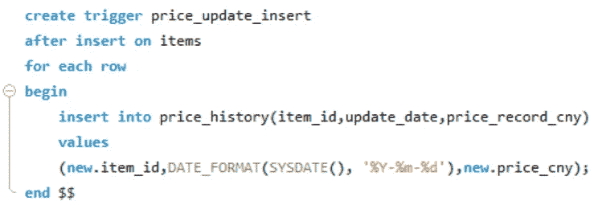**

**“price_update_update”触发器用于在“items”表的现有记录中出现价格变化时更新“price_history”表。**

**代码:**

**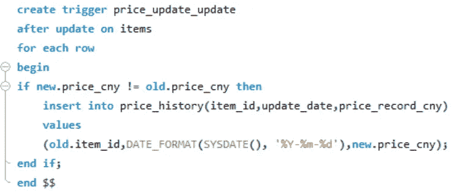**

**iii) Selenium、PyMySQL 和 PyInstaller:自动运输信息获取**

**当我想自动获取运输信息时，我首先想到的自然是使用 API。然而，大多数跟踪 API 不是免费的，而免费的 API 只有很少的请求配额。我试图与 17track 的团队沟通，这是目前最流行的跟踪系统之一。但是，好像他们的 API 不是公开使用的。他们要求我提供公司的详细信息，但我没有。即使我成功地获得了 API 访问权，我也不能用它开发通用项目，因为其他人没有访问权。**

**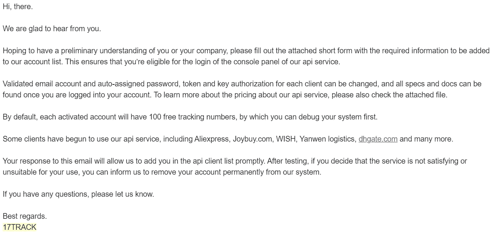**

**来自 17track 的邮件回复**

**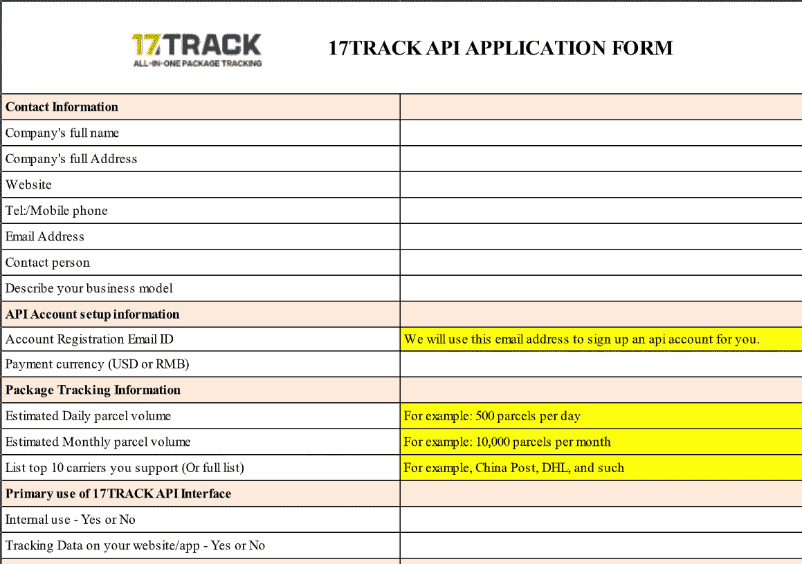**

**API 申请表**

**所以我才想到了一个绕过这个限制的方法。我发现 17track 有一个页面，最初是用来让人们测试如何将跟踪控制台嵌入到他们自己的网站中。**

**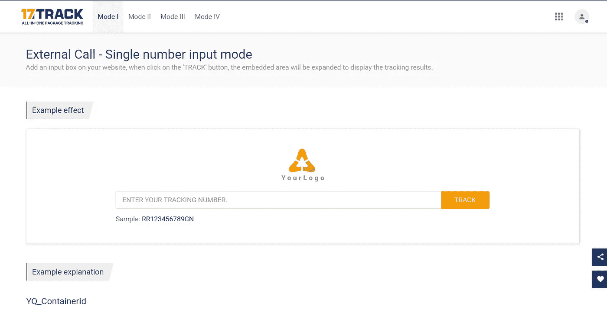**

**17track 的网站**

**我使用 Chrome 来检查这个页面中的元素，并使用 Selenium(一个 web 驱动程序)来输入包裹 ID，按下“TRACK”按钮并获取返回结果。**

**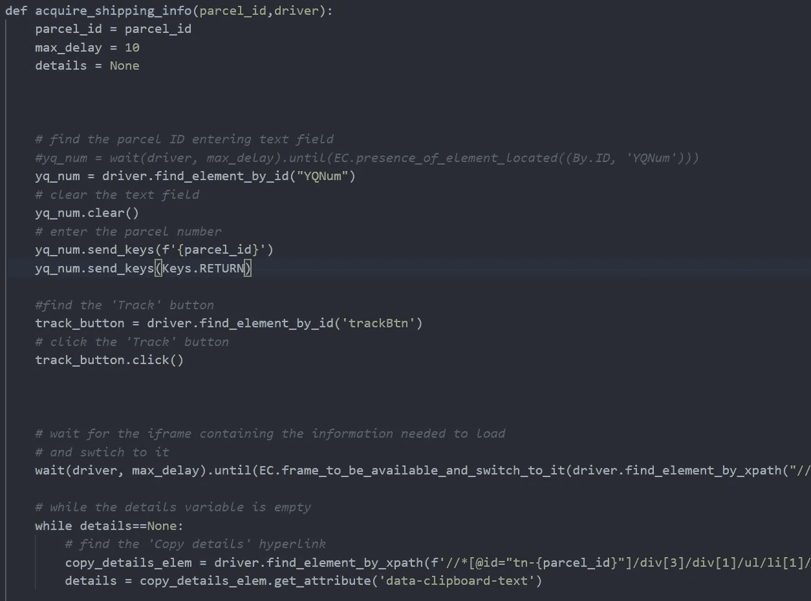**

**硒的作用**

**然后，我使用 PyMySQL library for Python 连接到之前开发的数据库，并更新“sales”表中的 shipping_info 列。**

**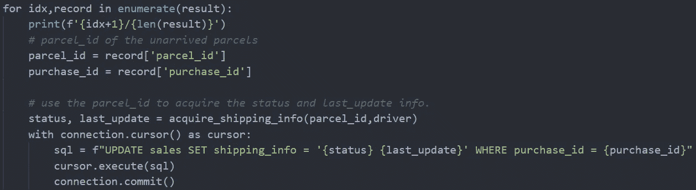**

**PyMySQL 的操作**

**最后，我使用 PyInstaller 将整个脚本( [acquire_shipping_info.py](https://github.com/lester1027/order_form_system/blob/main/acquire_shipping_info.py) )转换成一个可执行程序([acquire _ shipping _ info . exe](https://github.com/lester1027/order_form_system/blob/main/acquire_shipping_info.exe))，这样其他人可以很容易地使用更新功能。**

**四)表格:简单的数据分析**

**数据可以很容易地操作和导出为 csv 文件。csv 文件适合数据挖掘。第 1 部分中显示的上面的交互式 Tableau 仪表板演示了如何组合 SQL 查询和 Tableau 表来从数据中获得洞察力。**