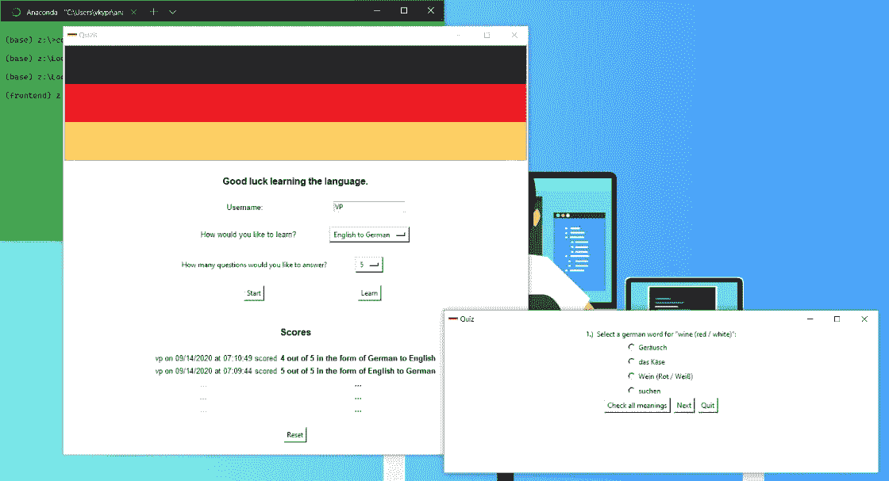
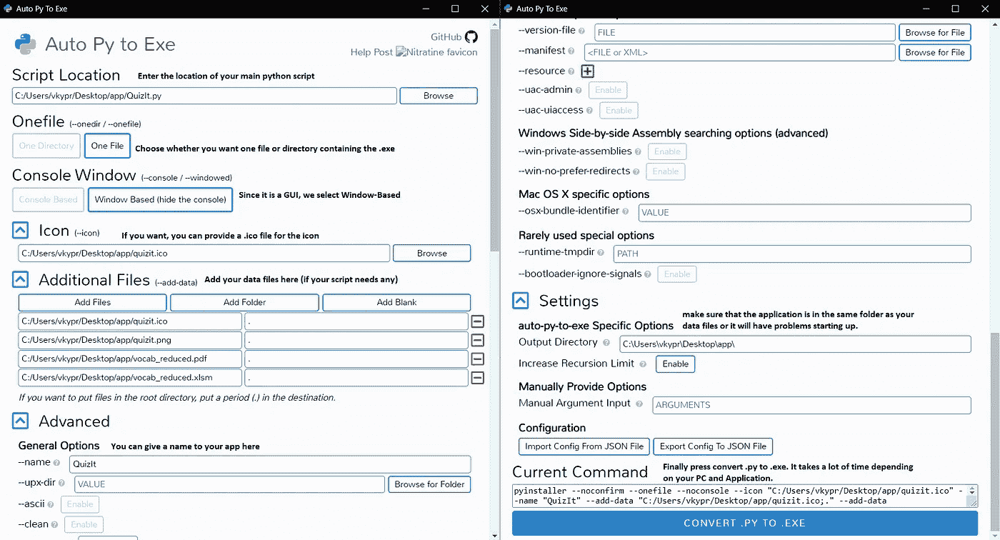
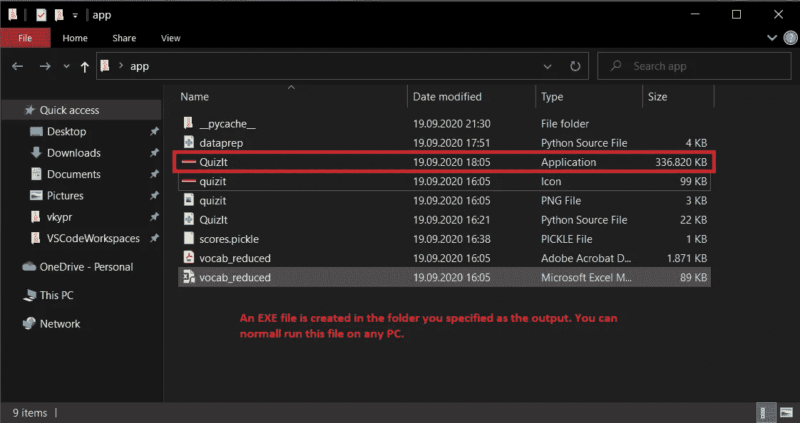
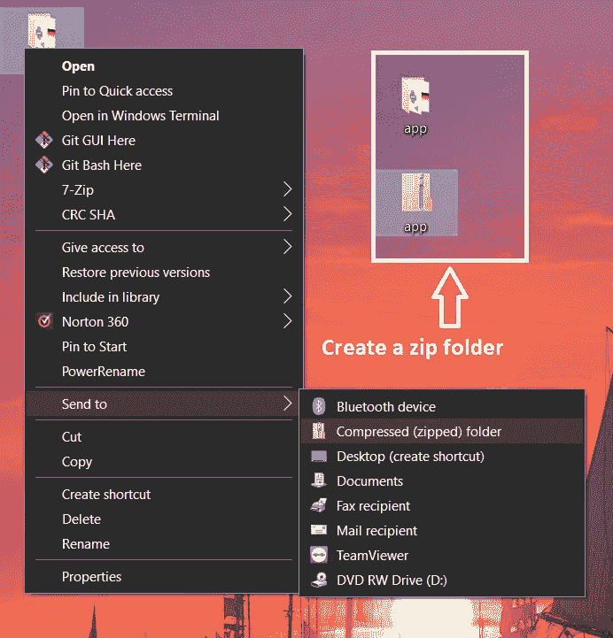
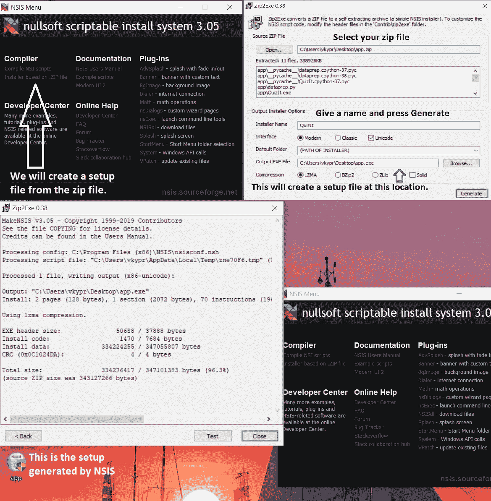
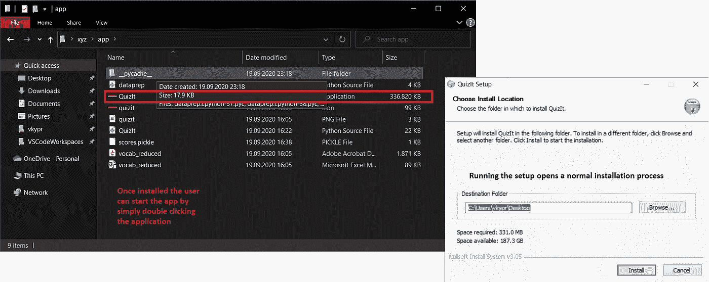

# 使用 Python 为 Windows 创建一个测验应用程序

> 原文：<https://medium.com/analytics-vidhya/create-a-quiz-application-for-windows-using-python-df7c14a5230d?source=collection_archive---------11----------------------->


照片由 [Unsplash](https://unsplash.com?utm_source=medium&utm_medium=referral) 上的 [Azharul Islam](https://unsplash.com/@azhar93?utm_source=medium&utm_medium=referral) 拍摄

## 介绍

大家好！欢迎学习使用 Python 创建/构建 Windows GUI 应用程序的分步指南。我想从告诉你我为什么决定写这篇文章开始。

我的德语相当流利，我的女朋友总是不停地抱怨我，不帮助她学习德语。所以，我开始教她德语，并给了她一份 PDF 文档，让她试着记忆一些词汇。这对她来说是“无聊”的，她也不觉得这是一种学习新事物的令人兴奋的方式。我知道那里有更好的应用程序来学习德语，但因为她抱怨我没有帮助她，我决定为她建立一个测试应用程序，认为她会喜欢它并变得更好。

该应用程序包含基本的选择题。用户可以输入他们的名字，并选择问题是否显示英语单词，他们可以选择一个德语单词，反之亦然。他们可以选择他们想回答的问题的数量。最后五个分数也会显示出来。该图显示了应用程序的主窗口以及问答窗口。



第一眼

正如你所看到的，如果有人不确定，他们可以检查所有显示的选项的含义，选择，并移动到下一个问题或退出游戏。只有在您完成测验后，分数才会被跟踪并添加到您的显示屏上。您可以使用底部的*重置*按钮重置您的分数。如果你想学习，按下*学习*按钮打开一个包含词汇的 PDF。*(免责声明:vocab 并非 100%正确。大多数使用这些单词的文章都是不正确的，因为我是在大约 3-4 年前从互联网上随机收集词汇的。)*

## 先决条件

**知识:**我假设你知道 *python(使用类、库如 pandas、Tkinter、pillow (PIL)等。)*。完整的代码可以在这篇文章的结尾找到。解释每一行代码超出了本文的范围。

**软件:**装了熊猫和枕头的 Python。

## 那么，我们开始吧。

我将代码分成两个不同的类:一个我命名为*generated data*，另一个命名为 *QuizIt* 。顾名思义，我使用*generated data*来生成列表:一个包含问题，第二个包含他们的个人选择(选项)，最后一个包含他们的答案。整个 GUI 部分都是用 *QuizIt 编写的。我将首先解释我如何生成数据，然后转到 GUI。*

***generated data***:下面，你可以找到代码来生成不同的列表传递给测验。该类将数据框架(df)、问题数量(num_ques)和形式(为给定的英语单词选择一个德语单词，反之亦然)作为输入。词汇表是从包含两列(德语和英语)的 Excel 文件中提取的。

```
import random
class GenerateData:
    def __init__(self, df, num_ques, form):
        self.df = df
        self.num_ques = num_ques
        self.form = form
```

下面的方法生成一个英语的问题字符串，4 个德语的选项，以及正确的答案并返回它们。它首先从数据帧中选择一个随机整数索引。然后，它从数据框中随机选择 3 种可能性和一个正确答案，然后对它们进行洗牌，这样解决方案就不会总是以*选项 A、*结束。

```
def generate_eng2ger(self):
    question = []
    data_len = len(self.df)+1
    n = random.randint(0, data_len)
    lst = []
    options = []
    for i in range(3):
        no = random.randint(0, data_len)
        lst.append(no)
    lst.append(n)
    lst = random.sample(lst, len(lst))

    ### Creating the question
    question.append(f'Select a german word for "{self.df.iloc[n, 1]}":')

    ### Creating options/choices
    for l in lst:
        options.append(f'{self.df.iloc[l, 0]}')### Allocating the answer
    answer = self.df.iloc[n, 0]
    return question, options, answer
```

另一种方法做同样的事情，但是用德语返回问题，用英语返回选项和答案。

类中的最后一个方法考虑要生成的问题数量(在 __init__ 中指定)。例如，如果用户选择 25 个问题，该方法将以三个列表的形式分别返回 25 个问题的列表、它们的选择(选项)以及它们的正确答案。

```
def collection(self):
    """
   Generates a collection of questions, respective multiple-choices     and answers for German to English.
    Returns:
    questions, options, answers (in that order)
     """
    questions = []
    choice_list = []
    answers = []if self.form=='The correct German word':
        for i in range(self.num_ques):
            question, options, answer = self.generate_eng2ger()
            questions.append(question)
            choice_list.append(options)
            answers.append(answer)
    else:
        for i in range(self.num_ques):
            question, options, answer = self.generate_ger2eng()
            questions.append(question)
            choice_list.append(options)
            answers.append(answer)
    return questions, choice_list, answers
```

***QuizIt*** :这个类创建 GUI。这个类有 300 多行代码，因此我不会完全解释它。该类导入以下模块:

```
# Imports
import os
import pickle
import PIL
from PIL import ImageTk
import pandas as pd
from datetime import datetime
from dataprep import GenerateData
from tkinter import *
from tkinter import messagebox
```

如前所述，Excel 文件用于生成测验数据。下面几行代码显示了数据的少量预处理。

```
### Preparing the dataframe
df = pd.read_excel('vocab_reduced.xlsm')    # Reading the vocab from an Excel file
df.dropna(inplace=True)     # Droping NaN (empty cells/values)
df.drop_duplicates(subset=['German', 'English'], keep='last', inplace=True)     # Dropping words if they repeat
df.reset_index(inplace=True, drop=True)
```

代码太长，无法粘贴到此处。这里可以找到[](https://github.com/vkyprmr/medium/tree/master/quizIt)**以及所使用的词汇和图标。**

**转换成。并为分发创建一个设置。**

**我使用 *auto-py-to-exe* 作为我的 goto 来将 python 脚本转换成 windows 可执行文件。如果你已经安装了它，你知道如何使用它。如果没有，您可以使用以下方式安装:**

```
**pip install auto-py-to-exe**
```

**一旦你有了它，你需要做的就是提供脚本的路径，添加一个图标(如果你想的话)，命名，改变输出路径到你的附加文件所在的目录(例如，在我的例子中，我有一个 pdf，excel 和 png 文件作为附加文件，所以我在*附加文件*部分指定了它)，如果它适用于你，查看任何其他设置。**

****

**转换中。PY to。可执行程序的扩展名**

*****注:*** *本。exe 文件应该放在与您的图像或附加文件相同的文件夹中。***

****

**。EXE 已创建**

****

**创建压缩的 zip 文件夹**

****

**#1 选择安装程序的依据。zip 文件— #2 给出 ZIP 文件—如您在左下角所见，设置文件已生成**

****

**安装就像一个正常的安装过程，然后用户可以使用 EXE 文件启动应用程序**

**现在你可以运行这个了。无需安装或配置 Python。为了更容易地将您的应用程序分发或发送给某人，您可以创建一个设置。为此，你需要在你的电脑上安装 NSIS。从 [*到这里*](https://nsis.sourceforge.io/Download) 都可以。然后创建一个压缩的 zip 文件夹。exe)并且所有数据文件都是。只需在 windows 搜索栏中搜索即可打开 NSIS 软件。看下图。给你。现在你可以把这个安装文件发送给任何你想要的人，他们将能够运行这个应用程序，而不需要安装 Python 或任何库。**