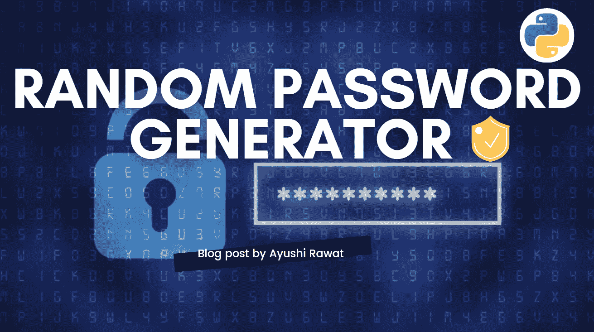
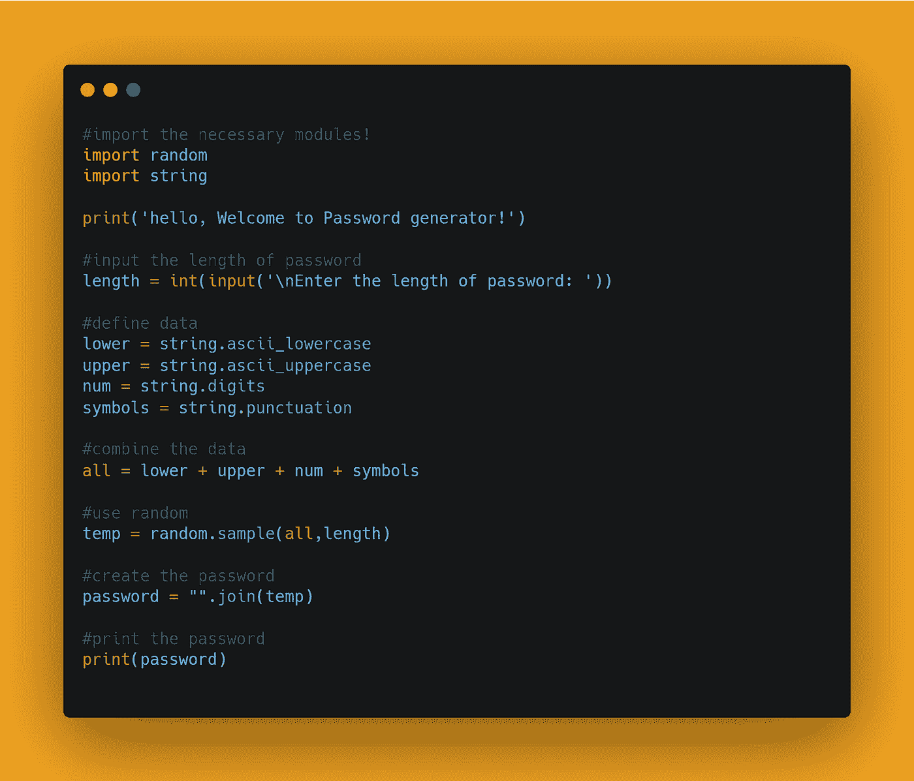

# 使用 Python 创建一个随机密码生成器

> 原文：<https://medium.com/analytics-vidhya/create-a-random-password-generator-using-python-2fea485e9da9?source=collection_archive---------0----------------------->

你好世界！



我们每天都在使用密码，为了保护你的账户安全，防止你的密码被黑客窃取，我们必须让我们的密码足够硬，没有人能猜到。

密码生成器是一个随机的密码生成程序，它生成大小写字母以及足够强大的数字和符号的密码组合，以提供极大的安全性。

在这篇博客文章中，我们将学习如何创建一个随机密码生成器。我们将看到 Python 中的实现。

[查看 python 的终极资源库](https://github.com/ayushi7rawat/Ultimate-Python-Resource-Hub)。发现有用就掉颗星！有什么要补充的吗？开个 PR 就一样了！

你可以参考我的 YouTube 视频教程，看一个工作教程来更好的理解和一步一步的指导。

# 这个博客将会涵盖什么

```
1\. What is Password
2\. Random and String Module
3\. how to Create a Random Password Generator
```

我们开始吧！

# 什么是密码:

密码，有时称为通行码，是一个记忆的秘密，通常是一个字符串，通常用于确认用户的身份，换句话说，是一个字符串，用于在身份验证过程中验证用户的身份。

如果你想了解更多，可以参考[密码维基百科页面](https://en.wikipedia.org/wiki/Password)。

# 使用的模块:

# 随机模块:

随机模块用于执行随机生成。我们在这里使用了`random.sample`模块。如果你注意到输出中的所有字符都是唯一的。`random.sample()`从不重复字符。如果你不想在随机字符串中重复字符或数字，那么使用`random.sample()`，但它不太安全，因为它会降低组合的概率，因为我们不允许重复的字母和数字。

# 字符串模块:

字符串模块[包含许多有用的常量、类和函数来处理标准的 python 字符串。](https://www.pythonforbeginners.com/basics/strings)

1.  `string.ascii_letters`:ascii(大写和小写)字母的连接
2.  `string.ascii_lowercase`:全部小写字母
3.  `string.ascii_uppercase`:全部大写字母
4.  `string.digits`:字符串‘0123456789’。
5.  `string.punctuation`:在 C 语言环境中被视为标点符号的 ASCII 字符串。

现在，您已经熟悉了密码用例，并获得了`random`和`string`模块的基本知识，我们可以前进到编码部分。

# 该编码了！

你可以在我的 [GitHub 库](https://github.com/ayushi7rawat/Youtube-Projects/tree/master/Random%20Password%20Generator)找到所有代码。发现有用就掉颗星。



为了访问 Python 库，我们需要在 Python 脚本中导入包。

```
import random
import string
```

一旦完成，让我们问候用户！

```
print('hello, Welcome to Password generator!')
```

接下来，让我们询问用户密码的长度。

```
length = int(input('\nEnter the length of password: '))
```

是时候定义数据了。我们将同样利用`string`模块。

```
lower = string.ascii_lowercase
upper = string.ascii_uppercase
num = string.digits
symbols = string.punctuation
```

我们存储了小写和大写字母以及数字和符号。我们来结合数据，存储数据。

```
all = lower + upper + num + symbols
```

现在我们有了数据，让我们利用`random`模块最终生成密码。

```
temp = random.sample(all,length)password = "".join(temp)
```

我们将组合数据和密码长度一起传入，并在最后连接它们。

现在您已经清楚地了解了脚本，我们甚至可以通过消除数据存储来减少代码行数。让我们看一看。

```
all = string.ascii_letters + string.digits + string.punctuation
pass = "".join(random.sample(all,length))
```

最后，我们来打印密码吧！

```
print(password)
```

让我们看看几个输出示例:

```
#SAMPLE O/P: (length = 16)3Atza*qP#h-vJoK+
7c%A4gOt#M[}qr2
@JmFf"awbQ1Ts4dx
```

通过这些步骤，我们已经成功地使用 python 创建了一个随机密码生成器项目。就是这样！

很简单，不是吗？希望这篇教程有所帮助。我强烈推荐你去看看 YouTube 上的视频，别忘了订阅我的频道。

您可以使用 Instaloader 库，甚至探索更多功能。您甚至可以使用 Tkinter 来利用 Python GUI。

你可以在我的 [GitHub 库](https://github.com/ayushi7rawat/Youtube-Projects/tree/master/Random%20Password%20Generator)找到所有代码。发现有用就掉颗星。

感谢您的阅读，我很乐意通过[Twitter](https://twitter.com/ayushi7rawat)|[LinkedIn](https://www.linkedin.com/in/ayushi7rawat/)与您联系。

请分享您的宝贵建议，感谢您的真诚反馈！

你绝对应该看看我的其他博客:

*   [Python 3.9:你需要知道的一切](https://ayushirawat.com/python-39-all-you-need-to-know)
*   [终极 Python 资源枢纽](https://ayushirawat.com/the-ultimate-python-resource-hub)
*   [GitHub CLI 1.0:您需要知道的一切](https://ayushirawat.com/github-cli-10-all-you-need-to-know)
*   [成为更好的程序员](https://ayushirawat.com/become-a-better-programmer)
*   [如何制作自己的谷歌 Chrome 扩展](https://ayushirawat.com/how-to-make-your-own-google-chrome-extension-1)
*   [使用 Python 从任何 pdf 创建您自己的有声读物](https://ayushirawat.com/create-your-own-audiobook-from-any-pdf-with-python)
*   你很重要，你的心理健康也很重要！

# 资源:

*   [en.wikipedia.org/wiki/Password](https://en.wikipedia.org/wiki/Password)

在我的下一篇博客文章中再见，保重！！