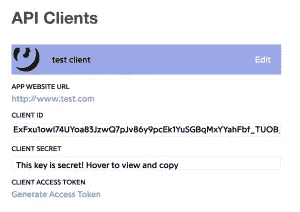

# 使用深度学习创建说唱人工智能—第 1 部分，收集数据

> 原文：<https://medium.com/analytics-vidhya/create-a-rapping-ai-using-deep-learning-part-1-collecting-the-data-634bbfa51ff5?source=collection_archive---------4----------------------->

问候所有**数据忍者**和 **ML 战士**！

这是关于我如何创造一个**人工智能**来生成全新的，但可信的(！)、**说唱歌词**。**从零开始！**

(也就是我从零开始创造了 AI。人工智能不会从零开始创造任何东西。需要对海量的说唱歌词进行训练。想想看，我可能接受过关于如何使用数据 ***【递归思维爆炸】*** 训练一个模型的大量数据培训，以便能够创建这个人工智能。严格地说，可能没有人从零开始创造过任何东西。不管怎样…重点是你将能够从头开始创建你自己的 Rap 生成 AI(某种程度上)!)

**免责声明:**这将是一个非常实用的、非理论的、代码繁重的、没有数学的教程。关于语言模型背后的理论，有大量的资源，我会在我认为合适的时候尝试参考它们。然而，本系列文章的目的是构建一些可以使用、重用、调整的东西，并有希望启发构建其他类似的应用程序。不是教深度学习或者 NLP 的理论。
*呼*
我们出发了……

我们项目的预期结果

# 第 1 部分—收集数据

任何有趣的 ML 项目的第一部分都是收集数据。一般来说，越多越好。

一个说唱 AI 自然会被训练说唱歌词。幸运的是，世界上最大的歌词集 [Genius](https://genius.com/) ，有一个免费使用的 API，我们可以利用它来收集说唱歌词。您需要做的第一件事是注册一个 Genius developer 帐户。进入[开发者页面](https://genius.com/developers)，点击**创建 API 客户端**。其中两个字段是必填的，**应用名称**和**应用网址**，但其他字段可以留空。接下来，您将收到一个客户端 ID、密码和访问令牌。请将它们存放在安全的地方，因为需要它们来访问 Genius API 和下载歌词。

将这些信息保存在安全的地方

接下来，我们将使用 Python 实现一个客户端脚本，它将通过向 Genius API 发送请求来下载我们想要的所有歌词。我们可以使用 HTTP 客户端库直接向 Genius REST API 发送请求。幸运的是，有人已经在 Python 库[lyric genius](https://github.com/johnwmillr/LyricsGenius)中为我们实现了一个包装器(没有双关的意思)，所以我们就用它吧。

要使用 **pip** 安装 lyricsgenius，只需在终端中键入`pip install lyricsgenius`。

在下面的代码片段中，您可以看到我如何创建自己的**包装类**(双关语)，它使用 **lyricsgenius** 下载特定艺术家的歌词，按照它们在 genius 数据库中的顺序:

访问 Genius 并下载歌词

如您所见，访问 Genius API 所需要的只是我们之前生成的 **client_access_token** 。所有找到的歌词都将存储在 Python 项目的根文件夹中，在一个名为 **data** 的子文件夹中。而且每首歌的歌词都会保存到单独的**。txt** 文件放在以艺人名字命名的子文件夹中。
**举例:** `/rap_generator/data/Eminem/My name is.txt`

为你能想到的每个说唱歌手运行`Genius.scrape_artist`方法真的很繁琐。此外，正如我之前所说，我们需要大量的数据来训练我们的说唱人工智能。当然，我不知道你能说出多少说唱歌手的名字…但我意识到我肯定需要我从未听说过的艺术家的歌曲来获得我需要的数据量。我所做的是我去了维基百科页面，复制了所有艺术家的名字，并创建了一个每行一个名字的文本文件。总共约有 1500 名说唱歌手。然后我从那个文件中读取名字，并为每个名字调用`Genius.scrape_artist`。

下载所有艺术家的歌词

这段代码将从文件 **rappers.txt** 中读取说唱歌手的名字，并尝试从每个说唱歌手那里下载 50 首歌曲的歌词。注意，我将 **secret_access_token** 作为命令行参数传递，它是使用`sys.argv[1]`读取的。这很有效，最终我们将拥有 1500 首歌曲。问题是…这要花很长时间。对 Genius API 的每个请求都有很长的往返时间。幸运的是，有一个解决方案，叫做并发！坚持住…

由于[全局解释器锁](https://wiki.python.org/moin/GlobalInterpreterLock)和 yadayadayada，Python 通常被指责为不是最具并行性的语言。这是真的。然而，在解释器由于外部进程(如文件 I/O 或 web 服务器请求)而大部分时间被阻塞的情况下，这些进程是相互独立的，我们也可以并行运行所有的进程。对于这个用例，Python 大放异彩！

并行运行 Python 代码最简单(可能也是最方便)的方式是通过`concurrent.futures`模块。只需查看这几行代码:

同时下载歌词

首先，我们将 **rappers.txt** 读入一个列表。然后，我们实例化一个`ThreadPoolExecutor`。(这听起来比实际要复杂得多。一个**线程**只是一段可以和其他代码并行运行的代码，即其他**线程**，一个**池**只是一堆**线程**，而**执行器**只是一个可以执行**池**中**线程**的东西。)我们必须指定并行运行的线程数量(即池的大小)，我选择了 5。

现在，下一行是很酷的东西:
`executor.map(genius.scrape_artist, rappers)`

当我们运行这一行时，执行器将从列表`rappers`中一次获取一个**元素**，该列表作为第二个参数传递给`executor.map`。它将调用作为第一个参数传递给`executor.map`的函数`genius.scrape_artist`，并将每个**元素**作为参数传递给该函数。因此，第一个呼叫将是`scrape_artist(rappers[0])`，第二个将是`scrape_artist(rappers[1])`，以此类推…

最酷的是，执行程序会自动并行启动 5 个这样的调用，等到其中一个调用结束，再启动一个新的调用，以此类推，直到整个列表用尽！

像我在这个例子中所做的那样设置`num_workers=5`将产生大约 5 倍的加速，因为这个脚本中的大部分时间都在等待请求完成。**警告！**如果这个数字增加得太多，您可能会达到一个客户端同时请求的服务器端限制。超过这个限制甚至可能会导致禁令，所以要小心…

下载所有歌词后，您可能希望将它们连接成一个大的文本文件，用于训练生成型 NLP 模型:

将所有下载的歌词连接成一个文本文件

这里发生的事情是，我列出了我们之前创建的 data 文件夹中的所有子文件夹，对于每个子文件夹，我遍历包含 rap 歌词的所有文本文件。我在每首歌的歌词前加上艺术家的名字和歌名。我希望人工智能能够在每首新歌的歌词生成之前，自己想出艺术家的名字和歌名。那该多酷啊。

最后，我用一个特殊的分隔符(字符`'*'`的 50 倍)将所有歌词连接起来，并将所有内容写入一个新文件。

**关于异常处理的注意:**因为我们下载了很多文件，其中一些可能因为…原因而损坏…这就是为什么我只是吞下任何可能发生的错误。无论如何，我们都希望有足够的数据。

就是这样！我们现在有一个相当不错的数据集，包括大约 40，000 首说唱歌曲的歌词。现在是时候教一个 AI 如何用类似的风格写新歌词了。

# 我们今天学了什么？

*   如何使用 Python 从 Genius 下载歌词
*   如何使用 Python 并发发送 web 请求
*   如何使用 Python 连接文本文件

# 下次我们会学到什么？

*   如何加载预训练的通用语言模型
*   如何使用自己的数据集微调预先训练的语言模型

未完待续…