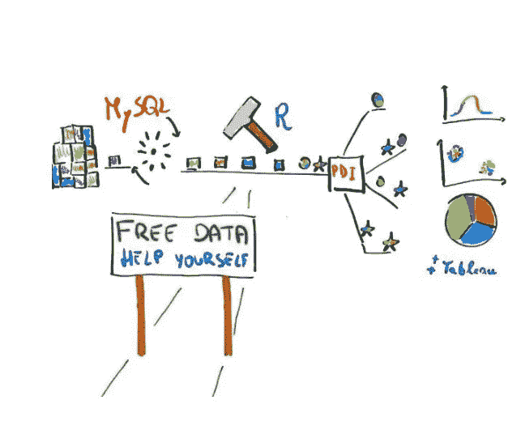

# 在家创建“真实世界”的数据科学环境

> 原文：<https://medium.com/analytics-vidhya/create-a-real-world-data-science-environment-at-home-7a4255ff6fa5?source=collection_archive---------14----------------------->

我在家里的“真实世界”数据科学环境:数据库，ETL，数据分析，仪表板，9 个步骤。

在我的第一篇媒体文章中，我想与你分享一种在家里创建“真实世界”数据环境的方法，这种方法基于大多数公司用来处理数据的相同组件。当然，规模要小得多，而且免费。