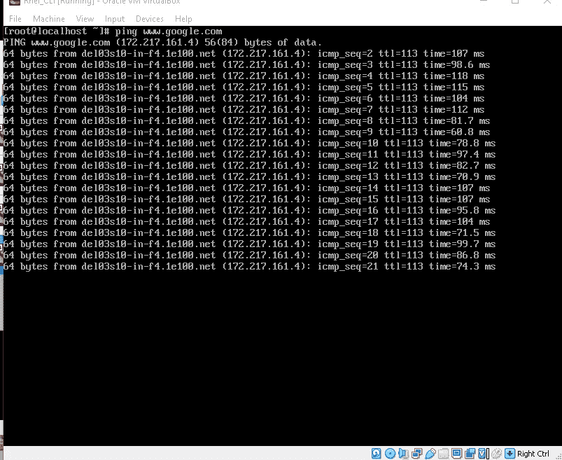
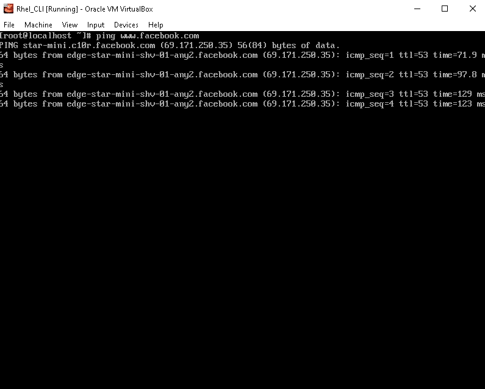
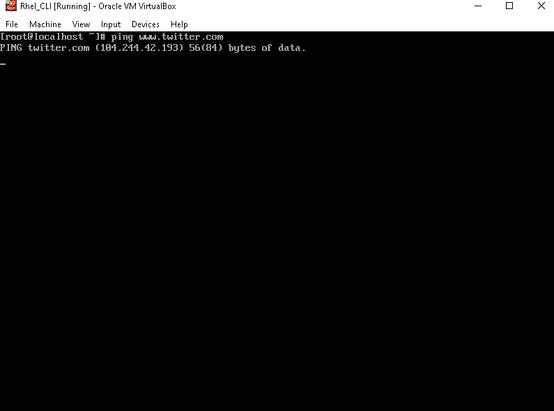
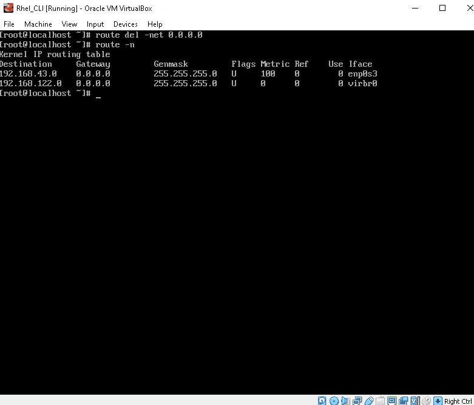
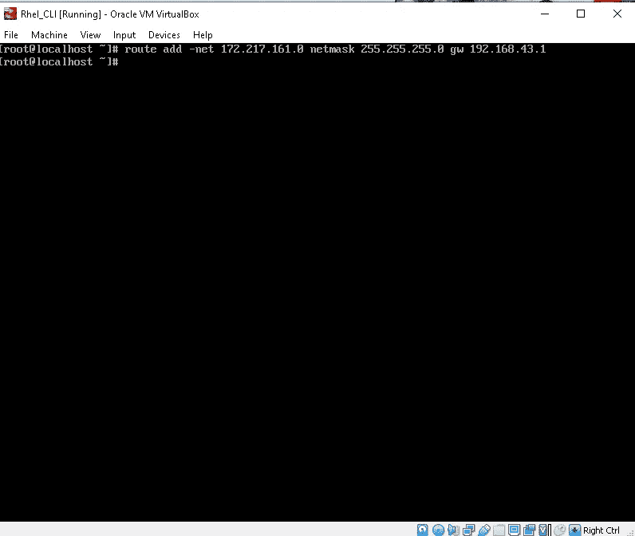
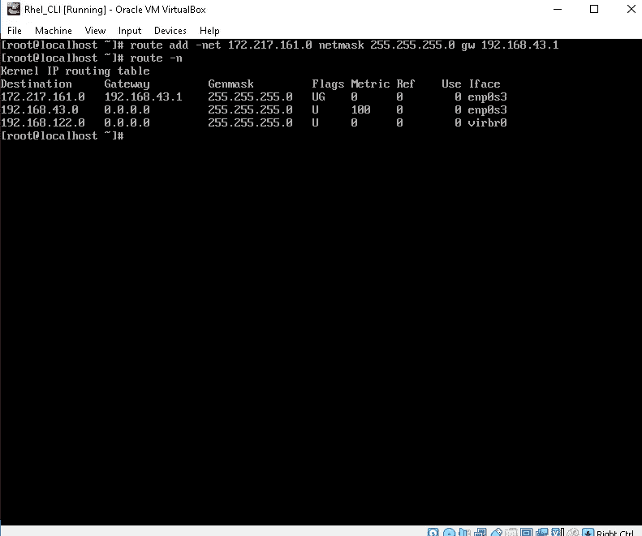
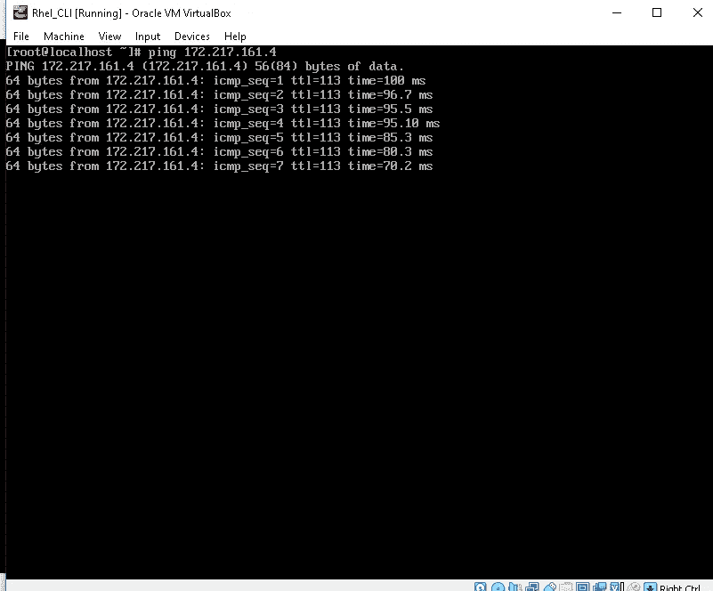
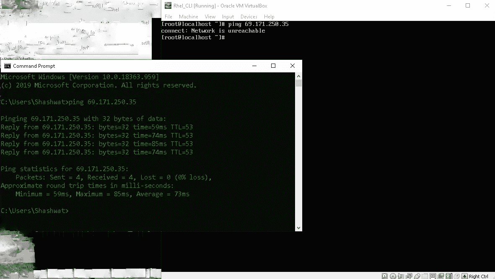

# 创建一个设置，使机器只能 ping 到谷歌，但不能从同一台机器 ping 到脸书！！

> 原文：<https://medium.com/analytics-vidhya/create-a-setup-so-that-machine-can-only-ping-to-the-google-but-not-able-to-ping-to-the-facebook-5cb67f9c73b1?source=collection_archive---------22----------------------->

# 注意:不使用防火墙

首先，让我给你演示一下，我的机器可以 ping 通所有的服务器，比如脸书，推特，谷歌…

谷歌

脸谱网

推特

首先，让我们记下以下地址的 IP 地址:-

谷歌—172.217.161.4

69.171.250.35 脸书

如问题陈述中所述，我们无法使用防火墙来配置系统、**，因此我们可以使用路由表来进行这种类型的约束，而不是使用防火墙。**

首先让我向您展示默认路由表:—

路由表

正如你在这张照片中看到的—

**目的 IP** 即 **0.0.0.0** *(这意味着它是世界上第一个 IP 地址)*

**网关**即**。192.168.43.1**

第三栏写着 **Genmask** 即 **0.0.0.0** ( *也称为网络掩码)——>网络掩码帮助我们找到它所能覆盖的最大 IP 范围，正如你所看到的，0.0.0.0 这个范围可以覆盖全球 IP* 。

所以我们只需要修改这个**路由表规则:-**

我们将选择这样一种方式，只有谷歌将在该范围内，而不是任何其他 IP，让我们开始…

用于更改规则的命令

现在你可以看到我们的路由表被改变了:—

新路由表规则

所以，现在我们只能 ping 到谷歌或属于这个范围的 IP。

让我们在之前提到的谷歌 IP 和脸书 IP 上做一个演示；

ping 谷歌机器的 IP 地址

脸书知识产权

正如你在上面的图片中看到的，机器没有生成任何数据包，因为这个 IP 不在路由表的范围内..

但是基础系统窗口外壳却完美地绑定到了脸书 IP。