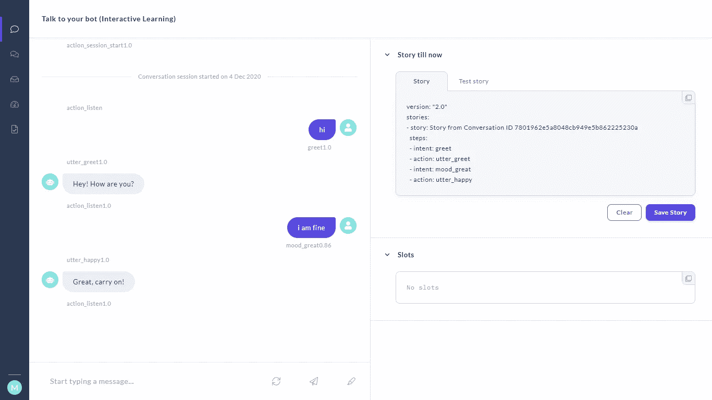
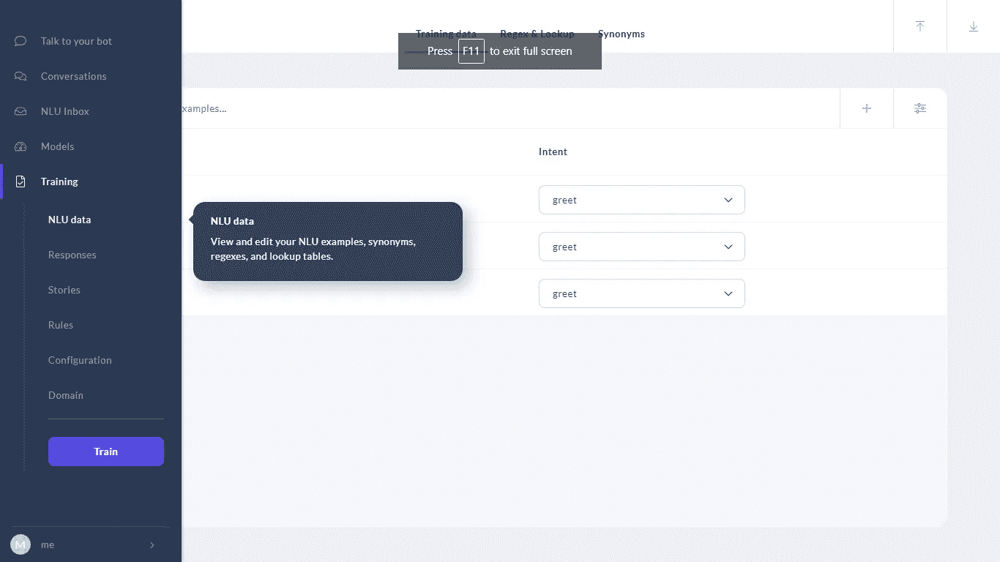
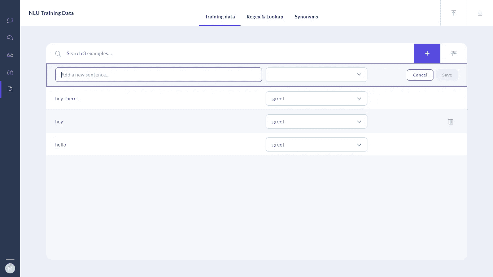
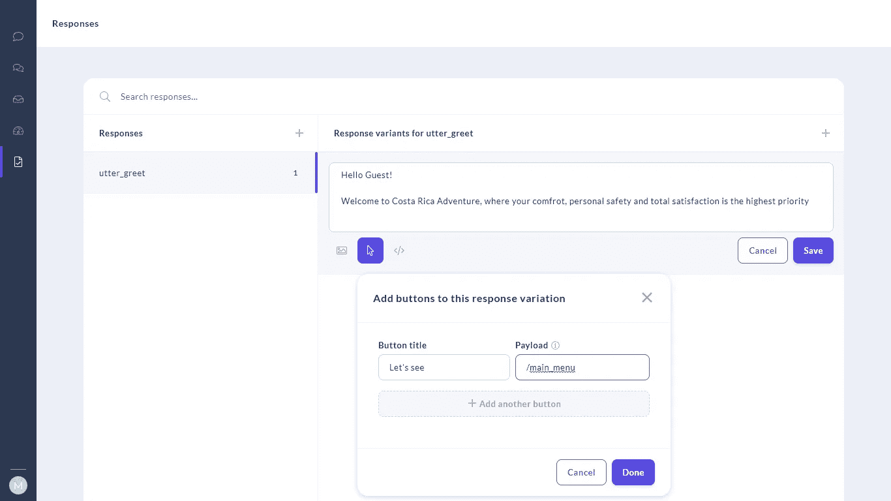
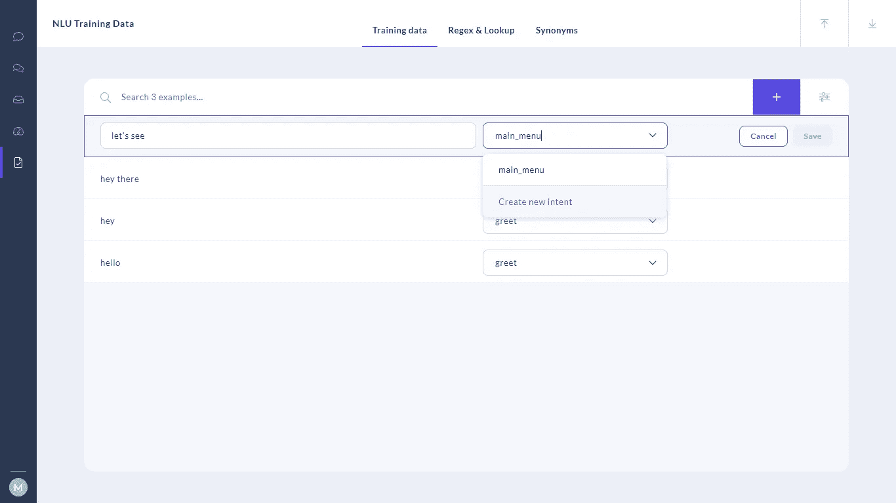
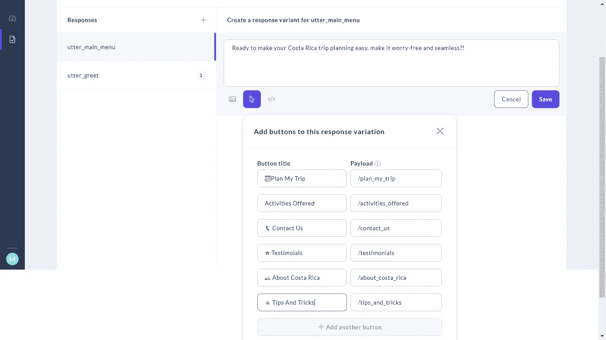
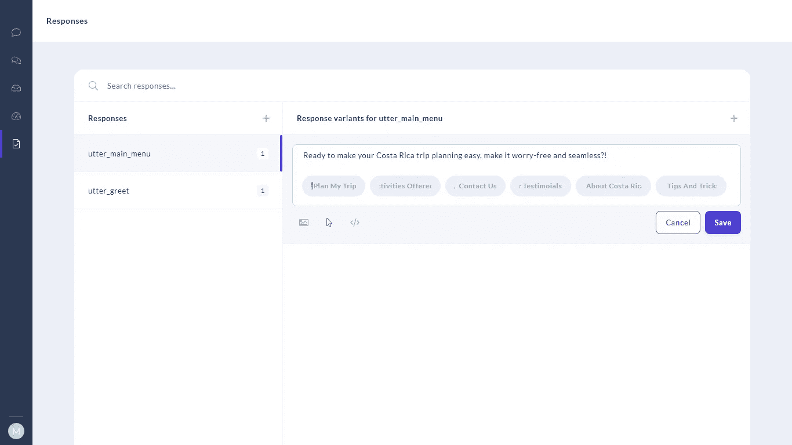
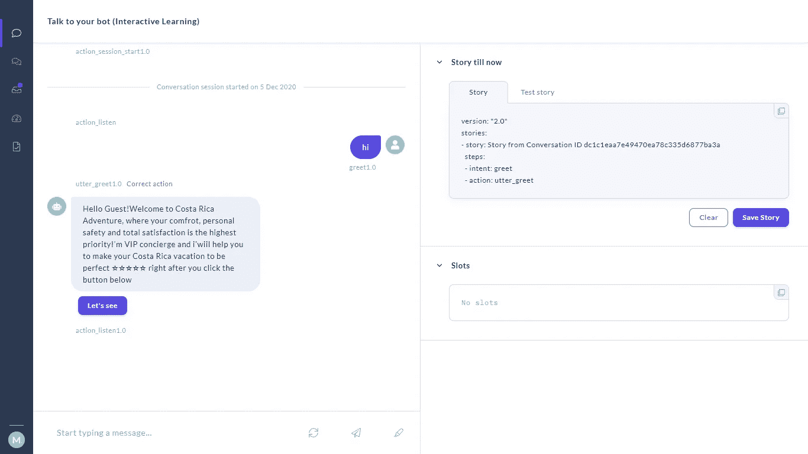
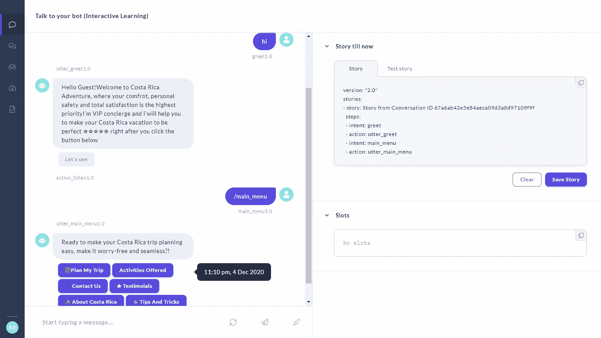
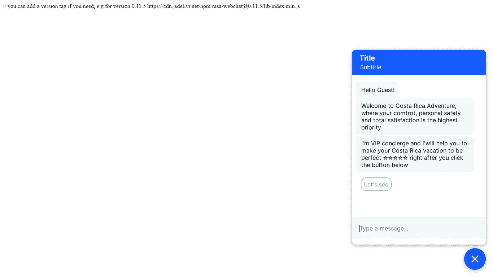

# 用 rasa-x 创建一个简单的聊天机器人，并与 web 集成

> 原文：<https://medium.com/analytics-vidhya/create-a-simple-chatbot-with-rasa-x-and-integrate-with-web-6c8c9338ce3?source=collection_archive---------5----------------------->

曾经想为你的网站或企业创建一个聊天机器人吗？那么这个博客是给你的。因此，让我们一步一步地看看如何创建一个聊天机器人，并与网站集成的过程。

首先，我们将创建一个新的项目和环境。对于开放终端和类型，以下命令

```
mkdir chatbot
cd chatbot
virtualenv venv
```

现在让我们激活环境并安装 rasa-x

```
venv\Scripts\activate
**pip install** rasa-x==0.34.0 --extra-index-url https://pypi.rasa.com/simple
```

现在我们已经设置好了，所以我们可以开始构建我们的聊天机器人。Rasa 最初给出了一个聊天机器人示例。我们可以通过下面的命令创建它。

```
rasa init --no-prompt
```

让我们看看 rasa 给了我们什么作为起点。

```
rasa-x
```

rasa-x 是为那些想不用编码就能构建聊天机器人的人设计的 UI。这将有助于我们创建一个聊天机器人并与之互动。这是一个对话的例子。



会话

## 创建对话

让我们创建第一个对话。例如。

```
User: hi
Bot: Hello Guest! Welcome to Costa Rica Adventure, where your comfrot, personal safety and total satisfaction is the highest priority I'm VIP concierge and i'wiil help you to make your Costa Rica vacation to be perfect ⭐⭐⭐⭐⭐ right after you click the button below
**Buttons:** Let's see
```

为了创建用户端，我们必须输入一些用户可能对机器人说的句子的例子。例如，在“培训”部分输入 NLU 数据。



现在点击+按钮，它会问你一个句子和它的意图。这里的**意图**指的是客户在输入问题或评论时心中的目标。例如。

```
Intent : Greet
Example : Hey, hi ,hello
```



在我们创建意图之后，我们必须创建一个响应，当用户问候一个机器人时，这个响应可以被回答。因此，让我们创建一个响应。在培训部分找到答案，然后按+按钮。然后它会问你的名字，我们会给你一个完全的问候，因为这是一个问候意图的响应。然后，我们可以输入下面的文本，并为显示菜单添加一个按钮。

```
buttons: 
        - 
          payload: /main_menu
          title: "Let's see"
      text: "Hello Guest! Welcome to Costa Rica Adventure, where your comfrot, personal safety and total satisfaction is the highest priority I'm VIP concierge and i'wiil help you to make your Costa Rica vacation to be perfect ⭐⭐⭐⭐⭐ right after you click the button below."
```



我们可以在这里插入图片和按钮。对于插入按钮，我们必须按下箭头符号。现在，它会问我们一个按钮的标题，这将显示给用户和一个按钮的有效载荷，这是聊天机器人的理解。

现在让我们再谈一次当用户按下按钮时会发生什么。

为此，我们必须用有效载荷名称创建 intent，这里是 main_menu。为此，让我们再次去 nlu 数据。



当您在 intent 中键入 main_menu 时，它将显示您在单击之后创建新的 intent，我们可以保存数据。

现在我们必须对此做出回应。为此，我们必须转到“培训”部分下的“响应”选项卡。按+按钮，现在我们必须给出名称，我们将给出主菜单作为主菜单意图的响应。然后，我们可以输入文本和按钮如下。

```
buttons: 
        - 
          payload: /plan_my_trip
          title: "📅Plan My Trip"
        - 
          payload: /activities_offered
          title: "Activities Offered"
        - 
          payload: /contact_us
          title: "📞 Contact Us"
        - 
          payload: /testimonials
          title: "⭐ Testimoials"
        - 
          payload: /about_costa_rica
          title: "🌅 About Costa Rica" 
        - 
          payload: /tips_and_tricks
          title: "👍 Tips And Tricks"        
      text: "Ready to make your Costa Rica trip planning easy, make it worry-free and seamless?!"
```



插入后，所有按钮按完成，然后保存您的回答。

现在你可以创建任何你想要的对话，如上所示。

## 编故事

我们只创建了一个问题和他们的答案，但我们没有告诉聊天机器人当用户问一些事情时应该如何回应。所以，让我们来创造一些故事，告诉聊天机器人谈话的流程。为此，请转到“培训”部分下的“故事”选项卡。按 enter 按钮并输入以下文本。

```
stories:
- story: greetings
  steps:
  - intent: greet
  - action: utter_greet
  - intent: main_menu
  - action: utter_main_menu
```

这里的故事:问候语显示了故事的名称。步骤用于描述对话的流程。如果用户说 greet，那么意图和动作就像问题和答案，但会从 utter_greet 示例中给出响应。

还有另一种简单的编故事方法。如果您发现机器人的响应不正确，您可以单击“与机器人对话”并更改它的响应。让我们以下面的图片为例。用户从 utter_greet 说 hi 和 bot 响应，这是正确的，但假设您期望 utter_welcome，然后您可以将光标拖向 utter_greet，单击后您可以看到 **correct_action** 按钮，您可以更正响应。对话结束后，你必须按下“保存故事”按钮。



现在，我们终于可以按下火车按钮，可以看到聊天机器人的工作。

要与聊天机器人互动，我们可以首先进入聊天机器人部分，然后如果它工作良好，我们可以与我们的网站集成。



我们可以看到我们的机器人工作，直到我们有插入对话。完整的对话你可以关注这个 GitHub repo[https://GitHub . com/dl made/rasa-chatbot-templates/tree/master/08 _ travel _ agency _ bot](https://github.com/dlmade/rasa-chatbot-templates/tree/master/08_travel_agency_bot)在这里你可以找到很多你的域名的模板。如果你不想写那么多东西，只想看到最终的结果，那么你可以克隆这个回购【https://github.com/dlmade/rasa-x-with-web[和](https://github.com/dlmade/rasa-x-with-web)继续写博客。

## 将 rasa 与您的 web 应用程序集成

现在，我们已经训练了模型，让我们继续与网站集成。为此，我们将使用这个回购[https://github.com/botfront/rasa-webchat](https://github.com/botfront/rasa-webchat)。

为此，进入项目目录并创建 index.html，然后复制下面的文本。

```
<div id="webchat"></div>
<script src="[https://cdn.jsdelivr.net/npm/rasa-webchat@0.11.5/lib/index.min.js](https://cdn.jsdelivr.net/npm/rasa-webchat@0.11.5/lib/index.min.js)"></script>
// you can add a version tag if you need, e.g for version 0.11.5 [https://cdn.jsdelivr.net/npm/rasa-webchat@0.11.5/lib/index.min.js](https://cdn.jsdelivr.net/npm/rasa-webchat@0.11.5/lib/index.min.js)
<script>
  WebChat.default.init({
    selector: "#webchat",
    initPayload: "/get_started",
    customData: {"language": "en"}, // arbitrary custom data. Stay minimal as this will be added to the socket
    socketUrl: "[http://localhost:5005](http://localhost:5005)",
    socketPath: "/socket.io/",
    title: "Title",
    subtitle: "Subtitle",
    params: {"storage": "session"} // can be set to "local"  or "session". details in storage section.
  })
</script>
```

为了使这个 HTML 页面工作，我们必须告诉 rasa，我们希望在我们的网站上使用它。因此，我们必须做如下一些改变。

首先，我们必须在 credential.yml 文件的末尾插入以下文本，您可以在项目目录中找到该文件。

```
socketio:
  user_message_evt: user_uttered
  bot_message_evt: bot_uttered
  session_persistence: true
```

然后，我们必须取消注释 endpoints.yml 文件中如下所示的行，您也可以在项目目录中找到该文件。

```
action_endpoint:
 url: "[http://localhost:5055/webhook](http://localhost:5055/webhook)"
```

之后，我们必须从项目目录中打开终端。然后我们必须运行下面的命令。

```
rasa run --cors "*" --enable-api
```

这个命令将从 rasa 端启动套接字，现在我们可以在浏览器中打开 index.html，并看到我们的网站工作。



你可以在这里看到完整的工作示例[https://rasa-travel-web.herokuapp.com/](https://rasa-travel-web.herokuapp.com/)。

如果你喜欢这篇文章，点击给我买杯咖啡！感谢阅读。

[](https://www.payumoney.com/paybypayumoney/#/147695053B73CAB82672E715A52F9AA5)

你的每一个小小的贡献都会鼓励我创造更多这样的内容。