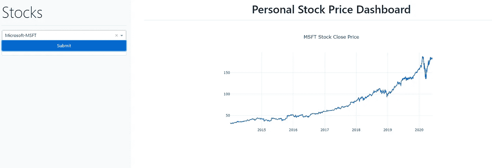
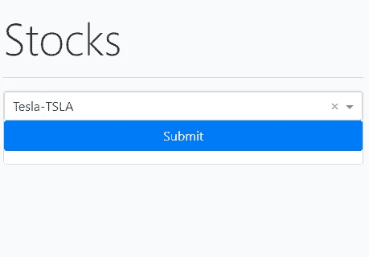
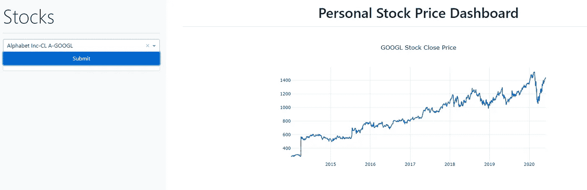

# 使用 Python Dash 创建时间序列数据可视化 web 仪表盘

> 原文：<https://medium.com/analytics-vidhya/create-a-time-series-visualization-web-dashboard-using-python-dash-e94c807e1d95?source=collection_archive---------3----------------------->

在本教程中，我们将使用 Python Dash 和 Boostrap Dash 库创建一个简单的 web dashboard，其中包含可供选择的侧栏和主要内容页面，以可视化时间序列数据。时间序列数据我们将可视化股票价格数据，但它可以扩展到任何数据集。最终结果将如下。



你需要一些 Python，Dash，Html，CSS，Bootstrap 的背景知识来完全理解这篇文章。

导入相关的 dash 库

```
import dash
import dash_bootstrap_components as dbc
import dash_core_components as dcc
import dash_html_components as html
from dash.dependencies import Input, Output, State
import pandas as pd
```

皮普安装这些，如果你没有它。

初始化仪表板应用程序

```
app = dash.Dash(external_stylesheets=[dbc.themes.BOOTSTRAP])

app.layout = html.Div()

if __name__ == '__main__':
    app.run_server(port='8083')
```

如果没有错误，试着运行并检查浏览器。没有什么会静止不动。

我们将创建一个有股票可供选择的侧栏和一个提交按钮

```
ticker_name_dic = {'TSLA':'Tesla', 'GOOGL':'Alphabet Inc-CL A', 'MSFT':'Microsoft'}
options = []
for ticker in ticker_name_dic:
    options.append({'label': '{}-{}'.format(ticker_name_dic[ticker], ticker), 'value': ticker})

SIDEBAR_STYLE = {
    "position": "fixed",
    "top": 0,
    "left": 0,
    "bottom": 0,
    "width": "30rem",
    "padding": "2rem 1rem",
    "background-color": "#f8f9fa",
}

controls = dbc.Card(
    [
        dbc.FormGroup(
            [
                dcc.Dropdown(
                    id='my_ticker_symbol',
                    options=options,
                    value='TSLA'
                ),
                dbc.Button(
                    id='submit-button',
                    n_clicks=0,
                    children='Submit',
                    color="primary",
                    block=True
                ),
            ]
        )
    ],
)

sidebar = html.Div(
    [
        html.H2("Stocks", className="display-4"),
        html.Hr(),
        controls
    ],
    style=SIDEBAR_STYLE,
) 
```

将此侧边栏添加到主应用布局

```
app.layout = html.Div([sidebar])
```

运行应用程序应该显示如下



我们将添加主要内容，这将有密切的页面价格图表

```
CONTENT_STYLE = {
    "margin-left": "32rem",
    "margin-right": "2rem",
    "padding": "2rem 1rem",
}content = html.Div(
    [
        html.H1('Personal Stock Price Dashboard', 
                style={'textAlign': 'center'}),
        html.Hr(),
        dbc.Row(
            [
                dbc.Col(dcc.Graph(id="my_close_price_graph"), 
                        width={"size": 8, "offset": 2}),
            ]
        )
    ],
    style=CONTENT_STYLE
)
```

为图形添加回调

```
@app.callback(
    Output('my_close_price_graph', 'figure'),
    [Input('submit-button', 'n_clicks')],
    [State('my_ticker_symbol', 'value')])
def update_graph(n_clicks, stock_ticker):
    graph_data = []
    close_price_query = "SELECT date, adjusted_close from stocks.eod_data where ticker = '" + str(stock_ticker) + "' order by date asc"
    df = pd.read_sql(close_price_query, con=conn)
    graph_data.append({'x': df['date'], 'y': df['adjusted_close']})
    fig = {
        'data': graph_data,
        'layout': {'title': stock_ticker + " Stock Close Price"}
    }
    return fig
```

我从本地 PostgreSQL 数据库中获取股票收盘价数据，但它也可以来自 CSV 或任何其他数据库。

```
database = "test"
postgresql_user = "test"
postgresql_password = "****"
conn = psycopg2.connect(database=database, user=user, password=password, host="127.0.0.1", port="5432")
```

向应用程序布局添加内容

```
app.layout = html.Div([sidebar, content])
```

运行应用程序并在 [http://127.0.0.1:8083/](http://127.0.0.1:8083/) 处检查输出

最终结果应该如下所示:



几个参考链接:

 [## Dash 用户指南

### Plotly Dash 用户指南和文档

dash.plotly.com](https://dash.plotly.com/) 

https://dash-bootstrap-components.opensource.faculty.ai/