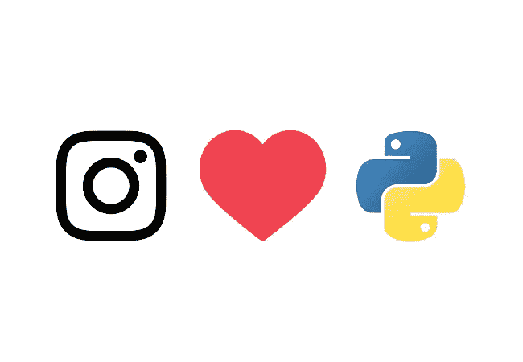
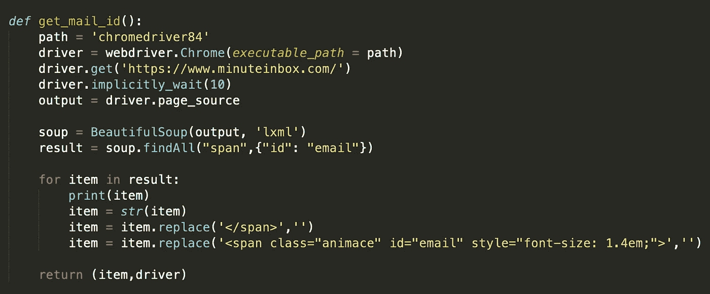
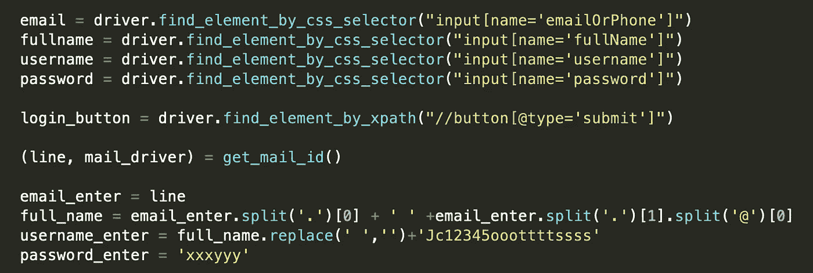
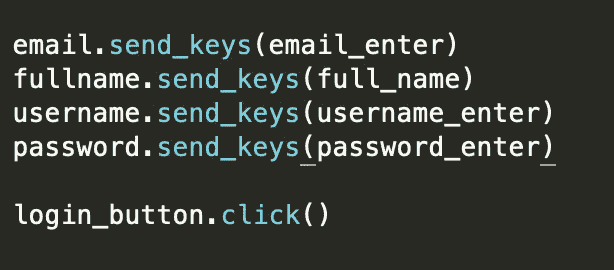
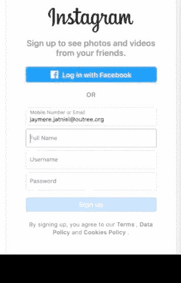
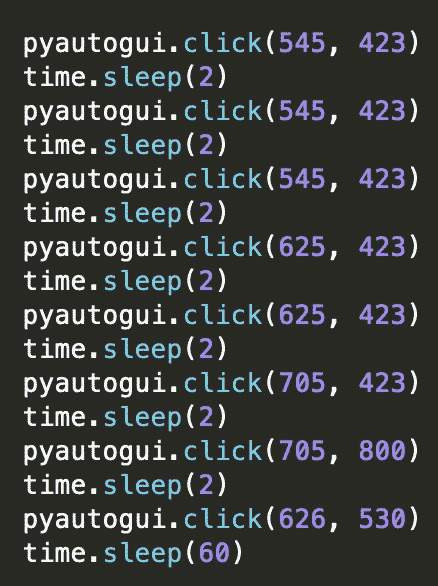
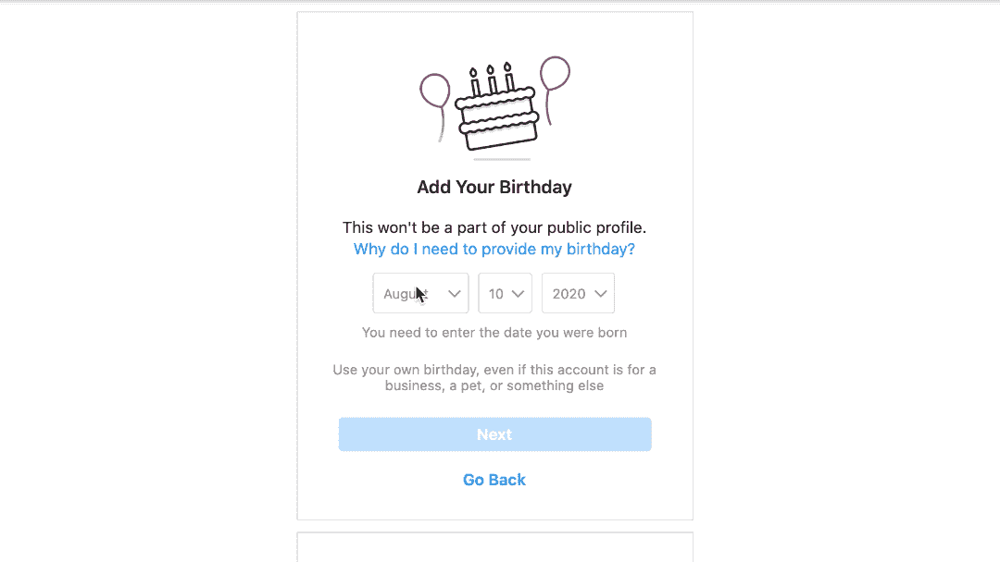
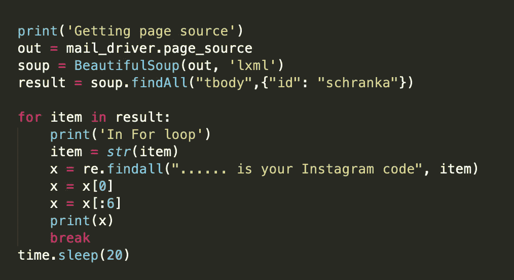

# 使用 Python 创建 Instagram 机器人

> 原文：<https://medium.com/analytics-vidhya/create-an-instagram-bot-using-python-755682b37d06?source=collection_archive---------6----------------------->

Instagram…，数百万人使用这个平台来展示他们的才华，并在不断变化的虚拟世界中留下印记。想把它变成你自己的吗？？？

我写了一个大约 100 行的程序，可以在一分钟内自动创建一个新的 instagram 账户。跟着走，你将被引入一个充满新的可能性的世界！！！

> **让我们从我们希望我们的应用程序做什么开始**

1.  设置一个临时邮件 ID，可以用来注册 instagram
2.  使用临时邮件 ID，从中可以提取名字、姓氏和用户名，并将其输入 instagram 注册页面
3.  自动移动鼠标和键盘来输入生日信息
4.  从 mail-id 的收件箱中获取验证码并提交

幸运的是，这些步骤都有简单的解决方案，使用 python 的强大功能只需几分钟就能实现！

> **第一步**

为了设置一个临时的邮件 id，我选择使用 www.minuteinbox.com 的，它为我们提供了一个邮件 id，可以访问它的收件箱 10 分钟。

我打开 chrome，导航到网页，使用 selenium 提取页面源代码，selenium 是一个自动化浏览器的工具。

使用 BeautifulSoup4，我提取了分配给我们的电子邮件 id，使用标签名和它的 Id。

> 第二步

使用电子邮件地址，这是形式 xxx.yyy@outree.org，我提取的名字和姓氏。使用这个，我还设置了帐户的用户名和密码

一旦所有这些都准备好了，我们提交这些细节到网页上！

通过 Python 提交信息

> 第三步

我发现，在输入生日信息时，网页中显示的元素不会出现在页面源代码中。因此，我通过使用自动化鼠标和键盘的 **pyautogui** 来解决这个问题。所以我直接和打开的 chrome 标签交互

鼠标点击屏幕上的特定点

> 第四步

最后，我们等待确认代码到达我们的收件箱，并再次使用页面源，提取它。

然而，由于提交这个确认代码和创建一个假帐户的道德分歧，我在这一点上停止了我的代码！

> 最后

仅仅 100 行 python 代码就让我们从零开始创建了一个新的 instagram 帐户！

**我们学到的一些东西是:**

1.  向网页提交信息(用于创建帐户、登录等。)
2.  使用鼠标和键盘的自动化与屏幕上的各种元素进行交互(用于面向 HTML 的解决方案不可用或难以实现的情况，例如填写日期)
3.  使用一个 http 会话中的信息，在不同的 http 会话之间无缝切换。(用于从一个网页获取确认代码并在另一个网页中提交)

从技术上讲，你从阅读这篇文章中获得的知识可以用来创建任何 web 应用程序和几乎任何过程！

如果你想尝试自己实现这段代码，请查看我的 [Github repo](https://github.com/abishekshyamsunder/instagram-account-bot) ！欢迎所有建设性的批评！