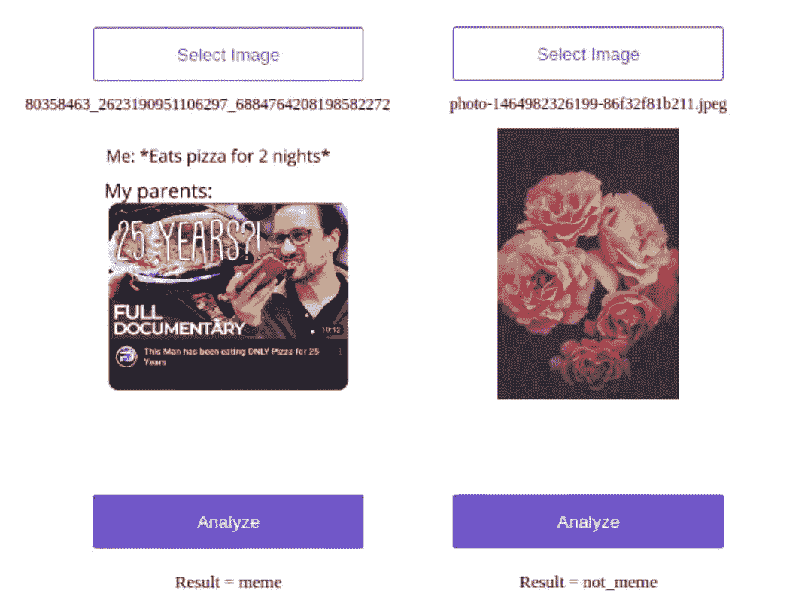
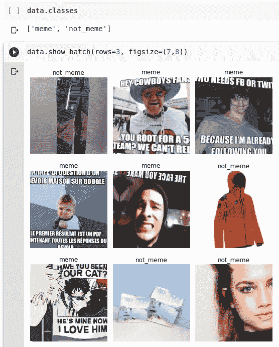
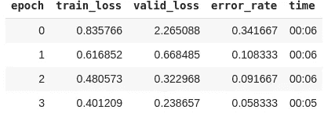
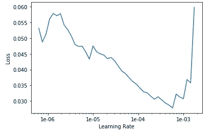
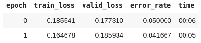
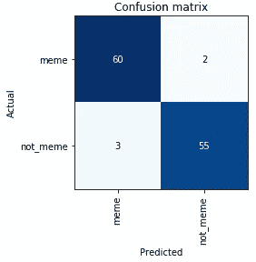

# 从头开始创建和部署你的迷因探测器:一步一步的指南

> 原文：<https://medium.com/analytics-vidhya/create-and-deploy-your-meme-detector-from-scratch-a-step-by-step-guide-3f5a96f22099?source=collection_archive---------17----------------------->

# 介绍



在本教程中，你将学习如何像[这个](https://meme-detector.onrender.com/)一样从头开始构建自己的迷因检测器。本教程结束时，您将能够:

*   使用谷歌图像创建自己的数据集。
*   选择并重新训练 CNN 架构的密集层。
*   将您的模型作为 web 应用程序部署到 Render.com

# 库和主要依赖项

1.  用于 GPU 的 Google Colab
2.  Fastai v 1.0.52
3.  PyTorch v1

Fastai 是一个建立在 PyTorch 之上的令人惊叹的库，它使深度学习更加直观，并使它需要更少的代码行。想了解更多信息，你应该去他们的文档网站:【https://docs.fast.ai/ 

# 1.获取数据

在开始数据收集过程之前，让我们先来定义什么是模因。根据维基百科，模因的定义如下:

> 一个**互联网迷因**，通常被简单地称为**迷因**([/miːm/](https://en.wikipedia.org/wiki/Help:IPA/English)[*meem*](https://en.wikipedia.org/wiki/Help:Pronunciation_respelling_key))是一种[迷因](https://en.wikipedia.org/wiki/Meme)，一种媒体，传统上但不排他地将图像宏与一个概念或流行语相结合，通过[社交媒体平台](https://en.wikipedia.org/wiki/Social_media_platforms)经由[互联网](https://en.wikipedia.org/wiki/Internet)传播。

所以基本上，网络迷因是伴随着有趣文字的图片。

在做任何事情之前，您需要设置 google Colab 环境:

*   安装 Fastai 及其依赖项

```
!curl -s [https://course.fast.ai/setup/colab](https://course.fast.ai/setup/colab) | bash
```

*   安装 google drive

```
from google.colab import drive
drive.mount('/content/gdrive', force_remount=True)
```

*   创建工作目录

```
root_dir = "/content/gdrive/My Drive/"
base_dir = root_dir + 'fastai-v3/data/MEMES/'from fastai.vision import *
path = Path(base_dir)
path.mkdir(parents=True, exist_ok=True)
```

现在一切都设置好了，你将建立你的迷因图像数据集

**收集模因**

进入谷歌图片，搜索关键词“ **meme** ”，向下滚动，直到你看到“显示更多结果”按钮。


现在，您必须在浏览器中运行一些 Javascript 代码，它将为我们的数据集保存您想要的所有图像的 URL。

根据浏览器/操作系统的不同，有不同的快捷方式将你带到控制台:在谷歌 Chrome 中，在 Windows/Linux 上按 CtrlShiftj，在 macOS 上按 CmdOptj，会出现一个 javascript“控制台”的小窗口。在 Firefox 中，在 Windows/Linux 上按 CtrlShiftk，在 macOS 上按 CmdOptk。这是您粘贴 JavaScript 命令的地方。

在运行以下命令之前，您应该禁用广告拦截扩展(uBlock、AdBlockPlus 等)。)在 Chrome 中。

之后，在控制台中运行以下命令

```
urls=Array.from(document.querySelectorAll('.rg_i')).map(el=> el.hasAttribute('data-src')?el.getAttribute('data-src'):el.getAttribute('data-iurl'));
window.open('data:text/csv;charset=utf-8,' + escape(urls.join('\n')));
```

这将创建一个文本文件，其中包含搜索结果中图像的 URL 列表。

你可能想用相关的关键词重复这个过程，比如“**动漫迷因**”、“**世界大战迷因**”、“**黑白迷因**”……并且将链接添加到同一个最终列表中。

你将把它命名为“url_memes.txt”。

现在，为了下载图像，您将首先为名为 *meme 的 **meme** 类创建一个文件夹。*然后您将使用名为`download_images`的 Fastai 内置函数从 URL 下载图像。

```
folder = 'meme'
file = 'url_memes.txt'
path = Path(base_dir)
dest = path/folder
dest.mkdir(parents=True, exist_ok=True)
download_images(path/file, dest, max_pics=300)
```

**创建非迷因集**

使用以下关键字对 **not meme** 类重复相同的谷歌搜索过程:**图片、图像、自拍、脸、照片、壁纸……**

最终的 URL 列表存储在一个名为“url_not_memes.txt”的文件中

现在，您应该运行以下脚本

```
folder = 'not_meme'
file = 'url_not_memes.txt'
path = Path(base_dir)
dest = path/folder
dest.mkdir(parents=True, exist_ok=True)
download_images(path/file, dest, max_pics=300)
```

它将创建 not_meme 文件夹并为您下载图像。

恭喜你！！您创建了您的第一个图像数据集，这是巨大的！你应该为自己感到骄傲。

# **2。训练模型**

您应该可以使用内置的 fastai `ImageDataBunch`来处理您的数据:

```
np.random.seed(42)
data = ImageDataBunch.from_folder(path, train=".", valid_pct=0.2, ds_tfms=get_transforms(), size=224, num_workers=4).normalize(imagenet_stats)
```

基本上，`from_folder`方法采用以下参数:

*   路径:图像数据集的路径
*   ds_tfms:应用于图像以扩充数据集的转换
*   尺寸:图像尺寸/选择值:224 x224 像素
*   valid_pct : 0.2(即数据集的 20%将用于验证，因为定型集和验证集没有特定的文件夹。

使用`data.classes`,你会发现数据加载器将每个文件夹视为一个类。`data.show_batch`将帮助您可视化数据样本，如下所示:



使用`cnn_learner`功能，一个内置的 fastai 功能加载一个预训练的 Resnet34

```
learn = cnn_learner(data, models.resnet34, metrics=error_rate)
```

基本上，该函数需要以下三个参数:

*   数据中心
*   要下载和训练的模型的规格。
*   和指标(我在这里选择了 error_rate)

您将在 4 个时期内进行培训

```
learn.fit_one_cycle(4)
```



现在您已经重新训练了最后一层，您应该解冻模型以将其作为一个整体重新训练:

```
learn.unfreeze()
```

为了选择好的学习率，可以使用内置的 fastai 函数`learn.lr_find()`。这个方法可以帮助你找到一个最佳的学习速度。它使用了 2015 年论文[中开发的技术，用于训练神经网络](http://arxiv.org/abs/1506.01186)的循环学习率，我们只是从一个非常小的值开始增加学习率，直到损失停止下降。我们可以绘制不同批次的学习率，看看这是什么样子。

如果您使用`learn.recorder.plot()`，它应该会产生类似下面的图



现在，您应该使用学习率值再运行 2 个时期的训练，学习率值属于损失下降非常陡峭的区间:即(3e-05 和 3e-04)

```
learn.fit_one_cycle(2, max_lr=slice(3e-5,3e-4))
```

***max_lr=slice(start，end)*** ，会告诉你的模型用`start`的 lr 训练第一层；`end`的最后一层 LR；对于剩余的层，将 LR 分布在整个范围内`(start, end)`。

给你。您应该会得到更好的结果(我得到的错误率为 **4%** )



您可以按如下方式绘制混淆矩阵:

```
interp = ClassificationInterpretation.from_learner(learn)
interp.plot_confusion_matrix()
```



恭喜你！你已经建立了你的迷因分类器！现在您要部署它了！

# 3.在 Render.com 部署应用程序

在这一步中，你将能够像我在这里所做的那样，将你的 meme 探测器部署到网络上:

【https://meme-detector.onrender.com/】

**叉本 github 回购:**

[](https://github.com/render-examples/fastai-v3) [## render-examples/fastai-v3

### 这个 repo 可以作为在 Render 上部署 fast.ai 模型的起点。这里描述的示例应用程序位于…

github.com](https://github.com/render-examples/fastai-v3) 

**在**[**Render.com**](http://render.com)上开户

将使用`learner.export` ( `export.pkl`)创建的训练好的模型文件上传到 Google Drive 或 Dropbox 等云服务。复制文件的下载链接。

## 为您的模型定制应用程序

1.  编辑`app`目录中的文件`server.py`，并用上面复制的 URL 更新`export_file_url`变量。
2.  在同一个文件中，用类`['meme', 'not_meme']`更新行`classes = ['black', 'grizzly', 'teddys']`。
3.  您还应该编辑`index.html`,其中包含您想要为您的应用程序显示的文本。
4.  在 docker 文件中，您应该在`RUN pip install --upgrade -r requirements.txt`之后添加以下内容

```
RUN pip uninstall — yes Pillow
RUN pip install ‘Pillow==6.1’
```

将您的更改提交并推送到 GitHub。请确保您在上面创建的 GitHub repo 是最新的。Render 与您的 GitHub repo 集成，并在您每次推送更改时自动构建和部署更改。

## 部署

1.  在 Render 上创建一个新的 **Web 服务**，并使用上面创建的 repo。在这一步中，您需要授予 Render 权限来访问您的 repo。
2.  在部署屏幕上，为您的服务选择一个名称，并为环境使用`Docker`。将使用此服务名称创建 URL。如有必要，可以更改服务名称，但不能编辑最初创建的 URL。
3.  点击**保存 Web 服务**。就是这样！您的服务将开始构建，并应在几分钟后在渲染仪表板中显示的 URL 处上线。您可以在部署日志中跟踪它的进度。

## 测试

你的应用程序的网址将看起来像`https://service-name.onrender.com`。您还可以在测试应用程序时监控服务日志。

# 结论

在本教程中，您学习了以下技能:

*   使用 google image 创建自己的图像数据集的简单方法。
*   训练一个 resnet34 并选择正确的学习率区间。
*   导出模型并将其部署为 web 应用程序。

特别感谢[*Jeremy*](https://twitter.com/jeremyphoward)*和*[*Rachel*](https://twitter.com/math_rachel)*为他们惊艳 fastai 深度学习课堂。***