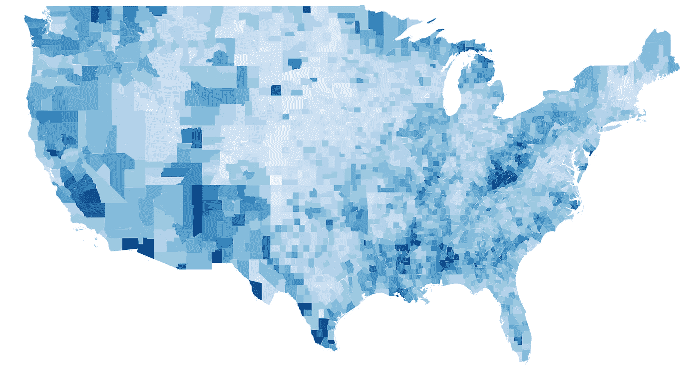
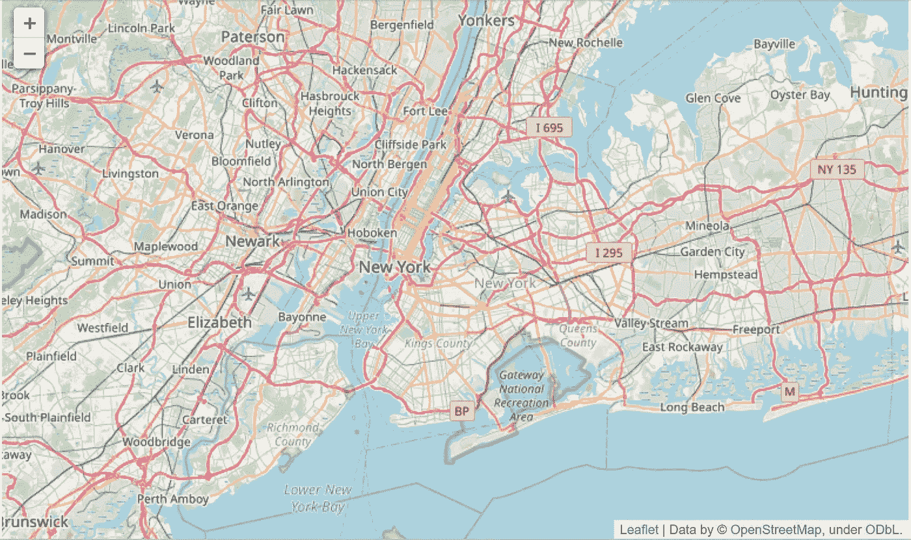
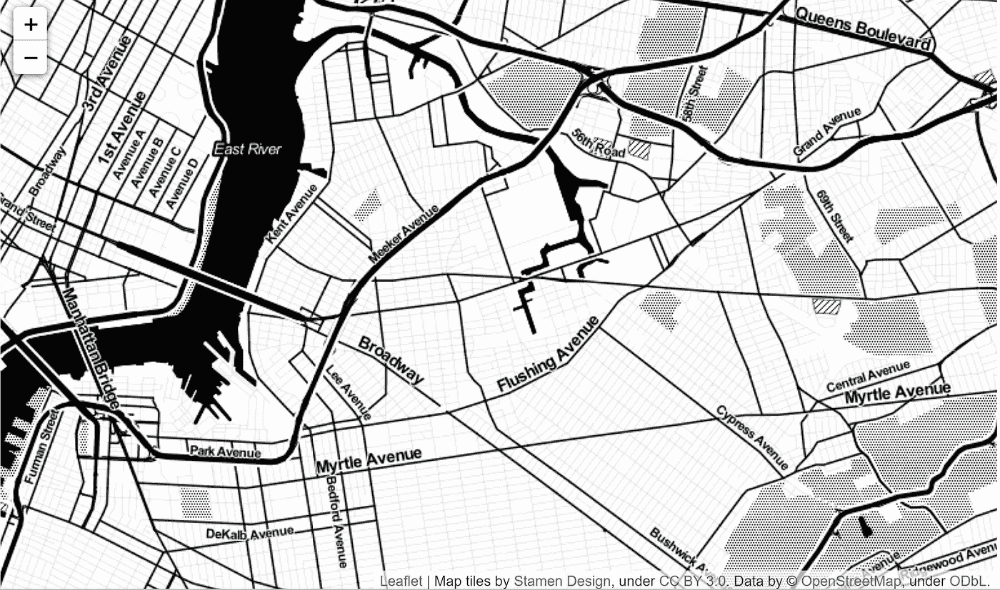
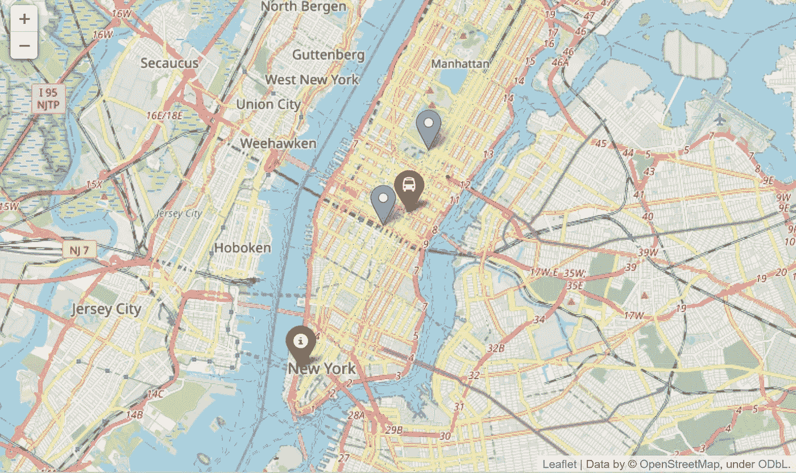
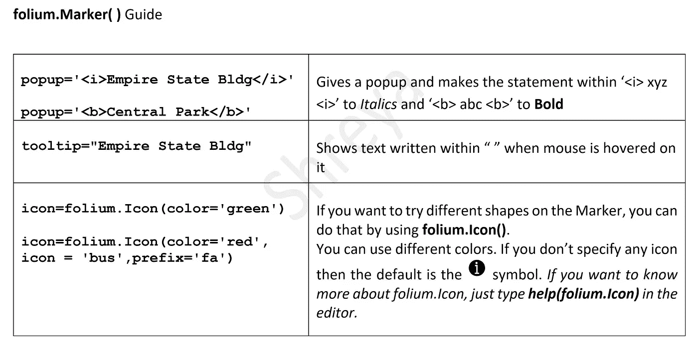
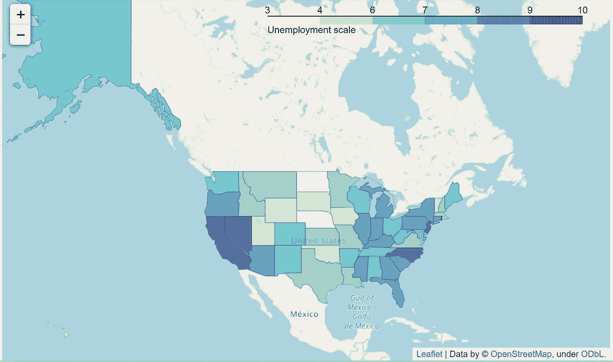
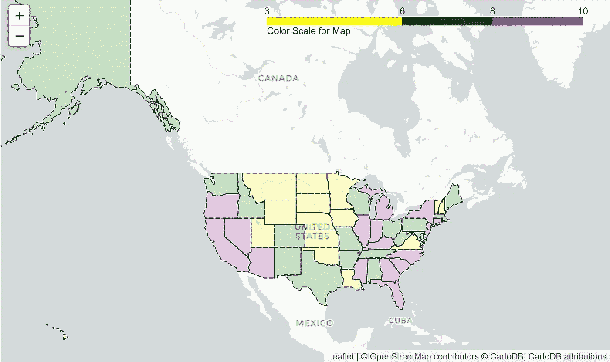
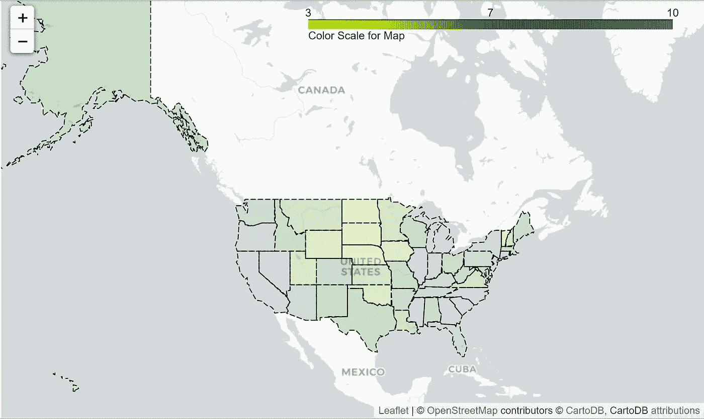
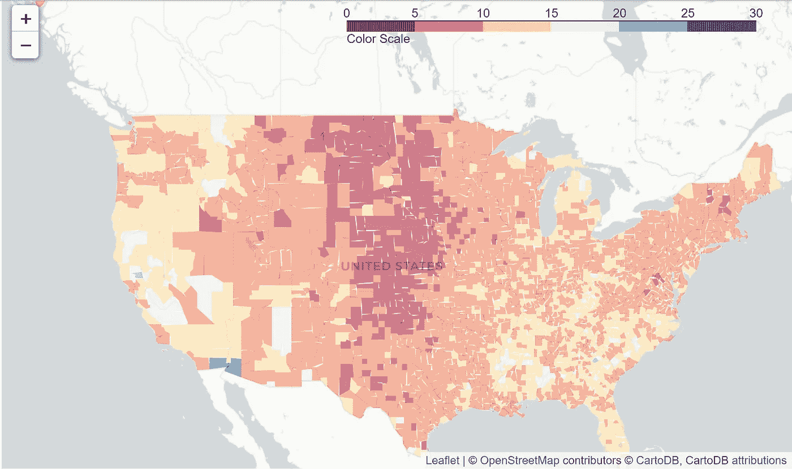

# 创建和可视化 Choropleth 地图与叶

> 原文：<https://medium.com/analytics-vidhya/create-and-visualize-choropleth-map-with-folium-269d3fd12fa0?source=collection_archive---------0----------------------->



/ˌviZH(o͞o)ələˈzāSH(ə)n/

> 以图表或其他图像的形式表示一个对象、一种情况或一组信息

# 为什么可视化如此重要？

数据可视化的目标是简化数据值，加深对数据值的理解，并向受众传达重要的概念。我们的大脑天生具有快速视觉处理能力。同样，**麻省理工**声明:

1.  人脑可以在短短的 13 毫秒内处理一幅图像
2.  **传输到大脑的信息 90%是视觉的**

> **“的确，视觉效果非常引人注目！!"**

# **让我们了解一下叶图书馆和 Choropleth 地图**

**C 它允许我们研究变量是如何随着领域发展的。它是一种功能强大且广泛使用的数据可视化技术。**

**F 它建立在 Python 生态系统的数据争论优势和 [leaflet.js](https://leafletjs.com/) 库的映射优势之上。**

**该库内置了来自 **OpenStreetMap** 、 **Mapbox** 和 **Stamen** 的多个 tileset，并支持带有 **Mapbox** 或 **Cloudmade API** 键的自定义 tileset。**

**让我们一步一步来**

# **1.叶子的安装**

## **在安装 have 之前，建议安装 [branca](https://pypi.org/project/branca/) 、 [jinja2](https://pypi.org/project/Jinja2/) 和 [requests](https://pypi.org/project/requests/2.7.0/) 。**

**有些功能需要 [geopandas](https://pypi.org/project/geopandas/) 和 [altair](https://pypi.org/project/altair/)**

```
$ pip install folium
```

**或者**

```
$ conda install folium -c conda-forge
```

# **2.使用切片和标记创建底图**

**要创建底图，只需将位置坐标传递给 map()。**

```
**import** **folium**new_york = folium.Map(location=[40.7128,-73.9352])
new_york
```

****

**上述代码的输出，这是一个 OpenStreetMap**

**列表包含**【纬度，经度】，**，这些值必须以十进制度数表示。你可以通过这个 [*网站*](https://www.gps-coordinates.net/) 获取地点的经纬度。**

**要将其存储为“下载”文件夹中的 HTML 文档:**

```
new_york.save(‘index.html’)
```

**注意:默认磁贴被设置为 OpenStreetMap，但也可以使用许多其他磁贴，如[雄蕊地形](http://maps.stamen.com/#terrain)、[雄蕊调色剂](http://maps.stamen.com/#toner)、[地图框明亮](https://api.mapbox.com/styles/v1/mapbox/bright-v9.html?title=true&access_token=pk.eyJ1IjoibWFwYm94IiwiYSI6ImNpejY4M29iazA2Z2gycXA4N2pmbDZmangifQ.-g_vE53SD2WrJ6tFX7QHmA#15/34.0442/-118.2518)。**

```
folium.Map(
    location=[40.7128,-73.9352],
    tiles='Stamen Toner',
    zoom_start=13
)
```

****

**输出为上面的代码，一个带有雄蕊调色剂的贴图**

> **要了解有关地图功能的更多信息，只需将以下内容粘贴到编辑器中**

```
**folium.Map?**
```

**为了在地图上精确定位一个位置，使用了一个标记**和**。**

```
**new_york** = folium.Map(
    location=[40.7128,-73.9352],
    zoom_start=12,

)folium.**Marker**([40.74843597, -73.98580932], popup='<i>Empire State Bldg</i>', tooltip="Empire State Bldg").add_to(new_york)folium.**Marker**([40.767459869,-73.970710754], popup='<b>Central Park</b>').add_to(new_york)folium.**Marker**([40.75271606,-73.97721862],popup='Grand Central Terminal',icon=folium.Icon(color='red',icon='bus',prefix='fa'))
.add_to(new_york)folium.**Marker**([40.713409424, -74.013343811],popup='One World Trade Center',icon=folium.Icon(color='green'))
.add_to(new_york)**new_york**
```

********

**我的一个小向导**

**如果你想要更多不同类型的图标，那么访问 [Font Awesome 的网站。要使用这些图标，在**叶中使用**前缀=‘fa’**。图标()。**](https://fontawesome.com/v4.7.0/icons/)**

# **3.最后，创建一个 Choropleth 地图！**

**我选择了一个美国州的数据集来工作。您也可以选择具有不同位置的数据集。首先，让我们加载我们选择的 CSV 文件来可视化 Choropleth 图。GeoJSON 和 TopoJSON 图层可以作为叠加图传递到地图，并且可以在同一地图上显示多个图层。**

```
**import folium 
import json
import requests
import pandas as pd
import matplotlib.pyplot as plt
import branca 
import seaborn as sns
import numpy as np****state_unemp** = pd.read_csv("state_unemployment.csv")**url** = '[https://raw.githubusercontent.com/python-visualization/folium/master/examples/data'](https://raw.githubusercontent.com/python-visualization/folium/master/examples/data')**state_geo** = f'{url}/us-states.json'        #for state level data
```

**现在创建一个简单的地图:**

```
**usa_state = folium.Map(location=[48, -102], zoom_start=3)****folium.Choropleth(
    geo_data = state_geo,** #json **name ='choropleth',                  
    data = state_unemp,                     
    columns = ['State', 'Unemployment'],** #columns to work on **key_on ='feature.id',
    fill_color ='YlGnBu',** #I passed colors Yellow,Green,Blue **fill_opacity = 0.7,
    line_opacity = 0.2
   legend_name = "Unemployment scale**" **).add_to(usa_state)****usa_state**#more info about the function can be found using **folium.Choropleth?**
```

****

**显示州一级失业情况的地图**

## **3.1 使用 StepColormap**

**StepColormap 是*嵌入*在 folium.colormap 中**

```
**import** **branca.colormap** **as** **cmp****step** = cmp.StepColormap(
 ['yellow', 'green', 'purple'],
 vmin=3, vmax=10,
 index=[3, 6, 8, 10],  #for change in the colors, not used fr linear
 caption='Color Scale for Map'    #Caption for Color scale or Legend
)**step**
```

****

**使用上面在图中定义的步长变量:**

```
**unemployment_dict** = state_unemp.set_index('State')['Unemployment']
**geo_json_data** = json.loads(requests.get(**state_geo**).text)usa_step = folium.Map([48, -102], tiles='cartodbpositron', zoom_start=3)folium.GeoJson(
    **geo_json_data**,
    style_function=lambda feature: {
        'fillColor': **step**(**unemployment_dict**[feature['id']]),
        'color': 'black',       #border color for the color fills
        'weight': 1,            #how thick the border has to be
        'dashArray': '5, 3'  #dashed lines length,space between them
    }
).add_to(usa_step)
**step**.add_to(usa_step)     #adds colorscale or legendusa_step
```

****

## **3.2 使用 LinearColormap**

**有一组连续的颜色。**

```
**import** **branca.colormap** **as** **cmp****linear** = cmp.LinearColormap(
    ['yellow', 'green', 'purple'],
    vmin=3, vmax=10,
    caption='Color Scale for Map' #Caption for Color scale or Legend
)**linear**
```

****

**使用上面在图中定义的线性变量:**

```
**unemployment_dict** = state_unemp.set_index('State')['Unemployment']
**geo_json_data** = json.loads(requests.get(**state_geo**).text)usa_linear = folium.Map([48,-102], tiles='cartodbpositron', zoom_start=3)folium.GeoJson(
    **geo_json_data**,
    style_function=lambda feature: {
        'fillColor': **linear**(**unemployment_dict**[feature['id']]),
        'color': 'black',     #border color for the color fills
        'weight': 1,          #how thick the border has to be
        'dashArray': '5, 3'  #dashed lines length,space between them
    }
).add_to(usa_linear)
**linear**.add_to(usa_linear)   #adds colorscale or legendusa_linear
```

****

> **“要找到更多这样的配色方案，只需将它粘贴到编辑器中”**

```
**cmp.linear   
#or
branca.colormap.linear**
```

## **转换策略**

**如果您想将线性配色方案转换为 step:**

```
**linear.to_step(6)**#Note: The color schemes appeared in **linear** have been changed to #step. Also, give a step size in the parenthesis.
```

****

**以及，将步骤颜色方案转换为线性:**

```
**step.to_linear()**#Note: The color schemes appeared in **step** have been changed to #linear
```

****

## **3.3 将阶跃转换为线性的 Choropleth 图，反之亦然**

**使用新的美国县数据集。按照步骤 3 加载 CSV 文件并导入必要的库。**

```
**us_data** = pd.read_csv('unemployment_county_data.csv')**url** = '[https://raw.githubusercontent.com/python-visualization/folium/master/examples/data'](https://raw.githubusercontent.com/python-visualization/folium/master/examples/data')**county_geo** =f'{url}/us_counties_20m_topo.json'#for county level data**employed_series** = us_data.set_index('FIPS')['Unemployment_rate_2011']
```

****利用。Choropleth 映射中的 to _ step():****

```
#linear to step using .to_step()colorscale = branca.colormap.linear.RdYlBu_11.**to_step(6)**.scale(0, 30)                       
colorscale.caption = 'Color Scale'     #Caption for legenddef style_function(feature):
    employed = **employed_series**.get(int(feature['id'][-5:]), None)
    return {
        'fillOpacity': 0.5,
        'weight': 0,
        'caption': "Color Scale",
        'fillColor': '#black' if employed is None else colorscale(employed)
    }us_county_stp = folium.Map(
    location=[42, -100],
    tiles='cartodbpositron',
    zoom_start=4
)folium.TopoJson(
    json.loads(requests.get(**county_geo**).text),  #data
    'objects.us_counties_20m',       #object_path
    style_function=style_function
).add_to(us_county_stp)colorscale.add_to(us_county_stp)us_county_stp
```

****

**使用阶跃函数的美国县明智失业**

****利用。Choropleth 映射中的 to _ linear():****

```
#step to linear using .to_linear()
colorscale = branca.colormap.step.RdYlBu_11.**to_linear()**.scale(0, 30)
colorscale.caption = 'Color Scale'def style_function(feature):
    employed = **employed_series**.get(int(feature['id'][-5:]), None)
    return {
        'fillOpacity': 0.5,
        'weight': 0,
        'fillColor': '#black' if employed is None else colorscale(employed)
    }us_county_lin = folium.Map(
    location=[42, -100],
    tiles='cartodbpositron',
    zoom_start=4
)folium.TopoJson(
    json.loads(requests.get(**county_geo**).text),
    'objects.us_counties_20m',
    style_function=style_function
).add_to(us_county_lin)colorscale.add_to(us_county_lin)us_county_lin
```

****

**使用线性函数的美国县级失业率**

**因此，创建一个 Choropleth 地图并不是一项任务😄。我希望我的帖子对大多数从事可视化数据工作的人有所帮助。**

*****请给我*** 👏 ***如果你喜欢我的帖子！🎉*****