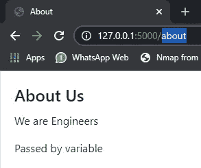

# 使用 pycharm 在任何地方创建 Flask web 应用程序

> 原文：<https://medium.com/analytics-vidhya/create-anywhere-use-flask-web-app-with-pycharm-fa67719df4d7?source=collection_archive---------10----------------------->

Flask web 应用程序创建，具有系统的 Flask 文件结构，即用型模板，可在任何地方用于任何项目，使用 PyCharm IDE。

# **目录:**

> 1.安装和配置
> 
> 2.烧瓶文件层次结构
> 
> 3.定义烧瓶应用程序
> 
> 4.路线或链接
> 
> 5.创建主页
> 
> 6.本地部署
> 
> 7.创建通用布局文件并添加引导程序 4。
> 
> 8.添加/修改 html 文件
> 
> 9.添加导航栏

# **1。安装和配置**

创建文件夹**‘flask _ H5’**(任意名称)

要检查 pip 的所有库: ***pip 列表***

安装库 **pipenv** :这将创建 python 虚拟环境

> **管道安装管道**

在 flask_h5 文件夹位置打开命令提示符:

运行命令:

> **pipenv —三个**

这将创建新的虚拟环境。自动打开它，直接与 python 版本安装在您的 PC 上。更多[https://pipenv.pypa.io/en/latest/](https://pipenv.pypa.io/en/latest/)

要运行虚拟环境:

> **管道外壳**

虚拟环境外壳

**在虚婀:**

安装最新版本的 flask:

> **pip 安装烧瓶**

烧瓶安装

我们将和皮查姆一起工作。

打开 Pycharm —>打开项目—>选择“flask_h5”文件夹

# 2.烧瓶文件结构

在创建应用程序之前，我们将创建 flask 应用程序所需的文件夹和文件。

烧瓶文件结构

让我们看看我们的文件结构:

app.py 用于运行我们的应用程序。

我们创建了**应用程序文件夹**,我们的整个 flask 应用程序将驻留在那里。在应用程序文件夹中，我们有:

**静态**文件夹，放置任何静态内容，这些内容将在我们的应用程序中的任何地方使用，如图像、视频、模型文件、css、js 等。

**模板**存放所有 html 文件的文件夹。

**routes.py** 包含/home、/about 等我们 app 的所有路线/链接。

**__init__。py** 定义了我们的 flask app 并包含了所有的配置。

我们将从 __init__ file 开始

# 3.定义烧瓶应用程序

## app/__init__。py:

 [## Hasan-hai der/Anywhere-use-systemic-Flask-we B- app

### Flask 网络应用程序，具有系统的 flask 文件结构，随时可用的模板，可以在任何地方用于任何项目，使用…

github.com](https://github.com/hasan-haider/Anywhere-use-systematic-Flask-web-app/blob/9e6e8e8136f966e8599f088d74354c85f6a813c0/app/__init__.py#L1) 

**从烧瓶导入烧瓶**:导入烧瓶库创建烧瓶应用

**app** 变量将在我们应用程序的任何地方使用，因为它定义了我们的 flask 应用程序。

**static_folder** 烧瓶内命令帮助使用静态文件夹内容

**app.config** 帮助我们配置整个 flask 应用程序，无需在每个步骤中手动执行任何操作。例如，在使用 html 表单时，我们使用 csrf 令牌(跨站点请求伪造)来保证安全性，我们在 flask 中使用“SECRET_KEY”来自动完成所有这些操作，而无需在所有表单上手动添加 csrf 令牌。

(可选) **APP_ROOT** 将给出应用程序的当前部署位置，稍后将会用到。因为在运行 webapp 时，服务器的位置并未确定，而是使用客户端位置。因此，要让我们的服务器文件在应用程序中使用文件和文件夹，我们将使用操作系统库。

最后，我们导入 **routes.py** 文件，该文件将用于路由页面。

## app.py:

从 app(文件夹)导入 app(我们的 flask app 定义在 __init__。py)

调试被设置为真，以便向我们显示错误，以及应用程序将在编辑/修改时运行。

# 4.路线或链接

Routes 定义了应用程序中的页面，用于重定向、执行任何 python 任务、显示 html 页面、json 请求/响应等。

## routes.py:

routes.py

导入“应用程序”是必要的，因为路线将与我们的 flask 应用程序关联。

***@ app . route('/route_name ')****是必须添加的，以便我们的应用程序了解下面的函数将与我们的路由“route _ name”相关联，即该函数将在 website.com/route_name 或本地主机/route_name 被调用时运行。*

> *默认路由是“/”*

****render _ template***:用于渲染我们的 html 文件，并作为响应发送到客户端显示给用户。这里，在'**index.html**'(html 文件)之后传递到这里的任何参数都可以在我们正在呈现的 html 页面中使用。*

*这里我们不传递 html 文件的任何位置，因为 flask 会自动从' **templates** '文件夹中获取它。*

# *5.创建主页*

## *应用程序/模板/索引. html:*

*Index.html 与我们的**路线('/')** 链接，使用 render_template，函数将在'/'路线被调用时呈现此页面。*

*我们创建了带有标题的基本 html 页面。*

**

*模板/索引. html*

*这里可以看到 ***{{title}}*** 被用在 title **标签**里面。这是一个在呈现索引页面时传递的变量。任何通过路线的东西都将在这里使用。我们可以传递 list，string，dict 等，并在我们的 html 中使用它来显示。*

# *6.本地部署*

*现在，我们创建了基本的 flask 应用程序，并准备运行。*

*打开 PyCharm 终端(pycharm 自动使用 virtaul env。我们在开始时创建的)并运行:*

> ***python app.py***

**

*转到给定的链接，你会看到你的应用程序部署在本地。您可以看到“Home”作为标题，我们在 route 中将其作为参数传递，并在 html 文件中使用。*

**

*127.0.0.1:5000*

# *7.创建通用布局文件并添加引导程序 4*

*让我们做一些装饰。*

*我们现在将修改 html 文件并创建一个通用布局文件，它将被用作我们的主文件，其他 html 文件将使用布局。**布局**将包含我们的主要 html 标签，如标题、正文、导航栏等，它们将在我们的应用程序中随处使用。通过这样做，我们不必一次又一次地创建和调用整个页面，而是只请求和显示页面的一部分。*

> ****点记:****
> 
> ***** : *使用 python 命令或任何 flask 内置命令。也必须关闭它才能结束它的执行。**
> 
> **例如*。 *for 循环:**
> 
> ******
> 
> ***{ { I } }***#在 html 页面中顺序打印 I 的所有值**
> 
> ******
> 
> **创建任何你自己的块在 html 中使用:**
> 
> ***{ % block our _ block _ name % }***
> 
> ******

*在模板文件夹中创建几个文件，如 layout.html、index.html、about.html 等。*

## *应用程序/模板/布局. html:*

*转到[**https://get bootstrap . com/docs/4.4/getting-started/introduction/**](https://getbootstrap.com/docs/4.4/getting-started/introduction/)，按照给出的说明添加引导。*

**

*这里我们**创建了一个** **块**，名为“ ***ourpage*** ”，将在每个 html 文件中使用。*

## *应用程序/模板/索引. html:*

*从我们之前创建的索引文件中删除所有内容。加几行就行。*

**

*app/templates/index.html*

*第一行包含***{ % extends’layout . html“% }***，它定义这个页面使用我们的布局文件。*

*我们初始化了我们的块' ***ourpage*** '并在里面添加了内容。*

## *刷新网页或重新运行 app.py*

*在这里，我们可以看到*

**

*a.引导程序正在工作*

*b.布局正在工作*

*c.我们的参数“标题”也在工作。*

# *8.添加/修改 html 文件*

*从上面我们得出结论，对于页面的创建:*

> *1.为路由中页面创建函数*
> 
> *2.创建 html 文件并扩展 layout.html*
> 
> *3.在 route 函数中返回 render_template 以使 html 文件工作。*

*添加其他页面，如关于我们。*

**

*routes.py*

**

*app/templates/about.html*

**

*输出*

# *9.添加导航栏*

*编辑应用程序/模板/布局. html:*

* [## Hasan-hai der/Anywhere-use-systemic-Flask-we B- app

### Flask 网络应用程序，具有系统的 flask 文件结构，随时可用的模板，可以在任何地方用于任何项目，使用…

github.com](https://github.com/hasan-haider/Anywhere-use-systematic-Flask-web-app/blob/9e6e8e8136f966e8599f088d74354c85f6a813c0/app/templates/layout.html#L12) 

在这里，你可以看到在**‘关于’href 标签**中我用了***{ { URL _ for(‘关于’)} }***

> **url_for()** 是内置的 flask 命令，它将函数名作为参数。我们在 route 中给函数取的任何名字都将被添加到这里。这样做的目的是，即使我们更改了路由/链接的名称，我们也不必到处更改它，因为函数将被调用，链接将被自动获取。

 [## Hasan-hai der/Anywhere-use-systemic-Flask-we B- app

### Flask 网络应用程序，具有系统的 flask 文件结构，随时可用的模板，可以在任何地方用于任何项目，使用…

github.com](https://github.com/hasan-haider/Anywhere-use-systematic-Flask-web-app) 

# (第 2 部分)使用 flask 部署任何 python 项目:

 [## 使用 Flask 部署 ML tensorflow 模型(后端+前端)

### 使用 flask 连接张量流模型，不使用任何 API 调用。添加任何 ML 原型和展示您的项目…

medium.com](/analytics-vidhya/deploy-ml-tensorflow-model-using-flask-backend-frontend-12a38ce53b7f) 

如果你发现这些信息有用，那么鼓掌并与你的朋友分享。*