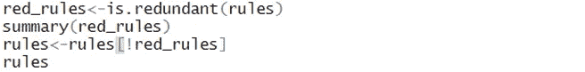

# 使用 R 和杂货(零售)数据集为给定阈值的购物篮分析创建关联规则

> 原文：<https://medium.com/analytics-vidhya/create-association-rules-for-the-market-basket-analysis-for-the-given-threshold-using-r-and-45af41400e1?source=collection_archive---------6----------------------->

**下面给出了程序和数据集的链接**

图片来源:- [思创资讯科技](https://thinksproutinfotech.com/)

市场购物篮分析有助于公司了解他们的客户是如何购买的。目标是帮助配置促销、忠诚度计划和商店布局。

## **什么是购物篮分析？**

购物篮分析研究亲和力的概念。亲和力是对某事物的自然喜欢或理解。它也可以指某物与另一物结合的程度。为了进行市场篮分析，我们需要一组交易数据。每笔交易都由一起购买的一组产品组成。假设我去了一家超市，买了酸奶、牛奶、钢笔、奶酪和纸。这些产品是在一次交易中购买的。然后，收集并分析交易，以确定关联规则。

那么现在，如何才能确定协会的强弱呢？要回答这个问题，我们需要考虑三个指标:

*   **支持:**这个指标表示产品在数据集中出现的频率。比如我们有十笔交易，笔出现在七笔交易中，那么支持度是 7/10，也就是 70%。高支持百分比是优选的，因为它们表明该关联可能应用于大量的未来交易。

> **Support(X->Y)= Support(X∪Y)**

*   **置信度:**该指标表示包含特定产品(X)的交易也包含产品(Y) {X - > Y}的概率。所以 X - > Y 的置信度= Pr(X & Y) / Pr(X)。这个指标的问题是，如果 X 和 Y 都是受欢迎或经常购买的产品，可信度可能会被夸大。所以，我们需要想办法控制 y 的流行。

> **置信度(X - > Y) =支持度(X - > Y) /支持度(X)**

*   **Lift:** 该指标表示在控制 Y 的流行度的同时购买 X 时购买 Y 的概率。为了控制 Y 的流行度，我们需要测量规则中所有产品一起出现的概率，并将其除以产品概率的乘积，就好像它们之间没有关联一样。例如，如果牛奶和奶酪同时出现在 2%的交易中，牛奶出现在 15%的交易中，奶酪出现在 5%的交易中，则 lift 为:0.02 / (0.15 * 0.05) = 2.7。等于 1 的提升值表示产品 X 和 Y 相互独立。我们应该寻找大于 1 的提升值，因为这些值意味着如果购买了物品 X，也可能会购买物品 Y。升力越大，两个产品之间的联系就越大。

> **升力(X - > Y) =支撑(X - > Y) /支撑(X) *支撑(Y)**

## **市场篮子分析旨在回答以下问题:**

*   有哪些购买模式？(一起/按顺序/按季节购买的物品)
*   哪些产品可能受益于广告？
*   客户为什么会购买某些产品？
*   他们每天什么时候买它？
*   客户是谁？(学生、家庭等)

# **Apriori 算法的工作原理**

发现频繁项目集是数据挖掘中研究最多的领域之一。Apriori 算法是最成熟的频繁项集挖掘算法。

## **频繁项目集的定义**

出现在许多篮子中的一组项目被称为“频繁”为了正式起见，我们假设有一个数字 **s** ，称为支持阈值。如果 **I** 是一组项目，那么 **I** 的支持就是 **I** 是其子集的篮子数。我们说 **I** 是频繁的，如果它的支持是 **s** 或更多。
 **例子:**
我们来考虑一个简单的例子。考虑下列项目的交易

接下来考虑这样一个规则，即如果项目/项目集出现的次数至少为 50%,它就会被频繁购买。所以这里应该至少买 2 次。

为了简单起见，让我们将这些项目缩写如下:

苹果-A

芒果-M

梨子-P

卷心菜-钙

胡萝卜河

所以这张桌子现在变成了

**第一步:统计每一项出现的交易次数**

**第二步:现在把购买次数少于 2 次的物品全部去掉。因此新表格变成了**

**第三步:开始将第二步中的物品配对**

注意:项目集 PM、CaP、CrP 与 MP、PCa、PCr 相同，因此它们不包括在步骤 3 中。

**第 4 步:现在我们统计第 3 步所示的每一对在表 1** 中出现的次数。

**第五步:看问题——它陈述了考虑被购买至少 2 次或 50%次的项目集。**

在步骤 4 中应用此规则会将表格简化为以下内容:

所以这张表显示，以下项目 MP(芒果和梨)、MCa(芒果和卷心菜)和 MCr(芒果和胡萝卜)至少有 50%的情况下是一起购买的。

# **使用杂货数据集实现购物篮分析的程序:**

## 步骤 1:加载必要的包。

首先，我们将加载程序所需的包。

*   arules——为表示、操作和分析事务数据和模式(频繁项目集和关联规则)提供基础设施。
*   aruleviz——实现了几种已知的和新颖的可视化技术来探索关联规则。
*   数据集-此包包含各种数据集。

## 第二步:读取杂货数据集

## 步骤 3:现在，让我们看看数据集中的前 10 项

## 步骤 4:最后一步是使用 Arules 库中的 Apriori 算法生成具有相应支持度和置信度的规则

**输入:-**

**输出:-**

## 步骤 5:现在删除数据集中出现的冗余规则

**输入:-**

**输出:-**

## 步骤 6:最后显示购物篮分析/关联规则的图表。

点击[此处](https://github.com/kshitijved/Market-Basket-Analysis)下载程序和数据集…