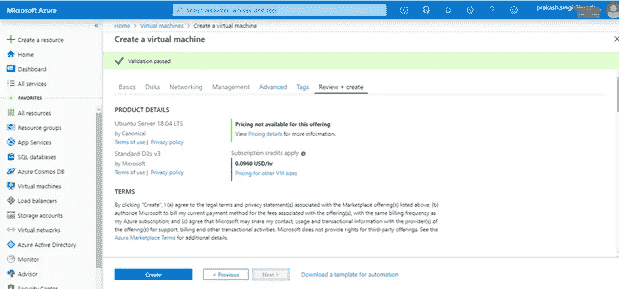

# 使用 Azure portal 创建一个 Linux VM，并使用 MobaXterm 连接它

> 原文：<https://medium.com/analytics-vidhya/create-azure-vm-and-connect-using-mobaxterm-4eaebd601ea0?source=collection_archive---------5----------------------->

整个场景分为两部分，第 1 部分展示了如何使用 azure portal 在 Azure 中创建虚拟机，第 2 部分展示了如何连接到使用 MobaXterm 创建的虚拟机(第三方应用程序，用于通过文件传输功能的拖放选项连接虚拟机)

**后续步骤:**

**第 1 部分—创建 Azure 虚拟机**

**1。** **使用您的凭证登录 azure 门户**，您将被重定向到 azure 主页。单击左侧面板中的虚拟机，如下所示。

主页— Azure 门户

**2。** **点击添加创建一个虚拟机**，如下所示

**填充所有 7 个阶段以创建虚拟机**

**3。** **基础:**填写字段名称前标有红色星号的必填字段，点击下一步。

**4。给出用户名和密码**并允许 SSH 的端口，如下所示

**5。** **磁盘:**选择磁盘类型为标准 SSD，如下图所示，点击下一步

**6。** **联网:**保留默认联网设置，点击下一步进行管理

7。 **管理:**默认管理，如下图所示。确保所有设置都已关闭，然后单击“下一步”进入高级模式

**8。** **高级:**保留高级为默认设置，点击下一步标签。

**9。** **标签:**根据您的需求给出标签，如客户端、环境、服务，其值如下所示。单击“下一步”查看并创建虚拟机

**10。** **查看+创建:**查看您的虚拟机的所有名称、设置以及您在前面步骤中给出的所有其他参数。单击“create”为您创建一个虚拟机。几分钟后，您就可以准备好虚拟机了

**第 2 部分—使用 MobaXterm** 连接虚拟机

你将需要一个 SSH 客户端来连接到你的虚拟机，我推荐 MobaXterm，因为它提供了多种杠杆作用，如拖放文件来复制，直接从应用程序更改文件，点击更新或删除文件等。

**1。** **下载安装 mobax term:**[https://mobaxterm.mobatek.net/download.html](https://mobaxterm.mobatek.net/download.html)

**2。打开 app**

**3。点击左上角的会话**

**4。点击 SSH**

**5。** **根据您的虚拟机给出主机、用户名和密码:**输入您在创建虚拟机时创建的用户名和密码。将端口保留为 22，这是用于 SSH 的

**6。Mobaxterm shell 将打开，并将在左侧面板上获得文件结构**

我们现在可以将文件从本地拖放到机器上，或者直接在这里创建文件。