# 在 R(保险数据)的 TrelliscopeJS 包中创建漂亮的数据可视化

> 原文：<https://medium.com/analytics-vidhya/create-beautiful-visualization-of-data-in-trelliscopejs-package-in-r-c67879c55864?source=collection_archive---------16----------------------->

## 对于那些希望生动展示数据的人来说，这是一次很好的学习体验


照片由 [Ulises Baga](https://unsplash.com/@ulisesbaga?utm_source=medium&utm_medium=referral) 在 [Unsplash](https://unsplash.com?utm_source=medium&utm_medium=referral) 上拍摄

TrelliscopeJS 包是由 Ryan Hafen 创建的。根据 Hafen " [的说法，trelliscopejs](https://hafen.github.io/trelliscopejs) 是一个 R 包，它将多面可视化带入生活，同时插入到通用的分析工作流中，如 ggplot2 或 tidyverse

您可能已经使用 R ggplot2 的 facet_wrap 函数对数据进行了分面。“face_wrap”给出了漂亮的数据可视化，但是我们不能像使用 trelliscope 包那样强大地与之交互。这就是我决定在印度保险行业数据上尝试的原因。读完这篇文章后，你会发现在不到 20 行的代码中，你可以用一种奇妙的方式展示你的数据，甚至你的同事也能很容易地理解。

我将向 telliscopejs 演示印度人寿保险公司的持续性数据。

什么是持续率？

持续率是全球每一家寿险公司的重要比率。它显示了客户对保险公司的忠诚度。人寿保险是保险公司与客户(称为保单持有人)之间的长期合同，客户承诺支付一笔定期金额(称为保费)以获得合同中提到的风险保障，直到保单的整个期限，保险公司承诺支付保险金额(风险保障)以应对客户发生的不幸或在保单到期后。有不同种类的人寿保险政策，我不会在这里进入这种政策的细节。

如果客户不支付他的保费，那么他的政策可能会失效，他失去了宝贵的风险保障。这对保险公司和客户都是损失。对客户来说，因为他损失了有价值的风险保险，因为如果保单因未支付到期保费而失效，公司将停止承保风险保险；对人寿保险公司来说，因为它没有获得承诺的续保保费，因此公司损失了保费收入。

持续率着眼于有多少客户通过支付定期保费来保持其保单的有效性，以及有多少客户的保单失效。它还考虑了保险公司账簿中客户的预期保费收入以及客户未支付到期保费造成的保费收入损失。

坚持对保险公司的盈利能力、股东价值、保费收入和整体增长非常重要。一般以第 13 个月、第 25 个月、第 37 个月、第 49 个月、第 61 个月来衡量。

本演示使用的数据取自[这里的](https://www.irdai.gov.in/ADMINCMS/cms/frmGeneral_Layout.aspx?page=PageNo3729&flag=1)。

让我们开始探索数据。在下面的代码中已经提到了 R 包。如果您的 R 库中没有这些包，那么您可以在使用之前下载它们。

```
# the purpose of below code is to present Indian Insurance Companies data
# through trelliscopejs package
# load packageslibrary(tidyr)
library(ggplot2)
library(dplyr) 
library(trelliscopejs)
```

让我们设置工作目录并获取数据

```
setwd(“D:/Harish/Lapsation model”)
getwd()
MasterData = read.csv(“Indian_Insurance_Persistency_201718_1.csv”)
```

看一下数据。

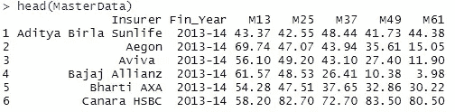

内部持久数据

从数据中我们发现数据是交叉表格形式的。我们在左边有保险公司名称和财政年度。每个月的持续数据都在不同的栏目中给出。

让我们检查数据中的 NA 值

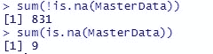

我们发现总共有 840 个值，其中 9 个没有值。在我的分析中，我将忽略北美数据，因为这是一个 5-6 年的数据，所以没有数据是有道理的。因此，对于一些公司来说，第 5 年第 13 个月数据可能不存在，因为这些公司开始运营较晚。

让我们筛选一家保险公司的数据，并根据这些数据绘制一个 ggplot。ggplot 是来自 R 的一个很棒的包，你应该学习它来实现可视化。

```
#filtering for one insurer
ABSL <- filter(MasterData, Insurer == “Aditya Birla Sunlife”)head(ABSL)
```

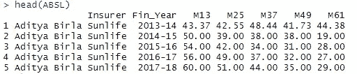

Aditya Birla Sun Life 的数据

让我们用这些数据做一个曲线图

```
h1 <- ggplot(data=ABSL, aes(x = Fin_Year, y = M13, group=1)) + 
 geom_line(linetype=”dashed”, color=”blue”, size=.0) +
 geom_point()h1
```

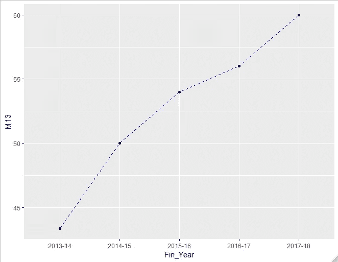

Aditya Birla Sunlife 的年度持续数据

从数据中我们可以得出结论，保险公司在增加第 13 个月的持久性方面做了很大的努力，因为它多年来一直在增加。

让我们过滤一个财政年度的数据，看看会发生什么。

```
#filtering for one financial year
YearWise <- filter(MasterData, Fin_Year == “2013–14”)head(YearWise)
```

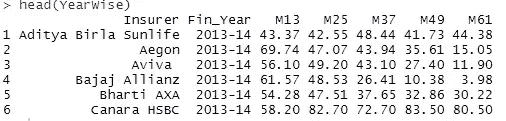

让我们用这个做一个图表

```
h2 <- ggplot(data=YearWise, aes(x = Insurer, y = M13, group=1)) + 
 geom_point(aes(col=YearWise$Insurer, size=M13)) +
 theme(axis.text.x = element_text(angle = 90, hjust = 1)) h2
```

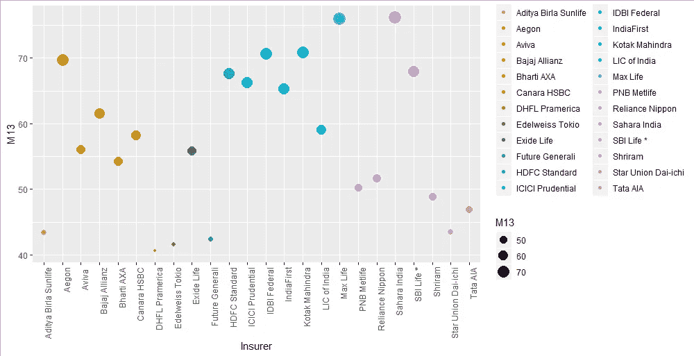

2013-14 财年的第 13 个持续性数据

从图中可以看出，撒哈拉人寿在第 13 个月的留存率最高，而 DHFL 保德信的留存率最低。

现在让我们使用 trelliscopejs 包进行可视化。我只展示了第 13 个月的持续性数据来进行推断。看看下面的代码。请注意，我在这里使用了“as_plotly=TRUE”参数。该参数有助于将数据显示为工具提示文本。

```
#showing 13th month data — trelliscope
h3 <- ggplot(data=MasterData, aes(x = Insurer, y = M13, group=1)) + 
 geom_point() +
 theme(axis.text.x = element_text(angle = 90, hjust = 1)) +
 geom_point(aes(col=Insurer, size=M13)) +
 facet_trelliscope(~ Fin_Year, as_plotly = TRUE,
 name = “Persistency of Indian Insurance Companies”,
 desc = “Persistency of Insurers year wise”) +
 theme(legend.position = “none”)h3
```

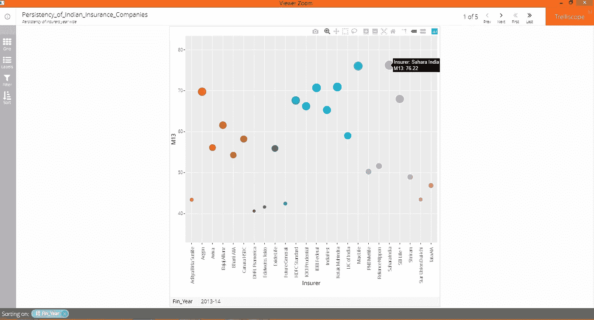

使用 trelliscopejs 包的数据

看上面的图像。当我们使用 trelliscopejs 包时，输出来自一个类似浏览器的容器。在这个容器中，我们还可以过滤数据。查看工具提示文本。这是使用“*as _ plotly = TRUE”*参数显示的。您可以点击右上角的“下一步”链接，查看下一财年的数据。

上面的可视化有一个挑战。它不显示其他年份的数据，如第 25 个月、第 37 个月等。那么现在该怎么办呢？

让我们再次看看我们的主数据，如下所示:


主数据

我们可以看到，第 13、25、37、49 和 61 个月的数据出现在不同的列中。那么我们如何在 x 轴上显示月份呢？

R 的 tidyr 包中有一个很棒的解决方案，可以帮助重塑数据。我们将使用 tidyr 包的 gather()函数。gather()有助于使“宽”数据更长。而 spread()函数让‘长’数据更宽。所以让我们收集()我们的数据，看看会发生什么。

```
#make wider data long
All_Gather <- MasterData %>% gather(Per_month, Value, M13, M25,
 M37, M49, M61) %>% group_by(Insurer)head(All_Gather)
```

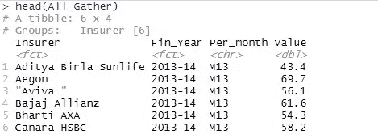

列转换为行后的数据

我们可以看到，月份进入了新的列“Per_month ”,它们的值进入了新的列“value”。因此，现在我们可以很好地将这些数据用于我们的最终可视化。由于 Fin_Year 是一个因子数据，我将对 Per_month 列使用 factor()参数，如下面的代码所示:

```
h5 <- ggplot(data = All_Gather, aes(x = factor(Per_month), y = Value,colour = Fin_Year, group = Fin_Year )) +
 geom_line(linetype=”dotted”) +
 geom_point() +
 xlab(“Month”) + ylab(“Persistency”) +
 facet_trelliscope(~ Insurer, as_plotly = TRUE,
 name = “Persistency Report”,
 desc = “Year wise persistency of Indian Insurance Companies”) +
 theme_classic()h5
```

看看下面的结果:

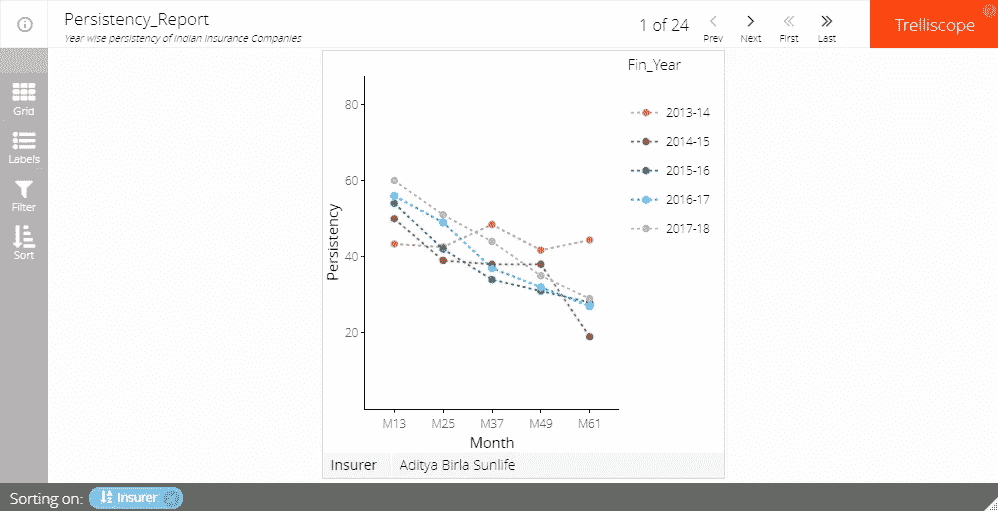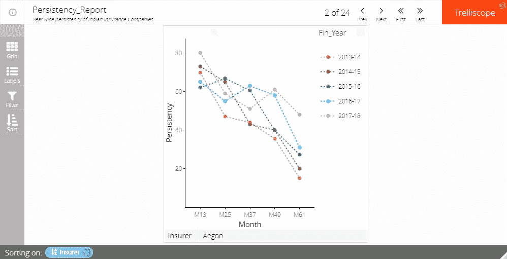

我们可以看到 x 轴表示月份，y 轴表示持续性。这些线条显示了每个财政年度的数据。在 x 轴下方，您可以看到保险公司的名称。

您也可以通过使用 LHS 上给出的“网格”选项，在如下所示的 2*2 面板中显示数据。


您也可以使用左侧的“过滤器”选项过滤保险公司名称的数据。见下图

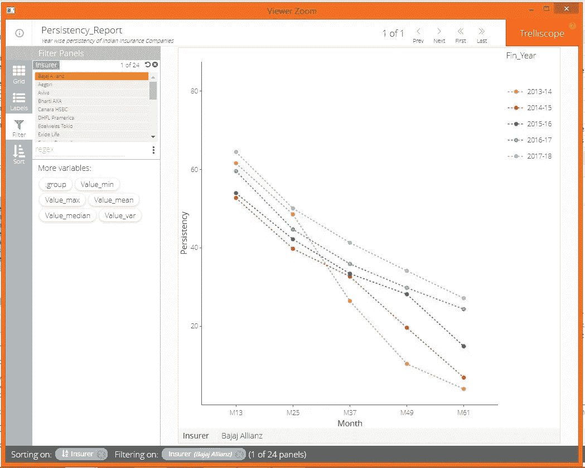

我们可以对数据进行各种分析。通过查看数据，我们可以得出结论，对于所有保险公司来说，随着保单生命周期的过去，持续时间会在我们到达第 61 个月时大幅减少。所有保险公司都有这种趋势。我们还可以看到，随着 61 个月时间的推移，大多数保险公司的持续性都在提高。

但有一点是肯定的。对于几乎所有的保险公司，第 61 个月的持续率低于 50%。这意味着每家保险公司 5 年前采购的 50%的保单处于失效状态，从而影响了保险公司的盈利能力。

您还可以从 LHS 菜单中选择最小值、平均值等。印度 LIC 见下图:

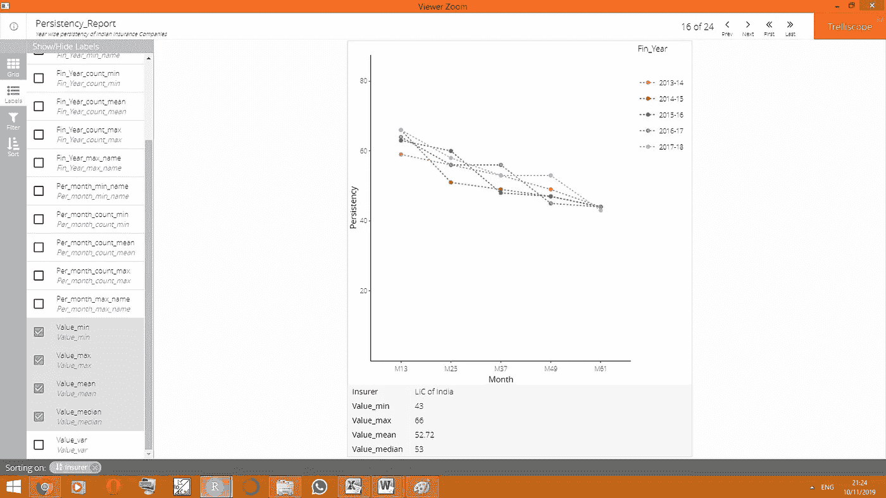

我以此结束这篇文章。请分享您的反馈。您可以自由使用此代码进行分析。