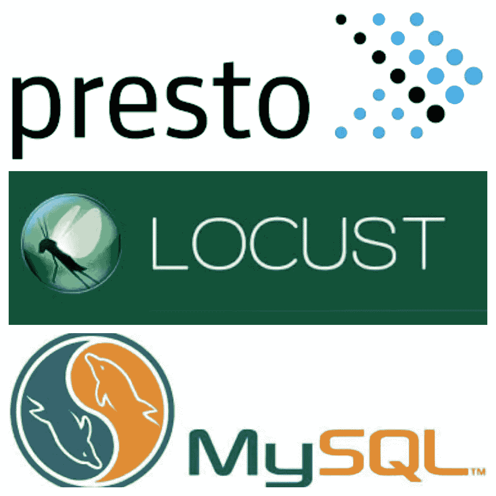

# 在 Locust.io 中创建定制客户端来测试数据库性能

> 原文：<https://medium.com/analytics-vidhya/create-custom-clients-in-locust-io-to-test-database-performance-fd71235ece6e?source=collection_archive---------3----------------------->



Make Locust 可以连接到 MySQL 和 Presto，也可能连接到任何其他数据库..

您可能知道，Locust 是以 HTTP 为主要目标构建的。因此，你将看到的所有教程和例子只告诉我们如何测试你的 GET、PUT 或 POST 端点。

然而，另一方面，如果你看看 JMeter 提供的各种选项，比如——能够通过其易于使用的 JDBC 客户端测试各种系统，如 FTP、JMS、SMTP 甚至数据库；你可能会很自然地觉得 Locust 有一些缺点。

但是，实际上，如果您需要扩展这个选项，并对任何基于请求/响应的系统(如数据库)进行负载测试，Locust 开发人员已经保留了这个选项。蝗虫官网明确提到的一个特性是:

> **:**
> 
> *蝗虫很小，非常容易被黑客攻击，我们打算保持这种状态。所有重要的事件 I/O 和协程都委托给 gevent。替代测试工具的脆弱性是我们创建蝗虫的原因。*

*还有一个[示例](https://docs.locust.io/en/latest/testing-other-systems.html)向您展示了如何创建一个定制的 XML-RPC 客户端，并使用它进行性能测试。*

*因此，本文将向您介绍如何创建自定义客户端来测试 MySQL 或 Presto 数据库的性能。*

# *向 TPC 基准致敬*

*行业标准数据库性能基准测试使用 [TPC](http://www.tpc.org/information/benchmarks.asp) 查询来完成这项工作。然而，*在您的项目*中可能有特定领域的用例或查询，您希望在某些预定义的负载下评估其性能。Locust 或 JMeter 对于这样的场景来说非常方便，并且在某种程度上补充了 TPC 基准测试过程。*

*假设您已经在项目中安装了 locust.io，让我们深入研究一个示例代码，展示如何编写一个定制客户端来测试 MySQL 查询性能。*

# ***MySQL/蝗虫定制客户端***

*我正在使用的软件包:*

```
*...
locustio==0.13.5
PyMySQL==0.9.3
SQLAlchemy==1.3.13
...*
```

*因此，您首先要编写与数据库建立连接的方法，然后执行您想要的查询。接下来，创建一个客户端类，它将负责执行该方法并收集诸如通过/失败状态、运行时间等指标。客户端类需要在您的 Locust 类中初始化。**参见下面的样本代码**:*

*要执行上面这段代码，用 MySQL 连接细节替换连接字符串的内容，并在第 47 行提供您想要的 SQL 查询。然后运行以下命令进行非 web 运行:*

```
*locust -f mysql_locust.py --no-web --clients=2 --hatch-rate=10 --run-time=1m*
```

> *这将使您的测试与 2 个并发用户一起运行 1 分钟。*

# *Presto/Locust 自定义客户端*

*Presto client 的规则也是一样的，您可能知道，这是一个针对大数据的分布式 SQL 查询引擎。因此，测量和优化不同负载下的 Presto 查询对于贵组织大数据计划的成功至关重要。*

*我正在使用的软件包:*

```
*...
locustio==0.13.5
PyHive==0.6.2
...*
```

*示例工作代码如下:*

*无头运行它将是类似的:*

```
*locust -f presto_locust.py --no-web --clients=2 --hatch-rate=10 --run-time=1m*
```

*您可以随意添加更多的方法(每个方法包含不同的查询模式)并从`TaskSet`类执行它们。这些代码可以使用的一个增强功能是在运行时传递连接细节的方法。否则，在任何情况下，任何人都可以使用这些代码来测量他们的 MySQL 或 Presto 查询性能，并识别/优化执行缓慢的查询。*