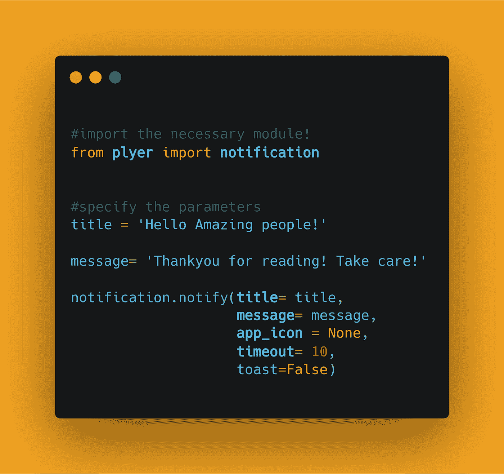
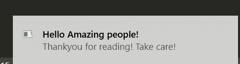

# 使用 Python 创建桌面通知程序

> 原文：<https://medium.com/analytics-vidhya/create-desktop-notifier-using-python-6dab0a1c348c?source=collection_archive---------0----------------------->

在这篇博客文章中，我们将学习如何发送桌面通知。我们将看到 Python 中的实现。


[python 中终极资源的存储库](https://github.com/ayushi7rawat/Ultimate-Python-Resource-Hub)。发现有用就掉颗星！有什么要补充的吗？开个 PR 就一样了！

你可以参考我的 YouTube 视频教程，以便更好地理解

# 这个博客将会涵盖什么

```
1\. Desktop Notification Introduction
2\. What is Plyer?
3\. Create a Desktop Notifier
```

# 桌面通知:

字典定义:

> 通知某人或某事的行为。

目的:

> 通知的目的是告知事件并鼓励他采取行动。

通知帮助人们记住事情。它是一小段文本，出现在桌面或手机屏幕上，通知用户有关更新或任何其他重要信息。

# Plyer 是什么？

Plyer 是一个 Python 库，用于访问硬件/平台的特性。

如果你想了解更多，你可以参考 [Plyer 文档](https://plyer.readthedocs.io/en/latest/)。使用此链接导航到文档。

# 您可以使用这种方法的其他领域

1.  为 COVID stats 设置每日跟踪器
2.  每日通知吃药。
3.  每小时通知喝水。

更多的是，如何使用这个应用程序完全取决于你。

现在，您已经了解了桌面通知和 Plyer 基础知识，我们可以前进到编码部分了。

# 该编码了！

你可以在我的 [GitHub 库](https://github.com/ayushi7rawat/Youtube-Projects/tree/master/Desktop%20Notifier)找到所有代码。发现有用就掉颗星。



# 安装层

打开您的终端并运行以下命令

```
pip install plyer
```

现在我们有了这个包，我们准备将它导入到我们的 python 脚本中。

```
from plyer import notification
```

现在让我们指定参数。让我们定义一下`title`和`message`。

```
title = 'Hello Amazing people!'message= 'Thankyou for reading! Take care!'
```

让我们看看这些参数的含义:

*   `title`:通知的标题
*   `message`:通知的消息
*   `app_name`:启动本通知的应用程序名称
*   `app_icon`:与消息一起显示的图标
*   `timeout`:显示消息的时间，默认为 10
*   `ticker`:通知到达时状态栏上显示的文本
*   `toast`:简单消息代替完整通知

现在，让我们使用`notify`方法传递参数。

```
notification.notify(title= title,
                    message= message,
                    app_icon = None,
                    timeout= 10,
                    toast=False)
```

我通过了:

*   `title`为“你好了不起的人！”``
*   ``message`为`'Thankyou for reading! Take care!'`
*   `app_icon`作`None`
*   `timeout`作`10 secs`
*   而`toast`为`False`。

就是这样！我们完了。现在让我们保存并运行我们的 python 脚本。



这是我们的桌面通知。很简单，不是吗？希望这篇教程有所帮助。

您可以使用这个库，探索更多的特性，甚至进一步定制它。

你可以在我的 [GitHub 库](https://github.com/ayushi7rawat/Youtube-Projects/tree/master/Desktop%20Notifier)找到所有代码。发现有用就掉颗星。

感谢您的阅读，我很乐意通过 [Twitter](https://twitter.com/ayushi7rawat) 与您联系。

请分享您的宝贵反馈和建议！

你绝对应该看看我的其他博客:

*   [Python 3.9:你需要知道的一切](https://ayushirawat.com/python-39-all-you-need-to-know)
*   [终极 Python 资源枢纽](https://ayushirawat.com/the-ultimate-python-resource-hub)
*   [GitHub CLI 1.0:你需要知道的一切](https://ayushirawat.com/github-cli-10-all-you-need-to-know)
*   [成为更好的程序员](https://ayushirawat.com/become-a-better-programmer)
*   [如何制作自己的谷歌 Chrome 扩展](https://ayushirawat.com/how-to-make-your-own-google-chrome-extension-1)
*   [使用 Python 从任何 pdf 创建您自己的有声读物](https://ayushirawat.com/create-your-own-audiobook-from-any-pdf-with-python)
*   你很重要，你的心理健康也很重要！

# 资源:

*   [plyer.readthedocs.io/en/latest](https://plyer.readthedocs.io/en/latest/)
*   [github.com/kivy/plyer](https://github.com/kivy/plyer)

在我的下一篇博客文章中再见，保重