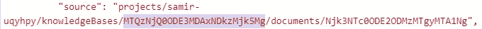

# 使用 Dialogflow Knowledge Connector 创建 FAQ Bot

> 原文：<https://medium.com/analytics-vidhya/create-faq-bot-using-dialogflow-knowledge-connector-d2f6ccb09ff1?source=collection_archive---------39----------------------->

机器人是客户支持市场的热门产品。此外，随着自助服务的兴起，机器人变得更加重要。在这篇文章中，我们将学习如何创建一个常见问题机器人。比你想象的简单。

[**创建免费聊天机器人**](https://dashboard.kommunicate.io/signup)

我们将使用谷歌对话流的[知识连接器](https://cloud.google.com/dialogflow/docs/knowledge-connectors)。这些不过是一组文档，它们向你的机器人反馈问题，并帮助你获取问题的答案。

在 Dialogflow 中构建 bot 时，您定义的意图反映了用户可能会提出的问题。知识库连接器所做的是通过解析文档(如 FAQ 和文章)来补充定义的意图，以找到问题和响应。

*   问题会作为训练短语自动添加
*   答案会自动添加为响应

## 需要 Dialogflow 知识库连接器

*   在知识库连接器的帮助下，我们可以设置机器人来回答重复的问题，这将节省更多的时间
*   对于用户来说，这将是更具交互性和更容易的
*   它消除了定义大量意图及其答案的手动过程

因为我们已经了解了知识库连接器的重要性。让我们深入研究如何使用它们来创建 FAQ bot。

# 创建 FAQ Bot 的步骤

# [https://www.youtube.com/watch?v=aAJvI0UOspM&feature = emb _ logo](https://www.youtube.com/watch?v=aAJvI0UOspM&feature=emb_logo)

## 创建对话流代理/机器人

为了创建 FAQ 知识库，首先，我们需要有一个现有代理，或者在 [Dialogflow 控制台](https://dialogflow.cloud.google.com/#/login)中创建一个新代理。代理只是您的 Dialogflow 控制台中的机器人。

*请参考此* [*Dialogflow 文档*](https://cloud.google.com/dialogflow/docs/agents-manage) *了解如何在 Dialogflow* 中创建代理

请注意，知识连接器是一项测试功能，您必须在对话流程中启用“*启用测试功能和 API*”:

1.  单击左侧面板中靠近代理名称的⚙️(齿轮图标)。
2.  在“ *BETA 特性*部分，启用“*启用 BETA 特性和 API*”选项

## 创建您的知识库

在左侧面板上，点击“*知识库*”选项，并选择“*创建知识库*

你可以给你的知识库起一个合适的名字，然后保存。我将它保存为 KB-FAQ。

## 创建知识文档并自动生成机器人

现在，点击“*创建第一个”*选项创建一个知识文档。

## 自定义知识文档字段

*   输入“文档名”，可以是任何名称
*   选择“知识类型”
*   对于知识类型“FAQ ”,支持 2 种 mime 类型(您要提供给机器人的数据类型)

*   对于知识类型“抽取式问题回答”，支持 3 种 mime 类型

*   给文档一个“数据源”:数据源是一个文件，你的知识库的所有数据都来自这个文件。它可以作为云存储或本地的文件提供，也可以作为公共页面的 URL 提供。

填写完所有必填字段后，点击“*创建*”。文档将解析 HTML 页面。

现在知识连接器已经创建了一个 FAQ 聊天机器人。

[**免费试用 30 天**](https://dashboard.kommunicate.io/signup)

## 验证您的数据

点击'*查看详情'*，查看常见问题解答中的数据。

文档被解析成问题和回答。

## 启用自动回复

点击“*添加响应*”启用自动响应。

## 启用你的机器人

此外，确保您已经启用了机器人。

现在，你的 FAQ 机器人已经可以测试了。

*   输入您的知识库 ID，然后单击“*保存并继续*
*   您可以通过用逗号分隔来添加多个 id。
*   要获取知识库 ID，请转到对话框流中的“*诊断信息*”部分
*   它将采用以下格式

## 在 Dialogflow 模拟器中测试 FAQ 聊天机器人

尝试任何问题，你可以看到机器人的回应。

# 将此机器人添加到您的网站和应用中

我们已经使用 Dialogflow 知识库连接器成功创建了 FAQ bot。但是，我们需要将它添加到我们的网站或应用程序中。为此，我们将使用[komunicate 丰富的聊天工具](https://www.kommunicate.io/product/dialogflow-integration)。

为了集成知识库连接器，您可以集成新的 bot 或编辑现有的 bot。[这里的](https://www.kommunicate.io/blog/integrate-bot-using-dialogflow-in-kommunicate/)是在通信中集成一个新机器人的说明。

您还可以在 Kommunicate 中编辑已经集成的 bot:

*   登录您的[通信仪表板](https://dashboard.kommunicate.io/)
*   导航到“ [*管理-机器人*](https://dashboard.kommunicate.io/bots/manage-bots) ”部分
*   点击“机器人集成”> >“管理-机器人”> >编辑
*   输入您的知识库 ID，然后单击“*保存并继续*
*   您可以通过用逗号分隔来添加多个 id。
*   要获取知识库 ID，请转到对话流中的“*诊断信息*部分
*   它将采用以下格式

> *#格式:项目/ <项目 ID>/知识库/ <知识库 ID >。*
> 
> *下面提到一个例子，*

*   集成 Dialogflow 知识库 ID 后，您可以用问题测试 FAQ 聊天机器人。

这样，您可以使用 Dialogflow knowledge connectors 创建 FAQ bot。

[**免费试用**](https://dashboard.kommunicate.io/signup)

*原载于 2020 年 3 月 30 日*[*https://www . komunicate . io*](https://www.kommunicate.io/blog/create-faq-bot/)*。*