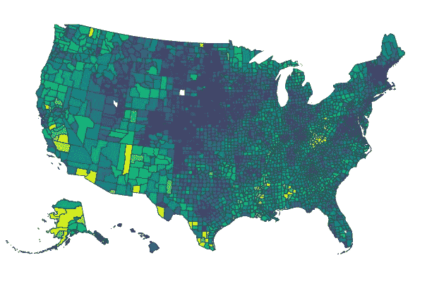
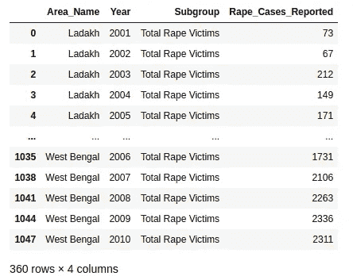
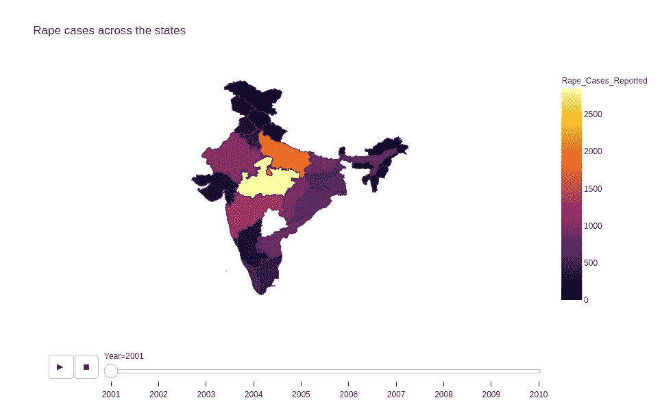
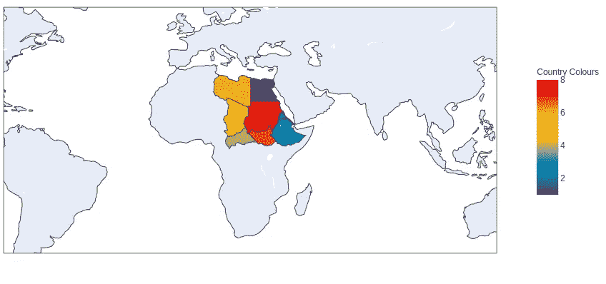
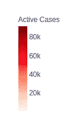
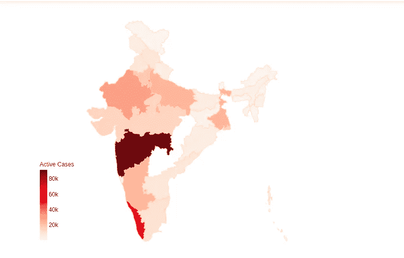
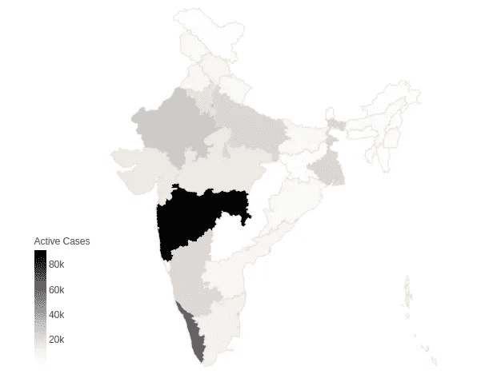

# 使用图形对象和 geoJSON-plotly 创建地理地图

> 原文：<https://medium.com/analytics-vidhya/create-geomaps-using-graph-objects-and-geojson-plotly-dcfb4067e3a6?source=collection_archive---------4----------------------->


照片由[埃里克 X](https://unsplash.com/@xarch?utm_source=unsplash&utm_medium=referral&utm_content=creditCopyText) 在 [Unsplash](https://unsplash.com/s/photos/globe-lights?utm_source=unsplash&utm_medium=referral&utm_content=creditCopyText) 上拍摄

大家好！所以这篇文章是关于直接使用图形对象来创建地理地图的。Plotly 的 Python 图形库制作出交互式的、出版物质量的图形。

*   概观
*   在 Jupyter 笔记本上安装
*   如何为美国以外的国家创建地图？
*   直接使用图形对象。
*   使用 geoJSON 创建地图！

# 概观

plotly.py 是一个交互式的、开源的、基于浏览器的 Python 图形库

`plotly.py`构建于 plotly.js 之上，是一个高级的、声明性的图表库。plotly.js 提供了 30 多种图表类型，包括科学图表、3D 图表、统计图表、SVG 地图、金融图表等等。

# 装置

如果你正在使用 anaconda，那么你可以在你的`terminal`或`jupyter notebook`上简单地使用这个命令下载它。

```
conda install -c plotly plotly
```

运筹学

```
conda install -c plotly/label/test plotly
```

如果 Anaconda 对您来说太难了，那么您可以使用`pip`下载它

```
pip install plotly==4.13.0
```

# JupyterLab 支持(Python 3.5 以上)

为了在 JupyterLab 中使用，使用 pip 安装`jupyterlab`和`ipywidgets`包。

```
pip install jupyterlab "ipywidgets==7.5"
```

或者康达。

```
conda install jupyterlab "ipywidgets=7.5"
```

# 创建除美国以外的其他国家的地图

`go.choropleth`函数接受许多参数来创建地图，其中最重要的是`locationmode`和`countries`

`locationmode`只能将 3 个变量识别为“ISO-3”、“美国-州”或“国家名称”之一。这种方法只适用于美国各县

如果你在为美国制作一张地图，它会是这样的，

```
px.choropleth(df, 
            locations='State_Code',
             color="Crime_Record",
              animation_frame="Year",
            color_continuous_scale="Inferno",
              locationmode="USA-states",
               scope="usa",
             range_color=(0,20),
             title='Crime By State',
             height=750)
```

它会给你一张这样漂亮的地图，



注意这条线

```
locationmode=”USA-states”
```

它确定用于将`locations`中的条目与地图上的区域相匹配的一组位置。`locations`由每个国家或州的州代码组成。例如`AL`代表阿拉巴马、`CF`代表中非或`IND`代表印度。

当您使用美国-美国各州的位置模式时，您不需要指定`geoJSON id`，但对于其他国家，您必须指定。举个例子，

# 2001-2010 年报告的强奸案件

```
import pandas as pd
import plotly.express as pxdf =pd.read_csv('path_to_file/Rape_Cases_Reported2001-2010.csv`) 
```



现在我们编写绘制图形的函数，

```
fig=px.choropleth(df1,
             geojson="[https://gist.githubusercontent.com/jbrobst/56c13bbbf9d97d187fea01ca62ea5112/raw/e388c4cae20aa53cb5090210a42ebb9b765c0a36/india_states.geojson](https://gist.githubusercontent.com/jbrobst/56c13bbbf9d97d187fea01ca62ea5112/raw/e388c4cae20aa53cb5090210a42ebb9b765c0a36/india_states.geojson)", featureidkey='properties.ST_NM',   
             locations='Area_Name',        #column in dataframe
              animation_frame='Year',       #dataframe
              color='Rape_Cases_Reported',  #dataframe
              color_continuous_scale='Inferno',
               title='Rape cases across the states' ,  
               height=700
              )fig.update_geos(fitbounds="locations", visible=False)fig.show()
```



动画不足

这里提供了 geoJSON 文件，它将其值映射到`locations`,这些值或者是国家代码，或者是专有名称。`featureidkey`指定 GeoJSON 特征对象中字段的路径，用于匹配传入`locations`的值。

*下载* [*Jupyter 笔记本及其数据*](https://github.com/Irene-123/Data-sets/blob/main/Rape_cases.zip)

**好吧，那么没有 geoJSON 还有更简单的方法吗？**

# 策划任何国家的邻国

让我们以非洲的苏丹为例。我想展示苏丹的所有邻国，并突出它们。

导入的模块-

```
import chart_studio
import plotly.graph_objs as gobj
import pandas as pd
from plotly.offline import download_plotlyjs,init_notebook_mode,plot,iplot
init_notebook_mode(connected=True)
```

快速提示:如果它给你`chart_studio`输入错误

*   蟒蛇

```
conda install -c plotly chart-studio            OR 
conda install -c plotly/label/test chart-studio
```

*   点

```
pip install chart-studio
```

好的，让我们画出苏丹的邻国

输出-



所以这里我没有使用`geoJSON`，而是使用国家代码作为`list or array`，并将它们嵌入到参数`text`中，并将其自身映射到国家名称`locations`

# **直接使用图形对象**

## 什么是图形对象？

由 plotly Python 库创建、操作和渲染的图形由树状数据结构表示[,这些数据结构自动序列化到 JSON 以供 Plotly.js JavaScript 库渲染。](https://plotly.com/python/figure-structure/)

这些树由称为“属性”的命名节点组成，其结构由 Plotly.js 图形模式定义，该模式以[机器可读形式](https://raw.githubusercontent.com/plotly/plotly.js/master/dist/plot-schema.json)提供。

> **`plotly.graph_objects`**模块(通常导入为** `go` **)包含一个自动生成的 Python 类****层次结构，该层次结构表示该图模式中的非叶节点。术语“图形对象”指的是这些类的实例。****

## **与字典相比的图形对象**

*   **图形对象提供精确的数据验证**
*   **图形对象的属性可以使用字典式关键字查找(如`fig["layout"]`)或类式属性访问(如`fig.layout`)来访问**
*   **图形对象支持附加渲染(`.show()`)和导出函数(`.write_image()`)，这些函数从`[plotly.io](https://plotly.com/python-api-reference/plotly.io.html)`[模块](https://plotly.com/python-api-reference/plotly.io.html)中自动调用适当的函数。**

**让我们举一个例子:**

**截至 2020 年 12 月 5 日印度的新冠肺炎活跃病例**

1.  **导入必要的模块**

```
import pandas as pd
import plotly.graph_objects as go
```

**2.导入 geoJSON 文件和参数**

```
geojson="[https://gist.githubusercontent.com/jbrobst/56c13bbbf9d97d187fea01ca62ea5112/raw/e388c4cae20aa53cb5090210a42ebb9b765c0a36/india_states.geojson](https://gist.githubusercontent.com/jbrobst/56c13bbbf9d97d187fea01ca62ea5112/raw/e388c4cae20aa53cb5090210a42ebb9b765c0a36/india_states.geojson)", featureidkey='properties.ST_NM',   #property of geoJSON file 
    locationmode='geojson-id',    
    locations=data['State'],
    z=data['Active_Cases'],  #importing column consisting of   
                              #active cases data    autocolorscale=False,
    colorscale='Reds',
    marker_line_color='peachpuff',
```

**3.创建彩条及其数据**

****

```
colorbar=dict(
             title={'text':"Active Cases"},
              thickness=15,
              len=0.35,
              bgcolor='rgba(255,255,255,0.6)',
              tick0=0,
               dtick=20000,
               xanchor='left',
                x=0.01,
               yanchor='bottom',
               y=0.05
               )
```

**4.提供经度和纬度**

```
fig.update_geos(
         visible=False,
         projection=dict(
                   type='conic conformal',
                    parallels=[12.4729,35.1728055],
                   rotation={'lat':24,'lon':80}),
         lonaxis={'range':[68,98]},
         lataxis={'range':[6,38]})
```

**5.完成图表**

```
fig.update_layout(
    title=dict(
            text="Active cases COVID-19 Cases in India by states as of December 5th,2020",
            xanchor='center',
            x=0.5,
            yref='paper',
            yanchor='bottom',
            y=1,
            pad={'b':10}),
            margin={'r':0,'t':30,'l':0,'b':0},
            height=550,
            width=550
      )
```

**输出:-**

****

**或者**

****

**下载 [jupyter 笔记本及其数据](https://github.com/Irene-123/Data-sets/blob/main/Active_cases.zip)**

***对强奸案件的分析-下载* [*Jupyter 笔记本及其数据*](https://github.com/Irene-123/Data-sets/blob/main/Rape_cases.zip)**

***主动案例分析-下载* [*jupyter 笔记本及其数据*](https://github.com/Irene-123/Data-sets/blob/main/Active_cases.zip)**

**想了解更多关于 geoJSON 的信息，这里有一个很棒的[网站](https://macwright.com/2015/03/23/geojson-second-bite.html)对 geoJSON 进行了深入而清晰的解释，一定要去看看！**

**谢谢大家！**