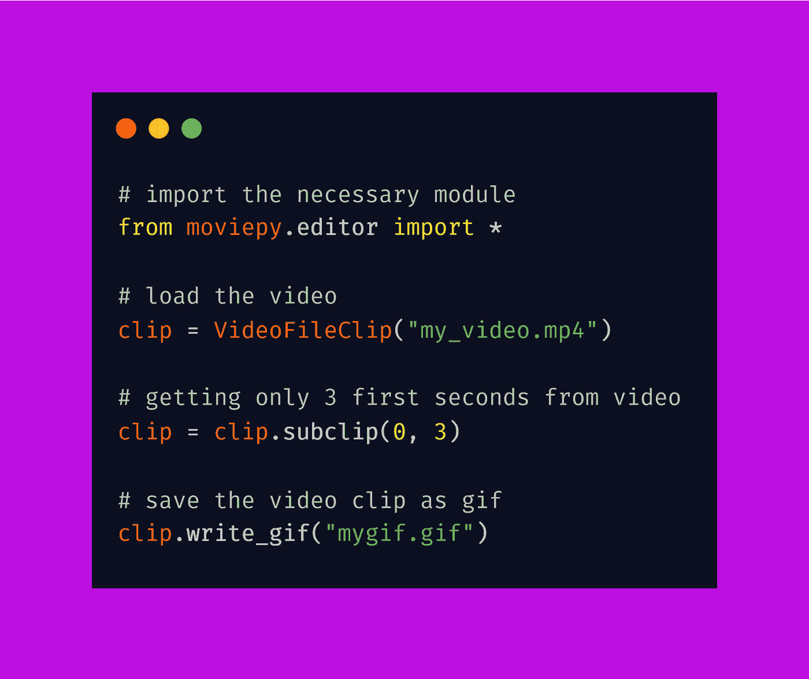

# 使用 Python 创建 GIF 转换器

> 原文：<https://medium.com/analytics-vidhya/create-gif-converter-using-python-f3de69662057?source=collection_archive---------4----------------------->

在这篇博客文章中，我们将学习如何将视频转换成 GIF。我们将看到 python 中的实现。


[python 中终极资源的储存库](https://github.com/ayushi7rawat/Ultimate-Python-Resource-Hub)。发现有用就掉颗星！有什么要补充的吗？开个 PR 就一样了！

你可以参考我的 YouTube 视频教程，以便更好地理解

# 这个博客将会涵盖什么

```
1\. GIF Introduction
2\. What is MoviePy?
3\. Convert any video into GIF
```

# GIF 简介:

字典定义:

> 支持动画和静态图像的无损图像文件格式。

GIF 代表图形交换格式。

*   gif 是一系列连续循环播放的图像或无声视频，不需要任何人按下播放键。我们说“动画图像”是因为 gif 不是真正的视频。


*   gif 基本上是视频的压缩格式，它们用在很少使用颜色的地方，它们主要用在标识上。为了不降低视频质量，这些 gif 使用无损数据压缩进行压缩。
*   gif 越来越受欢迎，因为像模因一样，它们对交流笑话、情感和想法很有用。这些服务被集成到 Twitter、Facebook Messenger 和手机键盘等应用程序中，因此它们就像表情符号或“贴纸”一样容易使用。

如果你想了解更多，可以参考 [GIF 维基百科页面](https://en.wikipedia.org/wiki/GIF)。使用此链接导航到 GIF 的维基百科页面。

# 什么是 MoviePy？

MoviePy 是一个用于视频编辑的 Python 模块，可用于基本操作(如剪切、拼接、标题插入)、视频合成(又称非线性编辑)、视频处理或创建高级效果。它可以读写最常见的视频格式，包括 GIF。

如果你想了解更多，可以参考 [MoviePy 文档](https://zulko.github.io/moviepy/)。使用此链接导航到文档。

现在你已经了解了 GIF 和 MoviePy 的基础知识，我们可以前进到编码部分了。

# 该编码了！

你可以在我的 [GitHub 库](https://github.com/ayushi7rawat/Youtube-Projects/tree/master/GIF%20Converter)找到所有代码。发现有用就掉颗星。



# 安装 MoviePy

打开您的终端并运行以下命令

```
pip install moviepy
```

现在我们有了这个包，我们准备将它导入到我们的 python 脚本中。

```
from moviepy.editor import *
```

你可以使用保存在手机上的视频或者在 YouTube 上找到的视频，你可以使用任何你选择的视频。

```
clip = VideoFileClip("my_video.mp4")
```

让我们使用`VideoFileClip`方法将视频加载并存储在`clip`中。

注意:我不需要指定视频文件的路径，因为它和我的 python 脚本在同一个文件夹中。

```
clip = clip.subclip(0, 3)
```

现在让我们在`clip`上使用`subclip`方法从视频中获取前 3 秒。一旦完成，我们可以继续前进，使用`write_gif`方法创建我们的 GIF。

```
clip.write_gif("mygif.gif")
```

这就是转换的方式。正如你所观察到的，声音被删除了，gif 的质量与视频相比降低了，而且 gif 在无限循环中运行，无法控制。

这是所有关于视频到 gif 的转换。就是这样！很简单，不是吗？希望这篇教程有所帮助。

你可以玩玩这个库，探索更多的功能，比如在 gif 上添加文本、裁剪图像、冻结一个区域、时间对称和许多其他很酷的功能。

你可以在我的 [GitHub 库](https://github.com/ayushi7rawat/Youtube-Projects/tree/master/GIF%20Converter)找到所有代码。发现有用就掉颗星。

感谢您的阅读，我很乐意在 [Twitter](https://twitter.com/ayushi7rawat) 与您联系。

请分享您的宝贵反馈和建议！

你绝对应该看看我的其他博客:

*   [Python 3.9:你需要知道的一切](https://ayushirawat.com/python-39-all-you-need-to-know)
*   [终极 Python 资源枢纽](https://ayushirawat.com/the-ultimate-python-resource-hub)
*   [GitHub CLI 1.0:您需要知道的一切](https://ayushirawat.com/github-cli-10-all-you-need-to-know)
*   [成为更好的程序员](https://ayushirawat.com/become-a-better-programmer)
*   [如何制作自己的谷歌 Chrome 扩展](https://ayushirawat.com/how-to-make-your-own-google-chrome-extension-1)
*   [使用 Python 从任何 pdf 创建您自己的有声读物](https://ayushirawat.com/create-your-own-audiobook-from-any-pdf-with-python)
*   你很重要，你的心理健康也很重要！

# 资源:

*   【en.wikipedia.org/wiki/GIF】
*   [pypi.org/project/moviepy](https://pypi.org/project/moviepy/)
*   [github.com/Zulko/moviepy](https://github.com/Zulko/moviepy)

在我的下一篇博客文章中再见，保重