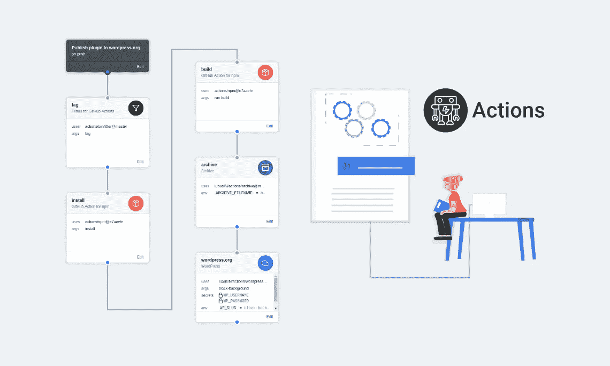
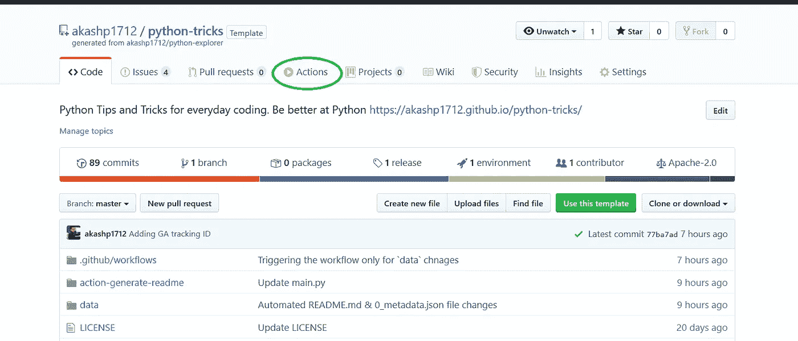
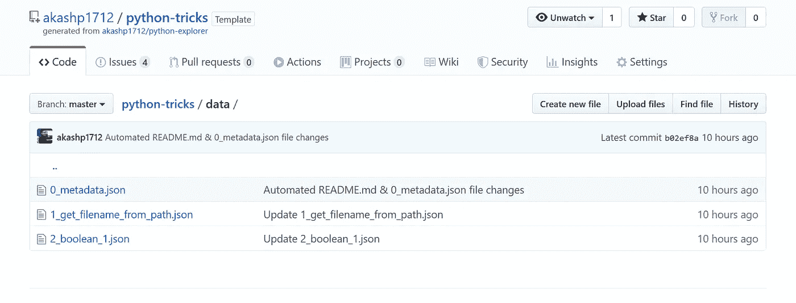
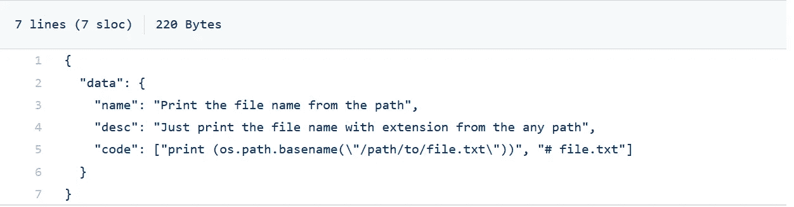
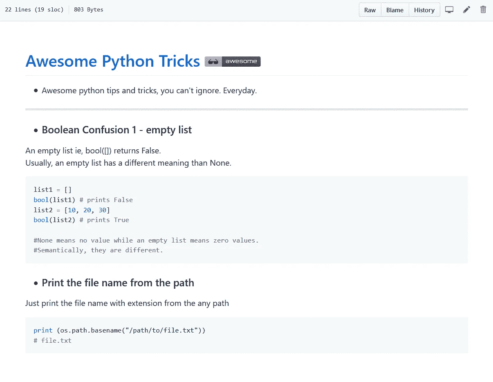
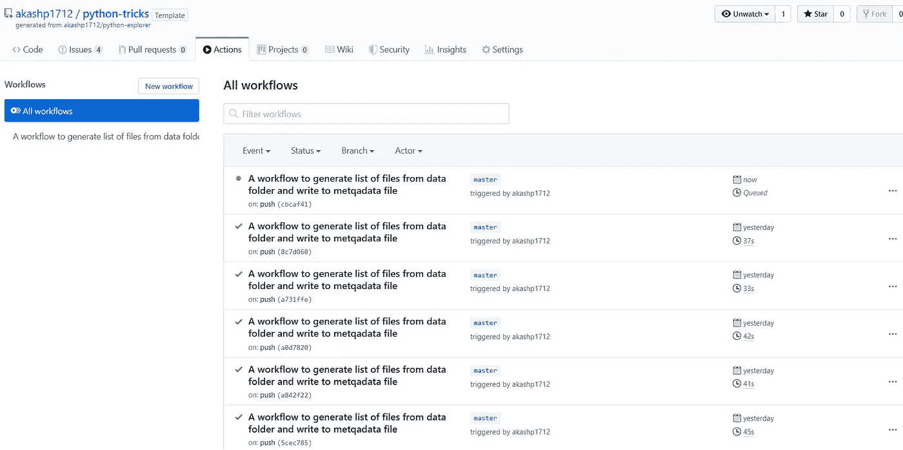
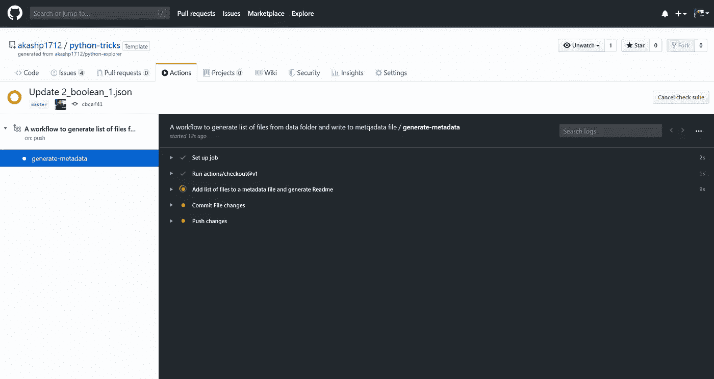
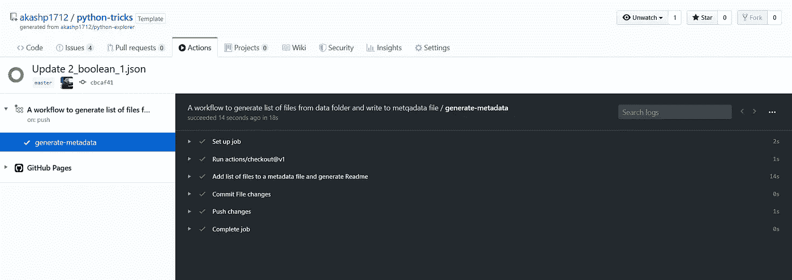
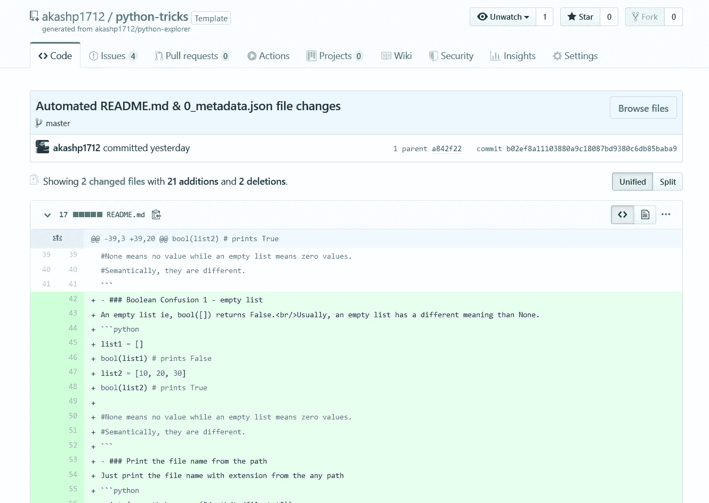

# 创建 Github 动作，变得聪明

> 原文：<https://medium.com/analytics-vidhya/create-github-actions-and-be-smart-f1e6b9cc9bfa?source=collection_archive---------9----------------------->

## 使用 Github 动作自动化您繁琐的工作。



来源:[https://lubus . in/blog/github-actions-to-release-WordPress-plugin-3656](https://lubus.in/blog/github-actions-to-release-wordpress-plugin-3656)

# 什么是 Github Actions？

[GitHub Actions 使您能够直接在您的 GitHub 存储库中创建定制的软件开发生命周期(SDLC)工作流。](https://help.github.com/en/actions/automating-your-workflow-with-github-actions/about-github-actions)

Github 动作是自定义代码/指令，以您喜欢的任何方式在 Github repo 中交互和执行一些操作。(真的！！！)

CI/CD 是它的传统范例。如果你知道 CI/CD 那么就知道 ***Github Actions*** 对它来说是++的。



# 更多关于它的？

*   *Github Actions* 被**完全集成到 Github** 中，因此不需要任何外部站点，并且只能在您的 repo 中进行管理。
*   *Github Actions* **为各种配置项配置提供了多个模板**，用户可以创建自己的自定义操作并在 [**Marketplace**](https://github.com/marketplace?type=actions) 上发布。
*   Github Actions 对每一个开源库都是完全免费的**,包括每月 2000 分钟的免费构建时间，这与大多数 CI/CD 免费计划相当。**

# Github 操作

在创建动作之前，让我们先了解一下动作的基本术语。

## 动作:

可用于创建**作业**的小型可移植代码。您可以使用市场中的操作，也可以自己创建一个。

## 工作:

一个作业由多个**步骤**组成，在虚拟环境实例中运行。作业可以独立运行，也可以顺序运行。

## 步骤:

步骤是可以由作业执行的一组任务。步骤可以运行命令或操作。

## 工作流程:

工作流是由一个或多个作业组成的自动化流程，可以由事件触发。工作流是使用中的 YAML 文件定义的。github/workflows 目录。

# 创建自定义操作

## 问题

自动创建获取内容并追加到 [**README.md**](https://github.com/akashp1712/python-tricks/blob/master/README.md) 文件中

我创建了一个 repo，我想在其中发布 python 技巧。主要内容是 python 技巧，部分内容驻留在 ***/data*** 文件夹中的单独文件中。



**每个文件的内容都是 JSON 格式，如下所示:**



我想**读取每个文件，并将内容**复制到 README.md 文件，该文件应如下所示:



## 可能的解决方案:

1.  手动复制粘贴，推送 README.md — **不……**
2.  写一个读取每个文件的 python 脚本，复制到 README.md 并推送。

## 如果 Github 为你做了一切呢？？？

是的，让我们创建一个 Github 动作来做到这一点。

## 步骤 1:为您的工作创建一个脚本

让我们创建一个 python 文件，它将从 */data* 文件夹中读取所有 JSON 文件，并将内容添加到 README.md 文件中

[**python-戏法**](https://github.com/akashp1712/python-tricks) **/** [**动作-生成-自述**](https://github.com/akashp1712/python-tricks/tree/master/action-generate-readme)**/**[**main . py**](https://github.com/akashp1712/python-tricks/tree/master/action-generate-readme/main.py)

我把这个文件保存在一个单独的文件夹里，这个文件夹就是动作目录。该文件将在您选择的虚拟机中执行。

## 步骤 2:创建一个 Docker 文件

Github 允许你构建 Docker 和 Javascript 动作。在这里，我们将使用 Docker 创建它。

让我们[创建一个 **Docker 文件**](https://help.github.com/en/actions/automating-your-workflow-with-github-actions/creating-a-docker-container-action#create-a-dockerfile) 并添加以下内容:

[https://gist . github . com/akashp 1712/17714 c 60 bb 07 a 650 b 20025922d 27 FB 55](https://gist.github.com/akashp1712/17714c60bb07a650b20025922d27fb55)

*   我们将在 docker 中使用***python:3 . 8 . 1-alpine 3.10***图像
*   并将入口点设置为 main.py 文件

```
ADD main.py /main.py                       
ENTRYPOINT ["python", "/main.py"]
```

## 第三步:将行动付诸实施(心流！)

现在，这是 Github 动作的重要部分:[配置工作流](https://help.github.com/en/actions/automating-your-workflow-with-github-actions/configuring-workflows)。

在 [***文件夹下创建工作流文件 **main.yml** 。github/workflows/***](https://github.com/akashp1712/python-tricks/blob/master/.github/workflows/main.yml)

让我解释一下工作流文件:

## 引发

```
on:
  push:                           
    paths:                           
      - 'data/**.json'                           
      -'!data/0_metadata.json'
```

*   工作流表示，当对 */data 文件夹中的更新/新 JSON 文件进行推送时，它应该触发作业。*
*   点击 阅读更多关于触发 [**的信息。天空是极限。**](https://help.github.com/en/actions/automating-your-workflow-with-github-actions/configuring-a-workflow#triggering-a-workflow-with-events)

## 乔布斯

```
jobs:                         
  generate-metadata:                           
     runs-on: ubuntu-latest
```

*   名为“生成元数据”的作业将在 *ubuntu 虚拟机*上运行
*   您的工作流中可以运行多个作业。

```
steps:                             
  - uses: actions/checkout@v1                             
  - name: Add list of files to a metadata file and generate Readme
    uses: ./action-generate-readme
  - name:  Commit File changes
    # skipping the commit code
  - name: Push changes                               
    uses: ad-m/github-push-action@master
       with:                                 
         github_token: ${{ secrets.GITHUB_TOKEN }}
```

这项工作有 **4 个步骤**:

1.  **actions/checkout@v1** —是一个来自市场的 Github 动作，它检查 VM 中的代码。
2.  **。/action-generate-readme** —是生成 readme 文件的本地操作
3.  提交文件更改—这是普通的 git 命令
4.  **ad-m/Github-push-action @ master—**是来自市场的 Github action，它将更改推送到遥控器。

仅此而已。真的。

我们的第一个动作已经准备好了，这是最基本的，对我们的回购做一个简单的操作。让我们看看它的实际效果。我需要做的就是推一个 **JSON** 文件。

它触发了工作流程，您可以从 ***动作*** 选项卡中看到



单击正在运行的工作流将显示详细的执行情况。



您可以看到，作业的所有步骤都是按顺序执行的，一旦完成，就会显示绿色勾号。



瞧，它会自动提交。(您也可以配置生成拉取请求)



就这样，伙计们。

我们在 repo 中创建了一个简单的 Gighub 操作，它自动完成了我的工作负载。

## 人们还可以使用 Github 动作做什么？

*   自动发布 WordPress 插件
*   Lint 检查代码