# 从头开始创建逻辑回归算法，并将其应用于数据集

> 原文：<https://medium.com/analytics-vidhya/create-logistic-regression-algorithm-from-scratch-and-apply-it-on-data-set-3f16ca5dbdb9?source=collection_archive---------7----------------------->

# 先决条件

1.  基础微积分
2.  Python 编程

# 设置环境

1.  Jupyter 笔记本

Jupyter 笔记本是交互式开发和展示数据科学项目的强大工具。Jupyter 笔记本将您的代码及其输出集成到一个单独的文档中。该文档将包含文本、数学公式以及代码直接在同一页面中生成的可视化效果。要开始使用 Jupyter 笔记本，您需要从 Python 安装 Jupyter 库。最简单的方法是通过 pip:

```
pip3 install jupyter
```

这些天我一直推荐使用`pip3`而不是`pip2`，因为从 2020 年 1 月 1 日开始 Python 2 将不再被支持。

2.NumPy

NumPy 是最强大的 Python 库之一。NumPy 是一个开源的数值 Python 库。NumPy 包含一个多维数组和矩阵数据结构。它可以用来在数组上执行许多数学运算，如三角函数、统计和代数例程。NumPy 是一个用 c 实现的库的包装器。Pandas(我们稍后将探讨它们是什么)对象严重依赖于 NumPy 对象。熊猫扩展 NumPy。

使用 pip 安装 NumPy 包:

```
pip3 install numpy
```

3.熊猫

[Pandas](https://pandas.pydata.org/) 已经成为 Python 编程语言中用于数据争论和分析的最流行和最受欢迎的数据科学工具之一。在现实世界中，数据不可避免地是杂乱的。在清理、转换、操作和分析数据方面，熊猫*真的*是游戏规则的改变者。简单来说，熊猫帮助收拾残局。

```
pip3 install pandas
```

4. [Seaborn](https://seaborn.pydata.org/)

当然，有大量的数据可视化库——但是如果您想知道为什么应该使用 Seaborn，简单地说，它为桌面带来了其他工具无法比拟的强大功能。你也可以使用 Matplotlib 来创建我们将要做的可视化。

```
pip3 install seaborn
```

5.随意

顾名思义，我们将使用它来获得数据集的随机分区。

```
pip3 install random
```

# 逻辑回归算法

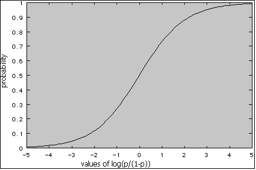

*   使用乙状结肠激活功能-

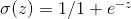

*   记住线性回归的梯度下降公式，其中使用了均方误差，但我们不能在这里使用均方误差，所以用一些误差 E 替换
*   梯度下降-

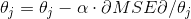

*   逻辑回归-

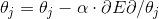

*   E 的条件:

1.  凸的或尽可能凸的
2.  应该是θ的函数
3.  应该是可微的

*   所以用，熵=

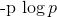

*   因为我们不能同时使用 y hat 和 y，所以使用交叉熵

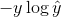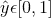

*   由于第二个条件，增加 2 个交叉熵 CE 1 =


*   而 CE 2 =

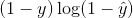

*   我们得到二元交叉熵(BCE) =

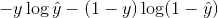

*   所以现在我们的公式变成了，

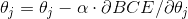

*   利用简单的链式法则我们得到，

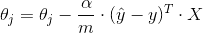

*   现在用这个公式应用梯度下降

这就是关于逻辑回归算法的证明，现在我们在代码中实现了上面证明的算法。

# 密码

我们将使用[乳腺癌数据集](https://archive.ics.uci.edu/ml/datasets/breast+cancer+wisconsin+(original))来实现我们的逻辑回归算法，该算法可在 UCI 机器学习库中获得。

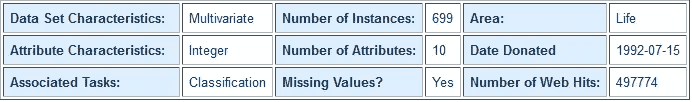

数据集描述

*   导入库

```
import numpy as np
import pandas as pd
import random
import seaborn as sns
```

*   数据预处理
    加载数据，删除空值。因为我们使用逻辑回归，所以用 0 和 1 代替 2 和 4。使用 pandas 读取数据并删除缺少值的行。

```
df=pd.read_csv("breast-cancer.data.txt",na_values=['?'])
df.drop(["id"],axis=1,inplace=True)
df["label"].replace(2,0,inplace=True)
df["label"].replace(4,1,inplace=True)
df.dropna(inplace=True)

full_data=df.astype(float).values.tolist()
df.head()
```

*   可视化数据——我们将通过 seaborn 使用成对网格..

```
sns.pairplot(df)
```

*   做主成分分析进行简化学习。

没有做 PCA 的特别需要，因为我们只有 9 个特性，但我们得到了一个更简单的模型，去掉了其中的 3 个特性，代码请访问 [github 链接](https://github.com/Rishit-dagli/Breast-cancer-prediction-ML-Python)。

*   将数据转换为矩阵，用完整的数据矩阵连接一个单位矩阵。也做一个零矩阵，对于初始θ。

```
full_data=np.matrix(full_data)
epoch=150000
alpha=0.001
x0=np.ones((full_data.shape[0],1))

data=np.concatenate((x0,full_data),axis=1)
print(data.shape)

theta=np.zeros((1,data.shape[1]-1))
print(theta.shape)
print(theta)
```

*   创建训练测试分割

```
test_size=0.2
X_train=data[:-int(test_size*len(full_data)),:-1]
Y_train=data[:-int(test_size*len(full_data)),-1]
X_test=data[-int(test_size*len(full_data)):,:-1]
Y_test=data[-int(test_size*len(full_data)):,-1]
```

*   如上所述定义 sigmoid 函数的代码和 BCE。

```
def sigmoid(Z):
    return 1/(1+np.exp(-Z))

def BCE(X,y,theta):
    pred=sigmoid(np.dot(X,theta.T))
    mcost=-np.array(y)*np.array(np.log(pred))-np.array((1 y))*np.array(np.log(1-pred))

    return mcost.mean()
```

*   定义梯度下降算法，并定义历元数。同样通过 1 次迭代测试梯度下降。

```
def grad_descent(X,y,theta,alpha):
    h=sigmoid(X.dot(theta.T))
    loss=h-y
    dj=(loss.T).dot(X)
    theta -= (alpha/(len(X))*dj)
    return theta

cost=BCE(X_train,Y_train,theta)
print("cost before: ",cost)

theta=grad_descent(X_train,Y_train,theta,alpha)

cost=BCE(X_train,Y_train,theta)
print("cost after: ",cost)
```

*   用梯度下降代码定义逻辑回归。

```
def logistic_reg(epoch,X,y,theta,alpha):
    for ep in range(epoch):
#         update theta 
        theta=grad_descent(X,y,theta,alpha)

#         calculate new loss
        if ((ep+1)%1000 == 0):
            loss=BCE(X,y,theta)
            print("Cost function ",loss)
    return theta

theta=logistic_reg(epoch,X_train,Y_train,theta,alpha)
```

*   最后测试代码，

```
print(BCE(X_train,Y_train,theta))
print(BCE(X_test,Y_test,theta))
```

现在我们完成了代码


## 同一项目的一些其他算法

1.  多类神经网络
2.  随机森林分类器
    [项目链接](https://gallery.azure.ai/Experiment/Breast-cancer-dataset)

## GitHub 回购:[此处](https://github.com/Rishit-dagli/Breast-cancer-prediction-ML-Python)

# 关于我

**Rishit Dagli**
[网站](http://rishitdagli.ml)
[LinkedIn](https://www.linkedin.com/in/rishit-dagli-440113165/)