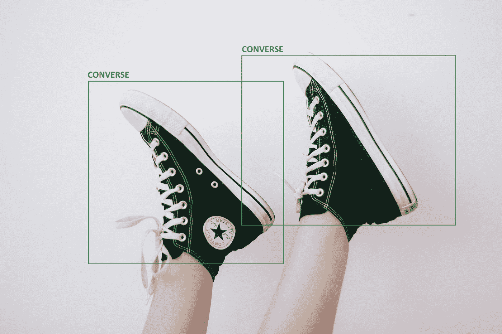
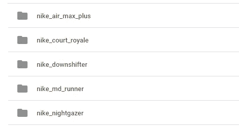
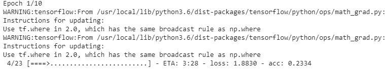
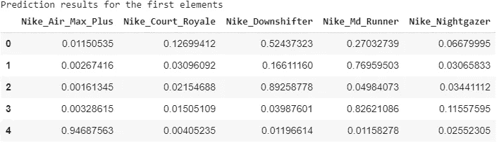
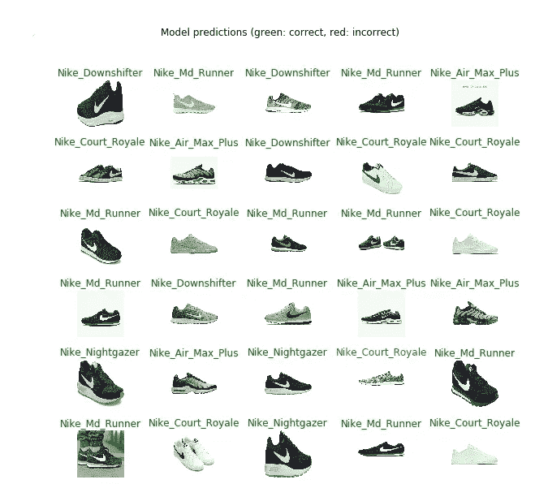
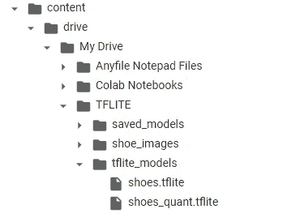

# 在 Google Colab 中使用您自己的数据集创建 Tensorflow 图像分类模型

> 原文：<https://medium.com/analytics-vidhya/create-tensorflow-image-classification-model-with-your-own-dataset-in-google-colab-63e9d7853a3e?source=collection_archive---------1----------------------->

本文旨在展示基于自定义数据集，在 Google Colab 中训练用于图像分类的 Tensorflow 模型。我们将会看到一个 TFLite 模型是如何被训练并用于图像分类的。例如，我们将尝试对我们的鞋子图像进行训练和测试。



照片由[卡蜜拉·达马西奥](https://unsplash.com/@miladamasio?utm_source=unsplash&utm_medium=referral&utm_content=creditCopyText)拍摄

# 准备 Colab 笔记本

首先你要用你的 GPU 进行快速训练。为此，点击“*运行时- >更改运行时类型”*，将您的硬件加速器设置为 GPU。

为了在 Google Colab 中训练我们的模型，我们应该通过执行下面定义的一些指令来准备我们的模型；

```
pip install tensorflow-gpu==2.0.0-beta0
pip install tensorflow_hubfrom __future__ import absolute_import, division, print_function, unicode_literalsimport matplotlib.pylab as pltimport tensorflow as tfimport tensorflow_hub as hubimport numpy as npimport pandas as pd
```

提高显示数据的精确度，以便更好地进行并排比较

```
pd.set_option("display.precision", 8)
```

# 正在准备数据集

我们将使用我们的 Google Drive 存储来训练这个模型。您也可以[下载](https://github.com/rifatcakir/TensorflowLite_Image_Classification_Training/tree/master/sample_inputs)本文档中使用的培训文件夹。

你应该为你的图像创建一个根目录，这是我们的“鞋 _ 图像”。然后，您可以为您的每个实例创建一个文件夹。

比如说；



Google Drive 中的分类图像文件夹

只要在这些文件夹里放上和它名字对应的图片就可以了。

# 连接数据集

让我们连接 Colab 中的 Google Drive，

```
from google.colab import drivedrive.mount('/content/drive')
```

使用存储训练数据集的驱动器帐户进行身份验证。

让我们将培训文件夹设置到 data_root 中。

```
data_root='/content/drive/My Drive/TFLITE/shoe_images'
```

创建用于培训和验证的数据生成器

```
IMAGE_SHAPE = (224, 224)TRAINING_DATA_DIR = str(data_root)print(TRAINING_DATA_DIR);datagen_kwargs = dict(rescale=1./255, validation_split=.20)valid_datagen = tf.keras.preprocessing.image.ImageDataGenerator(**datagen_kwargs)valid_generator = valid_datagen.flow_from_directory(TRAINING_DATA_DIR,subset="validation",shuffle=True,target_size=IMAGE_SHAPE)train_datagen = tf.keras.preprocessing.image.ImageDataGenerator(**datagen_kwargs)train_generator = train_datagen.flow_from_directory(TRAINING_DATA_DIR,subset="training",shuffle=True,target_size=IMAGE_SHAPE)
```

了解有关数据批处理的更多信息

```
image_batch_train, label_batch_train = next(iter(train_generator))print("Image batch shape: ", image_batch_train.shape)print("Label batch shape: ", label_batch_train.shape)dataset_labels = sorted(train_generator.class_indices.items(), key=lambda pair:pair[1])dataset_labels = np.array([key.title() for key, value in dataset_labels])print(dataset_labels)
```

我们模型的结果是:

图像批次形状:(32，224，224，3)标签批次形状:(32，5)[' Nike _ Air _ Max _ Plus ' ' Nike _ Court _ Royale ' ' Nike _ down shift er ' ' Nike _ Md _ Runner ' ' Nike _ night gazer ']

# 培养

作为迁移学习的基础模型，我们将使用存储在 TensorFlow Hub 上的 MobileNet v2 模型。这种模式的优势在于能够在移动应用程序上工作。更多信息:[https://tfhub . dev/Google/tf2-preview/mobilenet _ v2/feature _ vector/4](https://tfhub.dev/google/tf2-preview/mobilenet_v2/feature_vector/4)

```
model = tf.keras.Sequential([hub.KerasLayer("https://tfhub.dev/google/tf2-preview/mobilenet_v2/feature_vector/4",output_shape=[1280],trainable=False),tf.keras.layers.Dropout(0.4),tf.keras.layers.Dense(train_generator.num_classes, activation='softmax')])model.build([None, 224, 224, 3])model.summary()model.compile(optimizer=tf.keras.optimizers.Adam(),loss='categorical_crossentropy',metrics=['acc'])
```

最后，我们可以训练我们的模型。您可以修改 epoches 并测试准确性。

```
steps_per_epoch = np.ceil(train_generator.samples/train_generator.batch_size)val_steps_per_epoch = np.ceil(valid_generator.samples/valid_generator.batch_size)hist = model.fit(train_generator,epochs=10,verbose=1,steps_per_epoch=steps_per_epoch,validation_data=valid_generator,validation_steps=val_steps_per_epoch).history
```

你会看到这样一个屏幕，



训练时刻

# 导出模型

我们应该在训练后导出我们的模型。

```
SHOE_SAVED_MODEL = "saved_models/shoe"tf.keras.experimental.export_saved_model(model, SHOE_SAVED_MODEL)shoe_model = tf.keras.experimental.load_from_saved_model(SHOE_SAVED_MODEL,custom_objects={'KerasLayer':hub.KerasLayer})
```

从验证数据集生成器获取图像和标签批次

```
val_image_batch, val_label_batch = next(iter(valid_generator))true_label_ids = np.argmax(val_label_batch, axis=-1)print("Validation batch shape:", val_image_batch.shape)
```

# 测试我们的模型

让我们计算整批的预测。

```
tf_model_predictions = shoe_model.predict(val_image_batch)tf_pred_dataframe = pd.DataFrame(tf_model_predictions)tf_pred_dataframe.columns = dataset_labelsprint("Prediction results for the first elements")tf_pred_dataframe.head()
```



打印图像批次和标签预测

```
predicted_ids = np.argmax(tf_model_predictions, axis=-1)predicted_labels = dataset_labels[predicted_ids]plt.figure(figsize=(10,9))plt.subplots_adjust(hspace=0.5)for n in range(20):plt.subplot(6,5,n+1)plt.imshow(val_image_batch[n])color = "green" if predicted_ids[n] == true_label_ids[n] else "red"plt.title(predicted_labels[n].title(), color=color)plt.axis('off')_ = plt.suptitle("Model predictions (green: correct, red: incorrect)")
```

结果会告诉我们



对一些输入图像进行测试

# 将模型转换为 TFLite

将我们的模型转换成 TFLite 是如此简单。

```
!mkdir "tflite_models"TFLITE_MODEL = "tflite_models/shoe.tflite"TFLITE_QUANT_MODEL = "tflite_models/shoe_quant.tflite"
```

开始转换状态，

```
# Get the concrete function from the Keras model.run_model = tf.function(lambda x : shoe_model(x))# Save the concrete function.concrete_func = run_model.get_concrete_function(tf.TensorSpec(model.inputs[0].shape, model.inputs[0].dtype))# Convert the modelconverter = tf.lite.TFLiteConverter.from_concrete_functions([concrete_func])converted_tflite_model = converter.convert()open(TFLITE_MODEL, "wb").write(converted_tflite_model)# Convert the model to quantized version with post-training quantizationconverter = tf.lite.TFLiteConverter.from_concrete_functions([concrete_func])converter.optimizations = [tf.lite.Optimize.OPTIMIZE_FOR_SIZE]tflite_quant_model = converter.convert()open(TFLITE_QUANT_MODEL, "wb").write(tflite_quant_model)print("TFLite models and their sizes:")!ls "tflite_models" -lh
```

现在我们已经在 Drive 中训练了 TFLite 和量化的 TFLite 模式。



Google Drive 内容

***想知道 TFLite 和量化 TFLite 有什么区别吗？查看下方！***

[](/@rifatcakira/artificial-intelligence-for-small-devices-with-tensorflow-quantization-d0aa5c581b33) [## 用于具有张量流量子化的小型设备的人工智能

### 这篇文章探讨了张量流量化如何提高小型设备上的机器学习性能。

medium.com](/@rifatcakira/artificial-intelligence-for-small-devices-with-tensorflow-quantization-d0aa5c581b33) 

# 源代码

你可以在 [*这个 colab 笔记本*](https://colab.research.google.com/drive/1L-XkOFzTRj5x4ZqRy_TyDzuk8Cd6famu) *中找到我们是如何训练我们的模型以及我们是如何将它转化为结果的。*

本文中使用的所有代码和数据集都可以在 [my Github repo](https://github.com/rifatcakir/TensorflowLite_Image_Classification_Training) 中找到。

还有，如果你喜欢这篇文章，请关注我的 [*中*](/@rifatcakira) 和 [*Github*](https://github.com/rifatcakir) 。它给了我创造更多的正能量:)