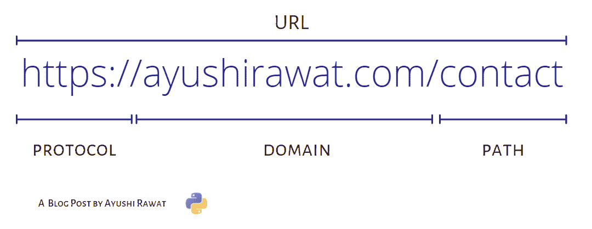
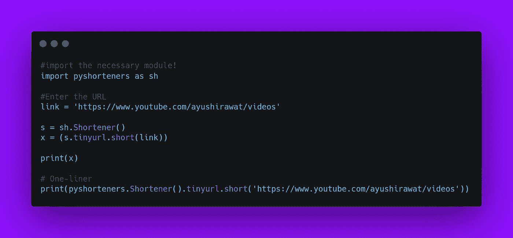

# 用 Python 创建 URL Shortner

> 原文：<https://medium.com/analytics-vidhya/create-url-shortner-with-python-50129714f044?source=collection_archive---------7----------------------->


在这篇博客文章中，我们将学习如何创建一个 URL Shortner。URL 缩短是缩短 URL 长度的过程。有许多消息平台的消息长度是有限的。在这里，任何人都可以面对分享长 URL 的问题，这样就可以在 Twitter 这样的平台上轻松分享，因为在 Twitter 上字符的数量是一个问题。如今市场上有如此多的网址缩写工具，我们将用 Python 来实现它。

[python 中终极资源的储存库](https://github.com/ayushi7rawat/Ultimate-Python-Resource-Hub)。发现有用就掉颗星！有什么要补充的吗？开个 PR 就一样了！

你可以参考我的 YouTube 视频教程，以便更好地理解

# 这个博客将会涵盖什么

```
1\. URL Introduction
2\. What is Pyshorteners?
3\. Creating a URL Shortner
```

# URL 介绍:

字典定义:

> URL 是对一个[网络资源](https://en.wikipedia.org/wiki/Web_resource)的引用，该资源指定了它在[计算机网络](https://en.wikipedia.org/wiki/Computer_network)上的位置以及检索它的机制。

URL 代表统一资源定位器。

URL 的一个例子是[youtube.com/ayushirawat](https://www.youtube.com/ayushirawat)，这是我的 YouTube 频道的 URL。

URL 分解:URL =协议+域+路径(最简单的分解，还可以进一步划分！)

我的博客的基本 URL 分解如下所示。



如果你想了解更多，可以参考[网址维基百科页面](https://en.wikipedia.org/wiki/URL)。使用此链接导航到该 URL 的维基百科页面。

# 什么是 Pyshorteners？

pyshorteners 是一个 Python 库，可以帮助你使用最著名的 URL 缩写来缩短和扩展 URL。在 pyshorteners 的帮助下，您可以生成一个简短的 URL 或扩展另一个 URL，就像输入一样简单。这基本上是 Python 中的一个库，提供了一些流行的 URL 缩写的实现。

如果你想了解更多，可以参考 [Pyshorteners 文档](https://pyshorteners.readthedocs.io/en/latest/)。使用此链接导航到文档。

既然您已经了解了 URL 和 Pyshorteners 的基础知识，我们就可以前进到编码部分了。

# 该编码了！

你可以在我的 [GitHub 库](https://github.com/ayushi7rawat/Youtube-Projects/tree/master/GIF%20Converter)找到所有代码。发现有用就掉颗星。



# 安装 Pyshorteners

打开您的终端并运行以下命令

```
pip install pyshorteners
```

现在我们有了这个包，我们准备将它导入到我们的 python 脚本中。

```
import pyshorteners as sh
```

现在，让我们存储将用于 URL 缩短的 URL。

```
link = 'https://www.youtube.com/ayushirawat/videos'
```

我正在将我的 [YouTube 频道 URL](https://www.youtube.com/ayushirawat) 存储在`link`中。如果您愿意，您甚至可以将 URL 作为用户输入，这样您就不必在每次想要缩短 URL 时都修改程序。

```
s = sh.Shortener()
```

现在，让我们调用`Shortener`方法并存储它。

```
print(s.tinyurl.short(link))
```

现在，我正在`s`上呼叫`tinyurl.short`，并传递存储在`link`中的网址。最后让`print`我们的结果。

```
[https://tinyurl.com/y533jl6f](https://tinyurl.com/y533jl6f)
```

这是我们的简短网址。

这是所有关于创建一个网址缩短器。就是这样！很简单，不是吗？希望这篇教程有所帮助。

你可以在我的 [GitHub 库](https://github.com/ayushi7rawat/Youtube-Projects/tree/master/GIF%20Converter)找到所有代码。发现有用就掉颗星。

感谢您的阅读，我很乐意通过 [Twitter](https://twitter.com/ayushi7rawat) 与您联系。

请分享您的宝贵反馈和建议！

你绝对应该看看我的其他博客:

*   [Python 3.9:你需要知道的一切](https://ayushirawat.com/python-39-all-you-need-to-know)
*   [终极 Python 资源枢纽](https://ayushirawat.com/the-ultimate-python-resource-hub)
*   [GitHub CLI 1.0:你需要知道的一切](https://ayushirawat.com/github-cli-10-all-you-need-to-know)
*   [成为更好的程序员](https://ayushirawat.com/become-a-better-programmer)
*   [如何制作自己的谷歌 Chrome 扩展](https://ayushirawat.com/how-to-make-your-own-google-chrome-extension-1)
*   [使用 Python 从任何 pdf 创建您自己的有声读物](https://ayushirawat.com/create-your-own-audiobook-from-any-pdf-with-python)
*   你很重要，你的心理健康也很重要！

# 资源:

*   [en.wikipedia.org/wiki/URL](https://en.wikipedia.org/wiki/URL)
*   [pyshorteners.readthedocs.io/en/latest](https://pyshorteners.readthedocs.io/en/latest/)

在我的下一篇博客文章中再见，保重