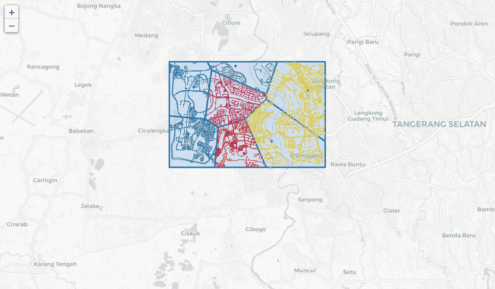

# 使用 Python 创建 Voronoi 区域

> 原文：<https://medium.com/analytics-vidhya/create-voronoi-regions-with-python-28720b9c70d8?source=collection_archive---------8----------------------->

# 概观

最常见的空间问题之一是找到离我们当前位置最近的兴趣点(POI)。假设某人很快就要没油了，他/她需要在为时已晚之前找到最近的加油站，这个问题的最佳解决方案是什么？当然，司机可以查看地图以找到最近的加油站，但如果该地区有多个加油站，他/她需要快速决定哪个加油站是最近的，这就有问题了。最佳解决方案是用多边形内的点来表示每个 POI。所以在一个多边形内，最近的 POI 肯定是多边形内的点。这些多边形被称为 Voronoi 区域。

# 数据收集

对于这个项目，我根据 POI 数据在地图上创建 Voronoi 区域。所有 POI 数据都是随机选择的，而街道网络数据是借助 OSMnx 软件包从 OpenStreetMap 下载的。

# 创建 Voronoi 区域

目前，使用 Python 构建 Voronoi 区域最简单的方法是使用 geovoronoi 包。Geovoronoi 是一个在地理区域内创建和绘制 voronoi 区域的软件包。至于地图可视化，我选择的是 leav 包。

首先，我开始在地图周围创建随机点。

```
gdf = gpd.GeoDataFrame()
gdf = gdf.append({'geometry': Point(106.644085,-6.305286)}, ignore_index=**True**)
gdf = gdf.append({'geometry': Point(106.653261,-6.301309)}, ignore_index=**True**)
gdf = gdf.append({'geometry': Point(106.637751,-6.284774)}, ignore_index=**True**)
gdf = gdf.append({'geometry': Point(106.665062,-6.284598)}, ignore_index=**True**)
gdf = gdf.append({'geometry': Point(106.627582,-6.283521)}, ignore_index=**True**)
gdf = gdf.append({'geometry': Point(106.641365,-6.276593)}, ignore_index=**True**)
gdf = gdf.append({'geometry': Point(106.625972,-6.303643)}, ignore_index=**True**)
```

下一步是确定 Voronoi 区域的覆盖范围，并将其保存到地理数据框架中。

```
area_max_lon = 106.670929
area_min_lon = 106.619602
area_max_lat = -6.275227
area_min_lat = -6.309795

lat_point_list = [area_min_lat, area_max_lat,area_max_lat,area_min_lat]
lon_point_list = [area_min_lon, area_min_lon, area_max_lon, area_max_lon]

polygon_geom = Polygon(zip(lon_point_list, lat_point_list))boundary = gpd.GeoDataFrame()
boundary = boundary.append({'geometry': polygon_geom}, ignore_index=**True**) 
```

不要忘记将 gdf 和边界数据帧转换为 Web 墨卡托投影。

```
gdf.crs = {'init' :'epsg:3395'}
boundary.crs = {'init' :'epsg:3395'}
```

将边界几何数据帧转换为多边形的并集，将 POI 数据帧转换为坐标数组。

```
boundary_shape = cascaded_union(boundary.geometry)
coords = points_to_coords(gdf.geometry)
```

计算 Voronoi 区域。

```
poly_shapes, pts, poly_to_pt_assignments = voronoi_regions_from_coords(coords, boundary_shape)
```

根据 OpenStreetMap 在覆盖区域的边界内创建一个图表。使用图表收集覆盖区域边界内的所有街道网络，并将其保存到 dataframe。

```
G = ox.graph_from_polygon(boundary_shape, network_type='all_private')
gdf_all_streets =  ox.graph_to_gdfs(G, nodes=**False**, edges=**True**,node_geometry=**False**, fill_edge_geometry=**True**)
```

创建新的数据框以收集每个 Voronoi 区域内的街道网络

```
gdf_streets_by_region = gpd.GeoDataFrame()
**for** x **in** range(len(poly_shapes)):
    gdf_streets = gpd.GeoDataFrame()
    gdf_streets['geometry'] = gdf_all_streets.intersection(poly_shapes[x])
    gdf_streets['voronoi_region'] = x
    gdf_streets = gdf_streets[gdf_streets['geometry'].astype(str) != 'LINESTRING EMPTY']
    gdf_streets_by_region = gdf_streets_by_region.append(gdf_streets)
```

下面是地图上 Voronoi 区域的可视化。



# 结论

地图看起来很棒！不幸的是，它还没有准备好用于现实生活中的应用，问题是这些 Voronoi 区域是通过使用欧几里德距离而不是网络距离创建的。

希望你喜欢阅读这篇文章。关于代码的更多细节，你可以点击[这个](https://nbviewer.jupyter.org/github/Dennypalinggi/voronoi_diagram_folium_map/blob/master/voronoi_diagram_project.ipynb)链接。