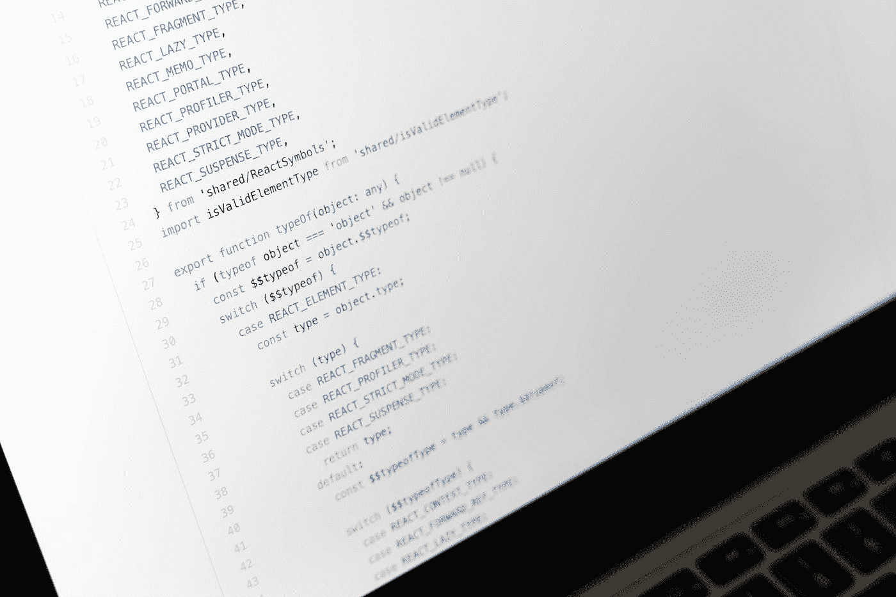

# 创建您的 GitHub 个人访问令牌

> 原文：<https://medium.com/analytics-vidhya/create-your-github-personal-access-token-9e5fd23acf5?source=collection_archive---------15----------------------->

## 使用令牌不仅符合 GitHub，也符合未来的趋势。



马库斯·温克勒在 [Unsplash](https://unsplash.com?utm_source=medium&utm_medium=referral) 上的照片

# 介绍

2020 年 12 月 15 日，GitHub 发布了一篇帖子，谈论他们在 2021 年 8 月 13 日之后将不会接受用于在 GitHub 上认证 Git 操作的帐户密码。[1]因此，GitHub 提供了以下两种认证方法:

1.  HTTPS 上的个人接入令牌。
2.  SSH 上的 SSH 密钥。

作为一个喜欢使用 HTTPS 的人(我经常切换工作电脑，例如，我在工作场所使用一台电脑，在家里使用另一台电脑)。更何况 GitHub 推荐 HTTPS 方法是因为这些原因:

1.  **SSH 密钥一旦被盗，将会引发巨大的问题。**不仅更换很麻烦，而且可能会让你暂时或永久无法使用该服务，因为所有认证都依赖 SSH 密钥。如果您的 SSH 密钥被盗，并且您没有其他认证方法，那么您必须联系管理员，否则您将永远无法登录服务(如 AWS EC2 机器)。
2.  **您组织中的一些防火墙会阻止 SSH 连接。出于安全原因，一些公司会屏蔽 SSH 连接，但他们通常不会屏蔽 HTTPS 连接，因为你必须使用 HTTPS 才能浏览网站。**
3.  **您可以随时撤销个人访问令牌(PAT ),几乎不需要任何成本。**

# GitHub 个人访问令牌创建程序

长话短说，下面是创建 GitHub 个人访问令牌的步骤[2]:

1.  在任一页面的右上角，点击您的个人资料照片，然后点击**设置**。
2.  在左侧工具条中，点击**开发者设置**。
3.  在左侧工具条中，点击**个人访问令牌**。
4.  点击**生成新令牌**。
5.  给你的令牌一个描述性的名字。
6.  选择您要授予此令牌的作用域或权限。我们想使用令牌访问存储库，选择 **repo** 。
7.  点击**生成令牌**。
8.  将令牌复制到剪贴板。提醒一下，如果您离开页面(如关闭页面)，您**将无法再次看到令牌。**

# 如何在命令行中使用个人访问令牌

在命令行中使用 PAT，如下所示:

```
$ git clone https://github.com/username/repo.git
Username: your_username
Password: *your_token*
```

您可以将 PAT 复制并粘贴到密码字段中。

# 如何保存个人访问令牌

输入 PAT 非常繁琐，因此这里有两种保存 PAT 的典型方法:

1.  **使用**`**gitcredentials**`【3】由于该方法因操作系统而异，请访问【4】以获取更多信息。
2.  **使用** `**curl**`由于我对此并不完全了解，请访问【5】以获取更多信息。

尽管如此，我还是想出了以下方法:

1.  使用`gitcredentials`保存 PAT。
2.  打开`~/.gitcredentials`(通常`gitcredentials`将凭证保存在该文件中)，您会看到这一行:

```
https://<your_username>:<your_token>@github.com/<your_username>
```

当 GitHub 提示您输入密码时，您可以将`<your_token>`复制粘贴到密码栏。


总有解决办法:)

# 概述

在这篇文章中，我将教你如何创建你的 GitHub 个人访问令牌。此外，我展示了一个技巧，如何保存您的令牌，并复制和粘贴令牌作为密码。

# 参考

[1][https://github . blog/2020-12-15-token-authentic ation-requirements-for-git-operations/](https://github.blog/2020-12-15-token-authentication-requirements-for-git-operations/)

[2][https://docs . github . com/en/free-pro-team @ latest/github/authenticating-to-github/creating-a-personal-access-token](https://docs.github.com/en/free-pro-team@latest/github/authenticating-to-github/creating-a-personal-access-token)

[https://git-scm.com/docs/gitcredentials](https://git-scm.com/docs/gitcredentials)

[4][https://docs . github . com/en/free-pro-team @ latest/github/using-git/caching-your-github-credentials-in-git](https://docs.github.com/en/free-pro-team@latest/github/using-git/caching-your-github-credentials-in-git)

[5][https://stack overflow . com/questions/18935539/authenticate-with-github-using-a-token](https://stackoverflow.com/questions/18935539/authenticate-with-github-using-a-token)

[6][https://stack overflow . com/questions/46645843/where-to-store-the-personal-access-token-from-github](https://stackoverflow.com/questions/46645843/where-to-store-the-personal-access-token-from-github)

*原载于 2020 年 12 月 26 日*[*https://cuda-Chen . github . io*](https://cuda-chen.github.io/version%20control%20system/2020/12/26/create-your-github-person-access-token.html)*。*

> *如果你有什么想法和问题要分享，请联系我*[***clh 960524【at】Gmail . com***](http://clh960524@gmail.com/)*。还有，其他作品可以查看我的* [*GitHub 库*](https://github.com/Cuda-Chen) *。如果你和我一样热衷于机器学习、图像处理和并行计算，欢迎在 LinkedIn 上* [*加我*](https://www.linkedin.com/in/lu-hsuan-chen-78071b171/) *。*