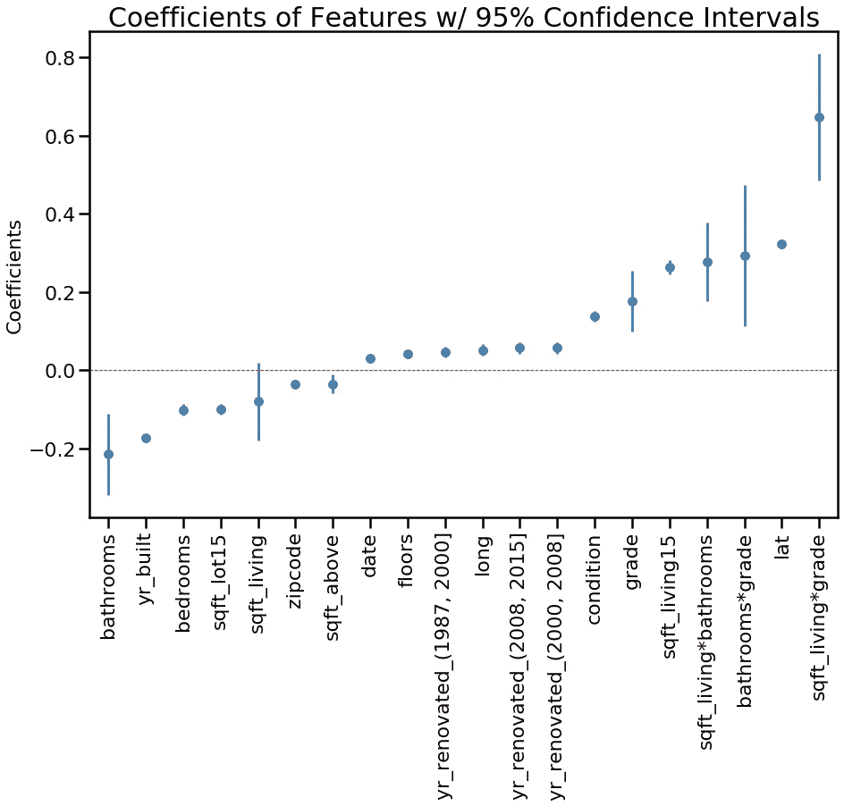

# 在 Python 中创建自己的系数绘图函数

> 原文：<https://medium.com/analytics-vidhya/create-your-own-coefficient-plot-function-in-python-aadb9fe27a77?source=collection_archive---------4----------------------->

## 因为为什么 R 可以享受所有的乐趣？

> 在本教程中，您将学习如何以 95%的置信区间可视化 OLS 多元线性回归模型的系数。或者你可以复制粘贴我的，交钥匙！