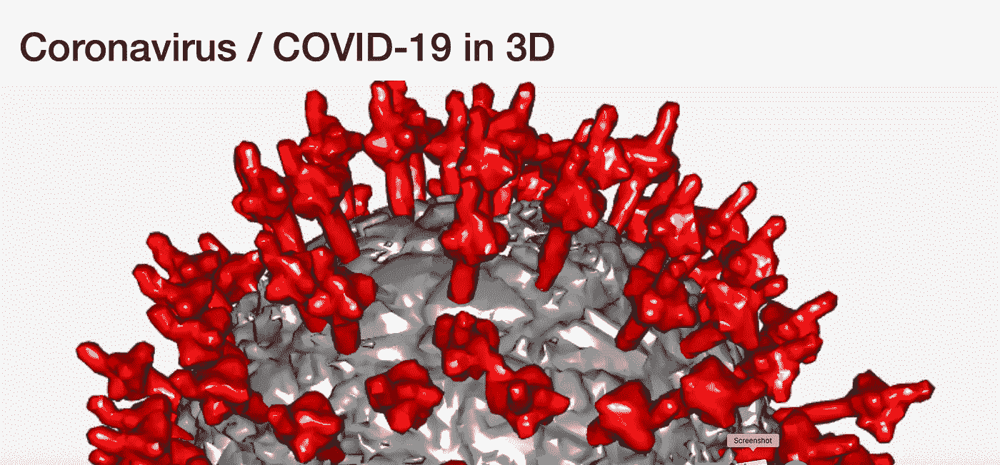
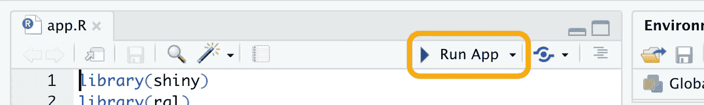

# 创建自己的 3D 冠状病毒

> 原文：<https://medium.com/analytics-vidhya/create-your-own-coronavirus-in-3d-37d1ac5a5437?source=collection_archive---------11----------------------->

## 用 20 行代码缩放和旋转您自己的新冠肺炎。



应用程序截图

> 这个简短的故事是关于你如何能够容易地可视化冠状病毒的 3D 模型。由此产生的**微型网络应用**允许你通过鼠标与“病毒”互动。

*在冠状病毒危机中，我们得到了许多病例数的更新、研究和预测。因为一级防范禁闭，我有很多时间可以自由支配。上周末，我创建了两个网络应用程序来下载和可视化新冠肺炎案件的数字(见中帖:*[*Python-Dash*](https://towardsdatascience.com/visualise-covid-19-case-data-using-python-dash-and-plotly-e58feb34f70f)*、*[*R-Shiny*](https://towardsdatascience.com/create-a-coronavirus-app-using-r-shiny-and-plotly-6a6abf66091d)*)。现在我花了一些时间在更有趣的事情上:3D 可视化。*

这个应用程序的实现将使用 R 来完成。 [**R 语言**](https://www.r-project.org/about.html) 主要由统计学家和数据科学家使用，但它也有一个非常好的包来处理使用 OpenGL 的 3D 可视化(**包“**[**Rgl**](https://cran.r-project.org/web/packages/rgl/vignettes/rgl.html)**“**)。

这个故事将展示如何解决这个任务，分为两个部分:

1.  **让它运行** : 101 让应用程序运行**。**
2.  **工作原理**:代码理解。

# 让它跑起来

## 下载 3D 模型

首先让我们以我们理解的格式下载一个免费的 3D 模型。我在 [Sketchfab](https://sketchfab.com/3d-models/coronavirus-covid-19-virus-991102145c294fe4b633faecc23f3799) 上发现了一个 85k 顶点的模型(CC 授权，Evan Pachon)。下载并以原始格式(obj)保存文件。

## 设置开发环境

如果你的 PC 上没有安装 R，那么按照我的[上一篇文章](https://towardsdatascience.com/visualise-covid-19-case-data-using-python-dash-and-plotly-e58feb34f70f)中描述的“步骤 1”打开 RStudio。将软件包安装代码替换为:

```
> packages = c("shiny", "rgl", "shinycssloaders", "readobj")
> install.packages(packages)
```

我们稍后会看到这些包的用途。现在创建一个新的空白闪亮项目。同样，如果你是 R 的新手，只需按照上面提到的文章中的“步骤 2”去做。但是，不要删除文件" *app。R"* ，因为我们将使用它作为我们的主要应用程序文件。将上一节中获得的 OBJ 文件移动到该文件夹中。

## “小”编码

您所需要的只是下面的小代码块。替换现有的 *app 内容。R* "用这几行。

```
library(shiny)
library(rgl)
library(shinycssloaders)
library(readobj)ui = fluidPage(
  titlePanel("Coronavirus / COVID-19 in 3D"),
  fluidRow(
    rglwidgetOutput("rglWidget", width="100%") %>% withSpinner()
  )
)server = function(input, output, session) {

  output$rglWidget = renderRglwidget({
    model = read.obj("coronavirus.obj", convert.rgl=TRUE)
    open3d()
    shade3d(model$Layer_1, color="darkgray")
    shade3d(model$Layer_2, color="red")
    bg3d(gray(level=0.95))
    rglwidget(reuse=TRUE)
  })
}shinyApp(ui=ui, server=server)
```

就是这样。你可以**按下*运行 App* 按钮启动 app** :



通过点击“*运行应用程序*”按钮，还会出现一些附加选项。勾选*运行外部*选项，重新运行应用，应用将**在默认浏览器**中启动。

*顺便说一句，如果你在 Mac 上，你可能需要下载并安装*[*XQuartz*](https://www.xquartz.org/)*才能正常工作。*


由 [Markus Spiske](https://unsplash.com/@markusspiske?utm_source=medium&utm_medium=referral) 在 [Unsplash](https://unsplash.com?utm_source=medium&utm_medium=referral) 上拍摄的照片

# 它是如何工作的

一个闪亮的应用程序分为两部分:用户界面(ui)和服务器。

我们的 UI 由所谓的**流体布局**组成，它由行和列组装而成。我们只需要一个标题行和一个包含 GL 小部件的附加流体行。函数 *rglwidgetOutput* 是 [*rgl* 包](https://cran.r-project.org/web/packages/rgl/vignettes/rgl.html)的一部分，为渲染模型创建占位符。它将在服务器代码中被其*outputId*("*rglWidget*")引用。

```
ui = fluidPage(
  titlePanel("Coronavirus / COVID-19 in 3D"),
  fluidRow(
    rglwidgetOutput("rglWidget", width="100%") %>% withSpinner()
  )
)
```

在模型加载时，管道操作符(" *% > %* ")用**动画微调器**替换小部件后，方法调用" *withSpinner()* "(包 *shinycssloaders* )，这可能需要几秒钟。

**服务器代码**实现**逻辑来加载和渲染 3D 模型**。" *read.obj(…)"* 从包 *readobj* 读取 obj 文件，并将其转换为 rgl 理解的格式。然后“ *open3d* ”打开一个新的图形窗口。函数“ *shade3d* ”用于添加具有指定颜色(红色和深灰色)的 3d 模型的两层。最后，“ *bg3d* ”设置背景颜色。

需要“rglWidget”来生成场景的 **WebGL 版本，可以进行渲染。**

```
server = function(input, output, session) {

  output$rglWidget = renderRglwidget({
    model = read.obj("coronavirus.obj", convert.rgl=TRUE)
    open3d()
    shade3d(model$Layer_1, color="darkgray")
    shade3d(model$Layer_2, color="red")
    bg3d(gray(level=0.95))
    rglwidget(reuse=TRUE)
  })
}
```

最后，这最后一行代码**创建了闪亮的应用**本身。

```
shinyApp(ui=ui, server=server)
```


由[杰西卡·诺尔登](https://unsplash.com/@mybibimbaplife?utm_source=medium&utm_medium=referral)在 [Unsplash](https://unsplash.com?utm_source=medium&utm_medium=referral) 上拍摄的照片

# 最后的话

显然，这是一个小小的展示，展示了我们如何使用 *R* 和 *rgl* 来轻松地可视化 3D 模型。

但是 ***rgl* 提供的** :
灯光、材质、纹理、动画、回调等等。

此外，**OBJ 或 STL 等格式的 3D 模型**允许使用 R、Python 或任何其他语言进行简单的**特征提取和模型改变**。对于我最近参与的一个更大的项目，我们额外将我们的 R-Shiny 应用程序连接到 Python [Freecad API](https://wiki.freecadweb.org/Python_scripting_tutorial) 来添加额外的开箱即用功能。

> 如你所见，没有上限。