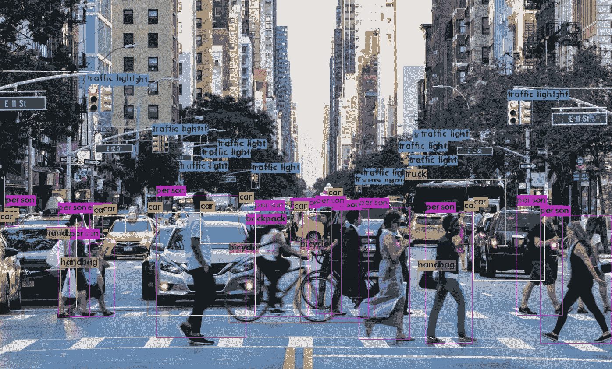
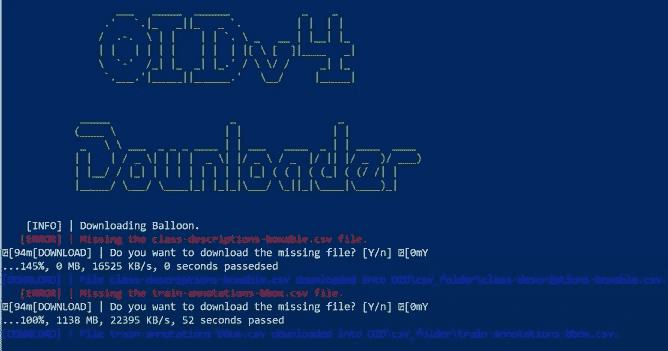
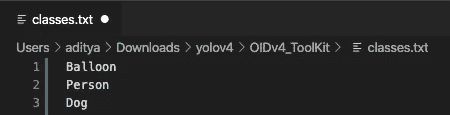

# 在 5 分钟内为 YOLOv4 对象检测创建您自己的数据集！

> 原文：<https://medium.com/analytics-vidhya/create-your-own-dataset-for-yolov4-object-detection-in-5-minutes-fdc988231088?source=collection_archive---------3----------------------->

## 这是一个使用 Google 的开放图像数据集创建你自己的定制数据集的教程，用于使用 Darknet 执行 YOLOv4 对象检测！



图片摘自 Aleksey Bochkovskiy 的 medium 文章:[https://medium . com/@ alexeyab 84/yolov 4-the-most-accurate-real-time-neural-network-on-ms-coco-dataset-73 adfd 3602 Fe](/@alexeyab84/yolov4-the-most-accurate-real-time-neural-network-on-ms-coco-dataset-73adfd3602fe)

YOLOv4 是“技术上”最先进的物体探测器。这是因为有些人可能会支持 YOLOv5，但由于这是一个高度争议的时刻，让我们现在就用 YOLOv4。我不打算深入这项技术是什么，但我将直接进入创建您自己的定制数据集的方法，该数据集可用于 YOLOv4 和 Darknet 使用[谷歌的开放图像数据集](https://opensource.google/projects/open-images-dataset)进行对象检测，该数据集有 600 类图像数据可供您选择。

向[维托里奥·马齐](https://vittoriomazzia.com/)大声欢呼，他构建了一个惊人的工具包，用于从[开放图像数据集](https://storage.googleapis.com/openimages/web/index.html)下载和标记图像。还要特别感谢[人工智能的家伙](https://www.youtube.com/channel/UCrydcKaojc44XnuXrfhlV8Q/featured)创造了一个伟大的方法来使用 YOLOv4 格式的注释来标记这些图像。这篇文章的灵感来自他们的创作。

查看他们的 github repos，了解相同内容的详细解释:

[](https://github.com/EscVM/OIDv4_ToolKit) [## EscVM/OIDv4_ToolKit

### 您是否希望构建您的个人对象检测器，但没有足够的图像来训练您的模型？你想不想…

github.com](https://github.com/EscVM/OIDv4_ToolKit) [](https://github.com/theAIGuysCode/OIDv4_ToolKit) [## 公平代码/oid v4 _ 工具包

### convert_annotations.py 通常使用工具包从打开的图像数据集中收集图像。收集图像后，只需运行…

github.com](https://github.com/theAIGuysCode/OIDv4_ToolKit) 

**注意**:您需要在本地机器上下载 Python，下面提到的步骤才能工作。所以如果你还没有的话，从[这里](https://www.python.org/downloads/)下载。

# **创建您自己的数据集的步骤**:

*   **步骤 1** :首先，进入您的命令提示符或终端，键入以下命令，将 aiguisscode/oid v4 _ ToolKit 的 github repo 克隆到您的本地计算机的首选文件夹中。

```
git clone [https://github.com/theAIGuysCode/OIDv4_ToolKit.git](https://github.com/theAIGuysCode/OIDv4_ToolKit.git)
```

你也可以直接从 repo 下载 zip 文件。

*   **步骤 2** :从您的终端进入文件夹‘oid v4 _ ToolKit’并输入:

```
pip install -r requirements.txt
```

这将为您提供实现这个项目所需的所有库。

*   **步骤 3** :现在你已经准备好了所有的要求，前往[开放图像数据集](https://storage.googleapis.com/openimages/web/index.html)网站，选择你感兴趣的图像类别。让我们假设你对三个类感兴趣:气球、人和狗。要从这三个类中获取图像，请回到您的终端，在同一个“OIDv4_ToolKit”文件夹中，键入:

```
python main.py downloader --classes Balloon Person Dog --type_csv train --limit 200
```

这将在一个名为“train”的新文件夹中下载每个类别的 200 张图片。用于训练的数据越多，模型就越好。所以，如果你有足够的资源，你可以随意下载你想要的图片。

**注意**如果你有一个包含空格的类名，用下划线代替空格。例如，“车辆登记牌照”将变成“车辆登记牌照”。

*   **第四步**:下载开始时，会问你两次是否要下载一些缺失的文件。两次都按 y。



截图取自 AI Guys Youtube 频道:[https://www.youtube.com/watch?v=_4A9inxGqRM](https://www.youtube.com/watch?v=_4A9inxGqRM)

*   **步骤 5** :再次重复步骤 3，但这次将命令中的‘train’改为‘validation ’,并将此处的图像数量减少到 40(20%的训练数据)。这样做是为了在训练后评估您的自定义对象检测器。

```
python main.py downloader --classes Balloon Person Dog --type_csv validation --limit 40
```

您也可以对测试文件夹再做一次同样的操作，但是这是可选的。

我们从工具包中得到的标签不是正确的 YOLOv4 格式。但是我们可以按照步骤 6 和 7 将它们转换成正确的格式。

*   **步骤 6** :在根 OIDv4_ToolKit 文件夹中，打开文件‘classes . txt’并编辑它，使之包含您刚刚下载的类，每行一个。



classes.txt

*   **步骤 7** :现在运行该命令，将 OIDv4_Toolkit 生成的标签转换为 YOLOv4 标签:

```
python convert_annotations.py
```

这将转换训练和验证数据集标签，现在 darknet 可以使用它们来正确地训练我们的自定义对象检测器。

*   **步骤 8** :移除训练和验证文件夹中包含非 YOLOv4 格式标签的旧“标签”文件夹。

现在，我们已经准备好用 YOLOv4 和 darknet 开始我们的自定义对象检测了！！😬 🙌

我已经用这种方法获得并标记了出租车的图像，用它我创建了一个出租车检测器项目。考虑访问我的 Github repo，深入了解如何使用 YOLOv4 -训练您的第一个对象检测器

[](https://github.com/adityarc19/taxi-detector-with-yolov4) [## adit yarc 19/带 yolov 的出租车检测器 4

### 这是一个出租车检测器项目，在给定的图像中识别出租车。我已经从网上下载了 200 张出租车的高清图像…

github.com](https://github.com/adityarc19/taxi-detector-with-yolov4) 

感谢阅读！