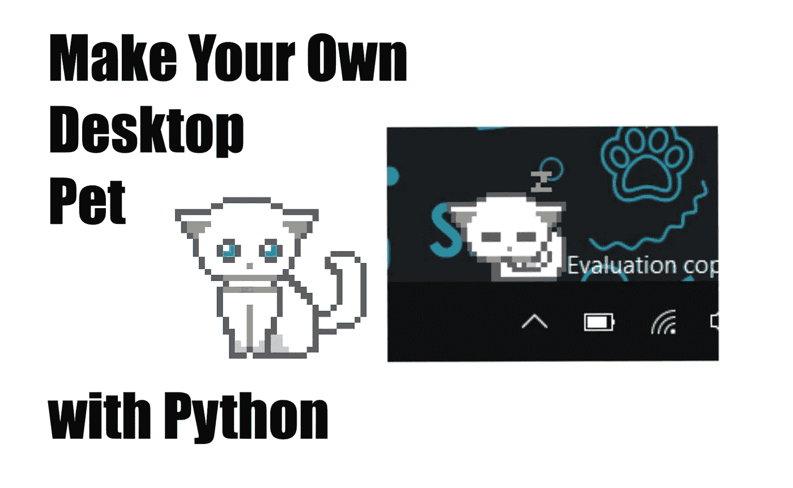
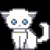
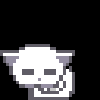
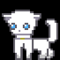
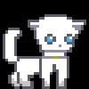

# 用 Python 创建你自己的桌面宠物

> 原文：<https://medium.com/analytics-vidhya/create-your-own-desktop-pet-with-python-5b369be18868?source=collection_archive---------0----------------------->



用 Python 制作你自己的桌面宠物

每个人都喜欢动物，对吗？但是肯定有人对猫或狗过敏，就像我一样。所以有一天，我就想，为什么不做一个数码的呢？虽然他们不是真的，但是，嘿，我可以得到我自己的猫！所以，在这篇文章中，我将向你展示我是如何使用 Python 编程语言编写自己的桌面猫的！

# **最终产品**

# 入门指南

首先，我们需要导入我们的模块，并分配一些变量，我将在文章的后面解释，我将使用' Tkinter '作为我们的 GUI。

```
import random
import tkinter as tk
import pyautoguix = 1400
cycle = 0
check = 1
idle_num =[1,2,3,4]
sleep_num = [10,11,12,13,15]
walk_left = [6,7]
walk_right = [8,9]
event_number = random.randrange(1,3,1)
impath = 'C:\\your\\path\\to\\file'
```

我导入 random 的原因是因为我们的宠物在随机运动。

之后，我们需要创建一个 tkinter 窗口来放置我们的宠物。

```
window = tk.Tk()
```

接下来，我们必须知道我们希望我们的宠物有什么动作，我的情况是，我想要一只猫，我希望它可以闲着，睡觉，在我的桌面上走来走去，所以我做了一些艰苦的工作。给我们的猫的 gif。



闲置的


当从空闲变为睡眠时



睡着的


当从睡眠回到空闲时



向左走



向右走

当我们有这些的时候。gif，我们必须从本地文件调用它到我们的 python 程序:

```
**#call buddy's action .gif to an array**
idle = [tk.PhotoImage(file=impath+'idle.gif',format = 'gif -index %i' %(i)) for i in range(5)]**#idle gif , 5 frames**
idle_to_sleep = [tk.PhotoImage(file=impath+'idle_to_sleep.gif',format = 'gif -index %i' %(i)) for i in range(8)]**#idle to sleep gif, 8 frames**
sleep = [tk.PhotoImage(file=impath+'sleep.gif',format = 'gif -index %i' %(i)) for i in range(3)]**#sleep gif, 3 frames**
sleep_to_idle = [tk.PhotoImage(file=impath+'sleep_to_idle.gif',format = 'gif -index %i' %(i)) for i in range(8)]**#sleep to idle gif, 8 frames**
walk_positive = [tk.PhotoImage(file=impath+'walking_positive.gif',format = 'gif -index %i' %(i)) for i in range(8)]**#walk to left gif, 8 frames**
walk_negative = [tk.PhotoImage(file=impath+'walking_negative.gif',format = 'gif -index %i' %(i)) for i in range(8)]**#walk to right gif, 8 frames**
```

要使我们的宠物背景从黑色变为透明，我们需要几行代码:

```
window.config(highlightbackground='black')
window.overrideredirect(True)
window.wm_attributes('-transparentcolor','black')
```

因为我希望她可以移动并显示动画，所以我给她分配了一个标签:

```
label = tk.Label(window,bd=0,bg='black')
label.pack()
window.mainloop()
```

这就是我们需要让我们的程序工作的前提。

# **让它活着！**

因为我们称之为。数组形式的 gif，我们需要做一个函数来循环每一帧:

```
**#make the gif work** 
def gif_work(cycle,frames,event_number,first_num,last_num):
 if cycle < len(frames) -1:
  cycle+=1
 else:
  cycle = 0
  event_number = random.randrange(first_num,last_num+1,1)
 return cycle,event_number
```

如代码所示，每次我们调用这个函数，变量' cycle '都会增加 1，但是当它大到(帧数组的长度-1)时，它又回到 0，并在随机范围内改变 event_number，这是因为我希望我的猫每次都改变它的动作。gif 循环过一次。这有助于让宠物变得更加自然，因为它的每一个动作都是随机的，但却是符合逻辑的，就像它睡觉时一样。gif 循环一次，它会立即考虑下一步该做什么，可能是从睡眠状态改变为继续睡眠状态，也可能是醒来后处于空闲状态。

# **更新画面**

我们需要我们的宠物做一个动作，并给每个动作分配一个数字:

```
def update(cycle,check,event_number,x):
 **#idle**
 if check ==0:
  frame = idle[cycle]
  cycle ,event_number = gif_work(cycle,idle,event_number,1,9)

 **#idle to sleep**
 elif check ==1:
  frame = idle_to_sleep[cycle]
  cycle ,event_number = gif_work(cycle,idle_to_sleep,event_number,10,10)**#sleep**
 elif check == 2:
  frame = sleep[cycle]
  cycle ,event_number = gif_work(cycle,sleep,event_number,10,15)**#sleep to idle**
 elif check ==3:
  frame = sleep_to_idle[cycle]
  cycle ,event_number = gif_work(cycle,sleep_to_idle,event_number,1,1)**#walk toward left**
 elif check == 4:
  frame = walk_positive[cycle]
  cycle , event_number = gif_work(cycle,walk_positive,event_number,1,9)
  x -= 3**#walk towards right**
 elif check == 5:
  frame = walk_negative[cycle]
  cycle , event_number = gif_work(cycle,walk_negative,event_number,1,9)
  x -= -3
 window.geometry('100x100+'+str(x)+'+1050')
 label.configure(image=frame)
 window.after(1,event,cycle,check,event_number,x)
```

代码

```
x = 1400
window.geometry('100x100+'+str(x)+'+1050')
```

是我们的 tkinter 窗口的位置，也就是我们宠物的位置，“100x100”是我们宠物的大小，以像素为单位，“x”是我们屏幕中的 x 位置，“1050”是我们宠物踩的地板。(它随着屏幕分辨率的变化而变化)

# 事件变化

为了使事件发生变化，我们需要一个函数来定义何时和概率去做一个动作:

```
idle_num =[1,2,3,4]
sleep_num = [10,11,12,13,15]
walk_left = [6,7]
walk_right = [8,9]**#transfer random no. to event**
def event(cycle,check,event_number,x):
 if event_number in idle_num:
  check = 0
  print('idle')
  window.after(400,update,cycle,check,event_number,x) **#no. 1,2,3,4 = idle**elif event_number == 5:
  check = 1
  print('from idle to sleep')
  window.after(100,update,cycle,check,event_number,x) **#no. 5 = idle to sleep**elif event_number in walk_left:
  check = 4
  print('walking towards left')
  window.after(100,update,cycle,check,event_number,x)**#no. 6,7 = walk towards left**elif event_number in walk_right:
  check = 5
  print('walking towards right')
  window.after(100,update,cycle,check,event_number,x)**#no 8,9 = walk towards right**elif event_number in sleep_num:
  check  = 2
  print('sleep')
  window.after(1000,update,cycle,check,event_number,x)**#no. 10,11,12,13,15 = sleep**elif event_number == 14:
  check = 3
  print('from sleep to idle')
  window.after(100,update,cycle,check,event_number,x)**#no. 15 = sleep** to idle
```

如果你们中的任何人对

```
window.after(1000,update,cycle,check,event_number,x)
```

这意味着程序将在 1000 毫秒后调用更新函数，我们可以通过改变它来控制动画的速度。

# **代码背后的逻辑**

如果你注意了上面的代码，你应该注意到在我们的猫从空闲状态转换到睡眠状态后，下一个动作必须是睡眠，和从睡眠状态转换到空闲状态后一样，它必须是空闲状态，

```
idle_num =[1,2,3,4]
#sleep to idle
 elif check ==3:
  frame = sleep_to_idle[cycle]
  cycle ,event_number = gif_work(cycle,sleep_to_idle,event_number,1,1)#must be idle
```

在我们开始时分配的变量中:

```
check = 1
idle_num =[1,2,3,4]#5 is idle to sleep
sleep_num = [10,11,12,13,15] #14 is sleep to idle,sorry for skipping
walk_left = [6,7]
walk_right = [8,9]
```

我们可以看到，我们有 15 个数字，在程序开始时，我们的宠物一定是空闲的，因为我们给变量' check '赋值为 1，在。gif 循环一次,‘event _ number’会随机地在 1 到 9 之间变化，所以它有 4/9 的概率保持空闲或向左右行走，还有 1/9 的机会从空闲变为睡眠。一旦它变成了睡眠状态，它必须执行一个睡眠动作，以防止突然醒来，这听起来不自然。

就像一只正常的猫一样，它有很高的几率一直睡啊睡啊睡。

# 完整的代码

```
import pyautogui
import random
import tkinter as tkx = 1400
cycle = 0
check = 1
idle_num =[1,2,3,4]
sleep_num = [10,11,12,13,15]
walk_left = [6,7]
walk_right = [8,9]
event_number = random.randrange(1,3,1)
impath = 'C:\\Users\\fx770\\Desktop\\Project\\Buddy\\image\\'#transfer random no. to event
def event(cycle,check,event_number,x):
 if event_number in idle_num:
  check = 0
  print('idle')
  window.after(400,update,cycle,check,event_number,x) #no. 1,2,3,4 = idleelif event_number == 5:
  check = 1
  print('from idle to sleep')
  window.after(100,update,cycle,check,event_number,x) #no. 5 = idle to sleepelif event_number in walk_left:
  check = 4
  print('walking towards left')
  window.after(100,update,cycle,check,event_number,x)#no. 6,7 = walk towards leftelif event_number in walk_right:
  check = 5
  print('walking towards right')
  window.after(100,update,cycle,check,event_number,x)#no 8,9 = walk towards rightelif event_number in sleep_num:
  check  = 2
  print('sleep')
  window.after(1000,update,cycle,check,event_number,x)#no. 10,11,12,13,15 = sleepelif event_number == 14:
  check = 3
  print('from sleep to idle')
  window.after(100,update,cycle,check,event_number,x)#no. 15 = sleep to idle#making gif work 
def gif_work(cycle,frames,event_number,first_num,last_num):
 if cycle < len(frames) -1:
  cycle+=1
 else:
  cycle = 0
  event_number = random.randrange(first_num,last_num+1,1)
 return cycle,event_numberdef update(cycle,check,event_number,x):
 #idle
 if check ==0:
  frame = idle[cycle]
  cycle ,event_number = gif_work(cycle,idle,event_number,1,9)

 #idle to sleep
 elif check ==1:
  frame = idle_to_sleep[cycle]
  cycle ,event_number = gif_work(cycle,idle_to_sleep,event_number,10,10)#sleep
 elif check == 2:
  frame = sleep[cycle]
  cycle ,event_number = gif_work(cycle,sleep,event_number,10,15)#sleep to idle
 elif check ==3:
  frame = sleep_to_idle[cycle]
  cycle ,event_number = gif_work(cycle,sleep_to_idle,event_number,1,1)#walk toward left
 elif check == 4:
  frame = walk_positive[cycle]
  cycle , event_number = gif_work(cycle,walk_positive,event_number,1,9)
  x -= 3#walk towards right
 elif check == 5:
  frame = walk_negative[cycle]
  cycle , event_number = gif_work(cycle,walk_negative,event_number,1,9)
  x -= -3
 window.geometry('100x100+'+str(x)+'+1050')
 label.configure(image=frame)
 window.after(1,event,cycle,check,event_number,x)window = tk.Tk()#call buddy's action gif
idle = [tk.PhotoImage(file=impath+'idle.gif',format = 'gif -index %i' %(i)) for i in range(5)]#idle gif
idle_to_sleep = [tk.PhotoImage(file=impath+'idle_to_sleep.gif',format = 'gif -index %i' %(i)) for i in range(8)]#idle to sleep gif
sleep = [tk.PhotoImage(file=impath+'sleep.gif',format = 'gif -index %i' %(i)) for i in range(3)]#sleep gif
sleep_to_idle = [tk.PhotoImage(file=impath+'sleep_to_idle.gif',format = 'gif -index %i' %(i)) for i in range(8)]#sleep to idle gif
walk_positive = [tk.PhotoImage(file=impath+'walking_positive.gif',format = 'gif -index %i' %(i)) for i in range(8)]#walk to left gif
walk_negative = [tk.PhotoImage(file=impath+'walking_negative.gif',format = 'gif -index %i' %(i)) for i in range(8)]#walk to right gif#window configuration
window.config(highlightbackground='black')
label = tk.Label(window,bd=0,bg='black')
window.overrideredirect(True)
window.wm_attributes('-transparentcolor','black')label.pack()#loop the program
window.after(1,update,cycle,check,event_number,x)window.mainloop()
```

希望你喜欢教程，并在制作自己的桌面宠物后感觉良好！！