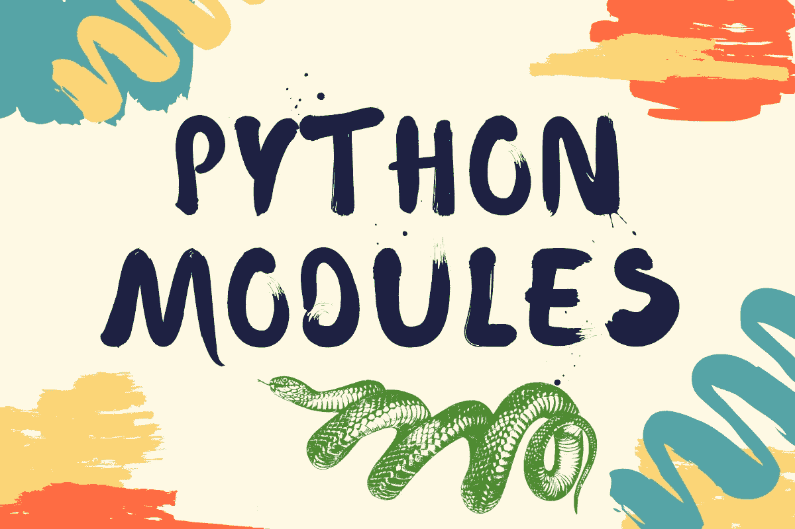
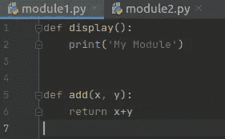
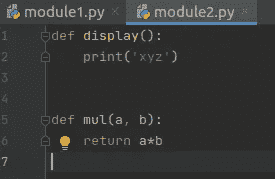
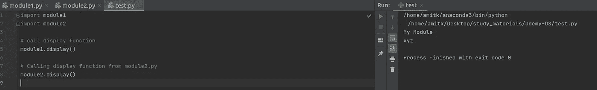

# 用 Python 创建你自己的模块

> 原文：<https://medium.com/analytics-vidhya/create-your-own-modules-in-python-f377f8d71800?source=collection_archive---------27----------------------->

**模块**:模块一般是函数的集合。

**使用模块的优势:**

*   模块允许将大程序分解成小代码块。
*   模块是单独开发的，但是集成到复杂的完整系统中，这使得软件开发过程有效。
*   模块也有助于程序的修改和更新。

让我们举个例子。

**注意:按照惯例，模块用小写字母命名。**

正如你在下面的快照中看到的，我已经创建了两个包含一些函数的 python 文件。

当你执行这两个，你会发现没有输出。现在我们将使用另一个 python 文件名 test.py，它将使用这个模块。

## 需要记住的几点:

*   Python 模块是一个包含 Python 定义和语句的文件。
*   模块用小写字母命名。
*   一旦你创建了你自己的模块，你可以把这个模块导入到主 python 文件中，然后使用命名空间调用各自的函数。

# **感谢阅读:)**