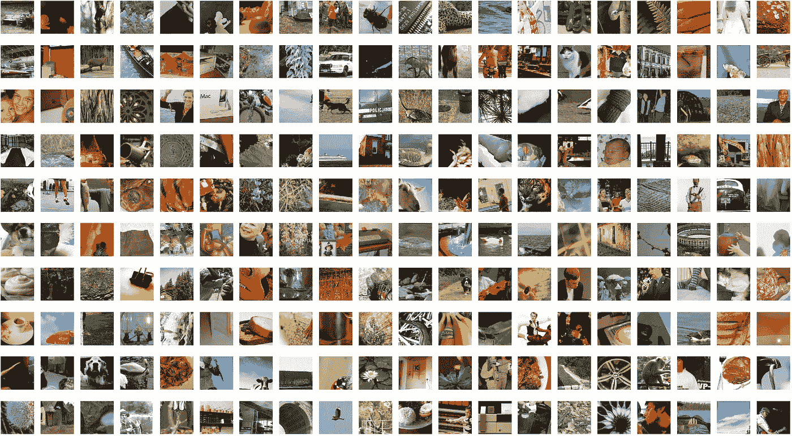
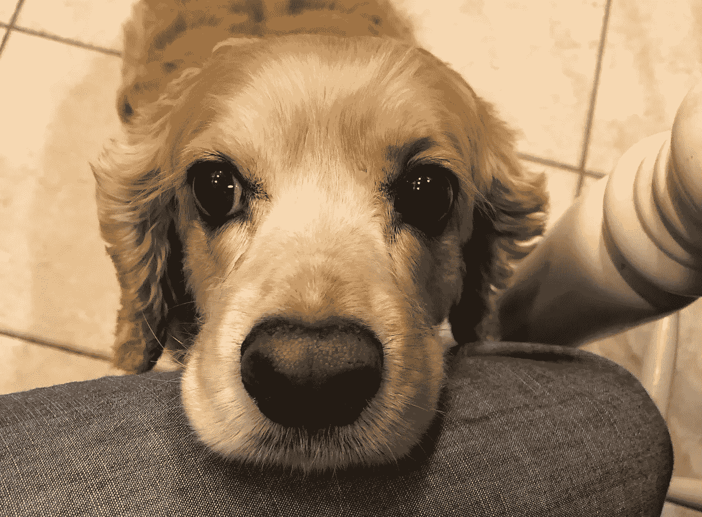

# 使用 python(深度学习)创建您自己的真实图像数据集

> 原文：<https://medium.com/analytics-vidhya/create-your-own-real-image-dataset-with-python-deep-learning-b2576b63da1e?source=collection_archive---------0----------------------->



我们都使用过著名的数据集，如 CIFAR10、MNIST、MNIST 时尚、CIFAR100、ImageNet 等等。但是，如何根据自己的需要使用定制的数据集来处理项目呢？这也让你在处理图像数据时成为了一个完全的大师

我们大多数人可能都知道如何在 csv 文件中处理和存储数值和分类数据。但是，将图像数据存储在文件中的想法非常少见。说到这里，让我们看看如何用 python 制作我们自己的影像数据集

代码从这里开始:

1)让我们从导入必要的库开始

```
#importing the libraries
import os 
import cv2
import numpy as np
import matplotlib.pyplot as plt
%matplotlib inline
```

2)然后，我们需要设置包含图像文件的文件夹或目录的路径。在这里，我需要上传的图片存储在下面提到的路径中

```
#setting the path to the directory containing the pics
path = '/media/ashwinhprasad/secondpart/pics'
```

3)使用 basic 语句导入、转换为 RGB 并将图像文件附加到 Python 列表

```
#appending the pics to the training data list
training_data = []
for img in os.listdir(path):
    pic = cv2.imread(os.path.join(path,img))
    pic = cv2.cvtColor(pic,cv2.COLOR_BGR2RGB)
    pic = cv2.resize(pic,(80,80))
    training_data.append([pic])
```

4)将上述列表转换为 numpy 数组，并以指定路径保存为. npy 文件

```
#converting the list to numpy array and saving it to a file using #numpy.save
np.save(os.path.join(path,'features'),np.array(training_data))
```

我们现在已经成功地创建了一个。带有图像的 npy 文件。让我们检查一下它是否像预期的那样工作

5)将保存的文件加载回 numpy 数组

```
#loading the saved file once again
saved = np.load(os.path.join(path,'features.npy'))
```

6)显示来自加载文件以及来自训练数据列表的第一张图片，并检查它们是否匹配

```
plt.imshow(saved[0].reshape(80,80,3))
plt.imshow(np.array(training_data[0]).reshape(80,80,3))
```

好吧。不出所料，两人似乎都是这只可爱狗狗的照片:



可爱的狗

现在，您已经知道如何通过 6 个简单的步骤在 python 中创建自己的影像数据集。当您尝试创新项目，但在互联网上找不到模型的数据集时，这可能会有所帮助。

感谢阅读:)