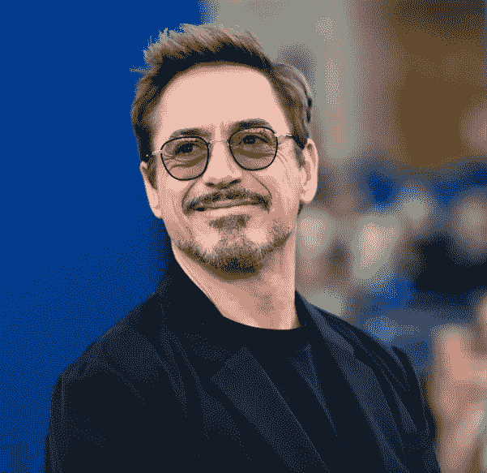
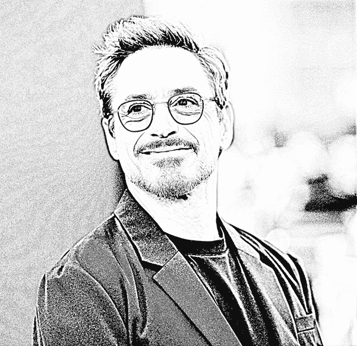
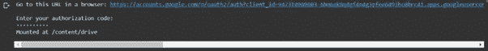
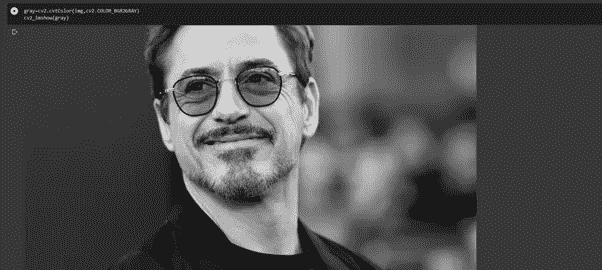
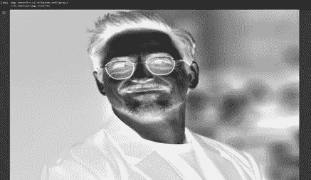
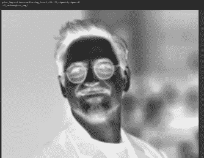
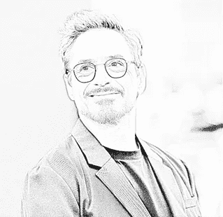
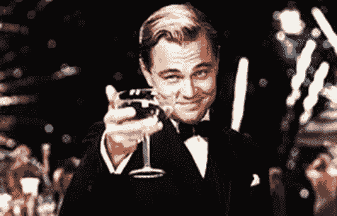

# 用 OpenCV 创建你自己的草图

> 原文：<https://medium.com/analytics-vidhya/create-your-own-sketch-with-opencv-638a463c6ec6?source=collection_archive---------8----------------------->

你多久想让一位艺术家给你画一张素描？不用多说，现在你可以很容易地使用 OpenCV，在几分钟内制作出你自己的草图。只需 4 个步骤，OpenCV 将为您提供相同的肖像。

从图像 1 到图像 2 只需 4 步。

图 1:常规 RGB 图片

图 2:铅笔素描肖像

好了，让我们开始吧，不用拿起画笔，自己画一张素描。

因此，对于这个特定的任务，我们将使用 Google Colaboratory 或简称为“Colab ”,它允许您在浏览器中编写和执行 Python，无需任何配置，可以免费访问 GPU 并轻松共享。嗯，你也可以用 Jupyter 笔记本，完全由你决定。

我们今天要用的四个步骤如下:

1.  将 RGB 彩色图像转换为灰度图像。
2.  将灰度图像转换为负片。
3.  使用[高斯模糊](https://docs.opencv.org/master/d4/d13/tutorial_py_filtering.html)平滑图像。
4.  匀光和燃烧图像，以获得最终的输出。

# **入门**

所以首要的第一步是加载图像并将其转换成灰度图像。
我需要的图像存在于我的 google drive 中，因此我们必须将该驱动器安装到协作室中，这样做也是一样的。

您可以使用下面这段代码来实现这一点:

> *从 google.colab 导入驱动
> drive . mount(' content/drive ')*

当您运行此命令时，您会发现一个需要访问的 google 身份验证链接，以便您可以复制身份验证代码并开始使用您驱动器的内容。

现在来了必要的导入，您需要导入 cv2 模块来完成所需的任务。此外，由于 cv2 模块的 imshow()函数不能与 google colab 一起工作，我们需要使用一个替代方法来查看图像。

> *从 google.colab.patches 导入 cv2_imshow
> 导入 cv2
> img = cv2 . im read(' picture . jpg ')
> cv2 _ im show(img)*

要转换的图像

**为草图将 RGB 彩色图像转换为灰度图像**

现在我们有了图像，我们把它转换成灰度，这样以后就可以使用 cv2 模块中的 cvtColor()方法把它转换成负片。同样的方法也用于将图像转换为 HSV 和 RGB 格式。

> *gray = cv2 . CVT COLOR(img . cv2 _ COLOR _ bgr 2 gray)
> cv2 _ im show(gray)*

灰度图像输出

**将灰度图像转换成负片图像**

需要使用位运算将灰度图像转换为负数。逐位运算用于图像处理，并用于提取图像中的重要部分。

我们将通过反转灰度图像在 0-255 之间的像素来获得图像的负片。为了反转图像，我们将使用 cv2 模块中的 bitwise_not()操作。

> *img _ invert = cv2 . bitwise _ not(gray)
> cv2 _ im show(img _ invert)*

反转图像输出

**使用** [**高斯模糊**](https://docs.opencv.org/master/d4/d13/tutorial_py_filtering.html) 平滑图像

在图像处理中，高斯模糊(也称为高斯平滑)是通过高斯函数模糊图像的结果。这是图形软件中广泛使用的效果，通常用于减少图像噪声和细节。

在这种方法中，使用高斯核，而不是由相等的滤波器系数组成的箱式滤波器。这是通过函数 cv2 完成的。GaussianBlur():

> gblur_img=cv2。GaussianBlur(img_invert，(21，21)，sigmaX=0，sigmaY=0)
> 
> cv2_imshow(gblur_img)

平滑图像

您可以根据自己的适合性更改内核大小，并查看输出如何变化。为了更好的理解，你可以学习更多关于[内核](https://www.pyimagesearch.com/2016/07/25/convolutions-with-opencv-and-python/)的知识。

**对图像进行匀光和刻录，得到最终输出**

匀光和灼烧指的是传统摄影中印刷过程中使用的技术。在传统摄影的好日子里，人们会试图通过控制曝光时间来使暗房照片的某个区域变亮或变暗。闪避使图像变亮，而燃烧使图像变暗。

Photoshop 等现代图像编辑工具提供了模仿这些传统技术的方法。例如，具有遮罩 B 的图像 A 的颜色匀光实现如下:

((B[idx] == 255)？B[idx] : min(255，((A[idx] << 8) / (255-B[idx]))))

This is essentially dividing the grayscale (or channel) value of an image pixel A[idx] by the inverse of the mask pixel value B[idx], while making sure that the resulting pixel value will be in the range [0,255] and that we do not divide by zero. We could translate this into a naïve Python function that accepts two OpenCV matrices (an image and a mask) and returns the blended image.

We’re lucky that we can do this with just minimal code with the help of Opencv.

Here we create custom function dodge_img() which takes a grayscale image and an inverse image as a mask as the arguments to the function and then convert the image to a dodged image.

> *def dodge_img(x，y):
> return cv2.divide(x，255-y，scale=256)*
> 
> *道奇 _ img =道奇 _img(gray，gblur_img)
> cv2_imshow(道奇 _img)*

这将产生以下结果:-

闪避图像输出

现在，为了执行烧录，我们将再次创建一个自定义函数 burn_img()，该函数将被遮挡的图像和被平滑的图像作为该函数的参数，该函数将使图像变暗，从而执行图像的烧录。

> *def burn_img(image，mask):
> return 255—cv2 . divide(255-image，255-mask，scale=256)*
> 
> *final _ image = burn _ img(sodied _ img，gblur_img)*

因此这最后一步最终产生我们的草图的原始图片:—

**瞧！这就是你用 OpenCV 画的草图。**

