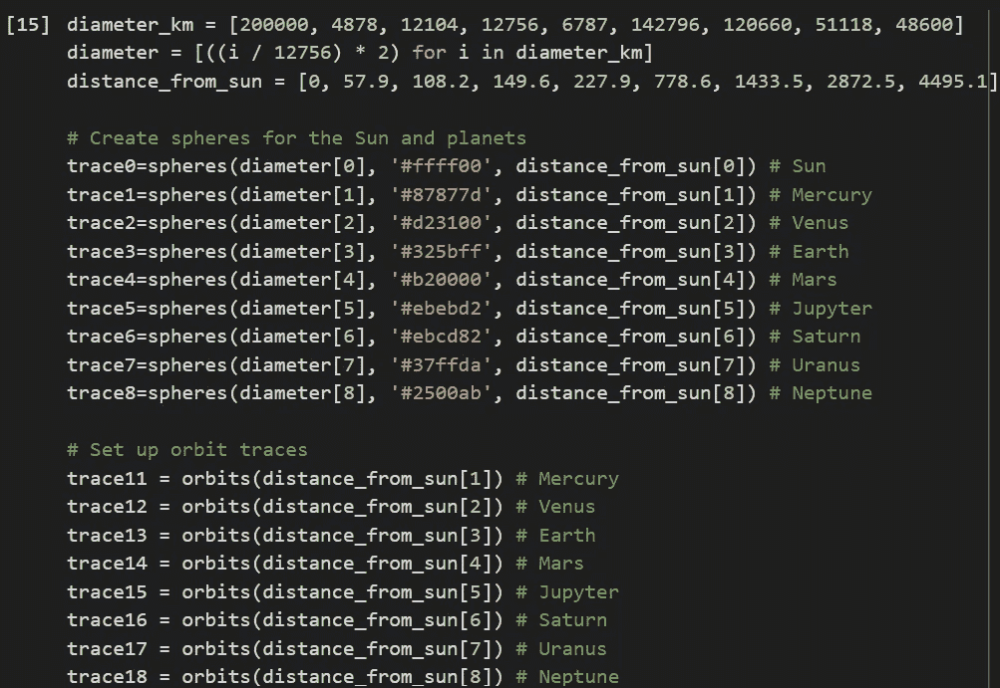

# 使用 Python 创建自己的太阳系

> 原文：<https://medium.com/analytics-vidhya/create-your-own-solar-system-using-python-6ff550dbf099?source=collection_archive---------8----------------------->

嗨，

如果没有人告诉你 Python 可以做的许多奇迹，那么你就可以享受一下了。在这篇文章中，我将告诉你我是如何使用 Python 从零开始制作自己的太阳系的。

Python 为您提供了大量的图形库，并允许您绘制所有主要类型的图形，以便您可以可视化您的数据。

在这里，我将使用 Plotly 散点三维和 Plotly 表面图的组合来创建一个图形内的整个太阳系。在本文中，我将向您介绍 Python 代码，它将允许您自己重新创建它。

您可以在此处找到代码:

[https://github . com/sanjanamops 8752/Create-Your-Own-Solar-System-Using-Python](https://github.com/sanjanamops8752/Create-Your-Own-Solar-System-Using-Python)

## 想象太阳系

我首先想到的是简单地使用 3D 散点图，为太阳和行星创建自定义大小的标记。然而，这并不理想，因为当放大或缩小时，标记保持相同的大小。

这导致了不必要的影响，如土星环在行星内部，一旦缩小，太阳吞没了所有的岩石内行星。这意味着我必须找到一个不同的解决方案来显示太阳和行星。

幸运的是，Plotly 还提供了一个 3D 表面图，我可以用它来绘制天体。然而，这需要画几个球，每个球的大小和颜色都不同。

## **入门**

我将从导入这个项目所需的所有库开始。

## 想象你的太阳系:太阳和行星

为了减少编码，我将从定义一个函数来帮助我们创建球体开始。它很短，尽管它需要一些关于[球面坐标系](https://en.wikipedia.org/wiki/Spherical_coordinate_system)的知识。或者，只要接受我将球的坐标定义如下:

要画一个球体，我们需要传递一个包含空间点的 x、y 和 z 坐标的数组。请注意，我们可以选择指定多少个点，但是，如果我们选择的太少，我们的球体将不会像我们希望的那样圆。

在这种情况下，我们创建两个包含 100 个等距点的数组。注意，θ在 0 和 2pi 之间变化，而 phi 在 0 和 pi 之间变化。

*球面坐标有 2 个角。就像地球上的一个位置，有经纬度。经度一路绕行(总角度 2π)。而纬度是从一极到另一极(总角度π)。*

一旦我们有了θ和φ，我们就可以使用上面的公式简单地计算 x，y 和 z 坐标。注意，我用了大小而不是半径，还指定了距离，它告诉我们离太阳的距离。这就是我们如何将球体放在正确的位置。

还要注意，Plotly 需要 z 坐标的 2D 数组，因此，我们用 1 填充了第一维，第二维符合公式。

最后，我们定义一个色标，它可以是一系列颜色。然而，在我们的例子中，我们只是希望每个对象都有一种颜色，所以尽管我们仍然需要指定至少两个参数，我们只是简单地将相同的颜色传递给两者。

## 创造轨道

如果你抬头看天空，你不会到处都看到轨道线。但是，在太阳系模型中，我们喜欢画轨道。现在我将定义一个新的函数，我们可以用它来绘制土星环和轨道。

## 定义注释

现在，这是我们需要定义的最后一个函数。这是非常基本的，它允许我们将行星的名称添加到我们选择的坐标位置。

请注意，我们使用注释而不是标记文本，因为我们希望行星的名称出现在球体之外:

# 现在让我们想象一下太阳系

现在我们有了所有的小函数来帮助我们，我们可以把它们放在一起，创建整个图形。下面是用 Python 可视化太阳系的代码:

现在让我们浏览一下上面的代码:

*   我们首先创建几个列表，其中包含到太阳的距离和天体的直径。请注意，我们必须通过使太阳变得更小来减小它的大小，否则对于我们的图表来说它会变得太大。
*   虽然我们保持了比例，以确保行星的大小相对于彼此是正确的，但太阳不是。此外，行星的距离是成比例的，例如，木星离太阳的距离是金星的 7 倍。
*   然而，我们没有保持行星之间的比例和到太阳的距离，因为我们用公里表示直径，而用百万公里表示距离。
*   然后我们使用之前定义的函数为每个球体和轨道创建轨迹，包括土星周围的几个环。

输出:

