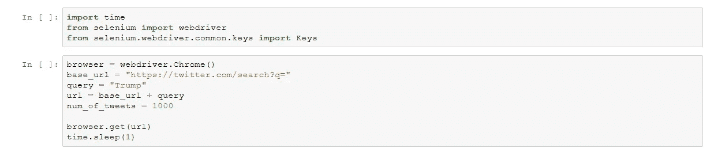
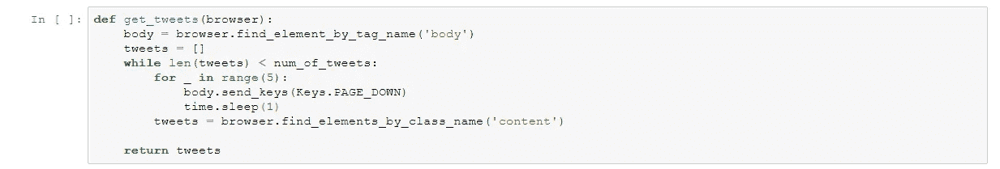
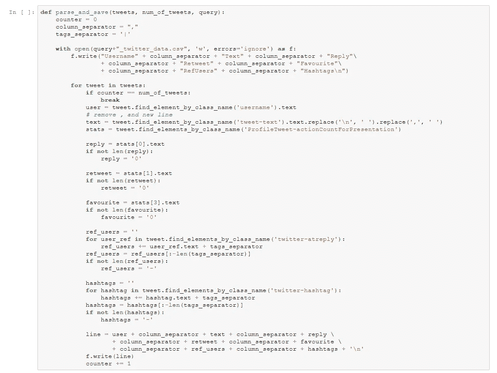
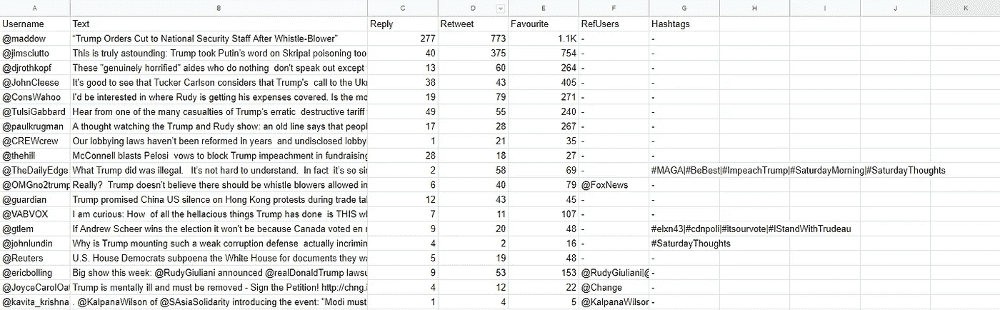

# 用这个简单的 Python Scraper 创建你自己的 Twitter 数据集

> 原文：<https://medium.com/analytics-vidhya/create-your-own-twitter-dataset-with-this-simple-python-scraper-710bf7c5dc04?source=collection_archive---------6----------------------->

如果你曾经处理过 twitter 数据，我敢肯定你遇到过令人沮丧的 API 请求“速率限制”(uhh)。所以今天，我将向您展示如何使用 Selenium 和 Python 来“绕过”这一限制。

为使该项目顺利进行，您需要:

*   谷歌 Chrome 浏览器
*   [ChromeDriver](https://chromedriver.chromium.org/downloads) (下载并保存在与脚本相同的路径下)
*   Python 3.7(之前的 3。*最有可能工作的版本)
*   硒(3.141.0)
*   Jupyter 笔记本电脑(可选)

在我们进入要点之前，让我简单解释一下这是如何工作的。在 Selenium library 的帮助下，我们将对外打开一个新的 Chrome 窗口，并通过 html 抓取从中提取数据。简单吧？那我们开始吧。

初始阶段

如您所见，这是初始化阶段。首先，我们启动一个新的 Chrome 窗口，设置 twitter 搜索词(在我们的例子中是 Trump)以及我们想要的推文数量(100)。最后，我们将浏览器指向所需的链接，并等待 1 秒钟加载。

初始化阶段完成后，我们有两个主要步骤。

*   get_tweets():负责抓取推文
*   parse_and_save():负责解析和保存数据

从 HTML 主体获取推文

这个函数抓取 tweets，直到达到期望的数量。这个函数中有趣的事情发生在 for 循环内部。因为我们使用的是一个真正的 Chrome 窗口，所以我们在 Selenium 的库中使用 PAGE_DOWN 按钮向下滚动，以便加载更多的 tweets。酷吧？

解析数据并保存到 CSV

顾名思义，这个函数解析并以 csv 格式导出我们想要的数据。我决定收集以下信息，但您可以根据自己的需要随意更改:

***用户名，tweet_text，#回复，#转发，#收藏，ref_users，标签***

结果将如下所示:

CSV 格式的结果

Jupyter 笔记本上的完整代码:

[https://gist . github . com/NikosKoufos/664 E6 D5 b 467 F6 c 602 f 87678062 b 78520](https://gist.github.com/NikosKoufos/664e6d5b467f6c602f87678062b78520)

就这样，我们到了这篇文章的结尾。我真心希望你们会觉得有用。如果您有任何建议/问题，请在下面评论。下次见。

页（page 的缩写）这个刮刀依赖于 twitter 的 html 结构，所以 twitter 结构未来的任何潜在变化都可能破坏刮刀。