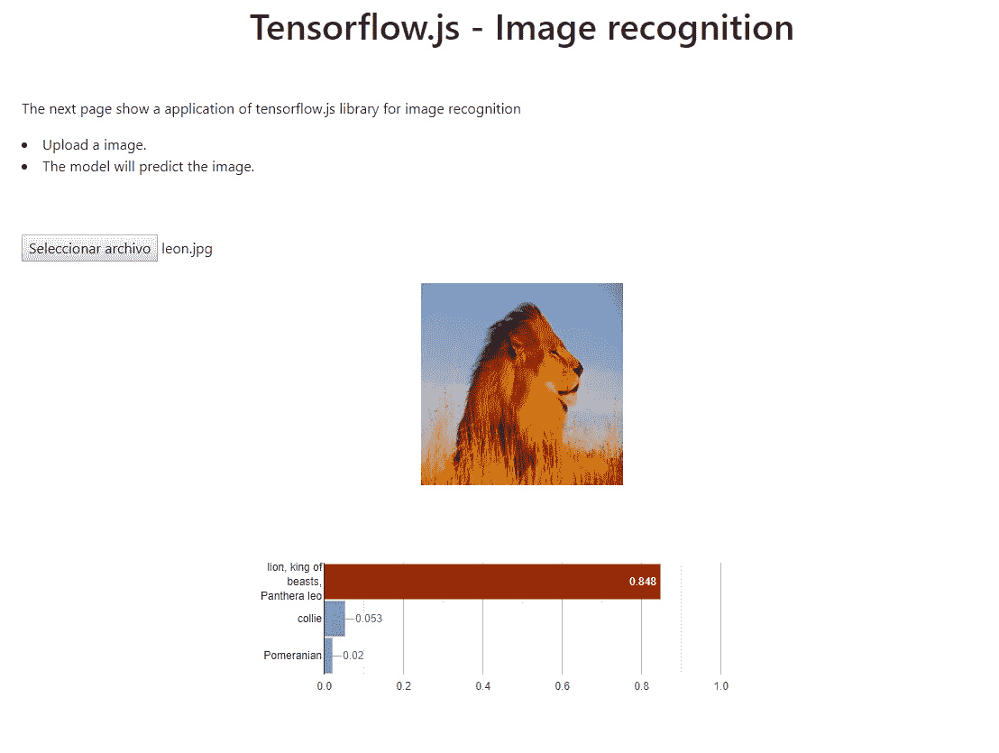
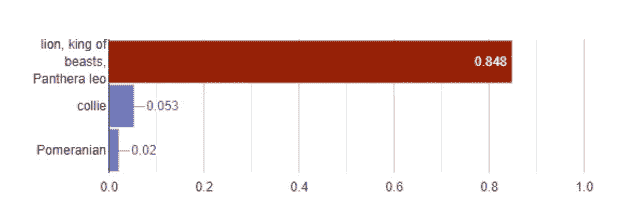
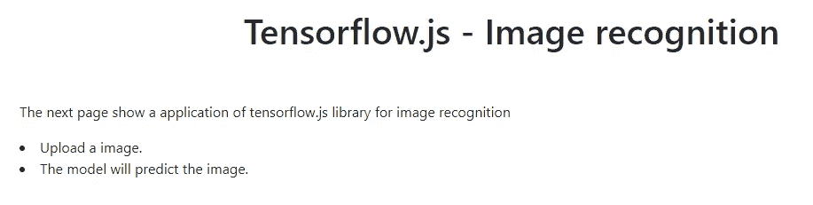
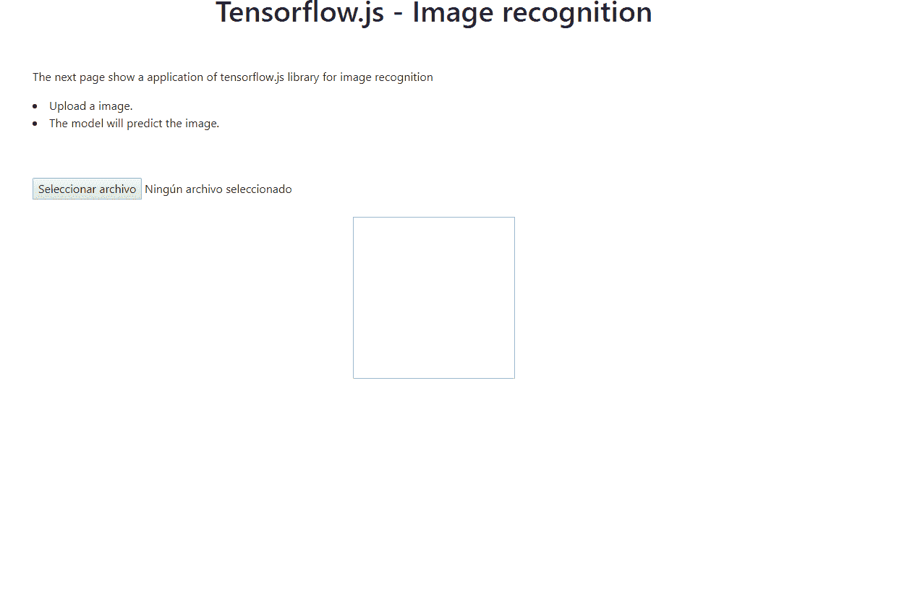

# 创建您的 Web 应用程序来识别图像

> 原文：<https://medium.com/analytics-vidhya/create-your-web-application-to-recognize-images-71cf4f242d7?source=collection_archive---------5----------------------->

## 使用 HTML、JavaScript 和 Tensorflow 的基础知识，您可以创建自己的 web 应用程序来识别图像

由[萨法尔萨法罗夫](https://unsplash.com/@codestorm?utm_source=medium&utm_medium=referral)在 [Unsplash](https://unsplash.com?utm_source=medium&utm_medium=referral) 上拍摄的照片

# 介绍

在许多场合，我们总是喜欢向我们的经理或不熟悉这些话题的人解释我们的机器学习模型的结果。例如，假设我们有一个深度学习模型，可以对图像进行分类，例如狗、猫……该模型在测试集中或对您尝试过的一些图像有很好的结果，但您希望其他人使用他们的模型，如果他们在 web 应用程序中使用该模型，效果会更好。这就是本教程的内容。

我们将学习如何使用 tensorflow.js 库和 MobileNet 模型创建 web 应用程序。只需要知道 HTML 和 JavaScript 中的基础知识。完成本教程后，您可能会有一个类似于下面的应用程序:

# 目录

1.  Tensorflow.js
2.  网络应用

# 1.Tensorflow.js

Tensorflow.js 是谷歌开发的一个库，你可以从 Javascript 生成机器学习模型，特别是深度学习。

使用 tensorflow.js 的优势:

*   导入现有的先前训练的模型，并在浏览器中使用它。现有模型可以用 Tensorflow 或 Keras 创建。为此，您必须安装`tensorflowjs`库并运行以下脚本(要了解更多信息，您可以访问以下[链接](https://www.tensorflow.org/js/tutorials/conversion/import_keras):

*   重新训练导入的模型。您可以在浏览器中收集更多数据，并使用学习转移继续训练模型。
*   在浏览器中训练。您可以使用 tensorflow.js 在浏览器中定义、训练和运行模型。脚本和`Keras`里写的很像。

更多信息可以去主网站:[https://www.tensorflow.org/js](https://www.tensorflow.org/js)

在本教程中，我们将使用一个经过训练的模型，带有 ImageNet 图像，名为 MobileNet。MobileNet 是一种卷积神经网络(CNN)架构，旨在移动设备上运行。如你所知，卷积神经网络是一种深度学习算法，用于学习与图像相关的机器学习模型，如:分类图像，检测图像或视频中的对象，…

# 2.网络应用

现在让我们开始有趣的事情吧！我们将使我们的 web 应用程序能够识别图像。为此，我们只需要一个文本编辑器，你可以使用 notepad ++，sublime 或一个简单的笔记块(用它你会感觉更舒服)

# 超文本标记语言

我们将从 **HTML** 开始，它将负责构建网页。该文件将被称为**index.html**:

*   为了使用 tensorflow.js 库，我们需要从 HTML 中调用它，如下所示:

*   我们将展示 MobileNet 模型预测的概率和决策:

输出如下所示:

*   我们将在网站上添加一些文字:

输出如下所示:

*   现在，我们将在 web 应用程序中添加一个上传图像的部分:

1.  MobileNet 模型已经使用大小为 224 * 224 的图像进行了训练，因此我们将以这些比例转换图像。
2.  我们将用来上传并显示图像的 JavaScript 函数叫做`showFiles(event)`:

# Java Script 语言

**JavaScript** 将负责上传图片，调用 tensorflow.js 函数，使用 MobileNet 模型进行预测。该文件将被命名为 **index.js** :

*   首先，我们创建一个函数来上传图像并在浏览器中显示它们:

*   以下脚本将在条形图上绘制预测的概率。我们将使用库 [Google](https://developers.google.com/chart/interactive/docs/gallery/barchart?hl=en) :

*   现在，我们将加载预训练的 MobileNet 模型:

*   最后，我们将预测上传的图像:

# 将所有代码放在一起:

*   **HTML(文件索引. html):**

*   **JavaScript(file index . js):**

就这样，在几行代码中，您已经创建了可以识别图像的 web 应用程序。

在这个[链接中](https://github.com/Jazielinho/image_recognition_tensorflow_js)是完整的脚本。

现在让我们试试我们的 web 应用程序:

我希望你喜欢这个教程。

请在评论中告诉我你的观点。

1.  关于这个架构的更多信息，可以去这个[链接](https://arxiv.org/abs/1704.04861)和这个[链接](https://keras.io/applications/)。
2.  这种类型的网络所做的是学习一系列过滤器，这些过滤器将尝试提取相关特征，如边界、颜色……要了解更多关于卷积神经网络的信息，您可以访问这个[链接](https://www.analyticsvidhya.com/blog/2018/12/guide-convolutional-neural-network-cnn/)或这个[链接](https://www.analyticsvidhya.com/blog/2017/06/architecture-of-convolutional-neural-networks-simplified-demystified/)。
3.  如果你想尝试自己的模式，可以去这个[链接](https://www.tensorflow.org/js/tutorials/conversion/import_keras)
4.  西班牙语版本在:[https://jahazielponce . com/crea-tu-aplicacion-we B- para-recon ocer-imagenes/](https://jahazielponce.com/crea-tu-aplicacion-web-para-reconocer-imagenes/)