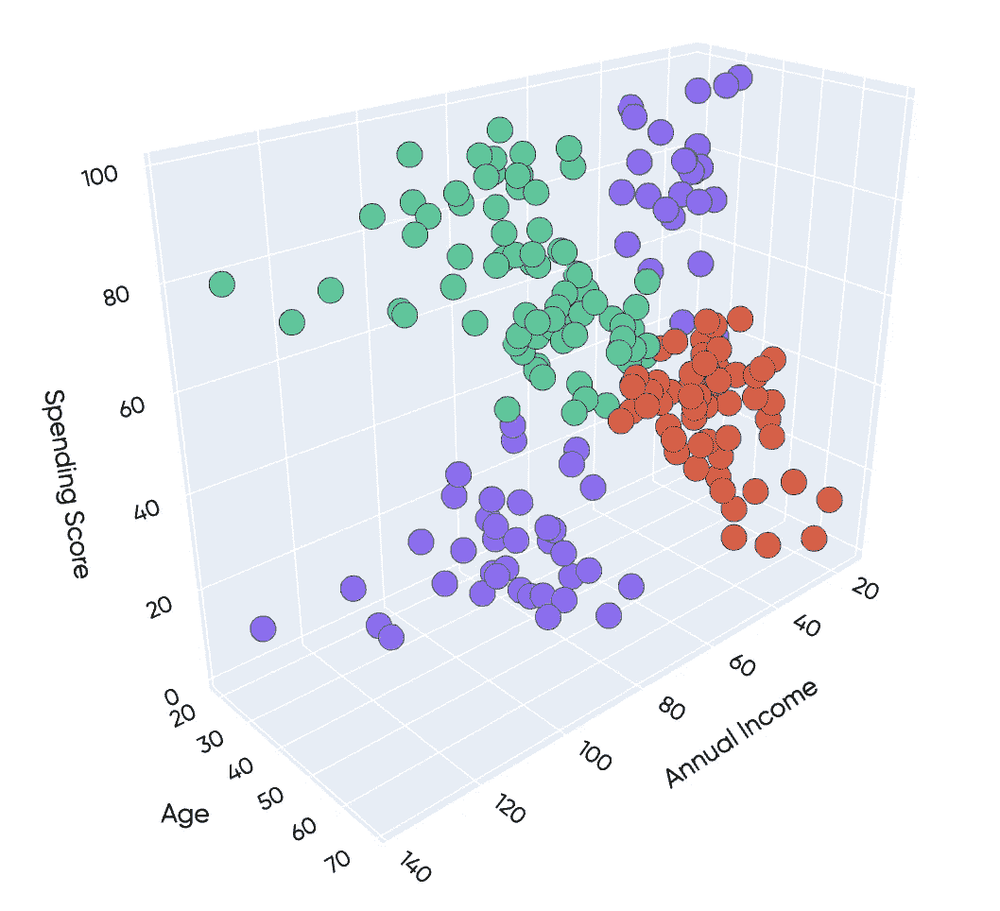

# 使用 Plotly 从聚类数据创建 3D 散点图。

> 原文：<https://medium.com/analytics-vidhya/creating-a-3d-scatter-plot-from-your-clustered-data-with-plotly-843c20b78799?source=collection_archive---------5----------------------->

你好。

今天我就从 *K-means 算法用 Python 实际实现来做一个快速补充。*如果您还没有机会阅读它，您可以在下面找到它:

 [## K-means 算法的实际实现

### 你好啊。

medium.com](/@rodrigodutcosky/k-means-algorithm-practical-implementation-1144d068d866) 

如果你把它记录下来，我们就对数据进行聚类，在某个时候，我们的数据帧被建模成这样:

**发现了四个**集群！

上一篇帖子，我没怎么讲剧情。尽管这可能是集群创建中最酷的部分。

在这篇文章中，我只想提出一个快速提示。我将使用 *plotly.graph_objects* 库来创建这个 3d 绘图。

***警告:*** *我们只输入了三个特征来训练我们的聚类模型。这给了我们足够的数据将这些家伙放在一个 3d 的尺度上。如果你在集群训练中使用了三个以上的特征，你需要应用一些降维技术。我可能会在以后的文章中更多地讨论这些类型的技术。*

从 *Plotly* 打印出一个 3d 散点图，你需要做的就是:

这不会把你的集群分开。但是我们在数据帧上也有聚类标签！

我们可以设置一个*循环*来分别将每个集群数据插入到绘图中。

对于*循环*迭代，我们基本上将过滤我们的数据帧，保留来自每个特定集群的所有行。

下面是我修改后的代码:

最后，循环结束后，我们可以随意添加一些布局。

您可以从 *Plotly* 的文档中检查布局更新的所有可能性。这里:

 [## Plotly Python 图形库

### Plotly 的 Python 图形库制作出交互式的、出版物质量的图形。如何制作线图的示例…

plotly.com](https://plotly.com/python/) 

## 创建 3D 散点图的完整 Python 代码

## 决赛成绩

希望你喜欢这个快速提示，下次再见！