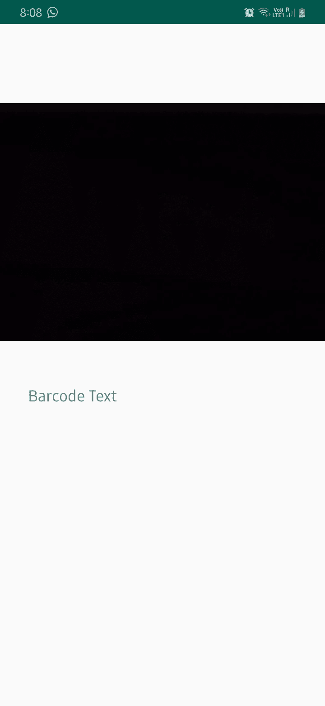
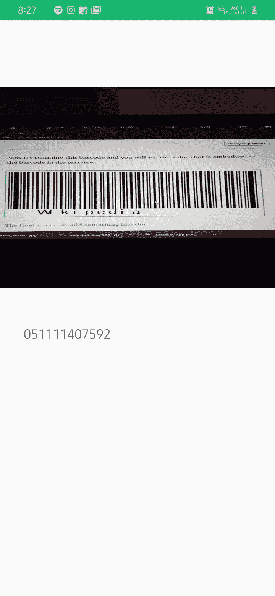

# 使用 Android Studio 创建条形码扫描仪

> 原文：<https://medium.com/analytics-vidhya/creating-a-barcode-scanner-using-android-studio-71cff11800a2?source=collection_archive---------1----------------------->

使用 Android Studio 构建条形码扫描应用程序的分步指南。

# 这篇文章是关于什么

本文将指导您创建一个 android 应用程序，您可以使用移动相机扫描条形码并读取其中的数据。

## 先决条件

1.  安装了最新版本的 Android Studio。([从此处下载](https://developer.android.com/studio))
2.  测试应用程序的移动设备。(你可以使用内置的 android 模拟器，但在一些电脑上，它可能会导致一些问题。)
3.  java 或任何面向对象编程语言的知识。

## 让我们写一些代码

1.  在 android studio 中创建一个新的应用程序，并将其命名为条形码扫描仪。
2.  打开你的应用程序级 Gradle 文件，在那里添加下面的依赖项。

```
implementation 'com.google.android.gms:play-services-vision:11.0.2'
```

3.现在点击“立即同步”按钮，等待构建完成。构建完成后，打开您的清单文件并添加必要的权限。

```
<uses-permission android:name="android.permission.CAMERA" />
<uses-permission android:name="android.permission.INTERNET" />
```

此外，在清单文件中添加元数据字段，位于应用程序标记内，活动标记之上。

```
<meta-data
    android:name="com.google.android.gms.vision.DEPENDENCIES"
    android:value="barcode" />
```

这是我的清单文件的完整视图

```
<?xml version="1.0" encoding="utf-8"?>
<manifest xmlns:android="http://schemas.android.com/apk/res/android"
    xmlns:tools="http://schemas.android.com/tools"
    package="com.example.barcodescanner">

    <uses-permission android:name="android.permission.CAMERA" />
    <uses-permission android:name="android.permission.INTERNET" />

    <uses-feature
        android:name="android.hardware.camera"
        android:required="true" />

    <application
        android:allowBackup="true"
        android:icon="@mipmap/ic_launcher"
        android:label="@string/app_name"
        android:roundIcon="@mipmap/ic_launcher_round"
        android:supportsRtl="true"
        android:theme="@style/AppTheme"
        tools:ignore="GoogleAppIndexingWarning">

        <!--<provider
            &lt;!&ndash;android:name="androidx.core.content.FileProvider"
            android:authorities="com.example.barcodescanner.fileprovider"
            android:exported="false"
            android:grantUriPermissions="true">&ndash;&gt;

        </provider>-->
    <meta-data
        android:name="com.google.android.gms.vision.DEPENDENCIES"
        android:value="barcode" />

        <activity android:name=".MainActivity">
            <intent-filter>
                <action android:name="android.intent.action.MAIN" />

                <category android:name="android.intent.category.LAUNCHER" />
            </intent-filter>
        </activity>
    </application>

</manifest>
```

4.现在，您已经设置了条形码扫描仪工作所需的所有依赖项和所有必要的权限。让我们为应用程序构建 UI。

5.打开 activity_main.xml 文件，并在其中编写以下代码。

```
<?xml version="1.0" encoding="utf-8"?>
<androidx.constraintlayout.widget.ConstraintLayout xmlns:android="http://schemas.android.com/apk/res/android"
    xmlns:app="http://schemas.android.com/apk/res-auto"
    xmlns:tools="http://schemas.android.com/tools"
    android:layout_width="match_parent"
    android:layout_height="match_parent"
    tools:context=".MainActivity">

    <SurfaceView
        android:id="@+id/surface_view"
        android:layout_width="match_parent"
        android:layout_height="300dp"
        app:layout_constraintTop_toTopOf="parent"
        app:layout_constraintLeft_toLeftOf="parent"
        app:layout_constraintRight_toRightOf="parent"
        android:layout_marginTop="100dp"
        />

    <TextView
        android:id="@+id/barcode_text"
        android:layout_width="match_parent"
        android:layout_height="50dp"
        android:layout_marginLeft="30dp"
        android:layout_marginRight="30dp"
        app:layout_constraintTop_toBottomOf="@id/surface_view"
        android:layout_marginTop="50dp"
        android:text="Barcode Text"
        android:textSize="25sp"
        android:padding="5dp"/>

</androidx.constraintlayout.widget.ConstraintLayout>
```

现在你的视图应该看起来像这样



这里我们有一个在 android 中称为 sufaceview 的东西和一个 textview 字段来显示条形码扫描的文本。

SurfaceView:它提供了一个嵌入在视图层次结构中的专用绘图表面。

您已经完成了条形码应用程序的 UI 代码，现在让我们编写 java 代码来创造奇迹。

6.打开 MainActivity.java 文件，你会看到下面的代码。

```
public class MainActivity extends AppCompatActivity {
@Override
protected void onCreate(Bundle savedInstanceState) {
    super.onCreate(savedInstanceState);
    setContentView(R.layout.*activity_main*);
}
```

让我们添加一些我们自己的代码

7.首先，我们需要绑定视图。

```
public class MainActivity extends AppCompatActivity {

    private SurfaceView surfaceView;
    private BarcodeDetector barcodeDetector;
    private CameraSource cameraSource;
    private static final int *REQUEST_CAMERA_PERMISSION* = 201;
    //This class provides methods to play DTMF tones
    private ToneGenerator toneGen1;
    private TextView barcodeText;
    private String barcodeData;

    @Override
    protected void onCreate(Bundle savedInstanceState) {
        super.onCreate(savedInstanceState);
        setContentView(R.layout.*activity_main*);
        toneGen1 = new ToneGenerator(AudioManager.*STREAM_MUSIC*,     100);
        surfaceView = findViewById(R.id.*surface_view*);
        barcodeText = findViewById(R.id.*barcode_text*);
    }
```

8.现在我们将编写方法来扫描图像中的条形码。

```
private void initialiseDetectorsAndSources() {

    //Toast.makeText(getApplicationContext(), "Barcode scanner started", Toast.LENGTH_SHORT).show();

    barcodeDetector = new BarcodeDetector.Builder(this)
            .setBarcodeFormats(Barcode.*ALL_FORMATS*)
            .build();

    cameraSource = new CameraSource.Builder(this, barcodeDetector)
            .setRequestedPreviewSize(1920, 1080)
            .setAutoFocusEnabled(true) //you should add this feature
            .build();

    surfaceView.getHolder().addCallback(new SurfaceHolder.Callback() {
        @Override
        public void surfaceCreated(SurfaceHolder holder) {
            try {
                if (ActivityCompat.*checkSelfPermission*(MainActivity.this, Manifest.permission.*CAMERA*) == PackageManager.*PERMISSION_GRANTED*) {
                    cameraSource.start(surfaceView.getHolder());
                } else {
                    ActivityCompat.*requestPermissions*(MainActivity.this, new
                            String[]{Manifest.permission.*CAMERA*}, *REQUEST_CAMERA_PERMISSION*);
                }

            } catch (IOException e) {
                e.printStackTrace();
            }

        }

        @Override
        public void surfaceChanged(SurfaceHolder holder, int format, int width, int height) {
        }

        @Override
        public void surfaceDestroyed(SurfaceHolder holder) {
            cameraSource.stop();
        }
    });

    barcodeDetector.setProcessor(new Detector.Processor<Barcode>() {
        @Override
        public void release() {
            // Toast.makeText(getApplicationContext(), "To prevent memory leaks barcode scanner has been stopped", Toast.LENGTH_SHORT).show();
        }

        @Override
        public void receiveDetections(Detector.Detections<Barcode> detections) {
            final SparseArray<Barcode> barcodes = detections.getDetectedItems();
            if (barcodes.size() != 0) {

                barcodeText.post(new Runnable() {

                    @Override
                    public void run() {

                        if (barcodes.valueAt(0).email != null) {
                            barcodeText.removeCallbacks(null);
                            barcodeData = barcodes.valueAt(0).email.address;
                            barcodeText.setText(barcodeData);
                            toneGen1.startTone(ToneGenerator.*TONE_CDMA_PIP*, 150);
                        } else {

                            barcodeData = barcodes.valueAt(0).displayValue;
                            barcodeText.setText(barcodeData);
                            toneGen1.startTone(ToneGenerator.*TONE_CDMA_PIP*, 150);

                        }
                    }
                });

            }
        }
    });
}
```

这个方法将帮助我们在 XML 文件中创建的 textview 中扫描和显示文本。

9.完整的 java 代码将如下所示。

```
package com.example.barcodescanner;

import androidx.appcompat.app.AppCompatActivity;
import androidx.core.app.ActivityCompat;

import android.Manifest;
import android.content.pm.PackageManager;
import android.media.AudioManager;
import android.media.ToneGenerator;
import android.os.Bundle;
import android.util.SparseArray;
import android.view.SurfaceHolder;
import android.view.SurfaceView;
import android.widget.TextView;

import com.google.android.gms.vision.CameraSource;
import com.google.android.gms.vision.Detector;
import com.google.android.gms.vision.barcode.Barcode;
import com.google.android.gms.vision.barcode.BarcodeDetector;

import java.io.IOException;

public class MainActivity extends AppCompatActivity {

    private SurfaceView surfaceView;
    private BarcodeDetector barcodeDetector;
    private CameraSource cameraSource;
    private static final int *REQUEST_CAMERA_PERMISSION* = 201;
    private ToneGenerator toneGen1;
    private TextView barcodeText;
    private String barcodeData;

    @Override
    protected void onCreate(Bundle savedInstanceState) {
        super.onCreate(savedInstanceState);
        setContentView(R.layout.*activity_main*);
        toneGen1 = new ToneGenerator(AudioManager.*STREAM_MUSIC*, 100);
        surfaceView = findViewById(R.id.*surface_view*);
        barcodeText = findViewById(R.id.*barcode_text*);
        initialiseDetectorsAndSources();
    }

    private void initialiseDetectorsAndSources() {

        //Toast.makeText(getApplicationContext(), "Barcode scanner started", Toast.LENGTH_SHORT).show();

        barcodeDetector = new BarcodeDetector.Builder(this)
                .setBarcodeFormats(Barcode.*ALL_FORMATS*)
                .build();

        cameraSource = new CameraSource.Builder(this, barcodeDetector)
                .setRequestedPreviewSize(1920, 1080)
                .setAutoFocusEnabled(true) //you should add this feature
                .build();

        surfaceView.getHolder().addCallback(new SurfaceHolder.Callback() {
            @Override
            public void surfaceCreated(SurfaceHolder holder) {
                try {
                    if (ActivityCompat.*checkSelfPermission*(MainActivity.this, Manifest.permission.*CAMERA*) == PackageManager.*PERMISSION_GRANTED*) {
                        cameraSource.start(surfaceView.getHolder());
                    } else {
                        ActivityCompat.*requestPermissions*(MainActivity.this, new
                                String[]{Manifest.permission.*CAMERA*}, *REQUEST_CAMERA_PERMISSION*);
                    }

                } catch (IOException e) {
                    e.printStackTrace();
                }

            }

            @Override
            public void surfaceChanged(SurfaceHolder holder, int format, int width, int height) {
            }

            @Override
            public void surfaceDestroyed(SurfaceHolder holder) {
                cameraSource.stop();
            }
        });

        barcodeDetector.setProcessor(new Detector.Processor<Barcode>() {
            @Override
            public void release() {
                // Toast.makeText(getApplicationContext(), "To prevent memory leaks barcode scanner has been stopped", Toast.LENGTH_SHORT).show();
            }

            @Override
            public void receiveDetections(Detector.Detections<Barcode> detections) {
                final SparseArray<Barcode> barcodes = detections.getDetectedItems();
                if (barcodes.size() != 0) {

                    barcodeText.post(new Runnable() {

                        @Override
                        public void run() {

                            if (barcodes.valueAt(0).email != null) {
                                barcodeText.removeCallbacks(null);
                                barcodeData = barcodes.valueAt(0).email.address;
                                barcodeText.setText(barcodeData);
                                toneGen1.startTone(ToneGenerator.*TONE_CDMA_PIP*, 150);
                            } else {

                                barcodeData = barcodes.valueAt(0).displayValue;
                                barcodeText.setText(barcodeData);
                                toneGen1.startTone(ToneGenerator.*TONE_CDMA_PIP*, 150);

                            }
                        }
                    });

                }
            }
        });
    }

    @Override
    protected void onPause() {
        super.onPause();
        getSupportActionBar().hide();
        cameraSource.release();
    }

    @Override
    protected void onResume() {
        super.onResume();
        getSupportActionBar().hide();
        initialiseDetectorsAndSources();
    }

}
```

现在尝试扫描这个条形码，您将在 textview 中看到条形码中嵌入的值。


最终的屏幕应该是这样的。



# 谢谢你。