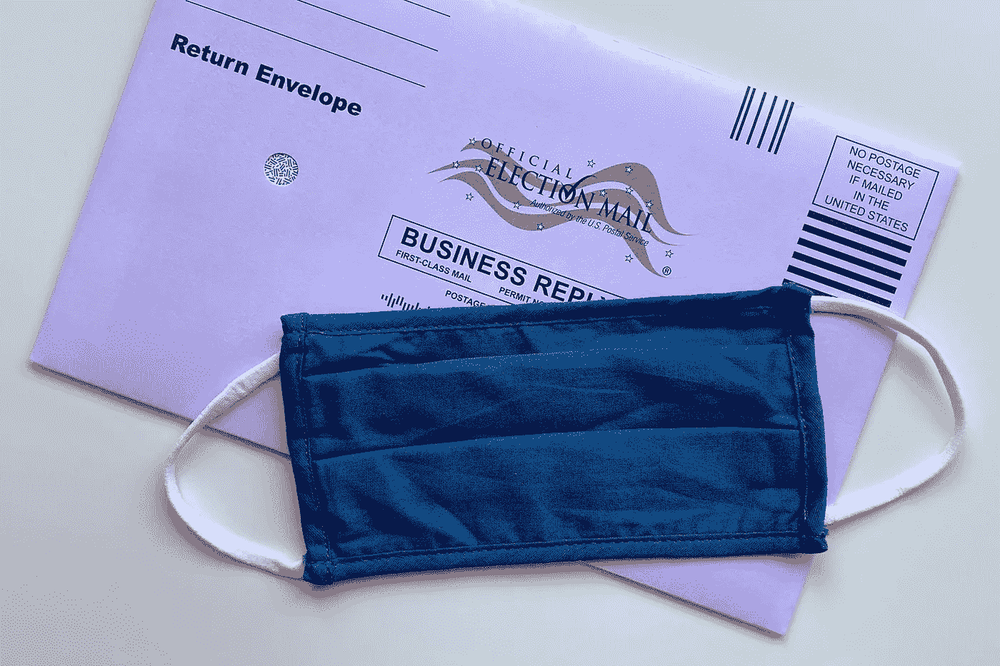

# 创建二元分类器来预测总统选举中合格选民的参与

> 原文：<https://medium.com/analytics-vidhya/creating-a-binary-classifier-to-predict-eligible-voter-participation-in-presidential-elections-9e882fc5da51?source=collection_archive---------20----------------------->

## 使用 2018 年综合社会调查的结果

照片由[蒂芙尼·特里普斯](https://unsplash.com/@tiffanytertipes?utm_source=unsplash&utm_medium=referral&utm_content=creditCopyText)在 [Unsplash](https://unsplash.com/s/photos/voting-ballot?utm_source=unsplash&utm_medium=referral&utm_content=creditCopyText) 拍摄

# 介绍

即将到来的总统选举被广泛认为是美国近代史上最重要的选举之一。选民外联组织正在不知疲倦地工作，以确保高投票率，特别是在与新冠肺炎疫情有关的新的压制选民的关切中。过去的研究表明，教育、财富和职业等社会经济变量是投票率的强有力预测因素。在这篇文章中，我将介绍我如何使用综合社会调查(GSS)的最新数据建立一个二元分类器来预测选民的参与。具体来说，该模型的目标将是预测受访者*是否没有在 2016 年总统选举中投票。*

预测合格选民是否没有投票的能力可用于增加未来选举中的总体投票率。值得注意的是，任何旨在预测人类行为的模型都有内在的局限性，因为个人的态度、动机和环境会在特定时期内发生变化，尤其是在整个总统任期内。此外，对于投票的价值和效力有各种不同的看法，一些有资格的选民可能会在原则上弃权。该项目并不假设每个非投票者都可以或应该选择投票，而是旨在为有意识别潜在非投票者的投票者参与组织提供指导。

# **对数据进行清理和编码**

对于这个数据集，我选择了与受访者的社会经济地位、政治身份和态度以及参与 2012 年和 2016 年选举有关的变量。我删除了带有“不适用”和“不知道”等回答的行，还排除了没有资格投票的受访者的数据。如果超过三分之一的列包含丢失的数据，我将删除该列。

在编码之前，几乎所有的数据都是分类的:

我进行了两种数字编码:

*   **二进制编码:**对于只有两个值的变量，取值‘0’和‘1’。零表示“不”缺席，而“1”表示“是”出席。
*   **整数编码:**对应于一个值在一个标度上的级别的整数值。

幸运的是，所有的特性都可以转换成兼容二进制编码或数字标度。我编写了以下函数来编码每个特性:

这里有一个例子，我是如何用它把“父亲的最高学历”变量转换成二进制变量“父亲上过大学”

对每一列重复这个过程(或者在适当的时候使用`pandas.get_dummies`),我得到了一个只包含整数值的数据帧:

在这个最终的数据集中，有 18 列来自 1，083 名受访者的数据。

# 探索性分析

变量的相关矩阵显示，总体而言，相关性比预期的要弱。相关性未超过 0.75:

我有兴趣了解与 2016 年投票最相关的变量在每个阶层中的选民比例。下面的 helper 函数使用提供的列中的唯一值创建一个字典，并计算投票者的百分比。

然后，我可以将这个函数插入另一个函数`plot_voter_perc`，给定一个列和绘图标签，它会生成一个选民百分比的绘图。

我使用函数创建了以下条形图:

在这些变量中，有一个明显的线性模式:投票率随着受访者年龄和教育水平的增加而增加。上层和中产阶级选民的投票率高于下层或工人阶级，自由派和保守派的投票率高于温和派。或许最有趣的是，2012 年投票者中也在 2016 年投票的比例极高。

# 建立和优化模型

我对数据测试了几种分类器类型，包括逻辑回归、随机森林和梯度推进。其中，随机森林分类器的性能最好。我首先将数据分为训练集和测试集:

自变量的类别相当不平衡，大多数受访者报告说他们在 2016 年投票:

当试图预测少数类的实例时，总体准确性不是衡量分类器性能的最佳指标。模型可以预测 100%的回答者投票，并且仍然具有相对较高的准确度分数。相反，模型性能是根据**召回**或**真实阳性率**来评估的。在这种情况下，真正的肯定将意味着该模型正确地分类了在 2016 年*没有*投票的受访者。

在导入正确的依赖关系并将每个模型与数据拟合后，我编写了一个函数，在模型的准确度、召回率、精确度和 F1 分数旁边绘制一个混淆矩阵。

默认模型有一个失败的回忆分数，因为，由于不平衡的类，它预测所有的回答者投票:

为了改进模型，我使用了`RandomizedSearchCV`，它将一个估计器和一个参数网格作为参数。它对传入的参数执行非穷举的随机搜索，并返回具有最佳性能的模型。

上面的代码给了我以下改进的混淆矩阵:

虽然 0.74 的正确率并不惊人，但这比随机猜测好得多。该模型正确预测了 2016 年没有投票的 79 名受访者中的 59 名。下面的 ROC 曲线显示了与经过训练和优化的其他模型相比，该模型的表现如何:

# 结论

随机森林模型具有最高的 AUC 和与逻辑回归相关的回忆分数，是总体上表现最好的分类器。

受访者参与 2012 年选举似乎是 2016 年选举投票的最强预测因素，这表明过去的投票行为可能会预测合格选民参与未来的选举。政治身份也是一个强有力的预测因素:认为自己是保守派或自由派的受访者比温和派更有可能投票。投票率似乎也与年龄呈线性正相关。

考虑到这些情况，寻求通过吸引潜在的非投票者来增加投票率的组织应该优先考虑那些在过去的选举中没有投票的人、年轻选民和政治温和派。

完整代码可在 [GitHub](https://github.com/AvonleaFisher/dsc-mod-3-project-v2-1-onl01-dtsc-ft-070620) 上获得。注意:自本文撰写以来，对 GitHub 存储库中的上述代码做了一些小的修改，但是随机森林分类器仍然是性能最好的模型。