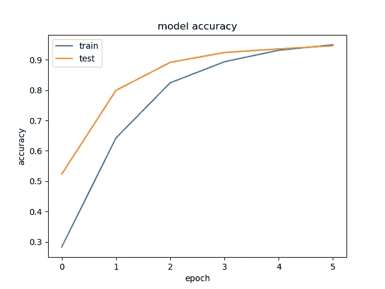
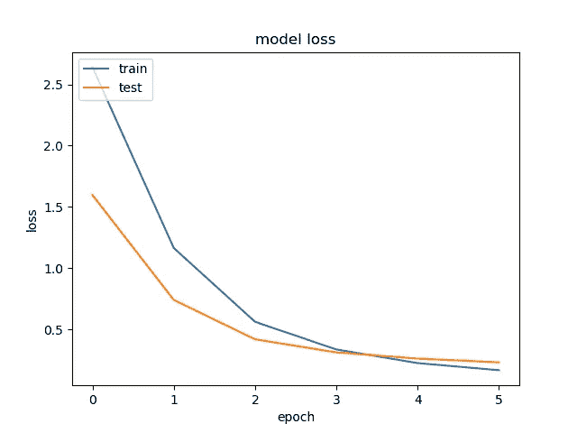
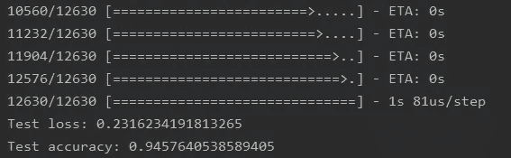

# 使用 Keras for GTSRB 创建 CNN

> 原文：<https://medium.com/analytics-vidhya/creating-a-cnn-using-keras-for-gtsrb-c67e647fb9ca?source=collection_archive---------18----------------------->

我创建了一个 CNN 模型 GTRSB 数据集，你可以在 kaggle 上查看一下这里:[https://www . ka ggle . com/meowmeowmeowmeowm/gt SRB-german-traffic-sign](https://www.kaggle.com/meowmeowmeowmeowmeow/gtsrb-german-traffic-sign)。

**上下文:**gt SRB 数据集是一个数据集，它是多类分类算法的众多基准之一。它由 43 个类别组成，每个类别都是一个不同的路标。CNN 的目标是对这些图像进行高精度分类。

在本文中，我将描述我的方法、代码和数据集的结果。

# 我的方法

1.  **检查数据:**看了 20 分钟的数据后，我发现不需要图像放大。这是因为每个类都有大量的数据来训练我的模型。此外，训练集在用于每个类别的图片类型方面有很好的差异(一些图片比其他图片有更多的模糊和噪声)。由于我的数据的性质，这里不需要数据扩充，所以我可以继续下一步。
2.  创建我的训练和测试集:我使用给定的数据创建了我的训练和测试集。我的输出(Y)是图像的标签(它的类),我的输入(X)是图像的数组表示。通过检查数据，我发现在 dataset 文件夹中已经有了单独的训练集和测试集，因此我不需要将我的数据分成训练测试比。集合的顺序并不重要，因为当我们稍后将数据拟合到我们的模型时，我们会对数据进行洗牌。
3.  **定义模型的架构:**我创建了 CNN 模型的架构。这种架构是定制的，因为我发现它在许多其他简单的图像任务中工作得很好，比如 GTSRB。然而，这取决于你想要什么，因为有许多不同的架构，如 VGG，AlexNet 和 YOLO。但是不管你用什么架构，最后一层一定是输出神经元数等于类数的密集层。
4.  **设置超参数后，将数据拟合到模型中，等待结果！**

# 创建训练集和测试集:

**第一步:导入**

```
#import tensorflow as tf (This depends on how you want to configure your GPU
from keras.models import Sequential, save_model
from keras.layers import Conv2D, MaxPool2D, MaxPooling2D, Dense, Dropout, Activation, Flatten
import keras.layers
import cv2 as cv
import matplotlib.pyplot as plt
import numpy as np
import pandas as pd
import os
```

我在代码的开头导入了预处理和模型初始化所需的所有库。我知道 TensorFlow 为本地 GPU 提供了一些定制功能，因此如果您愿意，您可以导入并配置这些功能。

**步骤 2:创建训练和测试集**

```
train_X = []
train_y = []for i in range(0,43):
    n = str(i)
    train_Path = "gtsrb-german-traffic-sign/Train/" + n
    label = [0 for i in range(0, 43)]
    label[i] = 1
    for filename in os.listdir(train_Path):
        img = cv.imread(train_Path + "/" + filename)
        img = cv.resize(img, (28,28))
        print(filename)
        train_X.append(img)
        train_y.append(label)train_X = np.asarray(train_X)
train_X = train_X/255
train_X = np.asarray(train_X, dtype = "float32")
train_y = np.asarray(train_y, dtype= "float32")
```

我遍历了所有的文件夹，并添加了(N，K，3)维图像的数组表示，其中 N 和 K 可以根据图像的大小而变化。此外，我创建了一个长度为 43(有 43 个类)的零数组，并将对应于图像类的索引转换为 1。因为数据集是零索引的，所以我可以简单地将相应的索引更新到图像的类。最后，我将数组从 uint8 转换为 float32 的 dtype。我这样做是因为对于训练模型来说，这是一个相对安全的数据类型，但是，我事先将我的值缩放了 255，以避免在类型转换期间搞砸我的图片。我还将我的图像大小调整为 28x28，因为训练集中的所有图像都有不同的大小，但没有一个小于 28x28。因此，为了最大限度地减少功能损失，这些是调整大小的最佳尺寸。

```
counter = 0
test_X = []
test_y = []
test_Path = "gtsrb-german-traffic-sign/Test"
for filename in os.listdir(test_Path):
        img = cv.imread(test_Path + "/" + filename)
        img = cv.resize(img, (28,28))
        label = [0 for i in range(0, 43)]
        #6 is the column # within the .CSV file        label[df.loc[counter][6]] = 1
        print(filename)
        test_X.append(img)
        test_y.append(label)
        counter += 1test_X = np.asarray(test_X)
test_X = test_X/255
test_X = np.asarray(test_X, dtype = "float32")
test_y = np.asarray(test_y, dtype= "float32")
```

我使用了与上面相同的逻辑来创建我的测试集，但是我必须使用一点 pandas。loc 方法)来遍历. CSV 文件中代表每张图片的类别的一列，以创建我的标签。

**第三步:创建模型**

```
model = Sequential()
model.add(Conv2D(32, (3, 3), padding='same',
                 input_shape=train_X.shape[1:]))
model.add(Activation('relu'))
model.add(Conv2D(32, (3, 3)))
model.add(Activation('relu'))
model.add(MaxPooling2D(pool_size=(2, 2)))
model.add(Dropout(0.25))model.add(Conv2D(64, (3, 3), padding='same'))
model.add(Activation('relu'))
model.add(Conv2D(64, (3, 3)))
model.add(Activation('relu'))
model.add(MaxPooling2D(pool_size=(2, 2)))
model.add(Dropout(0.25))model.add(Flatten())
model.add(Dense(392))
model.add(Activation('relu'))
model.add(Dropout(0.5))
model.add(Dense(43))
model.add(Activation('softmax'))
```

我为这个任务创建了一个简单的 CNN。我混合使用了卷积层和池层，以减少我需要插入到密集网络中的数据量，并减少了一些丢弃以防止过度拟合。我不会在这篇文章中详细介绍这是如何工作的，但如果你不明白发生了什么，那么这是一篇非常好的直觉文章:[https://adventuresinmachinehlearning . com/keras-tutorial-CNN-11-lines/](https://adventuresinmachinelearning.com/keras-tutorial-cnn-11-lines/)

**第四步:初始化一些超参数，训练模型**

```
opt = keras.optimizers.rmsprop(lr=0.0001, decay=1e-6)
model.compile(loss='categorical_crossentropy',
              optimizer=opt,
              metrics=['accuracy'])history = model.fit(train_X, train_y,
              batch_size= 16,
              epochs= 6,
              validation_data= (test_X, test_y),
              shuffle=True)
```

对于这个任务，我使用 RMSprop，学习率为 0.0001，分类交叉熵表示我的损失。我想使用准确性作为衡量标准，因为它有助于我更好地理解我的模型的性能。

**结果**

运行完模型后，我最后的准确率达到了 94%，这就可以了。



随着时间的推移，使用 matplotlib 来提高我的准确性



一个使用 matplotlib 的可视化工具来弥补我的损失



如你所见，我的模型收敛得很好，精度也很高。为了改进它，我可以尝试使用 Adam optimizer 而不是 RMSprop，或者通过减少我的 Conv 图层并增加大小或添加更密集的图层来保留更多功能，从而使我的模型更深入。

**我从我的项目中学到了什么:**

*   当我查看数据集时，我不认为我的 CNN 能够区分具有相同标志形状但标志上不同数字代表速度限制的图像。原来 CNN 比我想象的厉害多了！
*   我还学习了如何使用 *OS* 包遍历文件。我以前使用常规的字符串操作来遍历文件，但事实证明 OS 包使这项工作变得容易得多。

感谢阅读我的文章！如果我在某个地方犯了错误，或者如果我在某些方面可以改进，请随时给我一些建议或批评。我只是一名高中生，所以我有很多成长和犯错的空间。如果您有任何问题或需要澄清，我邀请您在下面发表评论。