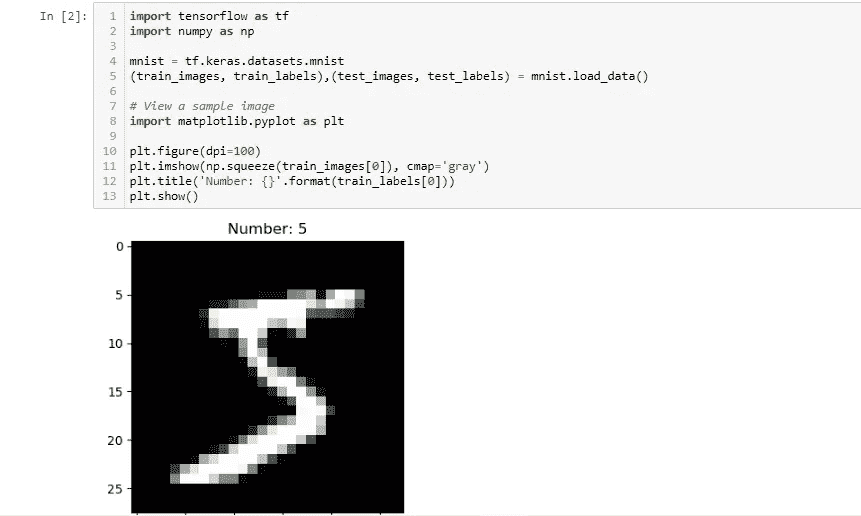
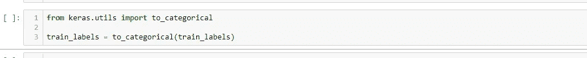
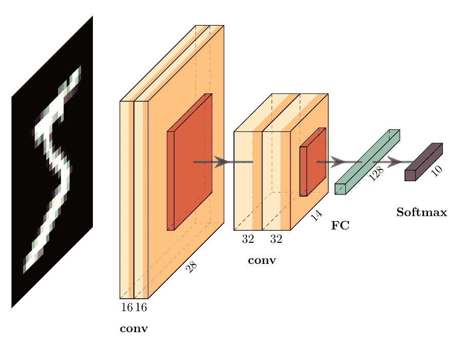
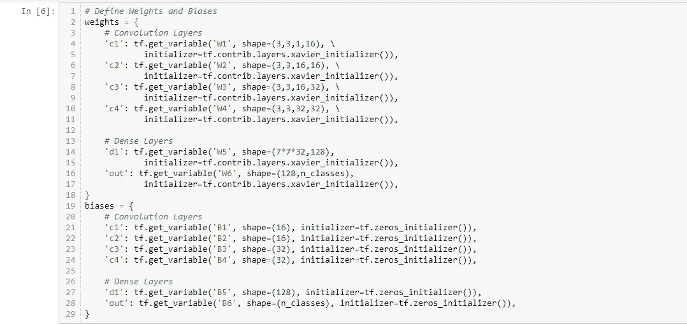
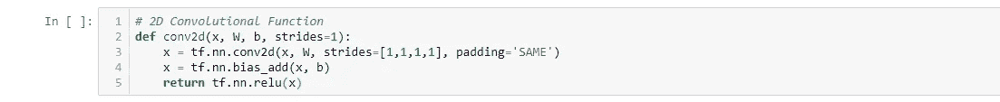
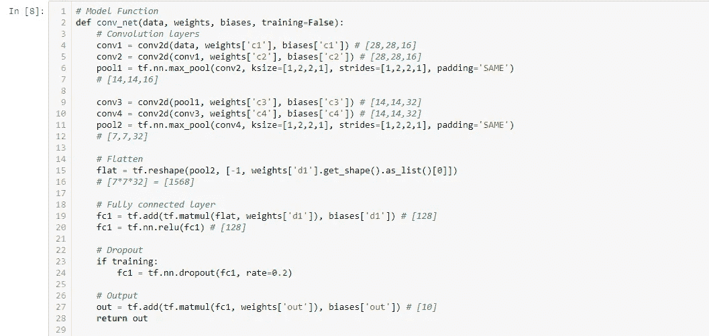
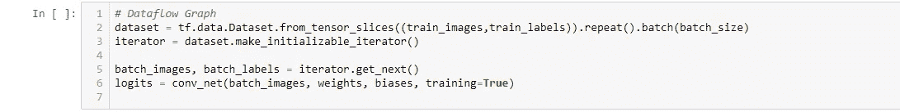
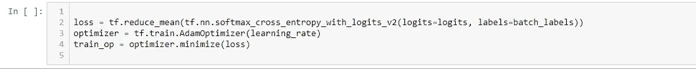
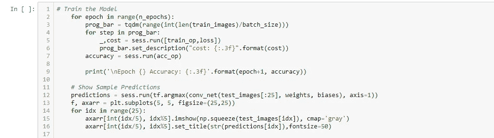
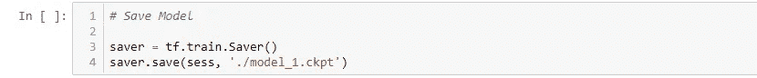

# 在张量流中创建自定义卷积神经网络

> 原文：<https://medium.com/analytics-vidhya/creating-a-custom-convolutional-neural-network-in-tensor-flow-a9b29ae9fcf9?source=collection_archive---------7----------------------->

在这里，我们将了解如何使用低级张量流来创建卷积神经网络(Conv 网)模型，而无需 Keras 之类的高级 API。在这方面，我们知道深层神经网络的背景过程，以及如何使用张量流来创建自定义代码。

为了更好地理解，我们采取了 MNIST 手写数字数据集。

在这一点上我们看到

1.  MNIST 数据集
2.  ConvNet 模型
3.  卷积层
4.  模型图
5.  构建 ConvNet 图
6.  损失和优化
7.  训练和测试模型
8.  保存模型
9.  **MNIST 数据集**

它是 60，000 个 0 到 9 之间的手写单个数字的小正方形 28×28 像素灰度图像的数据集。任务是将一个给定的手写数字图像分成 10 类，代表从 0 到 9 的整数值。

加载 MNIST 数据集并查看样本图像。

标签是整数值(如 0，1，2)，但标签是分类值，因此需要对它们进行一次性编码(如[1，0，0]，[0，1，0]，[0，0，1])，以便进行训练。Keras 有一个编码器 to _ categorical，我将用它来转换标签。

**2。ConvNet 型号**

该架构有四个卷积层。前两层有 16 个滤镜，后两层有 32 个滤镜，所有滤镜的尺寸都是 **3x3** 。四个卷积层中的每一层都添加了偏差和 relu 激活。最后两层是全连接(密集)层。

**3。权重和偏差**

ConvNet 中的初始权重需要是对称破缺的随机值，以便网络能够学习。xavier_initializer“旨在保持所有层中梯度的比例大致相同”，通常用于初始化模型的权重。

我们可以通过使用带有 tf.get_variable 的初始化器来创建层的权重。每个卷积层都有形状为[filter_height，filter_width，in_channels，out_channels]的过滤器。

**4。卷积层**

为了简化卷积层，我将创建一个函数，它采用输入数据 **x** 并应用权重为 **w** 的 2D 卷积，添加一个偏差 **b** ，并使用 relu 激活。

**5。模型图**

另一个函数可以用来制作模型图。这将把 MNIST 图像作为**数据**接收，并使用不同层中的权重和偏差。

6。构建 ConvNet 图

接下来，我们可以构建将用于训练模型的数据流图。

7。损失&优化器

损失可以通过 softmax 的交叉熵来计算。这些都可以使用 TensorFlow 的 softmax 交叉熵一步完成。由于我们正在测量一批图像的损失，我们可以使用 **tf.reduce_mean** 来获得该批图像的平均损失。

在这里，我使用的是学习率为 **1e-4** 的**亚当**优化器。然后计算梯度，并通过运行 minimize 方法来更新权重。

**8。培训和测试模型**

通过在会话中调用 **train_op** ，图表中的所有步骤都将如上所述运行。我将使用 **tqdm** 查看每个时期的训练进度。在每个历元之后，测量精度并打印出来。

**9。保存模型**

可以使用 tf.train.Saver 将会话和模型图以及经过训练的权重和偏差保存为检查点。

