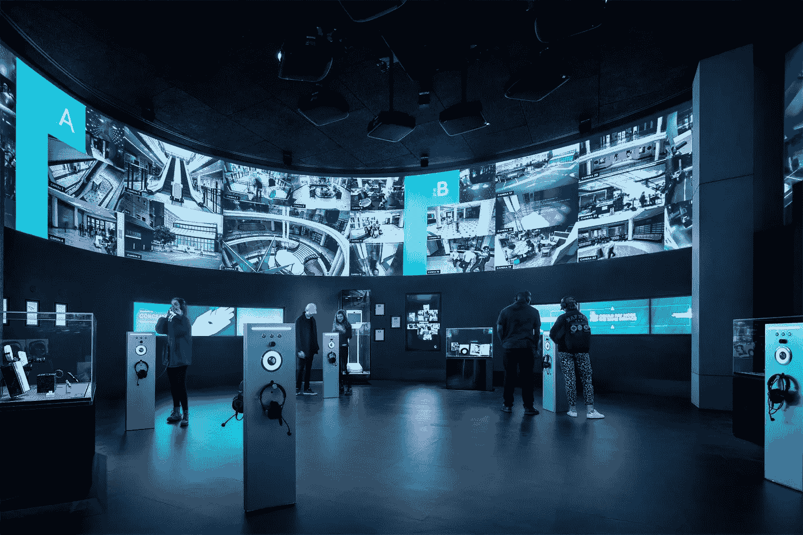
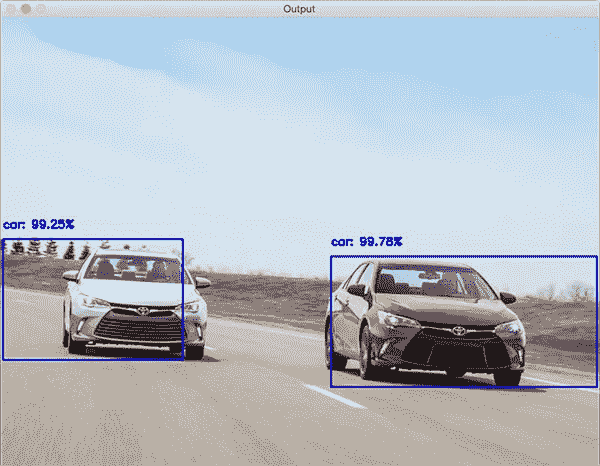
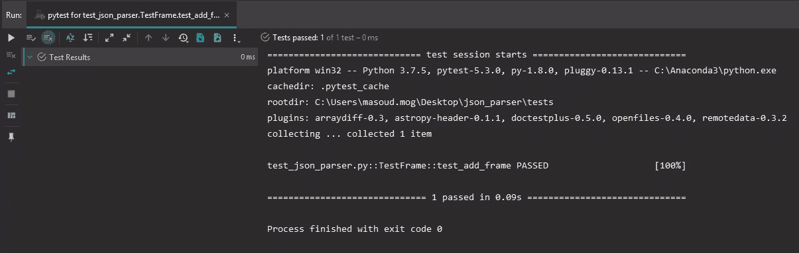
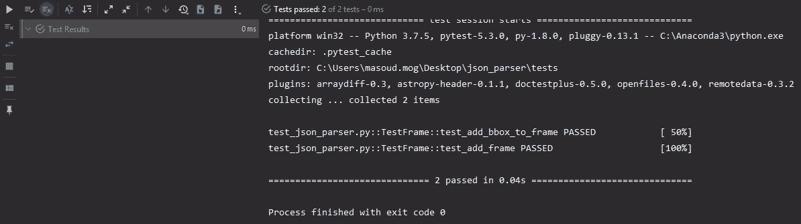
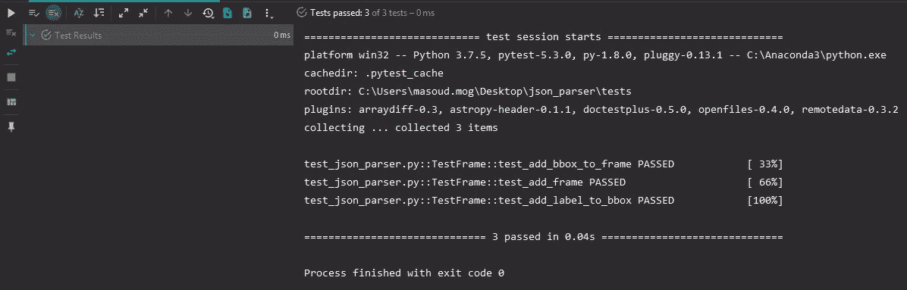
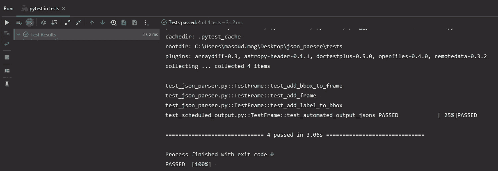
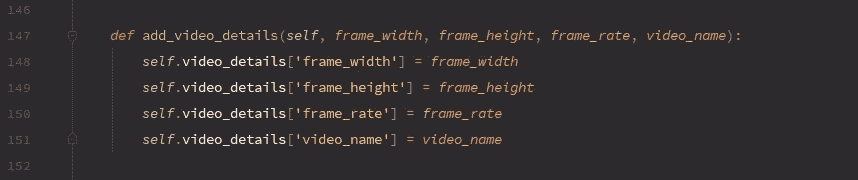

# 一种使用 TDD 创建实时对象检测日志机制的方法

> 原文：<https://medium.com/analytics-vidhya/creating-a-custom-logging-mechanism-for-real-time-object-detection-using-tdd-4ca2cfcd0a2f?source=collection_archive---------9----------------------->

原图:[https://www . architecture digest . com/story/David-adjaye-spy scape-spy-museum-opens-in-new-York](https://www.architecturaldigest.com/story/david-adjaye-spyscape-spy-museum-opens-in-new-york)

## 动机

最近，我有一个关于实时应用程序的项目，它从监控系统获取视频流作为输入，并返回在检测上绘制的边界框，以及将它们记录在 json 文件中。所以我想作为我在 medium 上的第一篇文章，这个简单的项目可能是一个好的开始。这样，我使用测试驱动开发来实现代码，所以我真的希望这篇文章对那些想熟悉 python 中的 unittest 工具的新手来说能派上用场。你可以查看[这个](https://github.com/masouduut94/json_logger_for_object_detection)链接获取源代码。在这个链接中你还可以找到一个物体检测案例的用法代码。物体检测代码属于阿德里安·罗斯布鲁克的[这篇](https://www.pyimagesearch.com/2020/02/10/opencv-dnn-with-nvidia-gpus-1549-faster-yolo-ssd-and-mask-r-cnn/?__s=ojnwchnsdmrtdosojsgp)棒极了的帖子，他是我的计算机视觉的伟大推动者之一。

## 描述系统

为了了解我们将要处理的内容，让我们仔细看看这个示例图像:

图 1:一帧中带有标签和置信度的检测包围盒。来源:[pyimageresearch.com](https://www.pyimagesearch.com/2017/09/11/object-detection-with-deep-learning-and-opencv/)

此图像显示了包含两个边界框的帧，每个边界框都有一个带有特定置信值的标签。因此，我们有一个帧列表，在每个帧中，有多个边界框，每个边界框都有一个带置信度的标签。通常，在任何对象检测中，都存在置信度较低的其他标签。我们可以让包围盒拥有一个标签列表，这些标签具有它们被分配的置信度。我们通过选择一个名为 top_k_label 的参数来做到这一点，我们希望所有的边界框都有完全相同数量的标签。

这是图 1 中的一个 json 文件示例，top_k_labels 等于 2。

`{
“video_details”: {
“frame_width”: 1080,
“frame_height”: 720,
“frame_fps”: 20,
“video_name”: “test.avi”
},
“frames”: [
{
“frame_id”: 1,
“bboxes”: [
{
“bbox_id”: “0”,
“labels”: [
{
“category”: “car”,
“confidence”: 99.25
},
{
“category”: “truck”,
“confidence”: 57.14
}
],
“left”: 5,
“top”: 400,
“width”: 250,
“height”: 145
},
{
“bbox_id”: “1”,
“labels”: [
{
“category”: “car”,
“confidence”: 99.78
},
{
“category”: “bus”,
“confidence”: 65.23
}],
“left”: 650,
“top”: 450,
“width”: 300,
“height”: 150
}]
}]`

我考虑了视频细节，它包含了视频文件的宽度、高度、fps 和名称等信息，以确保我们可以在必要时再次输入视频文件时重建边界框。

## 初始化

我从 3 个类开始编写基本代码，这 3 个类包含了框架、框和标签的基本信息。

框架的基本组件

为了管理输出，我创建了另一个类，并将其命名为`JsonParser`:

用 JsonParser 类管理组件

## 第一步:添加框架

好了，现在我们有了初始类，让我们使用 TDD 软件开发方法。我创建了另一个文件，命名为`test_json_parser`，然后把它放在`tests`文件夹中。

现在我们需要一个代码来测试简单地添加框架到`JsonParser.frames`。让我们用下面的代码初始化测试用例:

json_parser.py 上测试的初始化

我使用 pycharm 工具来测试代码。我添加`sys.path.append(../..)`的原因是，如果您的系统中没有 pycharm，我可以使用终端命令来运行测试。这是添加框架的测试:

测试简单框架插入

在这项测试中:

> 1-我们确保输出 json 包含输入中给定的帧号。
> 
> 2-如果插入了重复的帧号，我们预计会出现错误。
> 
> 注意`assertRaisesRegex`函数使用正则表达式来检查产生的错误消息。术语`(.*?)`是一个正则表达式，在这里我使用它是为了避免忽略句子`(Frame id:)`和`already exists`之间的任何内容。

现在让我们开发代码来通过这个测试。我们从`JsonParser`类开始。我给它增加了三个功能:

将这些函数添加到 JsonParser 类将通过测试

为了访问 python 中的每个类属性，通常我使用`__dict__()`函数。但是为了访问对象列表中的属性，比如类`Bbox`中的`labels`属性或者类`Frame`中的`bboxes`属性，我们需要做一些小技巧来使这些参数返回属性字典，而不是返回一堆对象。感谢[对我在 stackoverflow(如果这篇文章对你有用，请随意投票支持这个问题)中的问题的这个精彩回答](https://stackoverflow.com/a/60126384/6118987)，我创建了一个父类，它为类`Frame`、`Bbox`和`Label`添加了一个额外的属性。我给它取名为`BaseJsonParser`。我们将这个类设置为`Frame`、`Bbox`和`Label`类的父类。：

定义 BaseJsonParser 和' Label '、' Bbox '和' Frame '时，必须将其声明为父级。

> 当我们将 BaseJsonParser 设置为父类时，我们为继承该类的类设置了一个属性，即`dic`。这个属性将允许我们返回嵌套类中的属性。

让我们为``JsonParser``添加`output`函数并运行测试:

将此函数添加到“JsonParser”类中

现在我们运行`test_add_frame.py`功能:

测试通过！

## 步骤 2:添加边界框到每个框架

干得好！现在我们编写第二个测试，将 Bbox 添加到帧中:

现在，我们必须通过添加 bbox 的测试

好吧。在这里，我们需要:

> 1-为`JsonParser` 创建函数，在插入 bbox
> 之前检查 bbox 是否存在 2-创建函数，将 bbox 添加到`Frame` 和`JsonParser` 类的框架中。

现在我们将这些函数添加到`JsonParser`类中:

将这些添加到“JsonParser”中。

还有这个给`Frame` 上课:

为“框架”类添加 bbox 函数

现在让我们再次运行这两个测试:

## 步骤 3:向边界框添加标签

下一部分我们要测试给 bboxes 添加标签。我们需要测试的是这些东西:

> 1 —当我们设置`top_k_labels` 并向 bboxes 添加相同数量的标签时，我们希望添加它们时不会出现问题。
> 2 —插入标签超过`top_k_labels` 将被取消`ValueError`。
> 3——在输出 json 的过程中，我们希望程序检查边界框的标签数量是否与`top_k_labels` 允许的数量相同。

这是测试:

向 bbox 添加标签的测试

为了通过测试，我们必须:

> 1 —创建一个函数，在给定`frame_id` 和`bbox_id`
> 的帧中查找 bbox 列表中的 bbox 2—创建一个函数，为找到的 bbox 添加一个标签。
> 3 —添加到 bbox 的标签必须和`top_k_labels` 一样多。否则会引发错误。我们必须在输出帧时确保这一点。

我们在`JsonParser` 函数中增加`find_bbox` 函数:

JsonParser 中增加了 find_bbox 函数

然后我们在这里给`JsonParser` 添加`add_label_to_bbox` 功能:

如果 bbox 已经存在，将标签添加到 bbox

如你所见，bbox 必须有一个`add_label`函数。我添加了一个函数，如果标签号与 top_k 相同，该函数返回 true。我将其命名为`labels_full`:

我们更新了类“Bbox ”,增加了“add_label”和“labels_full”函数

输入中给定的`labels_full`的值将是`top_k`，我们已经在`JsonParser`中考虑过了。现在我们必须修改`JsonParser`中输出函数的代码:

修改 JsonParser 类中的输出函数

让我们再次运行整个测试:

运行所有的测试

## 最后一步:自动化 Json 输出

酷毙了。我们有我们的 JsonParser。现在，我们可以开发一个功能，帮助我们自动化保存 json 文件的整个过程。我想出的机制是这样的:

> 1 —我们设置了一个`interval` 参数，该参数可能在 1 秒到 5 小时之间，它将指示保存 json 文件的频率。
> 2 —我们在第一帧处理开始之前设置了一个开始时间。
> 3 —我们在循环中调用调度程序函数，为每一帧执行该过程。然后我们可以测量开始时间和当前时间之间的时间差。每当这个差值大于 time_to_save 参数时，我们就可以保存 json 文件。我们按照相应的时间戳保存文件。

让我们在另一个名为`test_scheduled_output.py`的文件中创建测试，并用以下内容初始化测试:

## 为什么是`mkdtemp`？

> `tempfile` 库中的`mkdtemp` 函数使用了系统中的一个临时目录，并创建了一个临时文件夹。我们使用该文件夹来保存 jsons，以便进行临时测试。

我需要这个过程花费超过 1 秒的时间来查看 json 是否会被自动保存。我不想在我的测试中使用视频，因为在单元测试中，更专业的做法是设计全面且运行更快的测试。所以我用时间库中的睡眠函数来模拟这个动作。

然后我们使用下面的代码通过测试:

添加 json_output 和 schedule_output

什么是`JsonMeta`？我使用`JsonMeta` 类的原因是我想为 schedule_output 函数中的所有参数设置限制。(例如，我不希望分钟或秒钟超过 59)。

让我们看看测试是否通过:

所有测试都通过了。万岁！！！！

最后，我们可以使用下面的函数向 json 添加视频细节:

## 对进一步工作的建议

好了，现在我们有了一个在实时监控系统中保存 jsons 的有用工具。实际上，我建议您添加以下功能:

1 —创建另一个能够分析 json 数据并从检测中发现见解的类。例如，找出特定的人通过监视摄像机的频率。

2-创建一个函数，该函数能够通过在视频帧上重建 bboxes 来返回视频中的检测，并显示结果

3-在物体检测代码上使用代码。

我已经对这篇文章中属于[的代码提出了第三个建议，这是一个由 Adrian rosebrock 创建的令人敬畏的快速对象检测代码。我在这里](https://www.pyimagesearch.com/2020/02/10/opencv-dnn-with-nvidia-gpus-1549-faster-yolo-ssd-and-mask-r-cnn/)上传了[的全部代码](https://github.com/masouduut94/json_logger_for_object_detection)