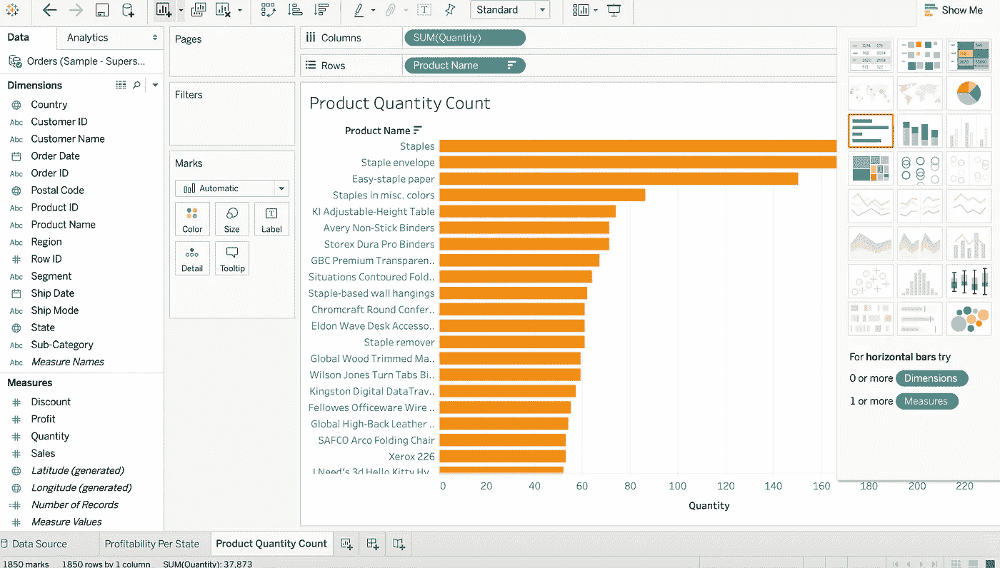

# 使用 Tableau Public 创建仪表板

> 原文：<https://medium.com/analytics-vidhya/creating-a-dashboard-with-tableau-public-2d01dce6a5bc?source=collection_archive---------0----------------------->

数据可视化是理解数据并能够清晰地交流见解的关键。这就是为什么许多公司利用像 Tableau 这样的数据可视化工具。

这是一个关于如何用 Tableau Public 构建仪表板的简单教程。

Tableau Public 是一个免费的应用程序，允许您构建数据可视化并将其发布到互联网上。你可以在这里创建一个 Tableau 公众账号并免费下载应用，[https://public.tableau.com/en-us/s/](https://public.tableau.com/en-us/s/)。

当你下载并打开 Tableau Public 后，你会看到一个类似这样的主屏幕。

Tableau 公共应用主页

对于本教程，将使用**样本——超市**数据集。在页面的左侧，您可以看到连接到数据的选项。要找到本教程中使用的数据集，您可以选择 **Microsoft Excel** 并找到标签为 **Sample-Superstore.xls** 的文件。

样品超市

在页面的左侧，您可以看到有三个不同的数据集，**订单**、**人员**和**返回**。要查看数据集，您只需将数据集从左侧拖放到屏幕的中上方，屏幕上会显示“将工作表拖放到此处”。我们要看的第一个数据集是**订单**表。

然后，您可以预览数据集，从中我们可以看到单个订单的信息。数据集列包括**客户名称、**城市、**产品名称、**、**销售额、**利润。****

既然我们已经预览了我们的数据，我们可以通过按页面左下角的 **Sheet 1** 来开始我们的分析，这将打开一个类似下图的工作表。

第一页

这一页上有很多内容，但是为了本教程的目的，我们将保持它的简单。在页面的左侧，我们可以看到来自**订单**数据集的所有列。为了了解我们的数据是如何可视化的，我们首先简单地点击**尺寸**标题下的**状态**字段，并将其拖动到工作表的中心，即“将字段拖放到此处”。

状态

我们现在可以看到包含在我们的**订单**表中的州，它们由一个蓝点标记。如果标记为蓝色，则表示该州至少有一个订单。现在所有的蓝点都一样大。如果我们想知道哪些州的订单利润最高呢？为此，点击**措施**标题下的**利润**，并将其拖至工作表中央。

状态和利润

我们现在可以看到，不同的点大小不同，对应着每个州的盈利水平。我们可以很快获得一些洞察力，只要看一眼这个可视化，像纽约和加州，非常有利可图，而得克萨斯州和俄亥俄州不是。这种类型的可视化可以帮助公司决定他们应该把营销工作的重点放在哪里。如果您将鼠标悬停在任何州的上方，您还可以看到该特定州的利润。

伊利诺伊利润

将鼠标悬停在伊利诺伊州上方，我们可以看到该公司实际上在来自伊利诺伊州的订单上总体亏损。

现在我们只能看到一些州比其他州盈利更多，而一些州盈利更少。如果我们想很容易地看到哪些州盈利了，哪些州亏损了呢？我们可以通过给我们的视觉效果添加颜色来做到这一点。为此，再次从页面左侧的**措施**标题下选择**利润**，并将其拖至**标记**框中的**颜色**图标上。现在地图上的点是不同的颜色。您可以通过再次点击**颜色**图标并选择**编辑颜色…** 来更改这些颜色。在那里你会看到不同调色板选项的下拉菜单。在这个教程中，我选择了红绿发散的选项，并选择了写着使用全色域的选项框，但是你可以随意选择你喜欢的颜色。

国家和利润与颜色

现在我们可以看到，一个州上方的点越绿越大，这个州就越有利可图。我们还可以看到，一个州上方的点越红越小，这个州损失的钱就越多。我选择了红绿发散的调色板，因为它很容易让其他人进来理解数据。如果一个点在一个州上方是红色的，他们在赔钱，如果一个点在一个州上方是绿色的，他们在赚钱。

在我们进行另一个数据可视化之前，请确保通过选择页面左下角的按钮“Sheet 1”来重命名此工作表，并将其重命名为“Profitability per State”。

我们可以创建一个新的工作表，方法是选择屏幕左下方新命名的“每个州的盈利能力”选项卡右侧的选项卡。

现在，我们将制作一个可视化图形，向我们展示哪些产品最受欢迎。为此，我们将选择**产品名称**并将其拖到工作表的中间，就像我们之前在最后一张工作表中所做的那样。

产品名称

在每个产品名称旁边，我们看到有另一列，该列的每个值都显示“Abc”。为了查看每个项目的订购数量，我们将把**措施**标题下的**数量**拖到包含每个值“Abc”的列中。

产品名称和数量

我们现在可以在产品名称旁边看到每个产品的订单数量。有很多产品，这是一个很长的清单要通过。为了更容易看出哪些产品卖得最多，哪些卖得最少，我们可以将订单数量最高的产品显示在列表的顶部，订单数量最低的产品显示在列表的底部。为此，将鼠标悬停在显示**产品名称**的页面上。应该会出现一个下拉选项，允许您按字母**或**总和(数量)对数据进行排序。**选择**总和(数量)**。**

现在我们可以很容易地看到哪些商品买得最多，哪些买得最少。

按数量排序的产品名称

我们有一个很好的列表，但现在我们想可视化这些数据。为此，请选择页面左侧的水平条形图。继续像我们之前做的那样更改图表的颜色，并将表名从“表 2”更改为类似“产品数量计数”的名称。

产品名称数量图

在制作仪表板之前，我们将进行最后一次数据可视化。只需单击页面底部的“新建工作表”图标，即可创建新的工作表。这次我们将着眼于一段时间内的销售情况。为此，我们将从**尺寸**标题下选择**订单日期**，并将其拖至工作表的中央。接下来选择**销售**并将其放到**订单日期**旁边的栏中。这应该是一个空列，其中“Abc”作为该列的每个值列出。

订单日期和销售

我们现在可以看到这家公司自 2016 年以来每年的销售额。这很好，但是如果我们想看到每个季度的销售额呢？为此，选择**年(订单日期)**，它列在**行**中。将出现一个下拉选项，允许您将数据按年、季度、月和日分类，选择**季度**。**季度**列表将在该下拉列表中出现两次，选择您在该列表中看到的第二个**季度**。

打破季度销售记录

我们现在可以看到每个季度的销售额，但它在视觉上并不吸引人。

按季度销售

为了方便查看销售额，我们将尝试使用左侧的**线条(连续)**图形选项。

按季度销售的折线图

现在很容易看出销售是如何随着时间的推移而变化的。我们还可以看到高点和峰值的模式。通过这个线图比通过我们之前看到的数字列表更容易看出这一点。我们现在可以将此工作表重命名为“Sales Over Time ”,并开始使用我们的控制面板。

要创建新的控制面板，您可以选择屏幕左下方的图标，该图标看起来像一个上面有“+”号的窗口。如果您将鼠标悬停在图标上，它应该会显示“新仪表板”。您应该会被带到如下所示的页面。

新仪表板

在左侧，我们可以看到我们创建的工作表的名称。首先，从屏幕左侧点击并拖动**每个州的盈利能力**到屏幕中央，屏幕上显示“在此放置表单”。在另外两个工作表上方拖动。您可以随意调整每个图像的大小。调整可视化效果的大小后，您的仪表板可能看起来像这样。

仪表盘

您也可以删除顶部地图可视化旁边的图例，只需单击每个图例，然后按右上角的“X”。

接下来，我们将按州过滤整个控制面板。要做到这一点，点击顶部的地图视觉和按下第三个按钮在右手边，它应该说“过滤器”当你把你的鼠标放在上面。

按州过滤

现在，当您单击顶部地图上的一个州时，下面的两个可视化显示将显示该州的数据。在下面，我选择了加利福尼亚，你可以在下面看到销售的顶级产品已经改变，它只显示来自加利福尼亚的产品数量。底部的图表也只显示了来自加利福尼亚的一段时间的销售信息。这一特性使我们能够使仪表板更具交互性。如果您再次单击地图，您将返回到默认仪表板，其中包括所有州的数据。

加州数据

现在，我们将通过点击页面左侧**对象**下的**文本**来添加标题。将**文本**拖放到页面顶部或您喜欢的仪表板标题位置。您必须调整文本框的大小，以便您的图表仍然清晰可见。

超市仪表板

给你的仪表板命名后，确保将选项卡从“仪表板 1”重命名为类似“超市仪表板”的名称。

这是一个非常简单的仪表板，我鼓励您尝试一下所有的功能。在本教程中，我们将简单地保持仪表板不变，然后继续发布仪表板。

现在你可以去你电脑的左上方，那里显示**文件**并选择**保存到 Tableau Public As…**

保存到 Tableau Public

然后会要求您登录您创建的 Tableau 公共帐户。登录后，它会要求您提供一个名称来保存仪表板。完成后，将会弹出一个网页，在您的 Tableau 公共个人资料上显示您的仪表盘。

Tableau 公共仪表板

您现在已经创建了您的第一个 Tableau 公共仪表板！您可以通过将仪表板嵌入您的网站或发送可共享的链接来与其他人共享您的仪表板。

嵌入或链接

这是一个让你的项目脱颖而出的好工具。你越是使用 app 中包含的数据分析和可视化工具，你就会越是得心应手，你的仪表盘也会看起来越好！