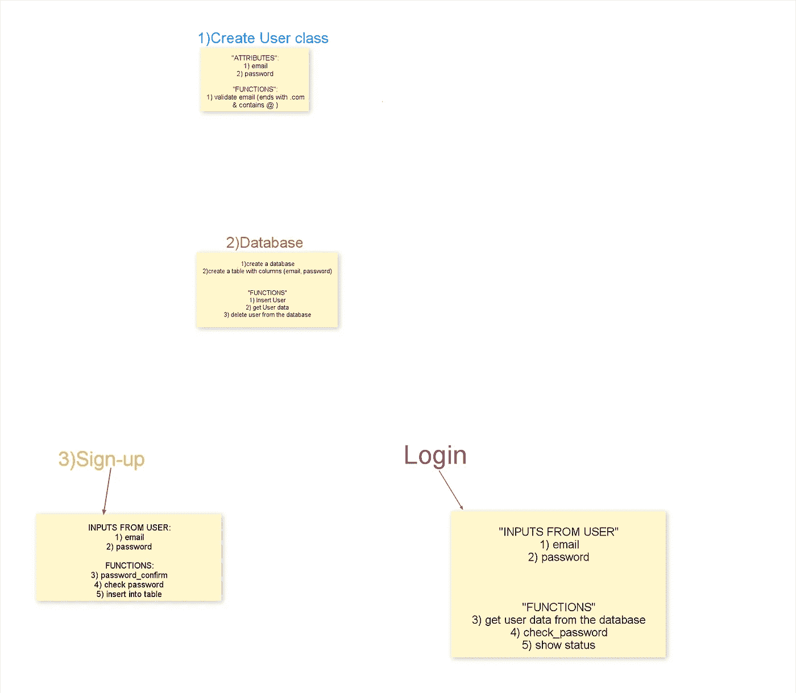
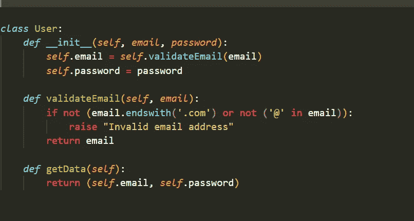
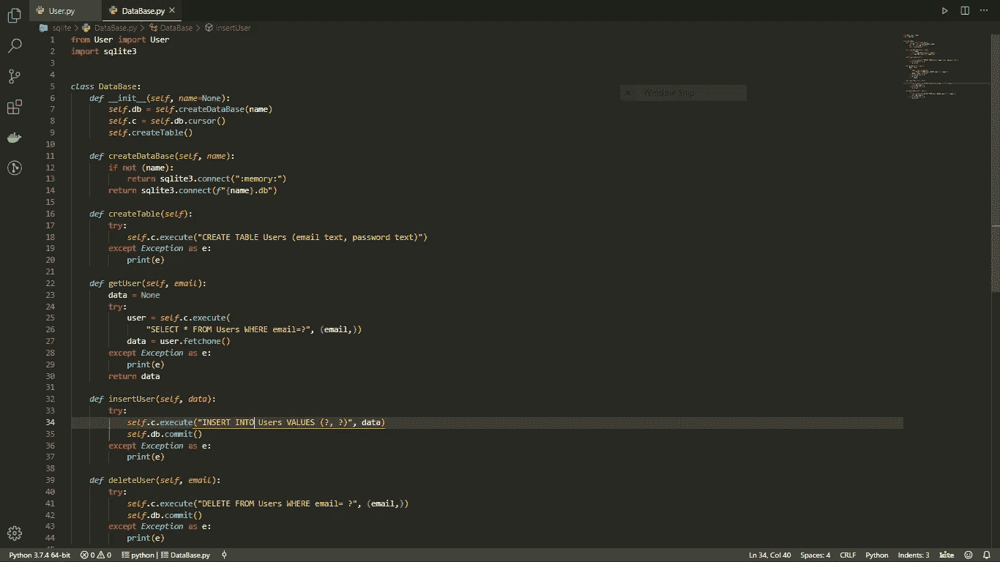
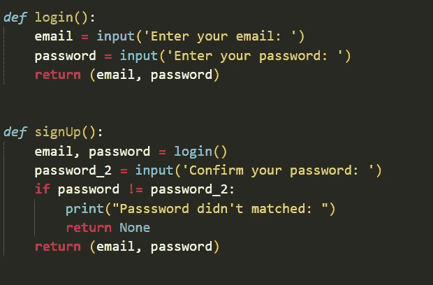
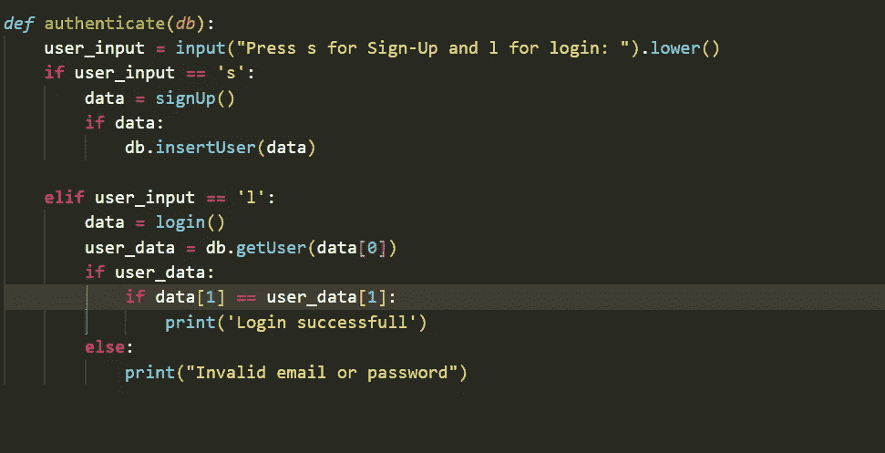
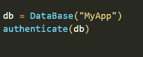

# 使用超级英雄“Python”创建数据库

> 原文：<https://medium.com/analytics-vidhya/creating-a-database-using-superhero-python-fe44ad68674b?source=collection_archive---------5----------------------->

在 *这篇文章中，我们将学习如何通过构建简单的登录和注册功能，使用 python sqlite3 模块创建“SQLite 数据库”。你为这次旅程做好准备了吗，* ***如果是的话*** *让我们马上开始吧。*

**来源**:[https://encrypted-tbn0.gstatic.com/images?q = tbn:and 9 gcrznwuhoypfewq 2 a 2-1I-2 cirwldpbkrn 0 ponwykb 3m zm 327 fym&s](https://encrypted-tbn0.gstatic.com/images?q=tbn:ANd9GcRznWuHOypfEWq2A2-1I-2CIRwldPbkRn0POnWYkB3mZM327FYm&s)

> **提示 1** *:* 当你想用编码来创造一些东西时，⚠️从不直接跳到代码中
> 
> **第一步:*思考并写出*** ，你想做什么以及如何去做

这是我在写代码之前创建的布局

> ***创建用户类***

用户类别的代码

> ***类的描述***

***validate email***会检查邮件地址是否以'结尾。'并在其中包含' @ '。如果没有，它将引发一个错误

***getData*** 将返回一个对象的电子邮件和密码，该对象稍后将在 ***注册*** 过程中用于在数据库中创建一行。

待办事宜一号完成， ***万岁…………***

C创建数据库

***python sqlite3 模块简介***

python sqlite3 模块有两个重要的实体，它们是数据库和游标

> ***数据库*** :有两种，一种是二级存储，另一种是内存。内存数据只会在程序运行前存在。您应该在数据库的测试阶段使用它。第二个是持久存储，即使在节目结束和停止后也将被存储。

#给出创建数据库的片段

> ***光标*** :该界面允许我们对数据库进行插入、删除、新建等操作。每个数据库都有自己的游标。例如，如果您有 database1.db、database2.db，那么两者都有自己的游标。拥有全局游标没有意义

#给出光标对象的代码片段

> ***创建数据库类***

创建数据库类的代码。

> ***类的描述***
> 
> ***createDataBase*** :将创建一个内存类型或二级存储类型的数据库。如果存在同名的数据库，则不会创建新的数据库。但是这种行为对于在数据库中创建表是不同的。属性“c”只是对数据库的游标对象的引用。
> 
> ***createTable*** :将创建一个用户表。将它放在 try except 块中的原因是，如果表已经存在，sqlite3 将抛出一个错误。为了避免这种行为，我们将把它放在 try except block 中。创建表格的 sqlite 命令是**(【创建表格***your _ TABLE _ name***(****column _ name***column _ type***)**。 *sqlite3* 提供了四种数据类型，分别是 **int、real、text、blob。****
> 
> *****insertUser*** :将用户插入到数据库中，创建它的命令是(**INSERT INTO***your _ table _ name***VALUES**(？, ?)、*tuple _ to _ fill _ the _ columns*)。警告，千万不要使用 python 字符串格式化技术向数据库中插入一行，因为这会导致 sqlite 注入，还有用**？** (DB-API)，将由一个元组的元素填充，该元组将由 **User.getData()给出。****
> 
> *****getUser*** :将从匹配给定电子邮件的表中获取用户。它只会给我们对象，但我们需要价值。因此，我们使用游标的 fectch 方法。有 3 个方法，一个是 **fetchone** 它将只使用元组中的行，如果它在那里的话。**fetchmany(number _ of _ rows)**将从匹配的查询集中返回最大行数。 **fetchall()** 将返回所有匹配的行**
> 
> ****deleteUser** :将删除一个用户，并向其提供电子邮件。从 sqlite 中删除一行的模板是("***DELETE FROM***table _ name***WHERE***column _ name =？"，(value，))如果给定的电子邮件中没有行，这将显示一个错误。**

## **⚠️ (3)是**不是元组** (3，)是元组，因为如果只有一个元素，元组期望第一个元素 后有 ***逗号。*****

> ****deleteUser** :将删除一个用户，并向其提供电子邮件。从 sqlite 中删除一行的模板是("***DELETE FROM***table _ name***其中*** column_name=？"，(value，))如果给定的电子邮件中没有行，这将显示一个错误。**

## *****创建登录和注册功能*****

****

**登录和注册功能代码**

****

**认证方法代码**

**认证功能将根据用户输入调用**登录/注册**功能。**登录**功能将调用 **getUser** 用实际密码确认输入的密码。**注册**功能会用 password_2 检查输入的密码进行确认。然后用输入的数据调用 **insertUser** 方法**

## **巨大的一步，将所有的东西结合在一起**

****

**所有代码中神奇的部分**

**如果你不喜欢这篇文章，写下你不喜欢的原因。建议总是受欢迎的。谢谢你的时间…**