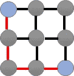

# 创建一个游戏机器人，用图论、Tensorflow 和 Keras 玩“连接”

> 原文：<https://medium.com/analytics-vidhya/creating-a-game-bot-to-play-link-up-with-graph-theory-tensorflow-and-keras-531686b5a69b?source=collection_archive---------30----------------------->

## 用圖論, Tensorflow 和 Keras 製作自動玩「連連看」的程式

1.  **最终结果**

1.1 Gif


1.2 YouTube 链接

如上图，最终工具可以有效识别游戏面板中的磁贴，并按照一定的规则自动点击。对屏幕动态变化的反应快速准确。

1.3 Github 链接

https://github.com/lester1027/game_bot_linkup

**2。动机**

在我的闲暇时间，我向我的女朋友挑战玩链接。连接是一种游戏，玩家试图一次将两个相同类型的瓷砖连接在一起。链接的瓷砖将会消失。连接它们的路径必须包含等于或少于两个转弯。


没有转折点


一个转折点


两个转折点

打了很多回合，都输了。原来我女朋友是这个游戏的高手。放学后她经常花很多时间在这上面。面对她令人难以置信的反射弧，作为一个新手，我毫无胜算。因此，我想到了向我们可爱的机器——计算机借用动力。

**3。目标**

然后，我开始计划一个程序，它可以为我自动化整个游戏过程。简而言之，某种类型的游戏黑客，尽管这里没有涉及真正的黑客。下面列出了该程序的功能。

*   在游戏面板中找到方块上的图案
*   确定瓷砖属于哪个类别
*   存储图块的位置和类别信息
*   制定游戏规则
*   确定目标牌是否符合规则
*   将鼠标光标移动到目标图块，如果是，则单击它们
*   如果没有，选择另一对牌或等待游戏面板屏幕的下一个时间步

**4。方法**

4.1 分类瓷砖

当我在网上为这个兼职项目寻找见解时，我发现了一个很好的[游戏机器人教程](https://inventwithpython.com/blog/2014/12/17/programming-a-bot-to-play-the-sushi-go-round-flash-game/)，它的作者编写了一个程序来自动化一个寿司制作游戏。这里使用的图像识别技术只是读取游戏面板中一些目标位置的 RGB 值。对于图形效果简单的游戏，这种方法足够有用。但是，对于我正在尝试解决的游戏来说，这种方法并不能胜任，原因如下。

I .此游戏中的瓷砖不能每次都以完全相同的高度和宽度尺寸切割。有时会有一到两个像素的误差。

二。由于照明效果，当块出现在不同位置时，来自同一类图案的像素的 RGB 值可能改变。

三。当触发图形效果时，像素的 RGB 值也可以改变。一些目标像素甚至可能被覆盖。

由于这个游戏的情况比较复杂，所以需要更聪明的方法。计算机视觉是一种值得尝试的合适方法。如今它被广泛应用于图像分类任务中。

我需要训练一个计算机视觉模型来完成这项任务。使用了《用 Python 进行计算机视觉的深度学习》一书中的一些代码。我使用 Tensorflow 和 Keras 库进行机器学习。Tensorflow 负责低层张量运算。Keras 是包装 Tensorflow 操作的高级 API。它使 Tensorflow 生态系统更加人性化。在这个项目中，一个简单的 CNN 被训练来捕捉图像中的特征，并使用它们来预测类别。它包括 17 个类别的分类，因为瓷砖中有 17 种不同的图案。CNN 由标准卷积层、激活层、批量标准化层、汇集层和丢弃层组成。然后矩阵被展平，并且 softmax 函数被用作最终的激活函数。交叉熵用于确定预测的类别。

```
model.add(Conv2D(128, (3, 3), padding=’same’))model.add(Activation(‘relu’))*# model.add(BatchNormalization(axis=channel_dim))*model.add(MaxPooling2D(pool_size=(2, 2)))model.add(Dropout(0.25))*# First (and only) set of FC => RELU layers*model.add(Flatten())model.add(Dense(512))model.add(Activation(‘relu’))model.add(BatchNormalization())model.add(Dropout(0.5))*# Softmax classifier*model.add(Dense(classes))model.add(Activation(‘softmax’))
```

首先，捕捉游戏面板的截图。然后根据预定义的 pos_dict 提取截图中的瓦片。pos_dict 的关键字是瓦片的行和列索引。它的值是每个图块的四个顶点的 x 和 y 坐标。对分割的图像应用灰度，从而只留下图像的一个通道，以减少分类期间的处理时间。已处理图像中的所有像素值都被重新缩放到(0，1)范围。预处理后，像素值存储在 val_dict 中。

```
def categorize(model):‘’’#input:None#output: a dictionary containing the cropped and grayscaled images‘’’val_dict =grabBox()type_dict={}*#for each position of the game panel*for row in range(n_row):for col in range(n_col):val=val_dict[(row,col)]*#resize*sp = SimplePreprocessor(pixels,pixels)val=sp.preprocess(val)*#image to array operation*iap = ImageToArrayPreprocessor()val=iap.preprocess(val)val=val.reshape(-1,pixels,pixels,1)type_dict[(row,col)]=type_list[model.predict(val,batch_size=1).argmax()]return type_dict
```

4.2 图表分析

图论用于分析从游戏面板收集的信息。图是一组顶点 V 和一组边 E，组成一个有序对 G=(V，E)。当我们只考虑一类目标瓷砖时，存储的图案可以被标记为三种类型:目标、障碍物和空瓷砖。


原始截图


目标瓷砖:黑鸭子(蓝色)、障碍瓷砖(红色)和空瓷砖(灰色)(此处添加了两列和两行，因为路径可以向外构建)


从上面的概念形成的图

在构建图之后，使用广度优先搜索(BFS)算法来确定从一个瓦片到另一个瓦片的最短路径。输入是图和遍历图时的初始顶点。该函数的输出是一个列表，其中包含遍历的顶点的顺序和一个字典，该字典包含作为键的顶点和作为值的父顶点。

然而，BFS 算法无法生成转弯次数最少的路径，而这是本项目所必需的。因此，编写了一个名为 count_turn()的函数来计算行走路径中的最小转弯次数。


最短的路径，但没有最少的转弯点



最短的路径，最少的转弯点

如果计数小于或等于 2，则对应的路径是有效路径。

在分析过程之后，程序可以将鼠标光标移动到目标瓷砖的中心，并一个接一个地点击它们。

当链接的瓷砖因链接成功而消失时，程序会对游戏面板进行另一次截图，并重复上述过程。如果在这个循环中没有有效的路径生成，程序将继续寻找由其他图块生成的潜在路径。

**5。后记**

我用这个程序成功打败了我的女朋友。从那以后她再也没有和我玩过这个游戏。