# 创建 Google Data Studio 连接器

> 原文：<https://medium.com/analytics-vidhya/creating-a-google-data-studio-connector-da7b35c6f8d5?source=collection_archive---------2----------------------->

我最近发现了一个谷歌工具，并立刻对它产生了兴趣:Data Studio。[根据谷歌的说法](https://support.google.com/datastudio/answer/6283323?hl=en)“Data Studio 是一款免费工具，可以将你的数据转化为信息丰富、易于阅读、易于分享、完全可定制的仪表盘和报告。”对我来说，使 Data Studio 真正脱颖而出的是它的免费(不像非常相似的工具 Tableau 和 Amazon QuickSight)和它可以通过社区构建的连接器和可视化工具相当容易地扩展的事实。虽然 Google 已经提供了大量关于如何构建连接器的文档，但是我发现这些文档在很多地方都缺少关键的细节，我花了无数的时间试图解决这个问题。在本文中，我将从头到尾向您介绍构建连接器的过程，并向您展示我花了大量时间解决的许多陷阱，这样您就不必再费时间了。

对于如何编写 data studio 连接器，一句话的总结是，您必须编写一些预定义的函数，本质上就像实现一个接口。首先，我们需要一个数据源。

作为加拿大多伦多的居民，我将应用本教程来构建一个连接器，从超级酷的“[多伦多开放数据](https://open.toronto.ca/)”计划中提取数据，该计划使世界可以免费访问许多有趣的数据集。具体来说，我们将调出多伦多市议员的[出席记录](https://open.toronto.ca/dataset/members-of-toronto-city-council-meeting-attendance/)。请注意，在这种特殊情况下，您可以简单地下载 CSV 格式的值，将其加载到 Google Sheets 中，并将 Data Studio 直接连接到该工作表，而无需编写任何代码，但本文的重点是向您展示如何编写连接器，因此我们将假装情况并非如此。


图片来源:斯科特·韦伯

如果你想要完整的源代码，又不想麻烦地走一遍，你可以在 GitHub gists 上找到它。

# 当地发展

Data Studio 连接器被写成一个“ [Apps 脚本](https://developers.google.com/apps-script)，这是一种扩展 Google 云应用的方法。应用程序脚本是用 JavaScript 编写的，你可以在许多应用程序中使用它们，而不仅仅是 Data Studio。你可以在 https://script.google.com/home 的[创建和管理你的脚本，在那里你也可以访问一个浏览器集成开发环境来编辑和发布你的代码。我的建议是不要使用这个界面——这个界面感觉非常笨拙，有时会有很多问题。相反，谷歌提供了一个名为“](https://script.google.com/home) [clasp](https://github.com/google/clasp) 的 CLI 工具，让你可以创建脚本，并在本地机器和“应用程序脚本”网站之间同步代码。这为您提供了许多优势，例如能够在 Git 中对代码进行版本控制，能够使用您最喜欢的开发环境，最重要的是，它将为您提供编写单元测试的能力，如果您的连接器不是微不足道的，这将非常方便。按照 clasps 的 readme 中的说明，使用您将要使用的 Google 帐户登录，并输入连接器的工作目录。创建一个新脚本，如下所示:

```
clasp create --title "Toronto City Council Attendance"
```

系统将提示您创建哪种类型的应用程序—选择“独立”。该目录现在将包含一个“appsscript.json”文件，它是应用程序脚本的清单。它还包含一个“. clasp.json”文件，这个文件只有一个 ID，告诉 clasp 当前目录链接到哪个脚本项目。如果你打开你的谷歌脚本页面，你应该在列表中看到你的脚本。

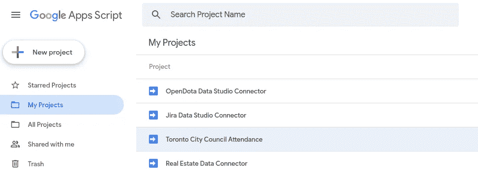

让我们稍微修改一下我们的清单文件；我们需要添加一些关于这个脚本的 data studio 方面的元数据。这是 data studio 清单的[官方文档](https://developers.google.com/datastudio/connector/build#complete_the_project_manifest)，但我将只留下我在这个项目中的一个例子:

```
{
  "timeZone": "America/Toronto",
  "dependencies": {},
  "dataStudio": {
    "name": "Toronto City Council Attendance",
    "logoUrl": "[https://i.imgur.com/e9wE7Md.png](https://i.imgur.com/e9wE7Md.png)",
    "company": "Petro Podrezo",
    "companyUrl": "[https://toronto.ca/](https://toronto.ca/)",
    "addonUrl": "[https://toronto.ca/](https://toronto.ca/)",
    "supportUrl": "[https://toronto.ca/](https://toronto.ca/)",
    "shortDescription": "Toronto City Council Attendance",
    "description": "Attendance statistics for Toronto city councilors.",
    "authType": ["NONE"],
    "feeType": ["FREE"]
  },
  "exceptionLogging": "STACKDRIVER",
  "runtimeVersion": "V8"
}
```

最重要的是，注意最后两行:属性“exceptionLogging”告诉 Google 记录到一个名为 Stack Driver 的特殊持久性存储中，而不是默认情况下记录到的临时日志中。此外，“V8”的“runtimeVersion”允许您使用各种 ES6+语言特性，如类、lambda 函数等等。

## 关于使用多个文件的说明

虽然可以将代码组织到多个文件中，并使其更容易与您的应用程序一起工作，但我在应用程序脚本中开发任何东西的最大烦恼之一是，谷歌运行应用程序脚本的方式是，它有效地将所有代码文件串联起来，并作为一个大文件运行，无论您做什么。这意味着函数和类之外的一切都是自动全局的，即使使用 V8 运行时，您也无法使用 ES6 风格的导入/导出功能——它只会使您的脚本崩溃。如果您计划在连接器本身中编写任何复杂的东西，请先阅读下面的“构建复杂的连接器代码”一节。出于本教程的目的，我们将在连接器本身中做所有事情，因为这是一个简单的用例，我主要关心的是向您展示如何构建连接器本身，而不是支持的 API。

# 界面

最基本的，data studio 连接器看起来像这样:

```
function isAdminUser() { ... }function getAuthType() { ... }function getConfig(request) { ... }function getSchema(request) { ... }function getData(request) { ... }
```

让我们从简单的东西开始，然后继续前进。

# isAdminUser()

整个体验中最简单的部分就是这个函数。用于[启用或禁用调试功能](https://developers.google.com/datastudio/connector/debug#enablingdisabling_debug_features)。尽管它被列为可选的，但在没有实现它的情况下，你会在日志中看到“失败”的条目，所以我建议你只填写它。在生产中，您可能希望根据关于用户的某种标准来设置该值，但是因为我们只是根据教程进行开发，所以让我们返回“true ”,这样我们就可以随时轻松访问所有的调试信息。

```
function isAdminUser() {
  return true;
}
```

# getAuthType()

这个函数返回我们将要使用的认证方案。在我们的示例中，我们不需要进行身份验证，因此函数体如下所示:

```
const cc = DataStudioApp.createCommunityConnector();function getAuthType() {
  const AuthTypes = cc.AuthType;
  return cc
    .newAuthTypeResponse()
    .setAuthType(AuthTypes.NONE)
    .build();
}
```

注意常量声明“cc”——它可以放在文件的最顶端，因为它会在很多地方被引用。它引用了 Google API for Data Studio。

如果在真实的场景中，您最终拥有一个使用身份验证的 API，那么需要知道的一件有用的事情是，与“getConfig()”定义的连接器配置不同，身份验证一旦被存储，报告的查看者就无法访问它。其他认证类型[包括 OAuth2、用户&密码和用户&令牌方案](https://developers.google.com/datastudio/connector/reference#authtype)。

# getConfig(请求)

当您第一次设置 data studio 数据源时，您可以选择设置一些配置选项。在我们的例子中，假设我们希望为用户提供选择他们想要查看的数据集的选项:

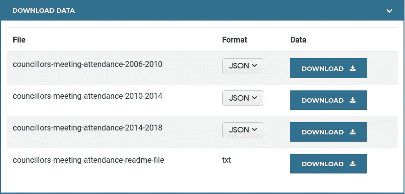

会议出席率的多伦多公开赛数据截图

出于本教程的目的，您可以忽略“request”参数，因为它提供给您的只是用户所在地区的语言代码。为了简单起见，我们的连接器将使用英语。让我们提供一个包含三个选项的下拉框:

```
function getConfig(request) {
  const config = cc.getConfig();
  config
    .newSelectSingle()
    .setId('dataSetUrl')
    .setName('Period')
    .addOption(config.newOptionBuilder().setLabel('2006 - 2010').setValue('[https://ckan0.cf.opendata.inter.prod-toronto.ca/download_resource/035afc79-7a6b-462a-85a4-ef7b7b14c403?format=json'](https://ckan0.cf.opendata.inter.prod-toronto.ca/download_resource/035afc79-7a6b-462a-85a4-ef7b7b14c403?format=json')))
    .addOption(config.newOptionBuilder().setLabel('2010 - 2014').setValue('[https://ckan0.cf.opendata.inter.prod-toronto.ca/download_resource/191a6bf8-038e-4269-8672-d236bc13318b?format=json'](https://ckan0.cf.opendata.inter.prod-toronto.ca/download_resource/191a6bf8-038e-4269-8672-d236bc13318b?format=json')))
    .addOption(config.newOptionBuilder().setLabel('2014 - 2018').setValue('[https://ckan0.cf.opendata.inter.prod-toronto.ca/download_resource/129dffc6-f820-422d-b23c-6469c4325dff?format=json'](https://ckan0.cf.opendata.inter.prod-toronto.ca/download_resource/129dffc6-f820-422d-b23c-6469c4325dff?format=json')));

  config.setDateRangeRequired(false);
  config.setIsSteppedConfig(false);return config.build();
}
```

配置可以变得非常高级，因为您可以使用多步配置过程和各种类型的控件。详情见[官方文件](https://developers.google.com/datastudio/connector/reference#getconfig)。需要注意的一点是“setDateRangeRequired”字段—如果设置为 true，则允许用户指定他们感兴趣的日期范围。对于生成只需要数据集提供的时间段的一个子部分的报告来说，这真的很方便，并且允许用户专注于他们感兴趣的时间段。对于本教程，我们将保持它简单一点，并设置为假。

# getSchema(请求)

该函数返回列的完整列表以及列的数据类型。每当配置连接器时都会调用它，以便 Data Studio 知道从使用该连接器的数据源中可以获得什么。当您使用此连接器将数据源添加到报表中时，如下所示:

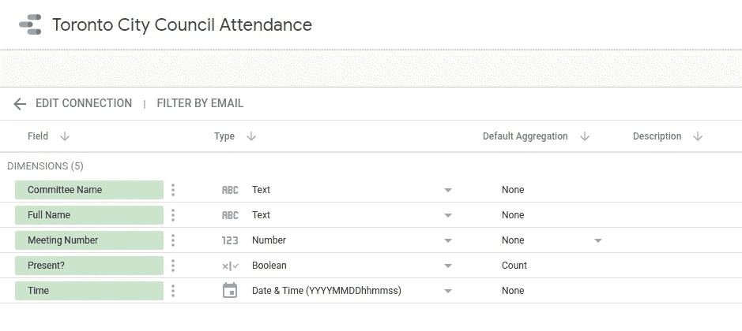

“请求”参数将是包含属性“configParams”的对象，该属性是配置属性的键值映射。键将是传递给“getConfig”函数中的“setId”的值，值将是用户设置的值。在我们的例子中，请求看起来像这样:

```
{
  "configParams": {
    "dataSetUrl": ["https://some.url/"](https://some.url/')
  }
}
```

在我们的例子中，不管数据集如何，列都是相同的，所以我们不需要对请求参数做任何事情。但是，在更高级的报告中，您可能需要根据用户设置的某些选项返回不同的模式。

我们的数据具有以下形状:

```
{
    "Session Start-End Time": "09:44AM - 12:30PM",
    "MTG #": 123,
    "Last Name": "Smith",
    "First Name": "John",
    "Committee": "City Council",
    "Session Type": "Morning",
    "_id": 9999,
    "Session Date": "2009-12-08T00:00:00",
    "Present": "Y"
  }
```

但是我们的模式将会是这样的:

*   议员的全名
*   会话日期和时间(我们将仅使用开始时间)
*   委员会的名称
*   会议号码
*   议员是否在场

我们需要重新格式化 getData()方法中的数据，以适应连接器代码中的模式。出于本教程的目的，我们将忽略其余字段，因为它们不太有趣(如会话结束时间)。

将以下常量添加到连接器代码的顶部，我们马上会用到它们:

```
const dsTypes = cc.FieldType;
const dsAggregationTypes = cc.AggregationType;
```

不过，在我们继续返回模式中的所有列之前，我们必须提前考虑一下——“getData()”方法还需要返回它正在执行的特定数据请求的模式，所以理想情况下，我们希望共享 getSchema()和 get data()为此使用的代码，使用一个 helper 方法返回一个基于其 ID 的特定字段。

以下是我对此的看法:需要注意的一件重要事情是，传入的“fields”对象要求所有操作作为一个链来完成，因此我们接受 fields 对象作为一个参数，调用方法来添加字段，然后返回“fields ”,以便调用者可以为它想要添加的下一个字段重用该对象。

```
// [https://developers.google.com/datastudio/connector/reference#datatype](https://developers.google.com/datastudio/connector/reference#datatype)
function _getField(fields, fieldId) {
  switch (fieldId) {
    case 'fullName':
      fields
        .newDimension()
        .setId('fullName')
        .setName('Full Name')
        .setType(dsTypes.TEXT);
      break;
    case 'sessionDatetime':
      fields
        .newDimension()
        .setId('sessionDatetime')
        .setName('Time')
        .setType(dsTypes.YEAR_MONTH_DAY_SECOND);
      break;
    case 'committeeName':
      fields
        .newDimension()
        .setId('committeeName')
        .setName('Committee Name')
        .setType(dsTypes.TEXT);
      break;
    case 'meetingNumber':
      fields
        .newDimension()
        .setId('meetingNumber')
        .setName('Meeting Number')
        .setType(dsTypes.NUMBER);
      break;
    case 'present':
      fields
        .newMetric()
        .setId('present')
        .setName('Present?')
        .setType(dsTypes.BOOLEAN)
        .setAggregation(dsAggregationTypes.COUNT);
      break;
    default:
      throw new Error(`Invalid fieldId: ${fieldId}`)
  }
  return fields;
}
```

下面是 getSchema()本身，在提取了获取每个单独字段的逻辑之后，它相当轻量级:

```
function getSchema(request) {
  let fields = cc.getFields();
  ['fullName', 'sessionDatetime', 'committeeName', 'meetingNumber', 'present'].forEach(fieldId => {
    fields = _getField(fields, fieldId);
  });
  fields.setDefaultMetric('present');
  fields.setDefaultDimension('fullName');
  return { 'schema': fields.build() };
}
```

最值得注意的是，请注意我们必须枚举我们希望在数据源中可用的所有字段。

# getData(请求)

我们几乎已经完成了编码部分——我们需要从 API 中获取数据，并返回数据以及返回列的相应数据类型。这里需要知道的一个重要细节是，对于使用该数据源的报表中的每个图表/控件，getData()都将被调用一次。Data Studio 的工作方式是，在您的图表中选择您对特定控件感兴趣的字段，然后 getData 将提供一个“请求”对象，该对象中指定了这些字段。该方法的主体应该准确地返回这些字段，并且按照请求的顺序返回。

*重要提示:*如果您正在访问的 API 限制了请求速率或需要很长时间来响应，那么如果不将 API 抽象出来并添加缓存层，将很难继续。顺便提一下，在我自己的将 Data Studio 连接到吉拉 API 的个人项目中，我原本打算在连接器本身中完成所有计算，并且不进行任何缓存，因为 API 没有速率限制，但是即使是一个只有 7 个图表的简单报告，刷新数据也慢得令人难以忍受，因为每个请求都必须处理大约 700 条记录，按 100 个项目分页，这意味着每当报告中的一个细节发生变化时，我都要进行大约 50 次 API 调用。我决定使用 AWS lambda 函数和 S3 来完成繁重的工作，并且仅仅使用连接器代码作为我的逻辑代码和 data studio UI 之间的接口。

在我们的例子中，我们将忽略缓存的需要，做简单的事情—直接从数据源获取数据。为此，我们可以使用“[urlfettchapp](https://developers.google.com/apps-script/reference/url-fetch)”，这是一个允许与 HTTP 服务器对话的应用程序脚本运行时 API。我将逐块运行代码来解释发生了什么，而不是一次放入整个函数。首先，我们需要了解我们实际上被要求提供哪些字段:

```
function getData(request) {
  let fields = cc.getFields();
  const fieldIds = request.fields.map(field => field.name);
  fieldIds.forEach(fieldId => {
    fields = _getField(fields, fieldId);
  });
  ... continued ...
```

接下来，我们要向 API 发出 HTTP 请求(不要忘记 URL 是从 config！).请注意,“muteHttpExceptions”标志被设置为 true，这是因为如果 API 调用失败(例如，我们遇到了 500 错误),则 UrlFetchApp 将引发一个异常，然后向用户显示一个通用的“无法获取数据”消息(如果调试模式关闭)。这不是一个理想的用户体验，所以我们会做得更好，首先记录响应代码、标题和正文。此外，我们希望向用户显示一个更有用的错误消息——我们将在后面讨论这个部分(现在我们只抛出一个异常，它的消息不会向用户显示)。

```
 const requestOptions = {
    muteHttpExceptions: true,
    method: 'get'
  };
  const url = request.configParams.dataSetUrl;
  const httpResponse = UrlFetchApp.fetch(url, requestOptions);
  // handle errors from the API
  if(httpResponse.getResponseCode() !== 200) {
    Logger.log('An exception occurred accessing the API:');
    Logger.log(httpResponse.getResponseCode());
    Logger.log(httpResponse.getAllHeaders());
    Logger.log(httpResponse.getContentText());
    // TODO: Return an error to the user
    throw new Error(`The API replied with an unsuccessful status code of ${httpResponse.getResponseCode()}`);
  }
  const data = JSON.parse(httpResponse.getContentText());
```

接下来，我们需要制定返回值的“数据”部分；这里我建议使用另一个帮助器方法—在我的例子中，我将其命名为“_getDataField”，它接受数据点(例如，为其生成行的特定离散实体)以及我们想要的字段 ID，并返回可以使用该实体的多个属性计算的值:

```
 const rows = data.map(dataPoint => {
    return {
      values: fieldIds.map(fieldId => _getDataField(dataPoint, fieldId))
    };
  });
```

最后我们返回结果:

```
 const result = {
    schema: fields.build(),
    rows: rows
  };
  return result;
}
```

下面是根据字段 ID 和实体获取值的 helper 方法:

```
function _getDataField(entity, fieldId) {
  switch (fieldId) {
    case 'fullName':
      return `${entity['First Name']} ${entity['Last Name']}`;
    case 'sessionDatetime':
      let year, month, day, hour, hour24, ampm, minute;
      [_, year, month, day] = /^(\d{4})-(\d{2})-(\d{2})/.exec(entity['Session Date']);
      [_, hour, minute, ampm ] = /^(\d{2}):(\d{2})(\w{2})/.exec(entity['Session Start-End Time']);
      hour24 = ampm === 'PM' ? (parseInt(hour) + 12).toString() : hour;
      // YYYYMMDDHHMMSS
      return `${year}${month}${day}${hour24}${minute}00`;
    case 'committeeName':
      return entity['Committee'];
    case 'meetingNumber':
      return entity['MTG #'];
    case 'present':
      return entity['Present'] === 'Y';
    default:
      throw new Error(`Invalid fieldId: ${fieldId}`)
  }
}
```

# 部署连接器

打开你的 [Google Scripts](https://script.google.com/home) 界面，在列表中找到你的项目。转到“打开项目”以打开在线 IDE。转到“发布”，然后“从清单部署…”

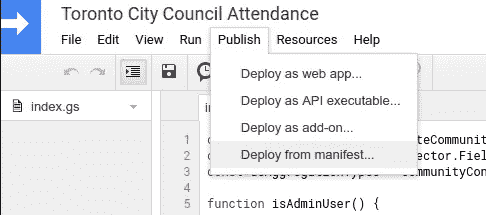

单击“安装附加组件”

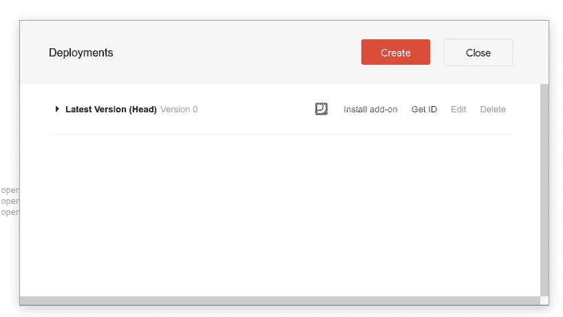

展开“最新版本”并点击下面的链接。

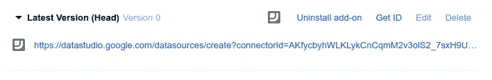

您将看到下面的界面，要求您授权代码在 data studio 的上下文中执行。

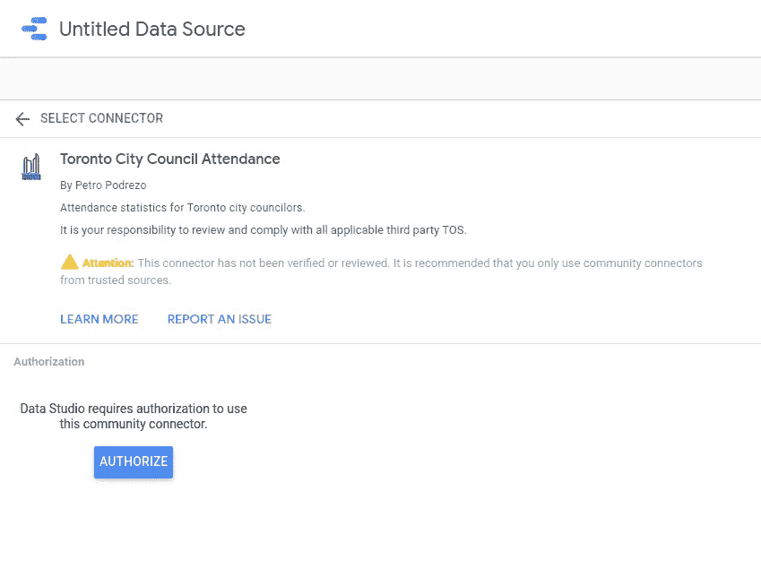

除非您的代码没有与外部系统(例如 Web APIs)对话，否则您应该会看到一个额外的弹出窗口，要求您确认是否允许该代码获得额外的权限。如果您授权了它，但随后又需要更多的权限，您可能看不到任何错误，并且会花费大量时间来找出问题所在。有关更多详细信息，请参见下面的“应用程序脚本使用 Google OAuth 权限”一节。


最后，您将看到使用该数据源可以获得的所有可能的字段。您现在可以添加数据源并开始使用它。

将数据源添加到报表后，我们可以生成一个简单的数据透视表:

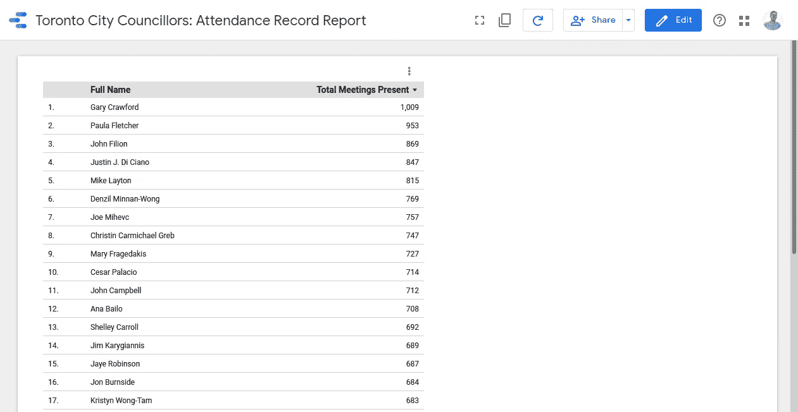

显示 2014–2018 年期间的统计数据

或者发疯加一堆图表！

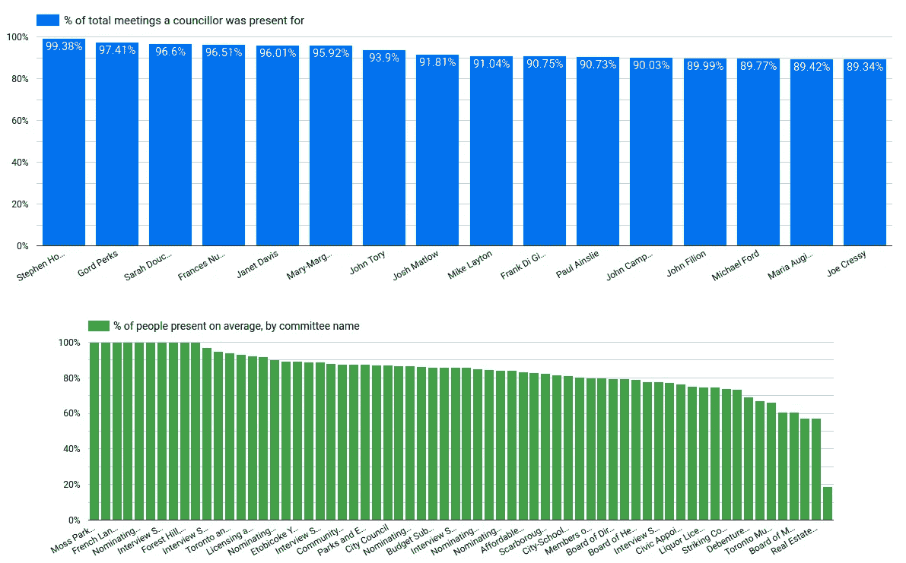

显示 2014–2018 年期间的统计数据

我希望你喜欢这个教程。下面有很多有用的附加信息，但你现在应该有了基本知识。

# 其他提示和陷阱

这里还有一些你可能会觉得有用的提示。

## 记录和例外

要查看您的日志输出和堆栈跟踪，您可以访问 Google Scripts 界面，单击您的脚本，然后转到边栏上的“我的执行”。

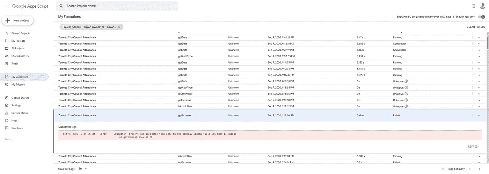

## 应用程序脚本使用 Google OAuth 权限

这很难调试，因为没有错误消息，但是你应该知道应用程序脚本在它们可以访问的范围上是有限的。如果您需要访问一个外部服务(比如访问一个 web API ),那么当脚本被添加到 Data Studio 时，它将需要被授予该权限。没有地方来定义您需要哪些范围——当您将脚本添加到 Data Studio 时，Google 会自动选择脚本需要哪些权限。不幸的是，这一点没有明确的指示，也没有办法刷新权限，所以如果您在实际使用该作用域之前将连接器添加到 Data Studio 中，那么当您开始访问 API 时，您的脚本将会失败，没有指示出哪里出错了。如果发生这种情况，您需要删除连接器，然后再次添加它。

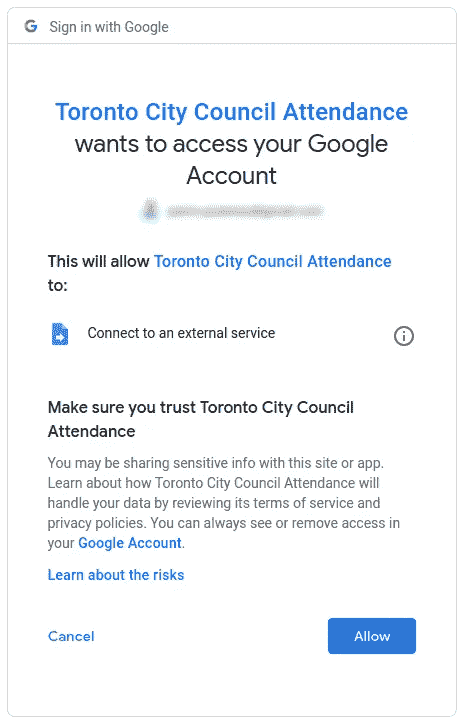

请注意“连接到外部服务”权限，因为我们使用的是“UrlFetchApp”

## 与其他人共享您的连接器

当你开发你的连接器时，它只能被你自己的谷歌账户访问。它将只为您显示在社区连接器的图库中。然后，您可以与个人或您的组织“共享”您的脚本，让他们运行连接器，而无需向外界公开。要做到这一点，进入脚本界面，点击“共享”按钮，就像你对 Google Drive 文档所做的那样。如果您愿意，您可以将您的连接器提交给 Google 进行审查，以将其添加到面向全世界的连接器公共列表中。

## 存储验证值

如果您使用需要存储凭证的数据源，比如用户名和密码，那么您需要存储这些值，因为它们不应该是连接器配置的一部分(因为配置数据对报告的编辑者是可见的)。谷歌提供了 [PropertiesService](https://developers.google.com/apps-script/reference/properties/properties-service) 来做这件事。属性服务是一个键值存储，它有三个可能的库:文档、脚本和用户。对于 data studio 连接器，您几乎肯定想要可以像这样获取、设置和删除的用户属性:

```
const userProperties = PropertiesService.getUserProperties();
userProperties.setProperty('myservice.username', username);
const username = userProperties.getProperty('myservice.username');
userProperties.deleteProperty('myservice.username');
```

例如，您可以在 resetAuth()和 setCredentials()方法中使用它。

## 向用户发送更好的错误消息

如果您想在 Data Studio 中向使用报告的最终用户显示一条错误消息，比如在 API 调用失败的情况下，并且您知道原因(比如凭证可能是错误的),那么您可以使用这个方便的助手方法非常简单地做到这一点:

```
function sendUserError(message) {
  cc.newUserError()
    .setText(message)
    .throwException();
}
```

现在你可以用一个消息调用这个方法，它会直接在一个模态窗口中显示给用户。

## 为 data studio 连接器添加单元测试

当我最初试图为我的项目添加一些单元测试时，我陷入了困境，因为 Data Studio API 中几乎所有的方法都是链式方法，很难模仿，并且使用了大量的全局变量。我的同事推荐了这篇名为“不要嘲笑你没有的东西”的文章，这篇文章对我来说意义重大，所以我强烈推荐它。

要点是，因为我们不控制 data studio API，所以尝试以一种对与它交互的您自己的代码有意义的方式将其抽象出来，然后模仿该接口。

## 构建复杂连接器代码

出于多种原因，包括性能、易维护性、可读性等等，我强烈建议让您的连接器尽可能地“笨”,并尽可能地在外部系统中使用，就像在无服务器函数中一样。如果您必须将所有的连接器逻辑构建到连接器本身中，那么当您试图添加单元测试和使用多个文件时，您可能会碰壁。问题是 Data Studio 不支持导入/导出，而是将所有文件视为一堆热气腾腾的连接在一起的乱七八糟的东西。为此，虽然我不推荐，但你可以使用古老的“吞咽”来完成。我设法让它工作的方法是像往常一样使用 require()和 module.export，并像任何普通项目一样使用 [jest](https://jestjs.io/) 来使用这些单独的文件，但在部署到 Google 之前，我会运行一个 gulp 脚本，通过用以下代码包围相关行来删除所有导入:

```
//removeIf(production)
const Schema = require('../lib/schema');
//endRemoveIf(production)
```

然后在你的 gulp 文件中，你可以使用插件“gulp-remove-code”

```
const removeCode = require('gulp-remove-code');
const concat = require('gulp-concat');
const run = require('gulp-run-command').default;const { series, src, dest } = require('gulp');function copyManifest() {
  return src('appsscript.json')
    .pipe(dest('./dist/'));
}function build(cb) {
  return src(['./google/**/*.js', './lib/**/*.js'])
    .pipe(removeCode({ production: true }))
    .pipe(concat('all.js'))
    .pipe(dest('./dist/'));
}exports.default = series(copyManifest, build, run('clasp push'));
```

这将把代码的生产版本构建到“dist”目录中，并运行“clasp push”来部署它。

# 进一步阅读

*   [谷歌官方参考指南](https://developers.google.com/datastudio/connector/reference)
*   [谷歌官方开发者指南](https://developers.google.com/datastudio/connector)
*   [Data Studio 连接器范例库](https://github.com/googledatastudio/community-connectors)
*   [谷歌开发连接器的官方演练](https://codelabs.developers.google.com/codelabs/community-connectors)