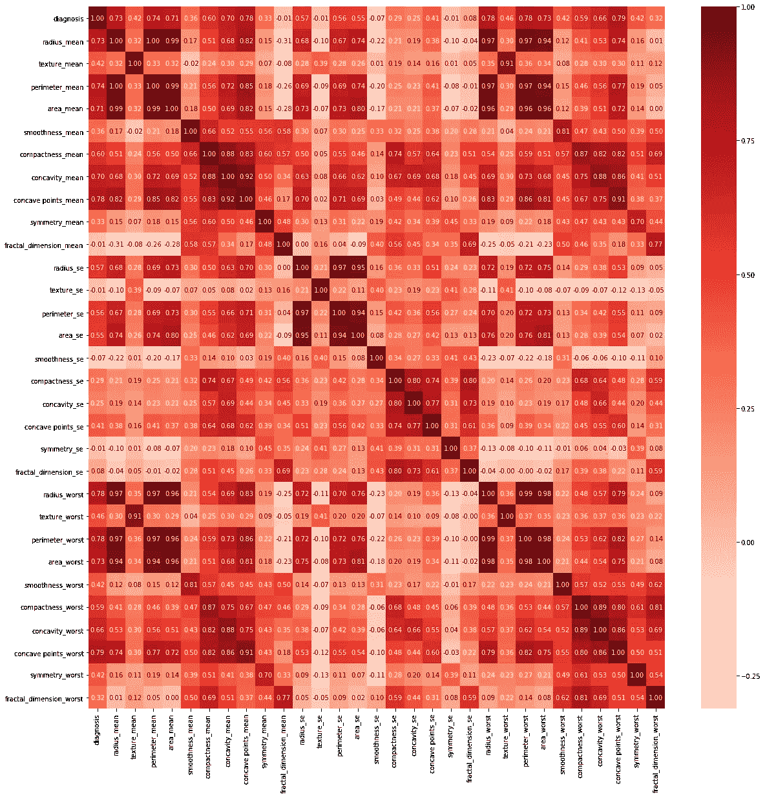

# 创建预测恶性乳腺癌肿瘤的机器学习模型

> 原文：<https://medium.com/analytics-vidhya/creating-a-machine-learning-model-to-predict-malignant-breast-cancer-tumors-87abc4065432?source=collection_archive---------8----------------------->

# 背景

下面的探索使用了来自威斯康星州[乳腺癌(诊断)数据集](https://www.kaggle.com/uciml/breast-cancer-wisconsin-data)的数据。这种解释的要点是建立一个相对精确的模型来确定乳腺肿瘤组织样本是恶性还是良性。

你可以点击这里查看 Kaggle 笔记本[的链接！](https://www.kaggle.com/zjarnagin/breast-cancer-wisconsin-diagnostic-data-set?scriptVersionId=21652917)

# 设置

首先，我们必须设置我们的环境。我们导入各种库(您可以在下面的代码单元中查看)并根据我们在提供的文件中遍历文件名得到的结果设置我们的目录。

```
import pandas as pd *# data processing, CSV file I/O (e.g. pd.read_csv)*
from sklearn.model_selection import train_test_split *# splitting our data into training and testing data*
import seaborn as sns *# for creating a correlation heatmap*
import matplotlib.pyplot as plt *# for displaying our heatmap for analysis*
from xgboost import XGBClassifier *# eventually, we will use an XGBClassifier for our model*
from sklearn.metrics import accuracy_score *# to score our model*

*# Input data files are available in the "../input/" directory.*

import os
for dirname, _, filenames **in** os.walk('/kaggle/input'):
    for filename **in** filenames:
        print(os.path.join(dirname, filename))
```

# 读取我们的数据

在这里，我们从提供的中读取数据。csv 文件使用熊猫并将其表示为熊猫数据帧。

我们对基于细胞特征的诊断预测感兴趣，因此我们为诊断列分配一个“y”变量。

值得注意的是，当使用“id”特性作为索引列时，我们会得到一个充满 NaN 条目的列。我们删除了这个栏目，因为它对我们没有用处。我们也改变了一些熊猫选项。这是为了无论何时我们调用“head ”,我们都可以看到所有的特性和列名，而不会被截断。

然后，我们将恶性肿瘤的诊断替换为 1(最初表示为“M”)，良性肿瘤的诊断替换为 0(最初表示为“B”)。这在我们拟合模型时很有用。

```
*# Read the dataset*
X_full = pd.read_csv('/kaggle/input/breast-cancer-wisconsin-data/data.csv', index_col='id')

*# Assign y to the diagnosis column*
y = X_full.diagnosis

*# Assigning our index_col to be the column 'id' shifted our data over, leaving a column with all NaN entries.*
*# We drop that here*
X = X_full.drop(columns=['Unnamed: 32'])

*# Show all values whenever we call head.*
pd.set_option('display.max_columns', None)
pd.set_option('display.max_rows', None)
*# If we run .dtypes on our data frame, we notice that all columns, aside from the diagnosis being a string, our integers.*

*# We replace a malignant diagnosis with 1, and benign with 0*
X['diagnosis'].replace('M', 1, inplace=True)
X['diagnosis'].replace('B', 0, inplace=True)
y.replace('M', 1, inplace=True)
y.replace('B', 0, inplace=True)
```

# 数据分析

为了避免过度拟合，我们找到似乎对诊断影响不大的特征。我们通过使用热图关联图来做到这一点。

我们得到的图将显示一个属性与另一个属性的相关性。我们感兴趣的是哪些属性影响(或不影响)诊断列。我们分析图上的结果，忽略绝对值小于 0.5 的特征。

```
*# Here, we use the seaborn correlation heatmap to visualize the correlatons of features in our dataset on one another.*
*# Using the filter method, we will drop features which have an absolute value of less than 0.5 on the feature 'diagnosis'*

*# Setting up and displaying our heatmap correlation*
plt.figure(figsize=(20,20))
cor = X.corr()
sns.heatmap(cor, annot=True, cmap=plt.cm.Reds, fmt='.2f')
plt.show()
```



显示特征相关性的热图

# 运用我们的分析

现在，我们运行一些代码来做我们上面说过要做的事情:忽略对诊断列影响较小的特性。

我们还将数据分为训练和测试数据，以训练和拟合我们的模型。

```
*# Keep features which have a med-high correlation on the diagnosis*
features = ['radius_mean', 'perimeter_mean', 'area_mean', 'compactness_mean', 'concavity_mean', 
            'concave points_mean', 'radius_se', 'perimeter_se', 'area_se', 'radius_worst', 'perimeter_worst',
           'area_worst', 'compactness_worst', 'concavity_worst', 'concave points_worst']
X = X[features]

*# Break off validation set from training data*
X_train, X_valid, y_train, y_valid = train_test_split(X, y, train_size=0.8, test_size=0.2,
                                                      random_state=0)
```

# 创建和测试模型

现在我们已经准备好创建、训练和测试一个模型了。我们必须使用分类模型，因为预测值要么是 0(良性)，要么是 1(恶性)。我们使用 Sklearn 的“accuracy_score”函数来评估该模型的准确性。

```
*# We will use an XGBoostClassifier, and score the model using SKLearn Accuracy Score*

model = XGBClassifier()
model.fit(X_train, y_train)
preds = model.predict(X_valid)
accuracy_score(y_valid, preds)
```

# 准确(性)

我们的准确度得分大约为 0.956。这意味着当我们被提供了用细针抽吸(FNA)从乳腺肿块中获取的细胞核的特征时，我们的模型应该准确地将肿瘤分类为恶性或良性。