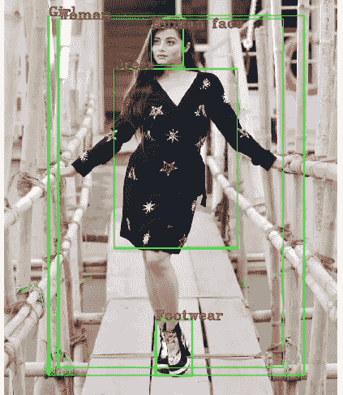

# 用几个步骤构建对象检测器

> 原文：<https://medium.com/analytics-vidhya/creating-a-powerful-and-quick-object-detection-system-using-frozen-tensorflow-models-bacfff3e2114?source=collection_archive---------4----------------------->

在这篇文章中，我们将看到如何使用冻结的张量流模型，用几行代码创建一个强大的物体检测系统。

图中检测到的类别。
类别:服饰、女人、人脸、脚穿和女孩

嗯，当涉及到一个物体检测系统的实现时，我们大多数人…