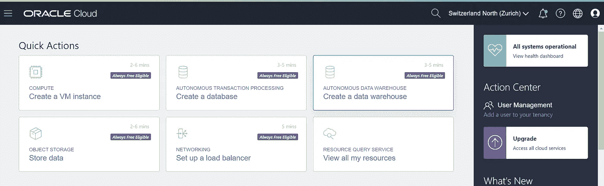

# 在 Oracle 数据库中创建预测模型！

> 原文：<https://medium.com/analytics-vidhya/creating-a-prediction-model-in-oracle-database-10aacf212e84?source=collection_archive---------2----------------------->


数据中的模式定义是数据准备的重要部分。📸拉斐尔·比斯卡尔迪在 [Unsplash](https://unsplash.com/s/photos/graph?utm_source=unsplash&utm_medium=referral&utm_content=creditCopyText) 上拍摄的照片

**了解 Oracle 数据挖掘功能的第一步，以及如何改进您的数据以获得精确的预测！**

## ✨Motivation

👩‍💻作为一名数据工程师，我一直想探索 Oracle 数据库中分析的可能性。在大学最近的一个研究项目中，我有机会试验 Oracles 的数据库内数据挖掘特性。

➡甲骨文机器学习，空间和图形功能自 12 月 5 日起在甲骨文数据库免费！

[](https://blogs.oracle.com/database/machine-learning,-spatial-and-graph-no-license-required-v2) [## 机器学习，空间和图形-不需要许可证！

### 为了与 Oracle 的使命保持一致，即帮助人们以新的方式看待数据，发现真知灼见，释放无限可能…

blogs.oracle.com](https://blogs.oracle.com/database/machine-learning,-spatial-and-graph-no-license-required-v2) 

## ❄案例❄

我们的客户❄❄是一个瑞士滑雪地区，他们面临的挑战是根据历史数据预测该地区未来的滑雪者。❄❄

这项研究的目标是，确定可能对他们所在地区的滑雪人数产生影响的变量，并建立一种算法来准确预测滑雪人数。

滑雪区的挑战在于，车站、餐厅和电梯的人员配备取决于某一天的滑雪人数。如果没有足够的工作人员，滑雪者不得不在餐馆、车站和电梯里等待服务。如果与山上的滑雪者相比，人员过多，滑雪者会很高兴，但与他们的收入相比，滑雪地区的成本太高了。对某一天滑雪者的准确预测确保了山上工作人员的最佳计划。

## 💻数据库设置

我们使用 Oracle 云创建了一个数据仓库。 [Oracle 云始终免费层](https://www.oracle.com/cloud/free/)提供了分析和数据挖掘功能。



具有快速选项的 Oracle 云仪表板—创建数据仓库

为了导入数据(从客户处以 Excel 和 CSV 文件的形式接收), SQL Developer 的[导入功能非常有用。](https://docs.oracle.com/database/121/ADMQS/GUID-7068681A-DC4C-4E09-AC95-6A5590203818.htm#ADMQS0826)

## 📄数据集的准备

为了能够构建数据挖掘模型，我们需要重组和准备数据以获得一个表或视图。我们需要从包含选定的特定数据的多个表，到包含所有必要的、聚合的相关数据的一个表。

准备数据时，必须考虑以下事项:

*   📄所有需要分析的数据都需要放在一个表或视图中。
*   🔖需要对数据进行良好的标记、注释和清理(解析关键字，将数字聚合到所需的粒度)。

数据不一定要保存在表中才能用于数据挖掘模型。如果不需要移动和复制数据，也可以将其准备为视图。

> 用于挖掘的数据必须存在于单个表或视图中。每个案例(记录)的信息必须存储在单独的行中。— [甲骨文文档](https://docs.oracle.com/cd/B28359_01/datamine.111/b28129/intro_concepts.htm#BHCBCGFJ)

在我们的数据集中，案例是滑雪季节的某个日期，包含天气和雪的信息、游客在该地区过夜的情况，以及外国游客最常去的国家的汇率信息。添加了关于日期功能(一年中的星期、星期几、滑雪季节的星期)的信息，以增加这些重要功能的权重。每天，我们都有不同数量的滑雪者参观滑雪场并使用他们的滑雪通行证。这个不同的滑雪人数是我们在模型中预测的目标值。我们(正确地)假设这个数字取决于数据中的其他属性。

## 🪓将数据集一分为二

一旦数据处于可以进一步使用的形式，就需要将数据分成两个数据集。一个数据集用于模型的训练，一个数据集用于模型的测试。这是通过 [ORA_HASH 功能](https://docs.oracle.com/database/121/SQLRF/functions136.htm#SQLRF06313)完成的，以获得两个同样大的数据集，它们包含没有重叠的不同数据。

 [## ORA _ 哈希

### 转到插图的主要内容语法描述“ora_hash.gif”目的 ora_hash 是一个计算…

docs.oracle.com](https://docs.oracle.com/database/121/SQLRF/functions136.htm#SQLRF06313) 

```
create table t_test_data as 
  select * from (
    select ora_hash(date_id, 1, 11) hashvalue, t.*
    from t_all_data t 
    order by date_id
  )
where hashvalue = 1;

create table t_training_data as 
  select * from (
    select ora_hash(date_id, 1, 11) as hashvalue, t.*
    from t_all_data t 
    order by date_id
  )
where hashvalue = 0;
```

上面的查询生成了两个同样大的数据集。种子值(ora_hash 中的第三个参数)保证了数据集的可重复性。如果两个数据集的分布比例为 80/20，那么 ora_hash 中的第二个参数 max bucket value 可以相应地更改。但是，只有在数据没有倾斜的情况下，才应该使用 ora hash。

如果你想在抽样前检查分布，使用[样本子句](https://docs.oracle.com/cd/B28359_01/server.111/b28286/statements_10002.htm#i2065953)更好。如果数据有偏差，这一点很重要。它更容易，但更消耗资源——由负引起。测试数据将由总数据中的一个减号子句生成，并为测试提供其余的数据。

```
create table t_training_data as 
  select * from (
    select * from t_all_data SAMPLE (80) SEED (11)
);   

create table t_test_data as 
select * from (
   select * from t_all_data 
   MINUS 
   select * from t_training_data
);
```

## 🧮选择一种算法

在创建模型之前，我们需要选择一种算法，以实现我们的数据挖掘任务的目标。 [DBMS_DATA_MINING 文档](https://docs.oracle.com/database/121/ARPLS/d_datmin.htm#ARPLS607)列出了所有的挖掘函数和可供选择的算法。

我们选择回归函数，因为我们希望根据数据集变量之间的关系来预测数字。

[→关于回归和 Oracle 数据挖掘概念的更多信息](https://docs.oracle.com/cd/B28359_01/datamine.111/b28129/regress.htm#DMCON005)

[](https://docs.oracle.com/cd/B28359_01/datamine.111/b28129/regress.htm#DMCON005) [## 回归

### 本章介绍回归，这是一种用于预测连续数值目标的监督挖掘功能。这个…

docs.oracle.com](https://docs.oracle.com/cd/B28359_01/datamine.111/b28129/regress.htm#DMCON005) 

## 📜创建设置表

每个数据挖掘模型都需要一个设置表，该表定义了要选择的算法以及与默认设置不同的所有属性。设置表由两列组成，**设置名称**和**设置值**。

```
create table model_settings (
  setting_name  varchar2(30 char),
  setting_value varchar2(30 char));
```

创建设置表后，必须插入不同于默认设置的实际设置。我们选择了[广义线性模型](https://docs.oracle.com/cd/B28359_01/datamine.111/b28129/algo_glm.htm#DMCON022)算法进行预测。

```
begin 
  insert into lds_model_settings (setting_name, setting_value)  
    values (dbms_data_mining.algo_name, 
            dbms_data_mining.algo_generalized_linear_model);    insert into lds_model_settings (setting_name, setting_value) 
    values (dbms_data_mining.prep_auto,        
            dbms_data_mining.prep_auto_on); insert into lds_model_settings (setting_name, setting_value)  
    values (dbms_data_mining.odms_missing_value_treatment, 
            dbms_data_mining.odms_missing_value_mean_mode);  insert into lds_model_settings (setting_name, setting_value)   
    values (dbms_data_mining.glms_ridge_regression, 
            dbms_data_mining.glms_ridge_reg_enable);    
commit;
end;
/
```

[自动数据准备(ADP)](https://docs.oracle.com/cd/B28359_01/datamine.111/b28129/xform_data.htm#DMCON003) 允许数据库根据所选算法的要求准备和转换构建数据。设置[odms _ missing _ value _ mean _ mode](https://docs.oracle.com/database/121/ARPLS/d_datmin.htm#CACIBHCE)用平均值处理缺失值，而不是删除数据行。启用 [glms_ridge_regression](https://docs.oracle.com/database/121/ARPLS/d_datmin.htm#CACIBHCE) 后，数据挖掘模型不会自动生成预测界限。如果未显式设置此设置，模型将自行决定是否使用岭回归。

## 🔨构建数据挖掘模型

准备好设置表后，就可以创建数据挖掘模型了。在创建命令中，必须设置数据表名称(t_training_data)以及案例(日期)、要预测的目标列名称(skiers)和设置表名称(model_settings)。

```
begin
  dbms_data_mining.create_model(
    model_name          => 'skier_model',
    mining_function     => dbms_data_mining.regression,
    data_table_name     => 't_training_data',
    case_id_column_name => 'date_id',
    target_column_name  => 'amount_skiers',
    settings_table_name => 'model_settings');
end;
/
```

数据挖掘模型的创建速度相当快。完成后，可以用测试数据进行预测。

## 🔮用模型做预测

下面的 select 语句使用了引用我们的数据挖掘模型进行预测的**预测**特性。它创建了一个单独的列，在实际滑雪人数旁边显示预测。通过这种方式，可以测试模型的准确性。

```
select 
   t.date_id, 
   t.amount_skiers, 
   prediction (skier_model using *) predicted_skiers
from t_test_data t ;
```

## 🧩得到了更准确的预测

因为在工作日和周末，山上滑雪者的数量变化很大，所以周末的预测不是很准确。我们在工作日有一个相当准确的预测(与目标值的偏差小于 10%)，但是在天气晴朗、寒冷的周末，预测与目标值的偏差很大(与目标值的偏差高达 100%)。

我们开始在数据中做特征工程，因为我们看到，模型在预测数字时没有得到周末因素的重要性。在添加了加权周末和好天气的列之后，我们的模型仍然没有太大的改进。我们更接近了一点，但仍然与周末的预测相差太多。

在与该领域的专家交谈后，我们决定建立两个独立的数据挖掘模型—🙌谢谢， [Abi](https://twitter.com/Abi_Giles_Haigh) 的提示！🤗。一个用于工作日，一个用于周末，以消除滑雪者人数的偏差。因为工作日预测已经非常有用，所以我们需要一个针对周末的单独的训练数据集，该数据集具有更高的目标数字。

这两个模型是以和以前一样的方式创建的。我们将训练和测试数据分成两组，一组用于工作日，一组用于周末，并重新创建了预测模型。为了预测时间表，带有测试数据的测试查询必须相应地考虑这两个模型。这两个模型的预测比之前的单一模型准确得多。我们利用双模型方法在工作日和周末实现了一个预测，其准确度与我们的目标的偏差小于 10%。对于滑雪区域的人员配备，10%的精确度大大简化了规划。

```
select 
   t.date_id,  
   t.amount_skiers,  
   prediction (skier_model_weekday using *) predicted_skiers
from t_test_data_weekday tunion allselect 
   t.date_id,  
   t.amount_skiers,  
   prediction (skier_model_weekend using *) predicted_skiers
from t_test_data_weekend t   
order by date_id asc;
```

## 🎉获取一些统计信息

在 Oracle 数据库中创建数据挖掘模型时，会自动生成包含统计信息的诊断表。创建模型后，在 SQL developer 中查找新表。根据算法的不同，也有统计函数可用，如用于广义线性模型的 [get_model_details_glm](https://docs.oracle.com/en/database/oracle/oracle-database/19/arpls/DBMS_DATA_MINING.html#GUID-12D4E3CB-742A-48E7-8C19-A9B3DB598E42) 或用于全局统计信息的 [get_model_details_global](https://docs.oracle.com/en/database/oracle/oracle-database/19/arpls/DBMS_DATA_MINING.html#GUID-4150FFC0-65E9-4878-B114-59D92CAADFFE) 。

```
select * 
from table (dbms_data_mining.get_model_details_glm ('skier_model'));select *
from table(dbms_data_mining.get_model_details_global('skier_model'))
order by global_detail_name;
```

上面的 select 语句生成关于模型的信息，如 R、标准误差、vif、f 值等等。更多模型细节可在[甲骨文文档](https://docs.oracle.com/en/database/oracle/oracle-database/19/arpls/DBMS_DATA_MINING.html#GUID-4150FFC0-65E9-4878-B114-59D92CAADFFE)中找到。

# 摘要

➡️一旦收集和汇总了数据，为机器学习创建数据挖掘模型是非常容易的。在数据库中对数据进行分析和预测是高效、可靠和超快的。💬虽然我以前没有太多的数据挖掘知识，但有了一些 PL/SQL 知识，数据挖掘很容易学习，Oracle 文档对解决问题很有帮助。在数据库内部做数据准备可能是最快的方法。

请用你的掌声支持这篇文章👏👏👏帮助它传播给更广泛的受众。💭如果你对这个主题有任何想法或问题，请随时联系我！我在推特上→ @ [jasminfluri](https://twitter.com/jasminfluri)

# 来源/参考

[](https://www.oracle.com/cloud/free/) [## 试用 Oracle 云免费层

### 注册永远免费的 Oracle 云免费层，并获得 300 美元的其他云 30 天免费试用…

www.oracle.com](https://www.oracle.com/cloud/free/)  [## ORA _ 哈希

### 转到插图的主要内容语法描述“ora_hash.gif”目的 ora_hash 是一个计算…

docs.oracle.com](https://docs.oracle.com/database/121/SQLRF/functions136.htm#SQLRF06313) [](https://blogs.oracle.com/database/machine-learning,-spatial-and-graph-no-license-required-v2) [## 机器学习，空间和图形-不需要许可证！

### 为了与 Oracle 的使命保持一致，即帮助人们以新的方式看待数据，发现真知灼见，释放无限可能…

blogs.oracle.com](https://blogs.oracle.com/database/machine-learning,-spatial-and-graph-no-license-required-v2) [](https://docs.oracle.com/cd/B28359_01/datamine.111/b28129/regress.htm#DMCON005) [## 回归

### 本章介绍回归，这是一种用于预测连续数值目标的监督挖掘功能。这个…

docs.oracle.com](https://docs.oracle.com/cd/B28359_01/datamine.111/b28129/regress.htm#DMCON005)  [## PL/SQL 程序包和类型参考

### DBMS_DATA_MINING 包是用于创建、评估和查询数据的应用程序编程接口…

docs.oracle.com](https://docs.oracle.com/en/database/oracle/oracle-database/19/arpls/DBMS_DATA_MINING.html#GUID-4150FFC0-65E9-4878-B114-59D92CAADFFE)