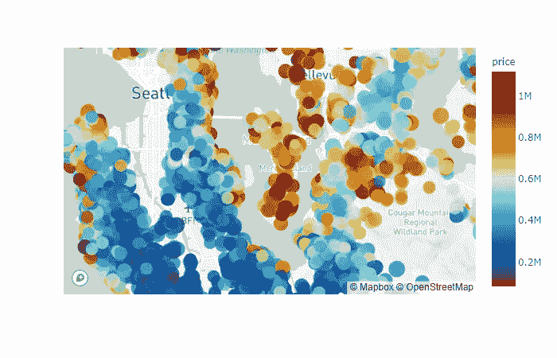
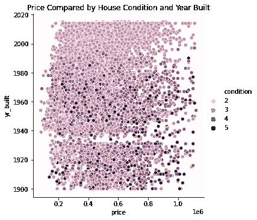
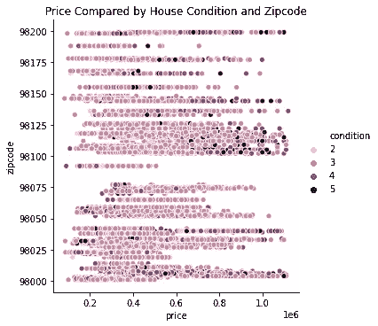
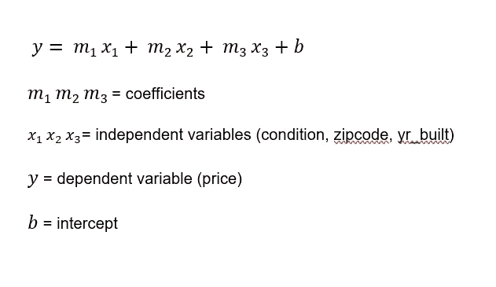
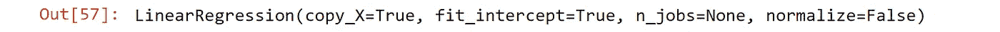
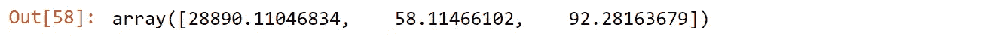
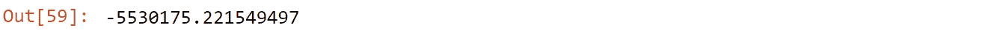
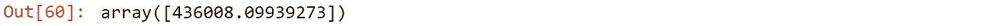
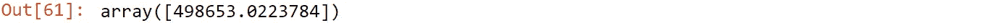

# 创建一个任何人都可以使用的房价预测模型

> 原文：<https://medium.com/analytics-vidhya/creating-a-predictive-model-for-home-prices-that-anyone-can-use-73749d6b1e40?source=collection_archive---------26----------------------->


ярослав·алексеенко在 [Unsplash](https://unsplash.com?utm_source=medium&utm_medium=referral) 上的照片

我和我的团队的任务是为华盛顿西雅图地区，更确切地说是金县的房屋销售价格创建一个预测模型。我个人想做更深入的研究，分析房屋条件、房屋建造年份和邮政编码是如何影响房价的。我建立了一个多元线性回归模型，并创建了一个专门针对这三个特征的房价预测模型。我知道有很多方法可以构建预测模型，有些方法比其他方法更复杂，但我发现这种方法非常简单，而且它还可以让您创建一个用户友好的界面，任何人都可以通过插入不同的特征值来使用。

让我们先来谈谈什么是线性回归。线性回归是一种建模技术，用于估计两个(或多个)变量之间关系的强度和方向。您将使用因变量(也称为目标变量)和自变量(也称为特征或预测变量)。线性回归仅使用一个自变量和一个因变量来确定两者之间的相关性，而多元线性回归使用多个自变量和一个因变量。回归是一种参数技术，这意味着它使用从数据中学习的参数，并且它也被认为是机器学习的初始概念。进行线性回归模型时必须做出的一些假设是，数据必须具备:

1.  线性
2.  多重共线性
3.  常态
4.  同方差性

一旦所有的假设都做出并得到满足，那么你就可以继续你的预测建模了。

在我们进入实际建模之前，我想简单介绍一下线性回归。接下来，我还想向你们简要展示一些围绕这个数据集创建的可视化效果。

在我清理完我的数据集并准备好进行分析之后，我创建了一些视觉效果来查看条件、房屋建造年份和邮政编码是如何影响房价的，然后才开始回归建模。

我创建了一个非常酷的华盛顿西雅图地区的地理地图，使用 Plotly 和 Mapbox 比较价格和他们的家庭条件评级！我对此感到非常兴奋，第一次创建它时有点棘手，因为创建和导入一个地图框令牌有一个学习曲线，但在你创建一个之后，它实际上非常容易。我将会发另一个帖子来说明如何制作这个地图，因为我在任何地方都找不到一个清晰的步骤，而且花了我将近一周的时间才弄明白！



接下来，我创建了一个散点图，以查看年份、条件和价格之间的相互关系。这幅图向我们展示了 1900 年至 1980 年间的房屋拥有最高的条件评级，它们也很好地保持了它们的价值。我想知道为什么，所以我做了一些关于西雅图房价的外部研究，在金县有一个房屋短缺。由于该县的发展速度如此之快，房主们保持了他们的财产。西雅图是美国生活成本第五高的城市，每 1060 人缺少 1 套住房，房价正在飙升。



价格范围指数转换为 20 万美元到 100 万美元

我还想知道是否有一个特定的邮政编码，有最高评级条件的房屋相比价格。条件最好的两个邮政编码是 98125 和 98101。这些地区位于西雅图市中心的海滨物业，但更具体地说，派克市场。



价格范围指数转换为 20 万美元到 100 万美元

在我完成可视化之后，我还对我的数据进行了一些建模。我想写这篇关于预测模型的文章，但是如果你对这个过程感兴趣，请查看我在 github 上的全部笔记。

一旦我的建模完成，我就开始创建我的房价预测模型。我的第一步是求解线性回归模型，并使用 reg.fit 来训练我的模型。线性回归模型的传统方程是:

𝑦̂ =𝛽̂ 0+𝛽̂ 1𝑥1+𝛽̂ 2𝑥2+…+𝛽̂ 𝑛𝑥𝑛

但是我决定用下面的公式将这个等式写得更简单一点，用于我的模型:



接下来，我为我的模型的房价和特征条件的特定等式插入变量，建造年份和邮政编码写为:

价格= m1 *条件+ m2 *邮政编码+m3 * yr _ build+b

这将是我的模型的蓝图，现在是时候将它添加到 python 中了。

```
import numpy as np
import pandas as pd
from sklearn import linear_modelreg=linear_model.LinearRegression()
reg.fit(housing_df_out[['condition', 'zipcode', 'yr_built']],housing_df_out.price)
```



一旦我们解决了我们的线性回归线，我们接下来找到 m1，m2，m3 值的系数。

```
reg.coef_
```



下一步将求解 b 的截距值。

```
reg.intercept_
```



一旦你解决了方程中的所有变量，你就可以插入条件、邮政编码和建造年份的值来得到预测的房价。现在，您可以自由地从数据集中切换出您喜欢的特征，并且可以使用您想要的任何值来求解您的预测价格。请记住，无论您将要素添加到 reg.fit 模型中的顺序是什么，您也需要为这些要素的值排序。所以，对于我的模型，我按照['condition '，' zipcode '，' yr _ build ']的顺序列出了我的特性。这意味着我还必须以相同的顺序插入我的值，以使模型正确工作。下面我举两个例子:

该预测值求解了 1995 年建造的 3 级条件、邮政编码为 98003 的房屋价格为 436，008 美元。

```
reg.predict([[3,98003,1995]])
```



这一预测值求解出一套房子的价格为 498，653 美元，条件为 5 级，邮编为 98101，建于 1986 年。

```
reg.predict([[5,98101,1986]])
```



我认为这非常酷，一旦设置正确，你可以插入不同的值来求解你的预测值。这对于非技术用户来说也是非常友好的。此时此刻。他们正在输入数字并得到一个结果。它不需要复杂的代码就能工作。

我从创建这个预测模型中获得了很多乐趣！我喜欢创造尽可能简单高效的东西，这绝对是我的拿手好戏。试试这个，让我知道它是否对你有用！